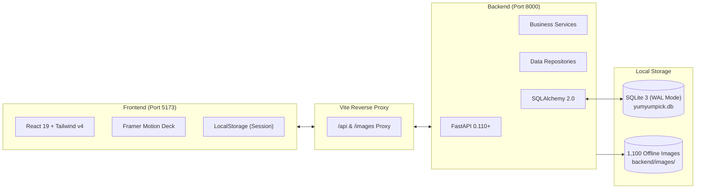

# YumYumPick — "Swipe to Feast, Zero Indecision"

<div align="center">

[-61DAFB?style=for-the-badge&logo=react&logoColor=black)](https://react.dev)
[](https://tailwindcss.com)
[](https://www.framer.com/motion/)
[](https://fastapi.tiangolo.com)
[](https://www.sqlalchemy.org/)
[-003B57?style=for-the-badge&logo=sqlite&logoColor=white)](https://www.sqlite.org)

**A smart dish discovery and recommendation platform powered by Tinder-style swipe mechanics**  
*Eliminating "Decision Paralysis" — Answering "What should I eat today?" in under 30 seconds.*

[Features](#1-core-features) • [Architecture](#2-system-architecture) • [Project Structure](#3-project-structure) • [Installation & Setup](#4-installation--quickstart) • [API Reference](#5-core-api-endpoints) • [Technical Documentation](#6-in-depth-technical-documentation) • [License](#7-license)

</div>

---

## Overview

Every day, millions of people spend 20 to 45 minutes pondering: *"What should I eat today?"*. Traditional food delivery platforms overwhelm users with thousands of restaurants, complex rating matrices, and endless promotional feeds (**Analysis Paralysis**).

**YumYumPick** solves this problem by applying the intuitive, binary decision model of **Tinder**:
- Focus on **one dish at a time**.
- **Swipe Right (Like):** Save the dish to your personal favorites menu.
- **Swipe Left (Skip):** Pass and instantly reveal the next curated suggestion.
- **Zero Duplicate Fatigue:** An automated 7-day rolling window exclusion engine ensures swiped dishes will not reappear for an entire week.
- **Cook at Home:** Access authentic recipes with interactive ingredient checklists, real-time completion progress tracking, and 5 step-by-step culinary instructions.

---

## 1. Core Features

### 1.1. 60 FPS Physics-Driven Tinder Swipe Deck
- Natural drag-and-drop physics powered by **Framer Motion**: dynamic rotation angle `rotate = x / 15` (bounded within $\pm 18^\circ$), responsive **YUMMY!** (neon green) and **NOPE** (crimson) stamp opacity transitions.
- Full multi-touch mobile gesture support alongside dedicated **Desktop PC keyboard navigation**: `[←]` (Skip), `[→]` (Like).

### 1.2. 3-Card Stack Virtualization & Infinite Background Prefetching
- **Stack Windowing:** Regardless of dataset size, the DOM tree maintains exactly **3 rendered cards** at any time (Scale `1.0`, `0.95`, `0.90`), eliminating memory leaks and frame drops.
- **Infinite Deck Prefetching:** When remaining cards in memory drop to $\le 3$, the system automatically fetches the next batch of 10 dishes in the background without interrupting the user experience.
- **Asset Pre-buffering:** Preloads upcoming dish images directly into the browser disk cache.

### 1.3. 7-Day Rolling Window Anti-Duplication Engine
- Every user decision (Like or Skip) is persistently recorded in the SQLite database on the server (`user_saved_dishes` and `user_skipped_dishes`).
- Subsequent discovery queries automatically exclude dishes interacted with in the preceding 7 days, maintaining a fresh rotation that is synchronized across all user devices.

### 1.4. 1,100 Authentic Global Dishes & 100% Offline Photographic Assets
- **15 World Cuisines:** Vietnam, South Korea, Japan, Thailand, Italy, China, France, Mexico, India, United States, Spain, Greece, Germany, Turkey, and Southeast Asia.
- **1,100 High-Resolution JPGs:** Locally hosted authentic food photographs (0% AI generated, 0% generic stock assets), served via `CachedStaticFiles` with `Cache-Control: public, max-age=86400` (HTTP 304 Not Modified support).

### 1.5. Authentic Recipes & Smart Ingredient Checklist
- **Interactive Checklists:** Users can check off ingredients as they shop or prep.
- **Real-Time Progress Bar:** Dynamically calculates completion percentage:
  $$\text{progressPercent} = \text{round}\left(\frac{\text{checkedCount}}{\text{totalIngredients}} \times 100\right)$$
- **5 Sequential Cooking Steps** accompanied by culinary secrets and technique tips (`tips`) from native chefs.

### 1.6. Multi-Criteria Filtering & Diacritic-Insensitive Search
- Filter by cuisine, difficulty (*Easy, Medium, Complex*), 4 spiciness levels (0–3), and maximum cooking time (*< 15m, 30m, 45m, 60m*).
- Smart search engine featuring diacritic removal (`removeVietnameseDiacritics`), allowing users to search without worrying about accent marks (`bun cha` matches `Bún chả`).

---

## 2. System Architecture

The application adopts a **Decoupled Layered Client-Server Architecture**:



### Technology Stack

| Layer | Technology | Version | Purpose & Rationale |
|:---|:---|:---:|:---|
| **Frontend Framework** | **React.js** | 19.2.8 | Fast, concurrent rendering for smooth 60 FPS gesture handling. |
| **Tooling & Bundler** | **Vite** | 8.3.0 | Instant Hot Module Replacement (HMR) and integrated reverse proxy. |
| **Styling** | **Tailwind CSS v4** | 4.3.3 | Built with `@tailwindcss/vite`, implementing the Limón Flat Dark Brasserie design tokens (`#1d0b0d`, `#f7ea48`). |
| **Physics Animation** | **Framer Motion** | 13.3.0 | Spring physics, velocity-sensitive drag gestures, and dynamic stamp feedback. |
| **Backend Framework** | **Python FastAPI** | 0.110+ | Asynchronous RESTful API framework with automatic Swagger UI documentation. |
| **ORM** | **SQLAlchemy** | 2.0+ | Modern typed mapping (`Mapped[...]`), relationship management, and eager loading (`selectinload`). |
| **Database** | **SQLite 3** | Local | Zero-configuration single-file database (`yumyumpick.db`) configured with Write-Ahead Logging (`PRAGMA journal_mode=WAL`) for non-blocking concurrent reads and writes. |

---

## 3. Project Structure

```text
YunYumPick/
├── backend/                             # SERVER-SIDE CODEBASE
│   ├── app/
│   │   ├── api/                         # Controller layer (auth, dishes, saved_dishes)
│   │   ├── db/                          # SQLite connection & WAL configuration (database.py)
│   │   ├── models/                      # 6 SQLAlchemy 2.0 Models (models.py)
│   │   ├── repositories/                # Data access layer (dish_repo, saved_dish_repo)
│   │   ├── schemas/                     # Pydantic v2 DTOs (auth, dish, filter, saved_dish)
│   │   ├── services/                    # Business logic layer (dish_service, saved_dish_service)
│   │   └── main.py                      # FastAPI entry point & CachedStaticFiles handler
│   ├── images/dishes/                   # 1,100 authentic high-resolution food photographs
│   ├── requirements.txt                 # Python backend dependencies
│   └── yumyumpick.db                    # Pre-seeded SQLite database (~7.6 MB)
│
├── frontend/                            # CLIENT-SIDE CODEBASE
│   ├── src/
│   │   ├── components/                  # User interface components
│   │   │   ├── CardStack.jsx            # 3-card virtualization, prefetching, PC hotkeys
│   │   │   ├── SwipeCard.jsx            # Drag physics, rotational transform, stamp badges
│   │   │   ├── DishDetailModal.jsx      # Recipe details, interactive checklist & progress bar
│   │   │   ├── LikedDishesView.jsx      # Saved collection, diacritic-insensitive search
│   │   │   ├── FilterModal.jsx          # Multi-criteria filter modal
│   │   │   ├── LandingPage.jsx          # Hero branding, 4s auto-preview showcase
│   │   │   └── AuthModal.jsx            # Registration and login modal
│   │   ├── hooks/                       # Custom React hooks (useAuth, useFilterMetadata)
│   │   ├── services/                    # REST client adapter (api.js)
│   │   ├── config/                      # API prefix configuration
│   │   ├── App.jsx                      # Central state machine & global sticky navbar
│   │   └── index.css                    # Tailwind CSS v4 tokens, Limón dark palette
│   ├── package.json                     # Frontend npm dependencies
│   └── vite.config.js                   # Vite dev server & reverse proxy configuration
│
└── docs/                                # IN-DEPTH ENGINEERING DOCUMENTATION
    ├── README.md                        # Master documentation map
    ├── 10_LINE_BY_LINE_CODE_BACKEND.md  # 100% line-by-line backend code explanation
    ├── 11_LINE_BY_LINE_CODE_FRONTEND.md # 100% line-by-line frontend code explanation
    └── 13_COMPREHENSIVE...              # Master architecture, full code & 8 E2E flows
```

---

## 4. Installation & Quickstart

### Prerequisites
- **Python:** $\ge$ 3.10
- **Node.js:** $\ge$ 18.x and npm $\ge$ 9.x

---

### Step 1: Start Backend (FastAPI + SQLite)

```bash
# 1. Navigate to backend directory
cd backend

# 2. Create and activate virtual environment
# Windows:
python -m venv .venv
.venv\Scripts\activate

# macOS / Linux:
python3 -m venv .venv
source .venv/bin/activate

# 3. Install dependencies
pip install -r requirements.txt

# 4. Start the development server
uvicorn app.main:app --reload --port 8000
```
- API Server: `http://localhost:8000`
- Interactive Swagger UI: `http://localhost:8000/docs`
*(The `yumyumpick.db` database is pre-seeded with 1,100 dishes and 15 cuisines; no database migrations or seeding scripts are needed).*

---

### Step 2: Start Frontend (React + Vite)

Open a new terminal session:

```bash
# 1. Navigate to frontend directory
cd frontend

# 2. Install dependencies
npm install

# 3. Start the Vite development server
npm run dev
```
- Web Application: `http://localhost:5173`
- The Vite development server automatically proxies `/api` and `/images` requests to `http://127.0.0.1:8000`.

---

## 5. Core API Endpoints

| Method | Endpoint | Description |
|:---:|:---|:---|
| `POST` | `/api/v1/auth/signup` | Register a new user account. |
| `POST` | `/api/v1/auth/login` | Authenticate user credentials and return active session. |
| `GET` | `/api/v1/dishes/random` | Fetch random swipe cards with optional filters and automatic 7-day exclusion via `user_id`. |
| `POST` | `/api/v1/dishes/skip` | Record a left swipe (pass) in `user_skipped_dishes` to exclude the dish for 7 days. |
| `DELETE` | `/api/v1/dishes/skip/{user_id}` | Reset a user's skip history to restart discovery from scratch. |
| `GET` | `/api/v1/dishes/{dish_id}` | Retrieve complete recipe details including ingredients and sequential cooking steps. |
| `GET` | `/api/v1/dishes/filters/metadata` | Fetch dynamic filter options for cuisines, spiciness, difficulty, and cooking durations. |
| `POST` | `/api/v1/saved-dishes/` | Save a dish to the user's liked collection (idempotent; handles re-likes gracefully). |
| `GET` | `/api/v1/saved-dishes/{user_id}` | Retrieve all saved dishes for a given user, ordered by most recently saved. |
| `DELETE` | `/api/v1/saved-dishes/{user_id}/{dish_id}` | Remove a dish from the user's liked collection. |

---

## 6. In-Depth Technical Documentation

For comprehensive engineering specifications, code dissections, and project architecture reports, refer to the [`docs/`](./docs) directory:

- [**Master Documentation Map**](./docs/README.md)
- [**Comprehensive System Architecture, Codebase Breakdown & End-to-End Flows**](./docs/13_COMPREHENSIVE_SYSTEM_ARCHITECTURE_CODE_AND_FLOWS.md)
- [**100% Line-by-Line Backend Code & Function Breakdown**](./docs/10_LINE_BY_LINE_CODE_BACKEND.md)
- [**100% Line-by-Line Frontend Code & Function Breakdown**](./docs/11_LINE_BY_LINE_CODE_FRONTEND.md)
- [**Codebase Reading Guide for Newcomers**](./docs/CODEBASE_READING_GUIDE.md)
- [**System Evaluation & Scalability Roadmap (SWOT & Production Architecture)**](./docs/12_SYSTEM_EVALUATION_AND_SCALABILITY_ROADMAP.md)

---

## 7. License

Distributed under the **MIT License**. Free for personal, educational, and commercial use.
