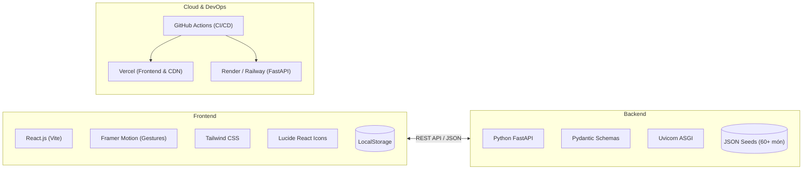

# 🍔 YumYumPick — "Tinder For Food" (Quẹt Là Măm)

<div align="center">

[](https://vercel.com)
[](https://fastapi.tiangolo.com)
[](https://react.dev)
[](https://tailwindcss.com)
[](https://www.framer.com/motion/)

**Nền tảng gợi ý món ăn ngẫu nhiên theo cơ chế quẹt thẻ (Tinder-style Swipe)**  
*Giải cứu câu hỏi kinh điển: "Hôm nay ăn gì?" trong tích tắc 30 giây!*

</div>

---

## 📖 Giới Thiệu Dự Án (About YumYumPick)

**YumYumPick** ra đời nhằm chấm dứt hội chứng *"Tê liệt quyết định" (Decision Paralysis)* khi chọn món ăn hàng ngày. Thay vì phải đọc những danh sách thực đơn dài vô tận, người dùng chỉ cần tập trung vào **một món ăn tại một thời điểm** và đưa ra quyết định trực giác:

- 👆 **Nhấp vào thẻ (Tap / ℹ️):** Mở nhanh bảng **Giới thiệu món ăn** (Dish Intro): khám phá nguồn gốc xuất xứ, hương vị đặc trưng, thời gian chế biến, lượng calo và tóm tắt nguyên liệu chính để cân nhắc trước khi quẹt.
- 👉 **Quẹt Phải (Swipe Right / ❤️):** Chọn món này! Tự động lưu toàn bộ món ăn và công thức nấu chi tiết vào bộ sưu tập `LocalStorage` để bạn xem lại sau khi đã quẹt xong.
- 📖 **Xem chi tiết công thức sau khi quẹt:** Mở bộ sưu tập món đã lưu để xem toàn bộ công thức chuẩn (danh sách nguyên liệu có checkbox tiện kiểm tra tủ lạnh/đi chợ, hướng dẫn nấu từng bước 1-2-3 và mẹo nhỏ từ đầu bếp).
- 👈 **Quẹt Trái (Swipe Left / ❌):** Bỏ qua món ăn này và ngay lập tức xem gợi ý tiếp theo.
- 🛒 **Xuất Danh Sách Đi Chợ (Smart Grocery List):** Tự động tổng hợp nguyên liệu của tất cả các món đã lưu để gửi nhanh qua Zalo/Messenger.
- 💾 **Không cần tài khoản:** Tích hợp `LocalStorage` giúp mọi thao tác lưu trữ diễn ra tức thì, an toàn và bảo mật trên thiết bị.

---

## 📚 Hệ Thống Tài Liệu Kỹ Thuật Chuẩn Doanh Nghiệp (Documentation Hub)

Toàn bộ tài liệu chi tiết của dự án được lưu trữ trong thư mục [`docs/`](./docs/README.md):

| # | Tài Liệu Chi Tiết | Mô Tả Tóm Tắt |
|---|---|---|
| **01** | [**Project Charter & Scope**](./docs/01_PROJECT_CHARTER_AND_SCOPE.md) | Tầm nhìn, đối tượng người dùng, phạm vi MVP vs Phase 2, tiêu chuẩn nghiệm thu KPIs. |
| **02** | [**System Architecture & Design**](./docs/02_SYSTEM_ARCHITECTURE_AND_DESIGN.md) | Sơ đồ kiến trúc phân tầng, đặc tả RESTful API FastAPI, mô hình dữ liệu & LocalStorage. |
| **03** | [**User Flow & UI/UX Specification**](./docs/03_USER_FLOW_AND_UIUX_SPEC.md) | Quy luật vật lý quẹt thẻ Framer Motion, bảng màu Design System, layout Responsive. |
| **04** | [**Team Roles & RACI Matrix**](./docs/04_TEAM_ROLES_AND_RACI.md) | Phân công công việc chi tiết cho 6 thành viên, ma trận trách nhiệm RACI rõ ràng. |
| **05** | [**Git Workflow & Collaboration Rules**](./docs/05_GIT_WORKFLOW_AND_COLLABORATION_RULES.md) | Quy chuẩn nhánh Git Flow, Conventional Commits, hướng dẫn tạo PR & giải quyết conflict. |
| **06** | [**Sprint Roadmap & TODO Per Role**](./docs/06_SPRINT_ROADMAP_AND_TODO_PER_ROLE.md) | Kế hoạch 4 Sprints Agile/Scrum, checklist TODO từng người, Definition of Done (DoD). |
| **07** | [**Data Schema & Food Seeds**](./docs/07_DATA_SCHEMA_AND_SEEDS.md) | Cấu trúc JSON dữ liệu món ăn, 60+ công thức mẫu (Việt, Hàn, Nhật, Thái, Ý) & hướng dẫn ảnh. |

---

## 🛠️ Công Nghệ Sử Dụng (Tech Stack)



---

## 🚀 Hướng Dẫn Cài Đặt & Chạy Thử (Quickstart Guide)

### 1. Khởi chạy Backend (Python FastAPI)

```bash
# Di chuyển vào thư mục backend
cd backend

# Khởi tạo môi trường ảo Python
python -m venv venv

# Kích hoạt môi trường ảo
# Trên Windows:
venv\Scripts\activate
# Trên macOS/Linux:
source venv/bin/activate

# Cài đặt các thư viện cần thiết
pip install -r requirements.txt

# Chạy server ở chế độ phát triển
uvicorn app.main:app --reload --port 8000
```
> Server sẽ chạy tại: `http://localhost:8000`  
> Tài liệu tương tác Swagger UI: `http://localhost:8000/docs`

### 2. Khởi chạy Frontend (React + Vite)

```bash
# Mở một terminal mới và di chuyển vào thư mục frontend
cd frontend

# Cài đặt các packages
npm install

# Khởi chạy server giao diện
npm run dev
```
> Ứng dụng giao diện mở tại: `http://localhost:5173`

---

## 👥 Cơ Cấu Đội Ngũ 6 Thành Viên (Team Structure)

| Thành Viên | Vai Trò Chính | Trách Nhiệm Cốt Lõi |
|---|---|---|
| **Member 1** | **Tech Lead & Coordinator** | Quản lý kiến trúc hệ thống, điều phối Git, review code, gỡ lỗi kỹ thuật. |
| **Member 2** | **Frontend Lead** | Xây dựng cơ chế quẹt thẻ (Card Stack, Framer Motion drag physics, stamp Like/Skip). |
| **Member 3** | **Frontend Developer** | Phát triển Modal Bộ Lọc, Drawer Công thức, kết nối LocalStorage & API Backend. |
| **Member 4** | **Backend Lead** | Xây dựng FastAPI app, thiết kế Pydantic schemas, thuật toán xáo trộn món ngẫu nhiên. |
| **Member 5** | **Backend & Data Specialist** | Thu thập, biên tập 60+ món ăn ngon, tối ưu hình ảnh WebP, viết seed loader. |
| **Member 6** | **DevOps & QA Engineer** | Cấu hình CI/CD Vercel, viết tài liệu Postman, kiểm thử chéo trình duyệt & mobile. |

---

## 🤝 Quy Tắc Cộng Tác (Collaboration Rules)

1. **Quy tắc phân nhánh:** Luôn tạo nhánh mới từ `develop` theo mẫu: `feature/<role>-<ten-tinh-nang>`. Tuyệt đối không commit trực tiếp vào `main` hay `develop`.
2. **Quy tắc Commit:** Tuân thủ chuẩn [Conventional Commits](https://www.conventionalcommits.org/):
   - `feat(swipe): add card swipe physics`
   - `fix(filter): fix cuisine query filter`
3. **Quy tắc Pull Request (PR):**
   - Sử dụng đúng [PR Template](.github/PULL_REQUEST_TEMPLATE.md).
   - Frontend bắt buộc đính kèm ảnh/video minh chứng hoạt động.
   - Bắt buộc có ít nhất **1 Approve** từ đồng đội trước khi merge.
4. **Họp Daily Standup:** 10 phút đầu ngày để đồng bộ tiến độ và hỗ trợ nhau tháo gỡ khó khăn.

---

## 📄 Bản Quyền & Giấy Phép (License)
Dự án được phát triển phục vụ mục đích học tập và xây dựng sản phẩm mẫu. Phân phối dưới giấy phép [MIT License](LICENSE).
