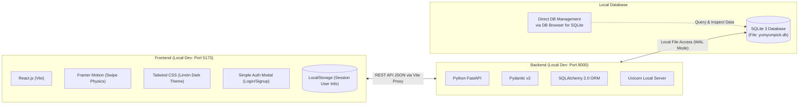
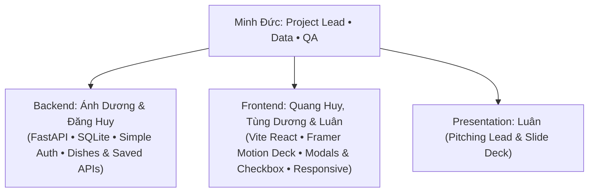

# YumYumPick — "Tinder For Food"

<div align="center">

[](https://fastapi.tiangolo.com)
[](https://www.sqlite.org)
[-61DAFB?style=for-the-badge&logo=react&logoColor=black)](https://react.dev)
[](https://tailwindcss.com)
[](https://www.framer.com/motion/)

**A smart random dish recommendation platform powered by Tinder-style swipe mechanics**  
*Solving the classic question: "What should I eat today?" in just 30 seconds!*

</div>

---

## 1. Project Overview (About YumYumPick)

**YumYumPick** was created to eliminate *"Decision Paralysis"* when choosing daily meals. Instead of scrolling through endlessly exhausting food delivery menus, users focus on **one dish at a time** and make intuitive snap decisions:

- **Swipe Cards with Description Intro:** Each card showcases high-resolution imagery, dish names (Bilingual Vietnamese & English), info badges (cooking time, calories, spiciness, cuisine), and a concise **introductory description (`short_description`)** highlighting the dish's distinct flavor profile.
- **Swipe Right (LIKE):** Loved it! Automatically saves the dish to the user's personal account in the SQLite database.
- **Swipe Left (SKIP):** Not feeling it! Discards the dish and instantly reveals the next suggestion.
- **Quick Filters:** Filter by 15 culinary cuisines, difficulty (Easy / Medium / Advanced), spiciness level, and maximum cooking time prior to swiping.
- **Post-Swipe Recipe Details:** Access the saved dishes tab to view comprehensive authentic cooking recipes (interactive ingredient checklist `[ ]` with dynamic preparation progress, step-by-step instructions, and chef cooking tips).
- **Streamlined Authentication:** Simple `username` & `password` registration and login, with session persistence via `localStorage`.
- **Comprehensive Responsiveness:** Seamless user experience across Mobile (touch gesture swipes) and Desktop PC (keyboard navigation with `←`, `→` arrow keys).
- **Offline Data via SQLite:** Pre-seeded with 1,100 dishes and 1,100 authentic offline images managed directly via SQLite (`backend/yumyumpick.db`).

---

## 2. Key Architecture Decisions

### 2.1. Local-First Focus (Dropping Cloud Deploy & Admin CMS)
- **Dropping Cloud Deploy (CI/CD / Cloud Hosting):** Transitioned 100% to local execution (`npm run dev` + `uvicorn`). This eliminates all cloud hosting expenses, SSL issues, complex CORS setups, and deployment risks.
- **Dropping Admin CMS UI:** All dish and recipe data is managed directly via the local **SQLite** database using GUI tools such as **DB Browser for SQLite** or DBeaver. This saved over 40% of development overhead on administrative endpoints and views.

### 2.2. Role of `LocalStorage`
- **In Previous Drafts:** Without user accounts, LocalStorage was forced to store all liked dishes and swipe histories.
- **In Current Architecture (SQLite & Simple User Auth):**
  - Liked dishes are persistently stored in the `user_saved_dishes` table on the SQLite database via Backend REST APIs.
  - **LocalStorage is kept strictly for lightweight session management:** It holds the active session token (`user_id`, `username`) so page reloads (F5) do not log the user out, alongside a local rolling history buffer for guest fallback.

### 2.3. Responsive UI for Mobile & Desktop PC
- **Mobile Web (<= 640px):** Edge-to-edge card layout (100vw / 100vh), native thumb touch gestures, floating bottom action buttons, and bottom-sheet modals.
- **Desktop PC (>= 1024px):** Centered card deck viewport (420px x 600px), dedicated keyboard shortcuts (`←` to Skip, `→` to Like, `Space` for recipe details), and comfortable spacing with side panels.

---

## 3. Technology Stack



| Layer | Technology | Role & Responsibility |
|---|---|---|
| **Frontend** | **React (Vite) + Tailwind CSS** | Fast, responsive Single Page Application with custom Limón Flat Dark Brasserie design tokens. |
| **Motion & Physics** | **Framer Motion** | 60 FPS gesture-driven card swipe mechanics, spring physics, and animated stamp badges. |
| **Backend** | **Python FastAPI + Uvicorn** | High-performance asynchronous RESTful API with automated OpenAPI / Swagger documentation at `/docs`. |
| **Database** | **SQLite 3 + SQLAlchemy 2.0** | Zero-configuration single-file database (`yumyumpick.db`) with Write-Ahead Logging (WAL) concurrency. |
| **Authentication** | **Simple Auth** | Frictionless registration and authentication using username and password without OTP/Email requirements. |
| **Database GUI** | **DB Browser for SQLite** | Visual desktop tool for browsing, querying, and updating dishes and ingredients. |

---

## 4. Installation & Quickstart Guide

### Step 1: Launch Backend & SQLite Database

```bash
# 1. Navigate to backend directory
cd backend

# 2. Create Python virtual environment
python -m venv venv

# 3. Activate virtual environment
# On Windows:
venv\Scripts\activate
# On macOS/Linux:
source venv/bin/activate

# 4. Install required dependencies
pip install -r requirements.txt

# 5. Start the FastAPI development server
# (The 'yumyumpick.db' database already contains 1,100 dishes and 15 cuisines; no seeding needed)
uvicorn app.main:app --reload --port 8000
```
> API Server running at: `http://localhost:8000`  
> Interactive Swagger Documentation: `http://localhost:8000/docs`

### Step 2: Launch Frontend (React + Vite)

```bash
# Open a new terminal window
cd frontend

# Install dependencies
npm install

# Start Vite development server
npm run dev
```
> Web Application running at: `http://localhost:5173`

---

## 5. Team Structure & Parallel Ownership

The project was executed by **6 specialized team members** operating concurrently without blocking dependencies:



| Member | Primary Role | Core Ownership (Parallel Tasks) | Key Deliverables |
|---|---|---|---|
| **Minh Đức** | **Project Lead • Data & QA** | 5-day sprint coordination, Daily Standups; Curating 1,100 dishes, 1,100 offline images, SQLite DB; End-to-end QA on PC & Mobile. | `backend/yumyumpick.db`, `backend/images/dishes/`, Test Matrix |
| **Ánh Dương** | **Backend Engineer 1** | FastAPI server bootstrap, CORS, static `/images` mounting; Simple Auth APIs (`signup`, `login`); Concurrency lock optimization. | `app/main.py`, `app/api/auth.py`, Mock API Contract |
| **Đăng Huy** | **Backend Engineer 2** | Dishes Core API (`random`, 15 cuisines, difficulty, spiciness, cook time, 7-day exclusion) and Saved Dishes API (`POST`, `GET`, `DELETE`). | `app/api/dishes.py`, `app/api/saved_dishes.py`, Swagger Docs |
| **Quang Huy** | **Frontend Engineer 1 (Swipe Deck & Motion)** | Framer Motion Swipe Deck (`SwipeCard.jsx`, `CardStack.jsx`, Infinite Deck auto-prefetch, stamp badges); Responsive PC & Mobile tuning. | `SwipeCard.jsx`, `CardStack.jsx`, Responsive layout |
| **Tùng Dương** | **Frontend Engineer 2 (Liked Dishes & Recipe Detail)** | Liked Dishes View (16-country filter pill bar, instant unlike) and Dish Detail Modal (interactive ingredient checklist, cooking steps, chef tips). | `LikedDishesView.jsx`, `DishDetailModal.jsx` |
| **Luân** | **Frontend Engineer 3 & Pitching Lead** | Landing Page, Auth Gate flow, Filter Modal (country & difficulty), Vite Proxy & Tunneling; Presentation slide deck (12-15 slides) and Live Demo script. | `LandingPage.jsx`, `AuthModal.jsx`, `FilterModal.jsx`, Slide Deck, Demo Script |

---

## 6. 5-Day Sprint Crash Plan

- **Day 1 (Foundation & Schema):** Finalized API Contracts, initialized repository directory structures, configured SQLite database with pre-seeded data and offline assets.
- **Day 2 (Core Features in Parallel):**
  - Backend: Implemented Auth APIs (Login/Signup) and Random/Filter dish query endpoints.
  - Frontend 1: Built Framer Motion swipe cards with spring physics and responsive containers.
  - Frontend 2: Built initial Liked Dishes collection and recipe detail modal skeleton.
  - Frontend 3 & Pitch: Scaffolded Auth Modal, Filter Modal, and project slide deck.
- **Day 3 (Integration & Responsive):**
  - Integrated Frontend with Backend APIs (swiping right saves directly to SQLite).
  - Wired Auth Modal and Filter Modal states.
  - Validated responsive layouts on both Mobile touch and Desktop PC keyboard navigation.
- **Day 4 (Liked Dishes, Recipe Details & Polish):**
  - Completed Liked Dishes View with instant unlike updates and 16-country filter bar.
  - Completed Recipe Detail Modal with interactive ingredient preparation checklist and cooking steps.
  - Executed end-to-end integration flow: Register -> Login -> Filter -> Swipe -> Like -> View Recipe.
- **Day 5 (Polish, Infinite Deck, Bug Fixing & Final Presentation):**
  - Implemented Infinite Deck background prefetching (auto-fetching when <= 3 cards remain).
  - Performed cross-browser testing, code cleanup, and final demo rehearsals.

---

## 7. Detailed Documentation Index

Comprehensive engineering specifications are located in the [`docs/`](./docs/README.md) directory:
- [**00. Master Project Overview**](./docs/00_PROJECT_OVERVIEW.md): Comprehensive system overview and project philosophy.
- [**01. Project Charter & Scope**](./docs/01_PROJECT_CHARTER_AND_SCOPE.md): 5-day MVP scope and Definition of Done (DoD).
- [**02. System Architecture & Design**](./docs/02_SYSTEM_ARCHITECTURE_AND_DESIGN.md): Layered architecture, RESTful API specs, SQLite schema, and responsive UI specs.
- [**03. User Flow & UI/UX Spec**](./docs/03_USER_FLOW_AND_UIUX_SPEC.md): User journey maps, card physics guidelines, and typography.
- [**04. Team Roles & RACI Matrix**](./docs/04_TEAM_ROLES_AND_RACI.md): Responsibility assignment matrix across 6 roles.
- [**05. Git Workflow & Collaboration Rules**](./docs/05_GIT_WORKFLOW_AND_COLLABORATION_RULES.md): Branching strategies, PR standards, and Conventional Commits.
- [**06. Sprint Roadmap & Actionable Checklist**](./docs/06_SPRINT_ROADMAP_AND_TODO_PER_ROLE.md): Hour-by-hour roadmap and role-specific tasks.
- [**07. Data Schema, SQLite & Seeds**](./docs/07_DATA_SCHEMA_AND_SEEDS.md): DDL schema, tables, 1,100 dishes, and offline image assets.
- [**08. Core Features Specification**](./docs/08_CORE_FEATURES_SPEC.md): Detailed specifications for Swipe, Filter, Liked Dishes, and Recipe views.
- [**⭐ Codebase Reading Guide for Newcomers**](./docs/CODEBASE_READING_GUIDE.md): 5-step onboarding guide to reading and understanding the full codebase.
