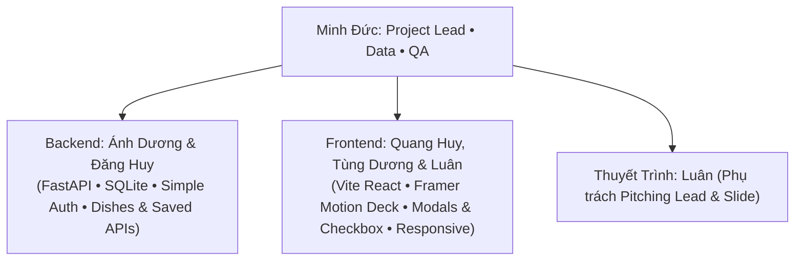

# YumYumPick — "Tinder For Food" (Quẹt Là Măm)

<div align="center">

[](https://fastapi.tiangolo.com)
[](https://www.sqlite.org)
[-61DAFB?style=for-the-badge&logo=react&logoColor=black)](https://react.dev)
[](https://tailwindcss.com)
[](https://www.framer.com/motion/)

**Nền tảng gợi ý món ăn ngẫu nhiên theo cơ chế quẹt thẻ (Tinder-style Swipe)**  
*Giải cứu câu hỏi kinh điển: "Hôm nay ăn gì?" trong tích tắc 30 giây!*

</div>

---

## 1. Giới Thiệu Dự Án (About YumYumPick)

**YumYumPick** ra đời nhằm chấm dứt hội chứng *"Tê liệt quyết định" (Decision Paralysis)* khi chọn món ăn hàng ngày. Thay vì phải đọc những danh sách thực đơn dài vô tận, người dùng chỉ cần tập trung vào **một món ăn tại một thời điểm** và đưa ra quyết định trực giác:

- **Thẻ quẹt tích hợp Description Intro:** Mặt thẻ hiển thị hình ảnh lớn sắc nét, tên món (Việt/Anh), huy hiệu thông số (thời gian, calo, độ cay, quốc gia) và **đoạn mô tả giới thiệu ngắn (`short_description`)** giúp người dùng hiểu ngay hương vị đặc trưng để quyết định quẹt trái hay quẹt phải.
- **Quẹt Phải (Swipe Right / LIKE):** Thích món này! Tự động lưu món ăn vào tài khoản cá nhân trên CSDL SQLite.
- **Quẹt Trái (Swipe Left / SKIP):** Bỏ qua món ăn này và ngay lập tức xem gợi ý tiếp theo.
- **Bộ lọc nhanh (Quick Filter):** Lọc theo quốc gia (Việt, Hàn, Nhật, Thái, Ý), độ cay, thời gian nấu trước khi quẹt.
- **Xem chi tiết công thức sau khi quẹt:** Vào danh sách món đã quẹt chỉ để xem chi tiết công thức chuẩn (danh sách nguyên liệu có **Checkbox tương tác `[ ]`** tiện đánh dấu khi chuẩn bị/nấu ăn, hướng dẫn nấu từng bước 1-2-3 và mẹo nhỏ từ đầu bếp).
- **Đăng ký & Đăng nhập siêu đơn giản:** Chỉ cần nhập `username` & `password` để tạo tài khoản hoặc đăng nhập, lưu session qua `localStorage`.
- **Responsive toàn diện:** Trải nghiệm mượt mà trên cả điện thoại (Mobile touch swipe) và máy tính (Desktop PC kèm phím tắt `←`, `→`).
- **Quản lý dữ liệu qua SQLite:** Quản trị 100 món ăn và 100 ảnh offline trực tiếp thông qua file CSDL SQLite `backend/yumyumpick.db`.

---

## 2. Giải Đáp Các Quyết Định Kiến Trúc Mới

### 2.1. Bỏ phần Deploy & Bỏ Admin CMS
- **Bỏ Deploy (Cloud/CI/CD):** Chuyển 100% về chạy Localhost (`npm run dev` + `uvicorn`). Giảm thiểu toàn bộ rủi ro về cấu hình port, SSL, CORS cloud, chi phí hosting và lỗi deploy.
- **Bỏ Admin CMS UI:** Mọi dữ liệu món ăn được quản trị trực tiếp thông qua file CSDL **SQLite** (dùng công cụ trực quan miễn phí như **DB Browser for SQLite**, DBeaver hoặc chạy script seed Python). Tiết kiệm ít nhất 40% thời gian code giao diện và API quản trị.

### 2.2. Vai trò của `LocalStorage` (Có cần bỏ không?)
- **Trong bản cũ:** Không có tài khoản người dùng, nên LocalStorage phải gánh toàn bộ dữ liệu món đã lưu và lịch sử quẹt.
- **Trong bản mới (Đã có SQLite & User Auth):**
  - Món đã lưu (Saved Dishes) được lưu trữ bền vững trong bảng `user_saved_dishes` trên CSDL SQLite thông qua API Backend.
  - **LocalStorage vẫn giữ lại nhưng với vai trò tối giản:** Chỉ dùng để lưu **phiên đăng nhập** (`user_id`, `username`) để khi người dùng F5 hoặc tải lại trang thì không bị bắt đăng nhập lại. Ngoài ra có thể làm bộ đệm tạm thời cho khách chưa đăng nhập (Guest mode).
  - Không cần lưu trữ các cấu trúc dữ liệu cồng kềnh trong LocalStorage nữa!

### 2.3. Responsive UI cho cả PC và Điện Thoại
- **Mobile Web (<= 640px):** Giao diện thẻ quẹt full màn hình (100vw/100vh), hỗ trợ thao tác vuốt cảm ứng đa điểm bằng ngón tay cái, cụm nút bấm nổi phía dưới màn hình, modal mở dạng Bottom Sheet kéo từ đáy lên.
- **Desktop PC (>= 1024px):** Giao diện hiển thị dạng khung điện thoại chuẩn hoặc bố cục 2 cột cân đối:
  - Khung giữa: Thẻ quẹt kích thước cố định trực quan ($420\text{px} \times 600\text{px}$), hỗ trợ phím mũi tên bàn phím (`←` để Skip, `→` để Like, `Space` để xem chi tiết).
  - Khung bên: Thanh điều hướng hoặc panel mở rộng xem nhanh danh sách món đã lưu mà không bị tràn màn hình.

---

## 3. Công Nghệ Sử Dụng (Tech Stack Tinh Gọn)

```mermaid
flowchart LR
    subgraph Client["Frontend (Chạy Local: Port 5173)"]
        React["React.js (Vite)"]
        Framer["Framer Motion (Swipe Physics)"]
        Tailwind["Tailwind CSS (Responsive PC/Mobile)"]
        AuthUI["Simple Auth Modal (Login/Signup)"]
        LS[("LocalStorage (Session User Info)")]
    end

    subgraph Server["Backend (Chạy Local: Port 8000)"]
        FastAPI["Python FastAPI"]
        Pydantic["Pydantic v2"]
        SQLAlchemy["SQLAlchemy 2.0 ORM"]
        Uvicorn["Uvicorn Local Server"]
    end

    subgraph Database["Local Database"]
        SQLite[("SQLite 3 Database\n(File: yumyumpick.db)")]
        DBBrowser["Quản lý trực tiếp bằng\nDB Browser for SQLite"]
    end

    Client <-->|REST API (JSON / CORS)| Server
    Server <-->|Local File Access| SQLite
    DBBrowser -.->|Truy vấn & Sửa data| SQLite
```

| Tầng | Công Nghệ | Mô Tả & Nhiệm Vụ |
|---|---|---|
| **Frontend** | **React (Vite) + Tailwind CSS** | Giao diện Responsive (PC & Mobile), nhẹ, load tức thì. |
| **Motion/Gesture** | **Framer Motion** | Hiệu ứng quẹt thẻ Tinder mượt mà 60 FPS, stamp Like/Skip. |
| **Backend** | **Python FastAPI + Uvicorn** | RESTful API hiệu năng cao, tự sinh Swagger UI tại `/docs`. |
| **Database** | **SQLite 3 + SQLAlchemy** | CSDL cục bộ lưu trong 1 file `yumyumpick.db`, không cần cài đặt server. |
| **Auth** | **Simple Auth** | Đăng ký & đăng nhập đơn giản bằng username/password, không cần OTP/Email. |
| **DB GUI Tool** | **DB Browser for SQLite** | Công cụ xem và sửa dữ liệu trực quan thay thế cho trang Admin. |

---

## 4. Hướng Dẫn Cài Đặt & Chạy Thử (Quickstart Guide)

### Bước 1: Khởi chạy Backend & SQLite DB

```bash
# 1. Di chuyển vào thư mục backend
cd backend

# 2. Khởi tạo môi trường ảo Python
python -m venv venv

# 3. Kích hoạt môi trường ảo
# Trên Windows:
venv\Scripts\activate
# Trên macOS/Linux:
source venv/bin/activate

# 4. Cài đặt các thư viện cần thiết (rất nhẹ)
pip install -r requirements.txt

# 5. Khởi tạo CSDL SQLite và nạp dữ liệu món ăn mẫu (Chỉ chạy 1 lần)
python -m app.db.seed_sqlite

# 6. Chạy server FastAPI
uvicorn app.main:app --reload --port 8000
```
> Server hoạt động tại: `http://localhost:8000`  
> Tài liệu Swagger UI để test API: `http://localhost:8000/docs`

### Bước 2: Khởi chạy Frontend (React + Vite)

```bash
# Mở một cửa sổ Terminal mới
cd frontend

# Cài đặt thư viện giao diện
npm install

# Chạy ứng dụng giao diện
npm run dev
```
> Ứng dụng giao diện mở tại: `http://localhost:5173`

---

## 5. Phân Chia Vai Trò Thành Viên (Team Structure & Parallel Breakdown)

Dự án gồm **6 thành viên** với vai trò được chuyên biệt hóa, vận hành theo mô hình làm việc song song không nghẽn:



| Thành Viên | Vai Trò Chính | Nhiệm Vụ Cốt Lõi (Song Song) | Sản Phẩm Bàn Giao (Deliverables) |
|---|---|---|---|
| **Minh Đức** | **Project Lead • Data & QA** | Điều phối tiến độ 5 ngày, Daily Sync; Quản trị kho 100 món ăn, 100 ảnh offline, CSDL SQLite; Kiểm định chất lượng (QA) PC & Mobile. | `backend/yumyumpick.db`, `backend/images/dishes/`, Test Matrix |
| **Ánh Dương** | **Backend Engineer 1** | Setup FastAPI server, CORS, Static mount `/images`; Xây dựng Simple Auth API (`signup`, `login` vào SQLite); Mock Data JSON cho FE. | `app/main.py`, `app/api/auth.py`, Mock API Contract |
| **Đăng Huy** | **Backend Engineer 2** | Xây dựng Dishes Core API (`random`, bộ lọc 5 nước, độ cay, thời gian, loại trừ món đã quẹt) và Saved Dishes API (`POST`, `GET`, `DELETE`). | `app/api/dishes.py`, `app/api/saved_dishes.py`, Swagger Docs |
| **Quang Huy** | **Frontend Engineer 1 (Swipe Deck & Motion)** | Xây dựng Swipe Deck Framer Motion (SwipeCard, CardStack, Stamp YUMMY/NOPE); Tích hợp Description Intro lên thẻ; Tối ưu Responsive PC (phím tắt `←`/`→`) & Mobile touch. | `SwipeCard.jsx`, `CardStack.jsx`, Responsive layout |
| **Tùng Dương** | **Frontend Engineer 2 (Liked & Recipe Detail)** | Xây dựng Liked Dishes View (danh sách món đã thích, nút xóa) và Dish Detail Modal (xem chi tiết công thức kèm Checkbox tương tác nguyên liệu, 3 bước nấu, mẹo bếp). | `LikedDishesView.jsx`, `DishDetailModal.jsx` |
| **Luân** | **Frontend Engineer 3 & Pitching Lead** | Xây dựng App Layout, Header/Navbar, Auth Modal (LocalStorage session), Filter Modal (bộ lọc 5 nước); Thiết kế Slide PowerPoint (12-15 slides), Kịch bản Thuyết trình & Live Demo. | `Navbar.jsx`, `AuthModal.jsx`, `FilterModal.jsx`, `Slide_YumYumPick.pptx`, Kịch bản Demo |


---

## 6. Kế Hoạch Triển Khai 5 Ngày (5-Day Crash Plan)

- **Ngày 1 (Foundation & Schema):** Chốt định dạng dữ liệu (API Contract), khởi tạo cấu trúc thư mục Frontend & Backend, kết nối CSDL SQLite `yumyumpick.db` (100 món, 100 ảnh offline đã sẵn sàng).
- **Ngày 2 (Core Features in Parallel):**
  - Backend: Viết xong API Auth (Login/Signup) và API Random/Filter món.
  - Frontend 1: Xây dựng xong bộ thẻ quẹt Framer Motion + Responsive khung thẻ PC/Mobile.
  - Frontend 2: Xây dựng xong UI Login/Signup + Modal Bộ lọc sơ bộ.
  - Pitching: Lên khung Slide PowerPoint và kịch bản thuyết trình.
- **Ngày 3 (Integration & Responsive):**
  - Frontend kết nối API Backend (Quẹt phải gọi API lưu món vào SQLite).
  - Tích hợp Auth Modal và Filter Modal.
  - Kiểm tra giao diện trên cả điện thoại (F12 Mobile view) và PC (phím tắt `←`/`→`).
- **Ngày 4 (Liked Dishes & Recipe Details):**
  - Hoàn thiện màn hình Danh sách món đã thích (kèm nút xóa/bỏ thích).
  - Hoàn thiện màn hình/modal Xem chi tiết công thức (nguyên liệu dạng text + 3 bước nấu).
  - Kiểm thử toàn trình (E2E): Đăng ký $\rightarrow$ Đăng nhập $\rightarrow$ Lọc $\rightarrow$ Quẹt $\rightarrow$ Lưu $\rightarrow$ Xem công thức.
- **Ngày 5 (Polish, Bug Fixing & Demo):**
  - Tinh chỉnh hiệu ứng mượt mà 60 FPS, sửa các lỗi nhỏ (edge cases).
  - Chạy thử nghiệm trên điện thoại thật qua mạng LAN.
  - Hoàn thiện slide và tổng duyệt kịch bản Live Demo.

---

## 7. Danh Mục Tài Liệu Chi Tiết

Mọi tài liệu chi tiết của dự án nằm trong thư mục [`docs/`](./docs/README.md):
- [**00. Master Project Overview**](./docs/00_PROJECT_OVERVIEW.md): Tổng quan hệ thống sau khi tinh giản.
- [**01. Project Charter & Scope**](./docs/01_PROJECT_CHARTER_AND_SCOPE.md): Phạm vi MVP 5 ngày, tiêu chuẩn hoàn thành.
- [**02. System Architecture & Design**](./docs/02_SYSTEM_ARCHITECTURE_AND_DESIGN.md): Thiết kế phân tầng, API RESTful, SQLite schema, Responsive PC/Mobile.
- [**03. User Flow & UI/UX Spec**](./docs/03_USER_FLOW_AND_UIUX_SPEC.md): Luồng người dùng, quy chuẩn vật lý quẹt thẻ, đặc tả Responsive.
- [**04. Team Roles & RACI Matrix**](./docs/04_TEAM_ROLES_AND_RACI.md): Phân công 6 vai trò làm việc song song không bị nghẽn.
- [**05. Git Workflow & Collaboration Rules**](./docs/05_GIT_WORKFLOW_AND_COLLABORATION_RULES.md): Quy chuẩn nhánh Git, Conventional Commits.
- [**06. Sprint Roadmap & Actionable Checklist**](./docs/06_SPRINT_ROADMAP_AND_TODO_PER_ROLE.md): Lộ trình 5 ngày chi tiết từng giờ, checklist theo từng vai trò.
- [**07. Data Schema, SQLite & Seeds**](./docs/07_DATA_SCHEMA_AND_SEEDS.md): Cấu trúc SQLite DDL, bảng users, danh mục 100 món ăn và kho ảnh offline.
- [**08. Core Features Specification**](./docs/08_CORE_FEATURES_SPEC.md): Đặc tả 3 tính năng cốt lõi tinh giản, loại bỏ tính năng phụ rườm rà.
