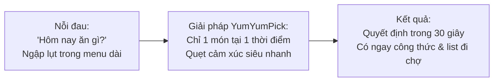
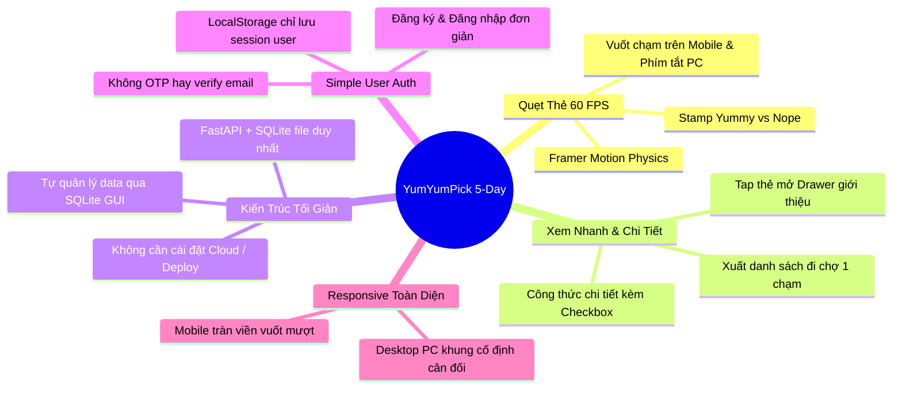

# 📖 00. Tổng Quan Dự Án & Thiết Kế Hệ Thống (Master Project Overview)
---

## 1. Tóm Tắt Dự Án (Executive Summary)

| Thuộc Tính | Chi Tiết Tóm Tắt |
|---|---|
| **Tên Ứng Dụng** | **YumYumPick** — *"Quẹt là măm, không lăn tăn nghĩ món"* |
| **Thể Loại Sản Phẩm** | Web App gợi ý ẩm thực tương tác theo cơ chế quẹt thẻ (Tinder for Food) |
| **Sứ Mệnh (Mission)** | Xóa bỏ sự lưỡng lự và "tê liệt quyết định" (Decision Paralysis) khi chọn món ăn hàng ngày, kết nối người dùng với cảm hứng nấu nướng và công thức chi tiết trong dưới 30 giây. |
| **Khách Hàng Mục Tiêu** | Sinh viên, nhân viên văn phòng, người nội trợ bận rộn và các nhóm bạn thường xuyên đau đầu với câu hỏi: *"Hôm nay ăn gì?"* |
| **Mô Hình Kiến Trúc** | 2 tầng tách rời chạy cục bộ (Decoupled Client-Server Local Architecture): React Frontend + FastAPI Backend + CSDL SQLite Cục Bộ |
| **Bộ Công Nghệ Chính** | React (Vite) + Framer Motion + Tailwind CSS + Python FastAPI + SQLite 3 |
| **Phương Thức Vận Hành** | Chạy Localhost (`npm run dev` + `uvicorn`) • Không cần Cloud Deploy phức tạp |
| **Thời Gian Triển Khai** | **Sprint 5 Ngày** (Áp dụng phân chia task song song cho 4-5 thành viên) |

---

## 2. Ý Tưởng Giải Pháp: "Tinder For Food"

Lấy cảm hứng từ cơ chế tương tác gây nghiện nổi tiếng của ứng dụng hẹn hò **Tinder**:
1. Thay vì hiển thị danh sách dài vô tận gây mệt mỏi, màn hình chỉ hiển thị **DUY NHẤT MỘT MÓN ĂN** tại một thời điểm dưới dạng thẻ ảnh lớn bắt mắt.
2. Người dùng chỉ cần đưa ra quyết định nhị phân siêu nhanh theo cảm xúc:
   - **Thích (Pick / Like ❤️):** Quẹt sang Phải $\rightarrow$ Lưu món ăn và công thức chi tiết vào tài khoản cá nhân trên CSDL SQLite.
   - **Không thích (Skip ❌):** Quẹt sang Trái để chuyển ngay sang món kế tiếp.
3. Muốn tìm hiểu thêm trước khi quẹt? **Nhấp nhẹ (Tap / ℹ️) vào thẻ** để mở Drawer xem câu chuyện xuất xứ, thời gian nấu, calo, độ cay và tóm tắt nguyên liệu.
4. Sau khi quẹt xong: Mở bộ sưu tập món đã lưu để xem **công thức chi tiết** (nguyên liệu có checkbox tiện kiểm tra tủ lạnh/đi chợ, các bước nấu 1-2-3, mẹo đầu bếp) và có thể **xuất danh sách đi chợ** để gửi qua Zalo/Messenger chỉ bằng 1 nút bấm.



---

## 3. Các Điểm Cốt Lõi Tinh Gọn Để Hoàn Thành Trong 5 Ngày



1. **Bỏ Deploy (Cloud / CI/CD):** Chuyển sang chạy Localhost hoàn toàn. Tránh việc cấu hình hạ tầng phức tạp, không lo lỗi mạng, SSL hay phát sinh chi phí.
2. **Bỏ Admin CMS UI:** Mọi dữ liệu món ăn được quản trị trực tiếp thông qua file SQLite `yumyumpick.db` bằng công cụ trực quan **DB Browser for SQLite** hoặc chạy script seed Python. Tiết kiệm hàng chục màn hình quản trị và API CRUD thừa thãi.
3. **Sử dụng SQLite đơn giản:** Toàn bộ dữ liệu nằm gọn trong một file `yumyumpick.db`. Kết nối cực nhanh bằng SQLAlchemy, backup và chia sẻ giữa các thành viên dễ dàng.
4. **Simple User Auth (Đăng nhập đơn giản):** Chỉ cần `username` và `password` để tạo tài khoản hoặc đăng nhập. Không xác thực email/OTP, không cần quy trình quên mật khẩu phức tạp.
5. **Làm rõ vai trò `localStorage`:** Vì đã có CSDL SQLite lưu trữ các món đã thích theo `user_id`, `localStorage` giờ đây chỉ làm một việc đơn giản duy nhất là lưu thông tin phiên đăng nhập (`user_id`, `username`) để khi người dùng F5 không bị đăng xuất.
6. **Responsive Web Design hoàn chỉnh:** Hoạt động tối ưu trên cả điện thoại (Mobile web full touch) và máy tính (Desktop PC có khung cố định kèm phím mũi tên).

---

## 4. Công Nghệ & Kiến Trúc Hệ Thống

```mermaid
flowchart LR
    subgraph Client["Frontend (React 18 + Vite)"]
        Deck["Swipe Deck (Framer Motion)"]
        Modals["Modals (Auth, Filter, Saved Recipes)"]
        Responsive["Tailwind CSS Responsive Engine"]
        LS[("LocalStorage: Session User Info")]
    end

    subgraph Server["Backend (Python FastAPI)"]
        Router["FastAPI Routers (/auth, /dishes, /saved-dishes)"]
        ORM["SQLAlchemy 2.0 ORM"]
    end

    subgraph Storage["Database Layer"]
        SQLite[("SQLite 3 Database (yumyumpick.db)")]
        DBBrowser["DB Browser for SQLite\n(Quản trị trực tiếp)"]
    end

    Client <-->|REST API JSON (Localhost)| Server
    Server <-->|Local File I/O| SQLite
    DBBrowser -.->|Thêm/Sửa món| SQLite
```

- **Frontend:** React 18 (Vite template), Framer Motion (xử lý cử chỉ quẹt thẻ), Tailwind CSS (hệ thống utility-first hỗ trợ responsive PC/Mobile), Lucide React (bộ icon hiện đại).
- **Backend:** Python FastAPI, Pydantic v2 (validate request/response), SQLAlchemy 2.0 (kết nối SQLite), Uvicorn ASGI server.
- **Database:** SQLite 3 (CSDL quan hệ lưu trong file `backend/app.db` hoặc `backend/yumyumpick.db`).

---

## 5. Kế Hoạch 5 Ngày & Phân Chia Song Song (No Blockers)

| Ngày | Backend Lead | Frontend Swipe Lead | Frontend Features Lead | Data & QA Specialist |
|---|---|---|---|---|
| **Ngày 1** | Setup FastAPI + SQLite, tạo bảng theo DDL, chốt API Contract. | Setup Vite + Tailwind, cấu hình Framer Motion. | Dựng Layout chung, thiết kế Navbar, Modal khung. | Soạn 10 món mẫu đầu tiên dạng JSON, chuẩn bị schema. |
| **Ngày 2** | Viết API Auth (Login/Signup) + API Random/Filter món. | Làm component `SwipeCard` + hiệu ứng Stamp Like/Skip. | Làm Form Login/Signup + Modal Bộ lọc ẩm thực. | Chuẩn hóa kho 100 món ăn kèm ảnh Unsplash sắc nét. |
| **Ngày 3** | Viết API Lưu/Xóa món đã quẹt vào SQLite. | Kết nối API Random thẻ, xử lý responsive khung thẻ. | Làm Drawer Giới thiệu món khi tap thẻ. | Nạp 100 món vào SQLite (`seed_sqlite.py`). |
| **Ngày 4** | Hỗ trợ API gộp nguyên liệu danh sách đi chợ. | Xử lý phím tắt PC (`←`, `→`, `Space`), tinh chỉnh touch mobile. | Làm Màn hình món đã lưu (checkbox công thức + copy list đi chợ). | Test chéo toàn trình (E2E), kiểm tra hiển thị ảnh và font. |
| **Ngày 5** | Tối ưu truy vấn SQLite, kiểm tra an toàn dữ liệu. | Tinh chỉnh chuyển động 60 FPS, polish UI. | Sửa lỗi giao diện, hỗ trợ flow đăng nhập/đăng xuất. | Chạy kiểm thử trên điện thoại thật + Chuẩn bị kịch bản Demo. |
