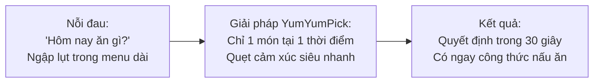
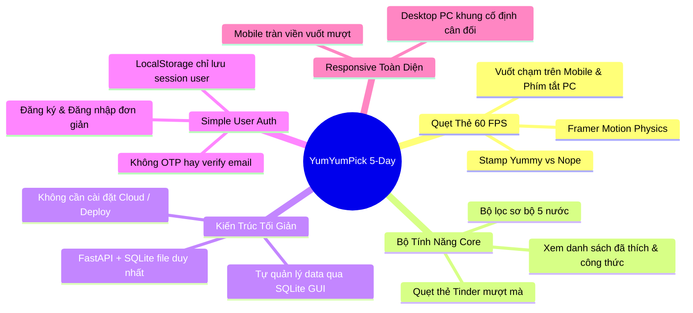

# 00. Tổng Quan Dự Án & Thiết Kế Hệ Thống (Master Project Overview)
---

## 1. Tóm Tắt Dự Án (Executive Summary)

| Thuộc Tính | Chi Tiết Tóm Tắt |
|---|---|
| **Tên Ứng Dụng** | **YumYumPick** — *"Quẹt là măm, không lăn tăn nghĩ món"* |
| **Thể Loại Sản Phẩm** | Web App gợi ý ẩm thực tương tác theo cơ chế quẹt thẻ (Tinder for Food) |
| **Sứ Mệnh (Mission)** | Xóa bỏ sự lưỡng lự và "tê liệt quyết định" (Decision Paralysis) khi chọn món ăn hàng ngày, kết nối người dùng với cảm hứng nấu nướng và công thức chi tiết trong dưới 30 giây. |
| **Khách Hàng Mục Tiêu** | Sinh viên, nhân viên văn phòng, người nội trợ bận rộn và các nhóm bạn thường xuyên đau đầu với câu hỏi: *"Hôm nay ăn gì?"* |
| **Mô Hình Kiến Trúc** | 2 tầng tách rời chạy cục bộ (Decoupled Client-Server Local Architecture): React Frontend + FastAPI Backend + CSDL SQLite Cục Bộ |
| **Bộ Công Nghệ Chính** | React (Vite) + Framer Motion + Tailwind CSS + Python FastAPI + SQLite 3 |
| **Phương Thức Vận Hành** | Chạy Localhost (`npm run dev` + `uvicorn`) • Không cần Cloud Deploy phức tạp |
| **Thời Gian Triển Khai** | **Sprint 5 Ngày** (Áp dụng phân chia task song song cho 4-5 thành viên) |

---

## 2. Ý Tưởng Giải Pháp: "Tinder For Food"

Lấy cảm hứng từ cơ chế tương tác gây nghiện nổi tiếng của ứng dụng hẹn hò **Tinder**:
1. Thay vì hiển thị danh sách dài vô tận gây mệt mỏi, màn hình chỉ hiển thị **DUY NHẤT MỘT MÓN ĂN** tại một thời điểm dưới dạng thẻ ảnh lớn bắt mắt kèm **đoạn mô tả giới thiệu (description intro)** trực tiếp trên mặt thẻ giúp người dùng hiểu ngay món ăn.
2. Người dùng chỉ cần đưa ra quyết định nhị phân siêu nhanh theo cảm xúc:
   - **Thích (Pick / Like):** Quẹt sang Phải $\rightarrow$ Lưu món ăn vào tài khoản cá nhân trên CSDL SQLite.
   - **Không thích (Skip):** Quẹt sang Trái để chuyển ngay sang món kế tiếp.
3. Muốn thu hẹp phạm vi? **Bấm nút Bộ Lọc** để lọc sơ bộ theo quốc gia (Việt, Hàn, Nhật, Thái, Ý), độ cay và thời gian nấu.
4. Sau khi quẹt xong: Vào danh sách món đã quẹt chỉ để xem **chi tiết công thức nấu ăn** (danh sách nguyên liệu có Checkbox tương tác `[ ]`, 3 bước nấu chuẩn 1-2-3, mẹo đầu bếp).



---

## 3. Các Điểm Cốt Lõi Tinh Gọn Để Hoàn Thành Trong 5 Ngày



1. **Bỏ Deploy (Cloud / CI/CD):** Chuyển sang chạy Localhost hoàn toàn. Tránh việc cấu hình hạ tầng phức tạp, không lo lỗi mạng, SSL hay phát sinh chi phí.
2. **Bỏ Admin CMS UI:** Mọi dữ liệu món ăn được quản trị trực tiếp thông qua file SQLite `yumyumpick.db` bằng công cụ trực quan **DB Browser for SQLite** hoặc chạy script seed Python. Tiết kiệm hàng chục màn hình quản trị và API CRUD thừa thãi.
3. **Sử dụng SQLite đơn giản:** Toàn bộ dữ liệu nằm gọn trong một file `yumyumpick.db`. Kết nối cực nhanh bằng SQLAlchemy, backup và chia sẻ giữa các thành viên dễ dàng.
4. **Simple User Auth (Đăng nhập đơn giản):** Chỉ cần `username` và `password` để tạo tài khoản hoặc đăng nhập. Không xác thực email/OTP, không cần quy trình quên mật khẩu phức tạp.
5. **Làm rõ vai trò `localStorage`:** Vì đã có CSDL SQLite lưu trữ các món đã thích theo `user_id`, `localStorage` giờ đây chỉ làm một việc đơn giản duy nhất là lưu thông tin phiên đăng nhập (`user_id`, `username`) để khi người dùng F5 không bị đăng xuất.
6. **Responsive Web Design hoàn chỉnh:** Hoạt động tối ưu trên cả điện thoại (Mobile web full touch) và máy tính (Desktop PC có khung cố định kèm phím mũi tên).

---

## 4. Công Nghệ & Kiến Trúc Hệ Thống

```mermaid
flowchart LR
    subgraph Client["Frontend (React 18 + Vite)"]
        Deck["Swipe Deck (Framer Motion)"]
        Modals["Modals (Auth, Filter, Saved Recipes)"]
        Responsive["Tailwind CSS Responsive Engine"]
        LS[("LocalStorage: Session User Info")]
    end

    subgraph Server["Backend (Python FastAPI)"]
        Router["FastAPI Routers (/auth, /dishes, /saved-dishes)"]
        ORM["SQLAlchemy 2.0 ORM"]
    end

    subgraph Storage["Database Layer"]
        SQLite[("SQLite 3 Database (yumyumpick.db)")]
        DBBrowser["DB Browser for SQLite\n(Quản trị trực tiếp)"]
    end

    Client <-->|REST API JSON (Localhost)| Server
    Server <-->|Local File I/O| SQLite
    DBBrowser -.->|Thêm/Sửa món| SQLite
```

- **Frontend:** React 18 (Vite template), Framer Motion (xử lý cử chỉ quẹt thẻ), Tailwind CSS (hệ thống utility-first hỗ trợ responsive PC/Mobile), Lucide React (bộ icon hiện đại).
- **Backend:** Python FastAPI, Pydantic v2 (validate request/response), SQLAlchemy 2.0 (kết nối SQLite), Uvicorn ASGI server.
- **Database:** SQLite 3 (CSDL quan hệ lưu trong file `backend/app.db` hoặc `backend/yumyumpick.db`).

---

## 5. Đội Ngũ Thực Hiện & Kế Hoạch Song Song 5 Ngày

Dự án gồm **6 thành viên** với phân công nhiệm vụ độc lập, phối hợp song song nhịp nhàng:

| Thành Viên | Vai Trò Chính | Trách Nhiệm Trọng Tâm Trong 5 Ngày |
|---|---|---|
| **Minh Đức** | **Project Lead • Data • QA** | Điều phối chung sprint 5 ngày, Daily Sync; Quản trị kho 100 món ăn, 100 ảnh offline và CSDL SQLite; Kiểm định chất lượng (QA) trên PC & Mobile. |
| **Ánh Dương** | **Backend Engineer 1** | Setup FastAPI Server, CORS, Static files mount `/images`; Xây dựng Simple Auth API (Signup/Login vào SQLite); Cung cấp Mock Data JSON cho FE. |
| **Đăng Huy** | **Backend Engineer 2** | Xây dựng Dishes Core API (lấy ngẫu nhiên, bộ lọc quốc gia, độ cay, thời gian, loại trừ món đã xem); Xây dựng Saved Dishes API (lưu/xóa món vào SQLite). |
| **Quang Huy** | **Frontend Engineer 1 (Swipe Deck & Motion)** | Xây dựng bộ Swipe Deck Framer Motion (SwipeCard, CardStack, Stamp YUMMY/NOPE); Tích hợp Description Intro trên thẻ; Tối ưu Responsive PC (phím tắt `←`/`→`) & Mobile touch. |
| **Tùng Dương** | **Frontend Engineer 2 (Liked & Recipe Detail)** | Xây dựng Liked Dishes View (danh sách món đã thích, nút xóa) và Dish Detail Modal (xem chi tiết công thức kèm Checkbox tương tác nguyên liệu, 3 bước nấu, mẹo bếp). |
| **Luân** | **Frontend Engineer 3 & Pitching Lead** | Xây dựng Layout tổng thể, Header/Navbar, Auth Modal (LocalStorage session), Filter Modal (bộ lọc 5 nước); Thiết kế bộ Slide PowerPoint báo cáo đồ án chuyên nghiệp (12-15 slides); Soạn Kịch bản Thuyết trình & Live Demo. |
