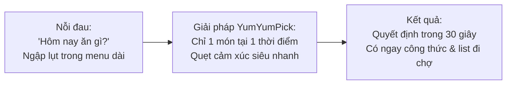
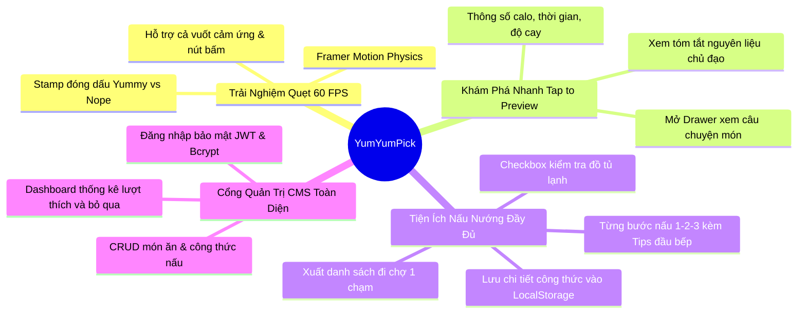
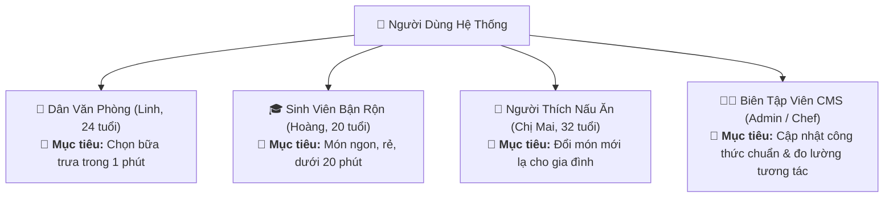
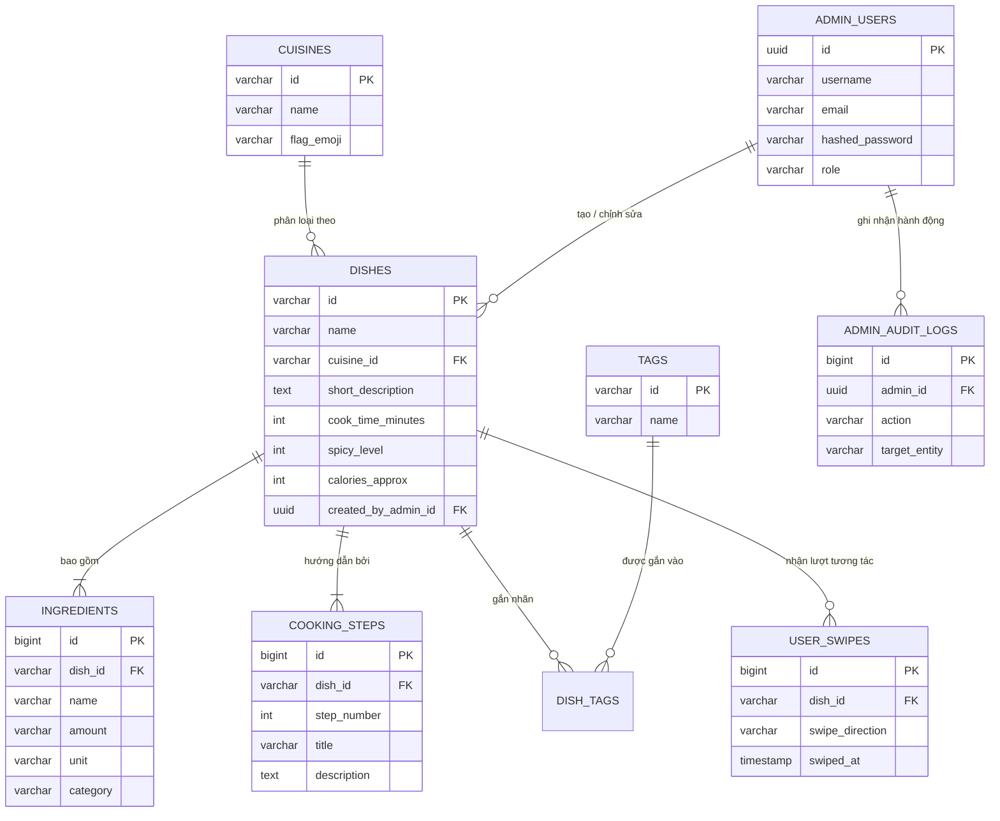
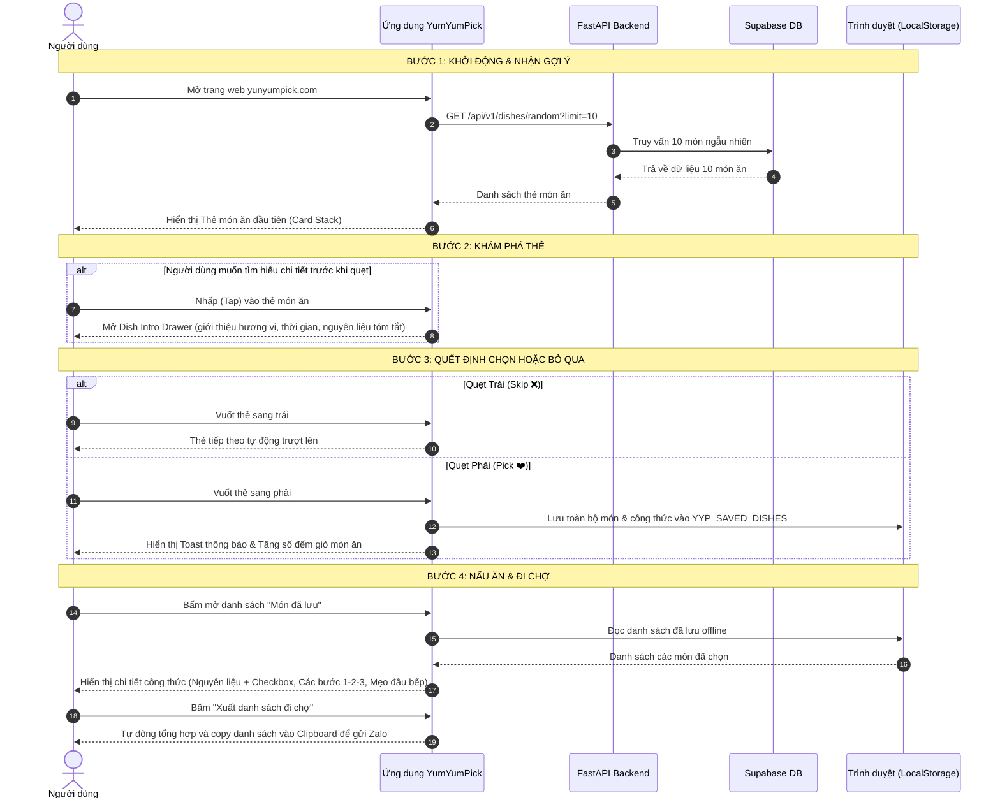

# 📖 00. Tổng Quan Dự Án & Thiết Kế Hệ Thống (Master Project Overview)
---

## 1. Tóm Tắt Dự Án (Executive Summary)

| Thuộc Tính | Chi Tiết Tóm Tắt |
|---|---|
| **Tên Ứng Dụng** | **YumYumPick** — *"Quẹt là măm, không lăn tăn nghĩ món"* |
| **Thể Loại Sản Phẩm** | Web App gợi ý ẩm thực tương tác theo cơ chế quẹt thẻ (Tinder for Food) |
| **Sứ Mệnh (Mission)** | Xóa bỏ sự lưỡng lự và "tê liệt quyết định" (Decision Paralysis) khi chọn món ăn hàng ngày, kết nối người dùng với cảm hứng nấu nướng và công thức chi tiết trong dưới 30 giây. |
| **Khách Hàng Mục Tiêu** | Sinh viên, nhân viên văn phòng, người nội trợ bận rộn và bất kỳ ai thường xuyên đau đầu với câu hỏi: *"Hôm nay ăn gì?"* |
| **Mô Hình Kiến Trúc** | 3 tầng phân tán chuẩn Cloud (3-Tier Cloud Architecture): Client SPA + RESTful API Backend + Cloud Database |
| **Bộ Công Nghệ Chính** | React (Vite) + Framer Motion + Tailwind CSS + Python FastAPI + Supabase (PostgreSQL 15+) |
| **Phương Thức Triển Khai** | Vercel (Frontend & CDN) • Render (FastAPI Web Service) • Supabase (Database) |

---

## 2. Bài Toán Thực Tế & Ý Tưởng Cốt Lõi (The Problem & The Big Idea)

### 2.1. Nỗi Đau Thực Tế (The Real-World Problem)
Hàng ngày, hàng triệu người lãng phí từ 15 đến 30 phút chỉ để suy nghĩ xem bữa trưa hoặc bữa tối nên ăn món gì. 
- **Nghịch lý của sự lựa chọn (The Paradox of Choice):** Khi mở các ứng dụng giao đồ ăn hiện tại (GrabFood, ShopeeFood) hoặc các trang web nấu nướng, người dùng bị "ngập lụt" trong hàng trăm trang danh sách thực đơn dài ngoằng, dẫn đến trạng thái mệt mỏi, lưỡng lự và cuối cùng lại chọn đại một món nhàm chán.
- **Thiếu sự hứng khởi:** Việc đọc chữ và danh mục tĩnh thiếu đi yếu tố trực quan sinh động và cảm giác thích thú.

### 2.2. Ý Tưởng Giải Pháp: "Tinder For Food"
Lấy cảm hứng từ cơ chế tương tác gây nghiện nổi tiếng của ứng dụng hẹn hò **Tinder**:
1. Thay vì hiển thị danh sách dài, màn hình chỉ hiển thị **DUY NHẤT MỘT MÓN ĂN** tại một thời điểm dưới dạng thẻ ảnh lớn hấp dẫn.
2. Người dùng chỉ cần đưa ra quyết định nhị phân siêu nhanh theo cảm xúc:
   - **Thích (Pick / Like ❤️):** Quẹt sang Phải.
   - **Không thích (Skip ❌):** Quẹt sang Trái để chuyển ngay sang món kế tiếp.
3. Muốn tìm hiểu thêm? **Nhấp nhẹ (Tap ℹ️) vào thẻ** để xem câu chuyện, thời gian nấu, độ cay và nguyên liệu trước khi quẹt.
4. Sau khi quẹt xong: Toàn bộ món đã chọn được lưu lại kèm **công thức chi tiết** (nguyên liệu có ô tích chọn, các bước nấu 1-2-3, mẹo đầu bếp) và có thể **xuất danh sách đi chợ** để gửi qua Zalo/Messenger chỉ bằng 1 nút bấm.



---

## 3. Điểm Đột Phá & Trải Nghiệm Khác Biệt (Key Highlights)



1. **Vật lý quẹt thẻ chân thực (Realistic Swipe Physics):** Sử dụng thuật toán tính toán góc nghiêng động ($\text{rotate} = x / 15$) và lực đàn hồi bung nở, mang lại cảm giác lướt thẻ mượt mà 60 khung hình/giây trên cả di động lẫn máy tính.
2. **Không cần đăng ký tài khoản phiền phức (Zero-Friction Onboarding):** Người dùng thông thường vào web là quẹt ngay lập tức. Dữ liệu các món đã lưu và lịch sử quẹt được lưu trữ bền vững tại `LocalStorage` trên chính trình duyệt của người dùng.
3. **Smart Grocery List (Xuất danh sách đi chợ thông minh):** Tự động gộp nguyên liệu của các món đã chọn thành bảng checklist để người dùng kiểm tra đồ có sẵn trong tủ lạnh hoặc gửi nhanh cho người đi chợ hộ.
4. **Hệ thống Quản Trị & Biên Tập Nội Dung (Admin / CMS Portal):** Được tích hợp sẵn cho đội ngũ biên tập viên để kiểm duyệt, thêm mới thực đơn, quản lý công thức và theo dõi báo cáo thống kê xu hướng món ăn được yêu thích nhất.

---

## 4. Đối Tượng Người Dùng (Target Personas)



| Nhóm Đối Tượng | Đại Diện Tiêu Biểu | Nỗi Đau Chính | Mục Tiêu Với YumYumPick |
|---|---|---|---|
| **Dân Văn Phòng** | Linh (24 tuổi) | Giờ nghỉ trưa ngắn, ngán thực đơn lặp lại | Chọn nhanh bữa trưa chỉ trong 1 phút |
| **Sinh Viên** | Hoàng (20 tuổi) | Ngân sách có hạn, ngại nấu nướng cầu kỳ | Gợi ý món ngon, tiết kiệm, làm dưới 20 phút |
| **Người Nấu Gia Đình** | Chị Mai (32 tuổi) | Cạn kiệt ý tưởng đổi món hàng ngày | Tìm kiếm cảm hứng và đổi vị cho cả gia đình |
| **Biên Tập Viên CMS** | Admin / Chef | Khó cập nhật thực đơn và đo lường tương tác | Quản lý công thức chuẩn, theo dõi xu hướng ẩm thực |

---

## 5. Phạm Vi Sản Phẩm (Product Scope)

Sản phẩm được phân định thành 2 phân hệ rõ ràng:

### 5.1. Phân Hệ Người Dùng (User Public Web App)
- **Màn hình chính quẹt thẻ (Card Deck):** Tải danh sách món ăn ngẫu nhiên, hỗ trợ quẹt trái (Skip), quẹt phải (Pick/Save), nút hoàn tác (Undo) và phím tắt bàn phím.
- **Drawer Giới Thiệu Món Ăn (Dish Intro Drawer):** Mở khi người dùng chạm (Tap) nhẹ vào thẻ. Hiển thị ảnh lớn, nguồn gốc xuất xứ, độ cay, calo, thời gian nấu và tóm tắt nguyên liệu chính.
- **Modal Bộ Lọc Nâng Cao (Smart Filter Modal):** Lọc theo 5+ nền văn hóa ẩm thực (Việt, Hàn, Nhật, Thái, Ý), theo bữa ăn (Sáng/Trưa/Tối), thời gian nấu (<20p, 20-45p) và khẩu vị (chay/mặn/cay).
- **Bộ Sưu Tập Món Đã Lưu & Trình Xem Công Thức Chi Tiết (Full Recipe Viewer):**
  - Xem danh sách món đã quẹt phải.
  - Mở xem công thức chi tiết: Định lượng nguyên liệu kèm checkbox, các bước thực hiện tuần tự, bí quyết mẹo nhỏ của đầu bếp.
  - Nút xuất và sao chép danh sách đi chợ (Copy Grocery List).
- **Lưu trữ ngoại tuyến (Offline-First LocalStorage):** Bảo toàn dữ liệu món đã lưu ngay cả khi tải lại trang hoặc mất mạng internet.

### 5.2. Phân Hệ Quản Trị Viên (Admin / CMS Portal - `/admin`)
- **Xác thực an toàn (JWT Authentication):** Đăng nhập dành riêng cho Quản trị viên và Biên tập viên, mật khẩu mã hóa một chiều chuẩn Bcrypt, cấp phát Bearer Token.
- **Bảng Thống Kê Tổng Quan (Analytics Dashboard):** Theo dõi 4 chỉ số KPI quan trọng: Tổng số món, Tổng lượt quẹt, Tổng lượt lưu, Tỉ lệ chuyển đổi thích/bỏ qua, kèm Top 5 món được yêu thích nhất và bị bỏ qua nhiều nhất.
- **Quản lý Thực Đơn & Công Thức (Dishes Management CRUD):**
  - Xem danh sách món ăn dạng bảng có phân trang, tìm kiếm theo tên và lọc theo quốc gia.
  - Modal tạo mới và chỉnh sửa món ăn đa tab: Thông tin cơ bản, Danh sách nguyên liệu động (thêm/xóa dòng, định lượng, phân loại), Các bước nấu ăn động (tiêu đề, hướng dẫn), Gắn thẻ Tags.
  - Xóa món ăn khỏi hệ thống với cơ chế ràng buộc toàn vẹn dữ liệu.

---

## 6. Kiến Trúc Hệ Thống Toàn Cảnh (System Architecture & Data Flow)

Hệ thống được thiết kế theo mô hình **3 Tầng Phân Tán (3-Tier Modern Cloud Architecture)** tách biệt hoàn toàn giữa giao diện, logic xử lý và lưu trữ dữ liệu:

```mermaid
flowchart TB
    subgraph ClientTier["TẦNG 1: GIAO DIỆN CLIENT (Vercel Cloud CDN)"]
        UserUI["Người dùng thông thường\n(React SPA Web App)"]
        AdminUI["Quản trị viên & Biên tập viên\n(Admin CMS Portal /admin)"]
        LocalStorage[("Browser LocalStorage\nCache công thức & món đã lưu")]
        UserUI <-->|Đọc/Ghi Offline| LocalStorage
    end

    subgraph ServerTier["TẦNG 2: XỬ LÝ NGHIỆP VỤ (Render Cloud Web Service)"]
        FastAPIServer["FastAPI Application Server (Python 3.11+)"]
        
        subgraph SubRouters["API Routing Layer"]
            PublicAPI["User Endpoints Router\n(/api/v1/dishes/random, /detail)"]
            AdminAPI["Admin Endpoints Router\n(/api/v1/admin/dishes, /stats)"]
            AuthGuard["JWT Security & Auth Guard\n(Bcrypt + Bearer Token)"]
        end

        subgraph CoreEngine["Business Logic Engine"]
            Randomizer["Thuật toán Gợi ý Ngẫu nhiên\n& Lọc Đa Tiêu Chí"]
            AdminService["Nghiệp vụ CMS CRUD\n& Tổng Hợp Thống Kê"]
        end

        FastAPIServer --> PublicAPI
        FastAPIServer --> AuthGuard
        AuthGuard --> AdminAPI
        PublicAPI --> Randomizer
        AdminAPI --> AdminService
    end

    subgraph DataTier["TẦNG 3: CƠ SỞ DỮ LIỆU ĐÁM MÂY (Supabase Managed PostgreSQL 15+)"]
        SupaDB[("Supabase PostgreSQL Database")]
        
        subgraph Tables["Các Bảng Dữ Liệu Quan Hệ"]
            T_Food["Dữ liệu Ẩm thực:\ncuisines, dishes, ingredients,\ncooking_steps, tags, dish_tags"]
            T_User["Dữ liệu Tương tác:\nuser_swipes, user_saved_dishes"]
            T_Admin["Dữ liệu Quản trị:\nadmin_users, admin_audit_logs"]
        end

        SupaDB --- T_Food
        SupaDB --- T_User
        SupaDB --- T_Admin
    end

    UserUI <-->|HTTPS / REST API (JSON)| PublicAPI
    AdminUI <-->|HTTPS / REST API (Bearer JWT)| AdminAPI
    CoreEngine <-->|SQLAlchemy ORM (Port 5432 / SSL)| SupaDB
```

### Luồng Dữ Liệu Trực Quan (How Data Moves)
1. **Khi người dùng lướt món ăn:** 
   - Ứng dụng gửi yêu cầu `GET /api/v1/dishes/random` lên FastAPI kèm theo các tiêu chí bộ lọc (nếu có).
   - FastAPI truy vấn Supabase PostgreSQL, lấy ngẫu nhiên danh sách món kèm tóm tắt nguyên liệu, loại trừ các ID món đã xem trong phiên và trả về mảng dữ liệu JSON.
2. **Khi người dùng quẹt phải (Chọn món):**
   - Không cần bắt người dùng phải đợi API trả lời, toàn bộ dữ liệu món và công thức nấu chi tiết được ghi lập tức vào `LocalStorage`. Trải nghiệm hoàn toàn tức thì (0ms latency).
   - Một sự kiện bất đồng bộ ghi nhận lượt quẹt được gửi ngầm lên CSDL để phục vụ báo cáo thống kê cho CMS.
3. **Khi Admin thao tác trên CMS:**
   - Admin đăng nhập, nhận chuỗi mã JWT. Mọi yêu cầu thêm/sửa/xóa đều được gửi kèm token này trong Header để backend kiểm tra tính hợp lệ trước khi tác động vào CSDL Supabase.

---

## 7. Mô Hình Dữ Liệu & Lược Đồ Supabase (Data Architecture)

Toàn bộ hệ thống dữ liệu được lưu trữ trên **Supabase (PostgreSQL 15+)** với thiết kế chuẩn hóa bậc 3 (3NF), đảm bảo không dư thừa dữ liệu và duy trì toàn vẹn qua các ràng buộc khóa ngoại `CASCADE`.



---

## 8. Lựa Chọn Công Nghệ & Lý Do (Tech Stack Justification)

| Thành Phần | Công Nghệ Lựa Chọn | Vì Sao Lựa Chọn? (Rationale) |
|---|---|---|
| **Frontend Framework** | **React 18 + Vite** | Khởi động dự án cực nhanh, cấu trúc component tái sử dụng cao, hệ sinh thái phong phú và tối ưu hiệu năng render DOM ảo. |
| **Hiệu Ứng Chuyển Động** | **Framer Motion** | Thư viện vật lý hàng đầu cho React, hỗ trợ cử chỉ kéo vuốt (`drag="x"`), quán tính và phân biệt cử chỉ nhấp (Tap) vs kéo (Drag) mượt mà 60 FPS. |
| **Giao Diện & Style** | **Tailwind CSS** | Thiết kế giao diện hiện đại theo chuẩn Utility-first, tốc độ code nhanh, hỗ trợ Responsive mobile-first hoàn hảo và file CSS đầu ra siêu nhẹ. |
| **Backend Framework** | **Python FastAPI** | Tốc độ thực thi tiệm cận Node.js/Go nhờ kiến trúc Asynchronous (ASGI), tự động validate dữ liệu chặt chẽ qua Pydantic v2 và tự sinh tài liệu Swagger UI. |
| **Xác Thực Admin** | **PyJWT + Passlib (Bcrypt)** | Chuẩn xác thực công nghiệp Stateless JWT gọn nhẹ, kết hợp băm mật khẩu chuẩn Bcrypt tăng cường độ an toàn bảo mật cho cổng quản trị. |
| **Cơ Sở Dữ Liệu** | **Supabase (PostgreSQL 15+)** | Cung cấp CSDL quan hệ chuẩn doanh nghiệp trên đám mây, độ tin cậy cao, có SQL Editor trực quan, có gói miễn phí vĩnh viễn (Free Tier) dồi dào, phù hợp hoàn hảo với cả môi trường học tập và vận hành thực tế. |
| **Lưu Trữ Client** | **Browser LocalStorage** | Cho phép người dùng truy cập lại toàn bộ thực đơn và công thức đã chọn tức thì, hoạt động trơn tru cả khi mất mạng mà không tốn chi phí băng thông server. |
| **Hạ Tầng Triển Khai** | **Vercel + Render + Supabase** | Mô hình 3 tầng Cloud hiện đại: Vercel phân phối Frontend qua mạng Edge CDN toàn cầu, Render chạy Web Service FastAPI tự động, Supabase đảm nhận lưu trữ an toàn. |

---

## 9. Hành Trình Người Dùng Toàn Diện (End-to-End User Experience)



---

## 10. Tiêu Chí Nghiệm Thu (KPIs) & Định Hướng Tương Lai (Roadmap)

### 10.1. Tiêu Chí Kỹ Thuật Nghiệm Thu (Target KPIs)
- ⚡ **Tốc độ phản hồi ban đầu (FCP):** $< 1.5\text{s}$ trên thiết bị di động mạng 4G.
- 🎯 **Độ mượt mà của cử chỉ quẹt (Swipe Frame Rate):** Đạt ổn định $60\text{ FPS}$.
- ⏱️ **Thời gian đưa ra quyết định:** Giúp người dùng chọn được thực đơn ưng ý trong vòng dưới $30\text{ giây}$.
- 🛡️ **Bảo mật cổng Admin:** 100% các endpoint quản trị bắt buộc có Bearer JWT, mật khẩu admin băm bằng thuật toán an toàn.
- 📱 **Điểm chất lượng Google Lighthouse:** $\ge 90$ cho Performance và $\ge 95$ cho Accessibility/SEO.

### 10.2. Định Hướng Phát Triển Tương Lai (Future Enhancements)
1. **AI Fridge Scanner (Quét tủ lạnh thông minh):** Chụp ảnh đồ ăn có trong tủ lạnh, AI nhận diện nguyên liệu và chỉ hiển thị quẹt những món nấu được từ các nguyên liệu đó.
2. **Near-Me Food Map (Bản đồ hàng quán xung quanh):** Nếu người dùng không muốn tự nấu, nút *"Tìm quán bán món này quanh đây"* sẽ định vị các quán ăn gần nhất trên Google Maps.
3. **Room Quẹt Chung (Group Room / Couple Mode):** Tính năng cho nhóm bạn hoặc cặp đôi cùng vào 1 phòng, mỗi người tự quẹt trên máy mình; khi cả 2 cùng "quẹt phải" một món thì hệ thống lập tức thông báo **"It's a Match!"**.

---

> [!TIP]
> **Đường dẫn nhanh đến các tài liệu kỹ thuật chuyên sâu:**
> - Xem chi tiết thiết kế CSDL & kịch bản SQL: [07_DATA_SCHEMA_AND_SEEDS.md](./07_DATA_SCHEMA_AND_SEEDS.md)
> - Xem đặc tả API & Kiến trúc phân tầng: [02_SYSTEM_ARCHITECTURE_AND_DESIGN.md](./02_SYSTEM_ARCHITECTURE_AND_DESIGN.md)
> - Xem chi tiết cơ học cử chỉ quẹt & giao diện: [03_USER_FLOW_AND_UIUX_SPEC.md](./03_USER_FLOW_AND_UIUX_SPEC.md)
> - Xem phân công công việc 6 thành viên: [04_TEAM_ROLES_AND_RACI.md](./04_TEAM_ROLES_AND_RACI.md)
> - Xem tiến độ và lộ trình 4 Sprints: [06_SPRINT_ROADMAP_AND_TODO_PER_ROLE.md](./06_SPRINT_ROADMAP_AND_TODO_PER_ROLE.md)
