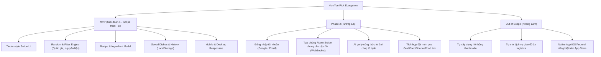

# 🎯 01. Project Charter & Scope Document

## 1. Tổng Quan & Bối Cảnh Dự Án (Project Overview)

- **Tên dự án:** YumYumPick
- **Slogan:** *"Quẹt mượt mà — Chọn món ngon không cần đắn đo"*
- **Mã dự án:** `YYP`
- **Loại hình sản phẩm:** Web Application (Mobile-first Responsive Web App)
- **Thời gian thực hiện:** 4 tuần (4 Sprints)

### 1.1. Vấn Đề Thực Tế (Problem Statement)
"Trưa nay ăn gì?", "Tối nay ăn gì?" là câu hỏi muôn thuở gây tốn kém thời gian và năng lượng tinh thần cho hàng triệu người mỗi ngày (hội chứng "Decision Paralysis" - tê liệt quyết định):
- Thực đơn quá nhiều nhưng không biết chọn gì.
- Muốn tự nấu nhưng mở tủ lạnh ra chỉ có vài nguyên liệu và không biết làm món gì phù hợp.
- Cần đổi khẩu vị sang món Hàn, Nhật, Thái, Âu... nhưng không nhớ tên món hoặc sợ cách nấu quá phức tạp.
- Các app giao đồ ăn truyền thống cung cấp danh sách dài vô tận, gây ngợp thị giác và khó lựa chọn nhanh.

### 1.2. Giải Pháp Của YumYumPick (Solution Statement)
YumYumPick đơn giản hóa triệt để quyết định ăn uống thông qua cơ chế **Tinder-style Card Swiping (quẹt thẻ ngẫu nhiên)**:
1. **Một món tại một thời điểm:** Giúp não bộ tập trung 100% vào hình ảnh bắt mắt của món ăn.
2. **Thao tác tức thì (Fast Decisive UX):**
   - **Quẹt Phải (Right Swipe / Like):** Quyết định chọn món này! Lưu vào danh sách yêu thích & mở khóa công thức/nguyên liệu chi tiết.
   - **Quẹt Trái (Left Swipe / Skip):** Không ưng món này, bỏ qua và chuyển sang món tiếp theo.
3. **Bộ lọc thông minh (Smart Filters):** Lọc theo quốc gia (Việt, Hàn, Nhật, Thái, Ý...), vùng miền, mức độ cay, nguyên liệu sẵn có trong tủ lạnh.
4. **Không bắt buộc đăng ký phức tạp:** Sử dụng `LocalStorage` giúp người dùng mở web là quẹt được ngay, dữ liệu lưu trữ tức thì và riêng tư trên thiết bị.

---

## 2. Đối Tượng Sử Dụng (Target Audience & Personas)

### Persona 1: "Sinh viên / Dân văn phòng bận rộn" (Nguyễn Minh, 22 tuổi)
- **Hành vi:** Đến giờ nghỉ trưa luôn hỏi đồng nghiệp "Ăn gì bây giờ?", lướt app 30 phút vẫn chưa chốt được.
- **Nhu cầu:** Cần một gợi ý nhanh trong vòng 30 giây, hình ảnh hấp dẫn, có tên quán hoặc cách làm đơn giản.

### Persona 2: "Người thích tự nấu ăn tại nhà" (Trần Linh, 25 tuổi)
- **Hành vi:** Đi làm về mở tủ lạnh còn một ít trứng, cà chua, thịt bò nhưng không biết nấu món gì lạ miệng.
- **Nhu cầu:** Nhập/chọn nguyên liệu sẵn có, quẹt vài thẻ để chọn ra món nấu được ngay kèm công thức chi tiết.

### Persona 3: "Nhóm bạn / Cặp đôi hay tranh cãi khi đi ăn"
- **Hành vi:** Đưa ra ý kiến gì đối phương cũng bảo "Gì cũng được" nhưng thực tế lại không chịu.
- **Nhu cầu:** Truyền tay nhau chiếc điện thoại để quẹt, món nào được quẹt phải thì ăn món đó.

---

## 3. Phạm Vi Dự Án (Project Scope)

### 3.1. Trong Phạm Vi MVP (In-Scope for Current Release)
1. **Tinder Card Swiping:**
   - Card trực quan: Hình ảnh chất lượng cao, tên món, quốc gia/ẩm thực, thời gian nấu, độ khó.
   - Thao tác quẹt cảm ứng trên điện thoại (touch gesture) và chuột trên máy tính (drag & drop / phím mũi tên).
   - Hiệu ứng quẹt mượt mà (smooth animation) kèm phản hồi thị giác (Icon Like màu xanh lá, Skip màu đỏ).
2. **Random & Recommendation API (FastAPI):**
   - API trả về danh sách món ăn ngẫu nhiên đã được xáo trộn (shuffle) không trùng lặp trong một phiên quẹt.
   - Bộ lọc theo: Quốc gia (Việt Nam, Nhật Bản, Hàn Quốc, Thái Lan, Ý, Trung Quốc, Âu Mỹ), độ cay, loại bữa ăn (Sáng, Trưa, Tối, Ăn vặt), nguyên liệu chính (Thịt bò, Gà, Hải sản, Rau củ/Chay).
3. **Chi Tiết Món Ăn & Công Thức (Recipe Modal/Drawer):**
   - Bấm vào thẻ hoặc nút "Xem công thức" để mở Bottom Sheet (trên mobile) hoặc Modal (trên desktop).
   - Hiển thị: Danh sách nguyên liệu cần chuẩn bị, các bước nấu (Step 1, Step 2,...), thời gian ước tính, mẹo chế biến (Tips).
4. **Lịch Sử & Bộ Sưu Tập Đã Lưu (Saved History & Bookmarks):**
   - Tab "Món Đã Chọn": Xem lại tất cả các món đã quẹt phải.
   - Quản lý: Đánh dấu đã nấu xong, chia sẻ link món ăn, xóa khỏi danh sách đã lưu.
   - Dữ liệu được lưu trữ tự động trên `LocalStorage` của trình duyệt.
5. **Giao Diện Responsive Toàn Diện (Mobile-First):**
   - Tối ưu hoàn hảo cho kích thước màn hình điện thoại (375px - 430px) và máy tính bảng / PC (1024px+).
6. **Bộ Dữ Liệu Ban Đầu (Seed Data):**
   - Tối thiểu 50-100 món ăn phong phú, hình ảnh đẹp mắt, định dạng chuẩn JSON.

### 3.2. Ngoài Phạm Vi (Out of Scope)
- Không làm ứng dụng Native tải từ App Store/Google Play (tập trung Web App chuẩn PWA).
- Không làm cổng thanh toán, ví điện tử.
- Không xây dựng chuỗi cung ứng shipper hay đặt món trực tiếp.

---

## 4. Yêu Cầu Chức Năng & Phi Chức Năng (Requirements Specification)

### 4.1. Yêu Cầu Chức Năng (Functional Requirements - FR)
- **FR-01 (Quẹt thẻ):** Người dùng có thể quẹt trái (Skip) hoặc quẹt phải (Pick) thẻ món ăn. Có hỗ trợ nút bấm vật lý (nút ❌ và nút ❤️) để người dùng không cần dùng cử chỉ kéo chuột.
- **FR-02 (Xem chi tiết):** Người dùng có thể bấm vào thẻ hoặc nút "Chi tiết" để xem toàn bộ thông tin món, nguyên liệu định lượng và các bước thực hiện.
- **FR-03 (Bộ lọc tìm kiếm):** Người dùng có thể chọn 1 hoặc nhiều tiêu chí lọc. Khi áp dụng bộ lọc, danh sách thẻ được tải mới theo tiêu chí đã chọn.
- **FR-04 (Lưu trữ cục bộ):** Các món được quẹt phải tự động lưu vào `LocalStorage`. Khi người dùng reload trang, danh sách đã lưu không bị biến mất.
- **FR-05 (Undo thao tác):** Cho phép hoàn tác (Undo) lại 1 thẻ gần nhất nếu vô tình quẹt nhầm.
- **FR-06 (Export danh sách đi chợ):** Tính năng tổng hợp nguyên liệu của các món đã chọn thành danh sách mua sắm (Grocery checklist).

### 4.2. Yêu Cầu Phi Chức Năng (Non-Functional Requirements - NFR)
- **NFR-01 (Hiệu năng quẹt - Performance):** Tốc độ khung hình khi quẹt thẻ đạt tối thiểu 60 FPS trên thiết bị di động tầm trung. Không giật lag khi render thẻ tiếp theo.
- **NFR-02 (Thời gian phản hồi API - Latency):** Endpoint lấy danh sách món ăn từ FastAPI phản hồi dưới **200ms**.
- **NFR-03 (Khả năng tương thích - Compatibility):** Hoạt động tốt trên Chrome, Safari iOS, Edge, Firefox trên cả iOS, Android, macOS và Windows.
- **NFR-04 (Kích thước hình ảnh - Asset Optimization):** Toàn bộ hình ảnh món ăn được tối ưu định dạng WebP, dung lượng dưới 150KB/ảnh để tải trang cực nhanh.
- **NFR-05 (Độ tin cậy & Offline tolerance):** Trường hợp mất kết nối mạng tạm thời, ứng dụng vẫn hiển thị được các món đã lưu từ LocalStorage.

---

## 5. Tiêu Chí Nghiệm Thu & Chỉ Số Thành Công (KPIs)

| Chỉ Số (Metric) | Mục Tiêu Nghiệm Thu | Cách Đo Lường |
|---|---|---|
| **Lighthouse Performance** | $\ge 90$ điểm trên Mobile | Google Lighthouse Audit |
| **First Contentful Paint (FCP)** | $< 1.5$ giây | Web Vitals / Vercel Analytics |
| **Dung lượng Data khởi tạo** | $\ge 60$ món ăn đa dạng | Đếm bản ghi trong data seed |
| **Tỷ lệ Crash / Lỗi UI Swipe** | $0$ lỗi kẹt thẻ khi quẹt liên tục | Kịch bản kiểm thử tự động & QA test |
| **Thời gian ra quyết định món** | Giảm thời gian chọn món xuống $< 2$ phút | Phỏng vấn người dùng thử nghiệm |
