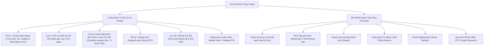

# 01. Project Charter & Scope Document (Kế Hoạch 5 Ngày)

## 1. Tổng Quan & Bối Cảnh Dự Án (Project Overview)

- **Tên dự án:** YumYumPick
- **Slogan:** *"Quẹt mượt mà — Chọn món ngon không cần đắn đo"*
- **Mã dự án:** `YYP`
- **Loại hình sản phẩm:** Web Application (Responsive Web App hỗ trợ cả PC và Điện thoại)
- **Thời gian thực hiện:** **5 Ngày** (Áp dụng chiến lược phân chia song song không phụ thuộc)
- **Phương thức chạy:** Cục bộ trên máy tính (Localhost với FastAPI và React Vite)

---

## 2. Bài Toán Thực Tế & Giải Pháp Tinh Gọn

### 2.1. Vấn Đề Thực Tế (Problem Statement)
"Trưa nay ăn gì?", "Tối nay ăn gì?" là câu hỏi muôn thuở gây tốn kém thời gian và năng lượng tinh thần cho hàng triệu người mỗi ngày (hội chứng "Decision Paralysis" - tê liệt quyết định):
- Thực đơn các ứng dụng đặt món quá dài, gây ngợp thị giác và khó lựa chọn nhanh.
- Muốn tự nấu ăn nhưng thiếu cảm hứng và công thức trực quan.
- Nhóm bạn/cặp đôi hay tranh cãi khi chọn món ăn chung.

### 2.2. Giải Pháp Tinh Gọn Của YumYumPick (Solution)
1. **Một món tại một thời điểm:** Giúp não bộ tập trung 100% vào hình ảnh bắt mắt của món ăn.
2. **Thao tác tức thì & Trực quan (Fast Decisive UX):**
   - **Quẹt Phải (Swipe Right / Thích):** Quyết định chọn món này! Lưu món vào danh sách yêu thích trên CSDL SQLite.
   - **Quẹt Trái (Swipe Left / Bỏ qua):** Bỏ qua món này và chuyển sang món tiếp theo.
3. **Bộ lọc sơ bộ (Basic Filters):** Lọc nhanh theo quốc gia (Việt, Hàn, Nhật, Thái, Ý), mức độ cay, thời gian chế biến.
4. **Xem danh sách đã quẹt & Chi tiết công thức:** Mở danh sách các món đã thích để xem công thức (danh sách nguyên liệu dạng văn bản rõ ràng, 3 bước nấu chuẩn 1-2-3, mẹo đầu bếp).
5. **Đăng ký & Đăng nhập cực kỳ đơn giản:** Chỉ cần nhập `username` và `password`, không cần xác thực email/OTP phiền phức.
6. **Responsive trên cả PC và Mobile:** Mobile vuốt chạm tiện lợi, PC có khung cố định kèm phím bấm điều hướng.

---

## 3. Phạm Vi Dự Án (Project Scope)

### 3.1. Chi Tiết Các Hạng Mục Trong Phạm Vi (In-Scope)
1. **Core 1 — Swipe Card Deck (Thẻ quẹt tích hợp Intro):** Bộ thẻ vuốt mượt mà 60 FPS, stamp "YUMMY" / "NOPE", hiển thị ảnh sắc nét, tên món, huy hiệu và đoạn mô tả giới thiệu (`short_description`) trực tiếp trên mặt thẻ. Hỗ trợ touch trên điện thoại và drag chuột/phím mũi tên trên PC.
2. **Core 2 — Bộ Lọc Sơ Bộ:** Modal chọn quốc gia (5 nước), độ cay, thời gian nấu để tải lại danh sách thẻ tương ứng từ SQLite.
3. **Core 3 — Danh Sách Đã Thích & Xem Chi Tiết Công Thức:**
   - Danh sách món đã thích (kèm nút xóa).
   - Xem chi tiết công thức: Danh sách nguyên liệu kèm **Checkbox tương tác `[ ]`**, hướng dẫn 3 bước nấu ăn chuẩn mực và mẹo đầu bếp.
4. **Simple Auth (Đăng nhập đơn giản):**
   - Đăng ký tài khoản: `POST /api/v1/auth/signup` (username, password, full_name).
   - Đăng nhập: `POST /api/v1/auth/login` (username, password).
   - Quản lý session qua `localStorage`: chỉ lưu `user_id` và `username` để không bị mất phiên khi F5 trang.
5. **Quản Trị Dữ Liệu Qua SQLite (Không Admin CMS):**
   - Sử dụng SQLite 3 cục bộ (`backend/yumyumpick.db`). Quản lý trực tiếp bằng **DB Browser for SQLite**.
6. **Responsive Đa Nền Tảng:** Tương thích màn hình Mobile (vuốt cảm ứng) và Desktop PC (khung thẻ cố định kèm phím mũi tên).

### 3.2. Các Hạng Mục Đã Bỏ Đi Để Hoàn Thành Trong 5 Ngày (Out-of-Scope)
- **Bỏ Smart Grocery List & Copy Zalo:** Không làm chức năng tự tổng hợp gộp nguyên liệu và nút sao chép gửi mạng xã hội.
- **Bỏ Drawer phụ đa tầng:** Mô tả giới thiệu món ăn đã hiển thị trực tiếp trên mặt thẻ quẹt; muốn xem công thức chi tiết thì vào danh sách đã quẹt.
- **Bỏ Deploy Cloud (Vercel, Render, Supabase):** Chạy 100% localhost ổn định.
- **Bỏ Admin CMS Portal (`/admin`):** Thêm/sửa món trực tiếp trong file SQLite.
- **Bỏ xác thực phức tạp:** Không email verify, không SMS OTP, không Google OAuth.

---

## 4. Tiêu Chuẩn Nghiệm Thu Dự Án (Definition of Done - DoD)

1. **Khởi chạy cục bộ thành công:** Chạy 1 lệnh khởi động Backend (`uvicorn app.main:app --reload`), 1 lệnh khởi động Frontend (`npm run dev`), hệ thống kết nối thông suốt với file SQLite.
2. **Đăng ký & Đăng nhập thông suốt:** Tạo được tài khoản người dùng mới và đăng nhập thành công.
3. **Quẹt thẻ & Lưu món:** Đọc được giới thiệu món trên thẻ, quẹt trái bỏ qua mượt mà, quẹt phải lưu món vào SQLite liên kết với tài khoản user đang đăng nhập.
4. **Hiển thị công thức & Checkbox nguyên liệu:** Xem được công thức chi tiết của các món đã thích, tích chọn được checkbox nguyên liệu trong quá trình chuẩn bị nấu nướng.
5. **Responsive:** Giao diện co giãn chuẩn đẹp trên cả trình duyệt máy tính và màn hình giả lập điện thoại (Mobile Responsive Mode của DevTools).
