# 🎯 01. Project Charter & Scope Document (Kế Hoạch 5 Ngày)

## 1. Tổng Quan & Bối Cảnh Dự Án (Project Overview)

- **Tên dự án:** YumYumPick
- **Slogan:** *"Quẹt mượt mà — Chọn món ngon không cần đắn đo"*
- **Mã dự án:** `YYP`
- **Loại hình sản phẩm:** Web Application (Responsive Web App hỗ trợ cả PC và Điện thoại)
- **Thời gian thực hiện:** **5 Ngày** (Áp dụng chiến lược phân chia song song không phụ thuộc)
- **Phương thức chạy:** Cục bộ trên máy tính (Localhost với FastAPI và React Vite)

---

## 2. Bài Toán Thực Tế & Giải Pháp Tinh Gọn

### 2.1. Vấn Đề Thực Tế (Problem Statement)
"Trưa nay ăn gì?", "Tối nay ăn gì?" là câu hỏi muôn thuở gây tốn kém thời gian và năng lượng tinh thần cho hàng triệu người mỗi ngày (hội chứng "Decision Paralysis" - tê liệt quyết định):
- Thực đơn các ứng dụng đặt món quá dài, gây ngợp thị giác và khó lựa chọn nhanh.
- Muốn tự nấu ăn nhưng thiếu cảm hứng và công thức trực quan.
- Nhóm bạn/cặp đôi hay tranh cãi khi chọn món ăn chung.

### 2.2. Giải Pháp Tinh Gọn Của YumYumPick (Solution)
1. **Một món tại một thời điểm:** Giúp não bộ tập trung 100% vào hình ảnh bắt mắt của món ăn.
2. **Thao tác tức thì & Trực quan (Fast Decisive UX):**
   - **Tap vào thẻ (ℹ️):** Mở nhanh bảng **Giới thiệu món ăn** (Dish Intro): nguồn gốc, hương vị, calo, thời gian nấu và tóm tắt nguyên liệu chính để cân nhắc trước khi quẹt.
   - **Quẹt Phải (Swipe Right / ❤️):** Quyết định chọn món này! Gọi API lưu món ăn vào tài khoản cá nhân trên CSDL SQLite để vào xem chi tiết sau khi quẹt xong.
   - **Quẹt Trái (Swipe Left / ❌):** Bỏ qua món này và chuyển sang món tiếp theo.
3. **Bộ lọc thông minh (Smart Filters):** Lọc theo quốc gia (Việt, Hàn, Nhật, Thái, Ý...), mức độ cay, thời gian chế biến.
4. **Xem chi tiết & Đi chợ sau khi quẹt:** Mở bộ sưu tập món đã lưu để xem đầy đủ công thức (nguyên liệu có checkbox, các bước nấu 1-2-3, mẹo đầu bếp) và tự động xuất danh sách đi chợ gửi qua Zalo/Messenger.
5. **Đăng ký & Đăng nhập cực kỳ đơn giản:** Chỉ cần nhập `username` và `password`, không cần xác thực email/OTP phiền phức.
6. **Responsive trên cả PC và Mobile:** Mobile vuốt chạm tiện lợi, PC có khung cố định thẩm mỹ kèm phím bấm điều hướng tiện lợi.

---

## 3. Phạm Vi Dự Án (Project Scope)

```mermaid
graph TD
    A["YumYumPick 5-Day Scope"] --> B["✅ Trong Phạm Vi Thực Hiện (In-Scope)"]
    A --> C["❌ Ngoài Phạm Vi / Đã Cắt Giảm (Out-of-Scope)"]

    B --> B1["Tinder-style Swipe UI (Framer Motion)"]
    B --> B2["Simple User Auth (Signup/Login không OTP/Verify)"]
    B --> B3["CSDL SQLite Cục Bộ (File yumyumpick.db)"]
    B --> B4["Bộ Lọc Món Ăn (Quốc gia, Calo, Cay, Thời gian)"]
    B --> B5["Dish Intro Drawer (Xem nhanh khi tap thẻ)"]
    B --> B6["Saved Dishes & Công thức chi tiết (Có checkbox nguyên liệu)"]
    B --> B7["Smart Grocery List (Xuất danh sách đi chợ 1 chạm)"]
    B --> B8["Responsive hoàn chỉnh (Mobile Web + Desktop PC)"]
    B --> B9["Chuẩn bị dữ liệu 40-50 món ăn & Script Seed SQLite"]

    C --> C1["Cổng Quản Trị Admin CMS Portal (/admin)"]
    C --> C2["Cloud Deployment (Vercel, Render, Supabase Cloud)"]
    C --> C3["Xác minh Email, số điện thoại, OTP, Forgot Password"]
    C --> C4["CI/CD GitHub Actions phức tạp"]
    C --> C5["Hệ thống thanh toán & Đặt đơn logistics"]
```

### 3.1. Chi Tiết Các Hạng Mục Trong Phạm Vi (In-Scope)
1. **Swipe Card Deck:** Bộ thẻ vuốt mượt mà 60 FPS, stamp "YUMMY" / "NOPE", hỗ trợ touch trên điện thoại và drag chuột/phím mũi tên trên PC.
2. **Simple Auth (Đăng nhập đơn giản):**
   - Đăng ký tài khoản: `POST /api/v1/auth/signup` (nhập username, password, full_name).
   - Đăng nhập: `POST /api/v1/auth/login` (nhập username, password).
   - Quản lý session qua `localStorage`: chỉ lưu `user_id` và `username` để không bị mất phiên khi F5 trang.
3. **Quản Trị Dữ Liệu Qua SQLite (Không Admin CMS):**
   - Sử dụng SQLite 3 cục bộ (`backend/yumyumpick.db`).
   - Nhóm tự quản lý dữ liệu món ăn thông qua công cụ trực quan **DB Browser for SQLite** hoặc chạy script Python `seed_sqlite.py`.
4. **Dish Intro Drawer & Recipe View:**
   - Tap thẻ mở Drawer xem câu chuyện, thời gian nấu, calo, tóm tắt nguyên liệu.
   - Trang/Modal chi tiết công thức nấu chuẩn kèm danh sách checkbox nguyên liệu.
5. **Smart Grocery List:** Tự động gộp nguyên liệu các món đã lưu thành checklist, nút copy để gửi qua mạng xã hội.
6. **Responsive Đa Nền Tảng:** Thiết kế tương thích hoàn hảo cả màn hình nhỏ (Mobile 375px - 430px) và màn hình lớn (Laptop/PC 1024px+).
7. **Data Preparation:** Chuẩn bị 40-50 món ăn chuẩn định dạng JSON và nạp sẵn vào CSDL SQLite.

### 3.2. Các Hạng Mục Đã Bỏ Đi Để Hoàn Thành Trong 5 Ngày (Out-of-Scope)
- **Bỏ Deploy Cloud (Vercel, Render, Supabase):** Tránh mọi lỗi liên quan đến kết nối mạng, biến môi trường cloud, CORS domain, build failure. Dự án chạy 100% localhost ổn định.
- **Bỏ Admin CMS Portal (`/admin`):** Loại bỏ toàn bộ giao diện quản trị, bảng thống kê KPI, modal soạn thảo món ăn đa tab và JWT RBAC bảo mật cao. Việc thêm/sửa món ăn được thực hiện trực tiếp trong file SQLite.
- **Bỏ xác thực phức tạp:** Không cần gửi email xác nhận tài khoản, không cần mã OTP SMS, không cần đăng nhập Google OAuth.

---

## 4. Tiêu Chuẩn Nghiệm Thu Dự Án (Definition of Done - DoD)

1. **Khởi chạy cục bộ thành công:** Chạy 1 lệnh khởi động Backend (`uvicorn app.main:app --reload`), 1 lệnh khởi động Frontend (`npm run dev`), hệ thống kết nối thông suốt với file SQLite.
2. **Đăng ký & Đăng nhập thông suốt:** Tạo được tài khoản người dùng mới và đăng nhập thành công.
3. **Quẹt thẻ & Lưu món:** Quẹt trái bỏ qua mượt mà, quẹt phải lưu món vào SQLite liên kết với tài khoản user đang đăng nhập.
4. **Hiển thị công thức & Đi chợ:** Xem được công thức chi tiết, tích chọn được checkbox nguyên liệu, copy được danh sách đi chợ.
5. **Responsive:** Giao diện co giãn chuẩn đẹp trên cả trình duyệt máy tính và màn hình giả lập điện thoại (Mobile Responsive Mode của DevTools).
