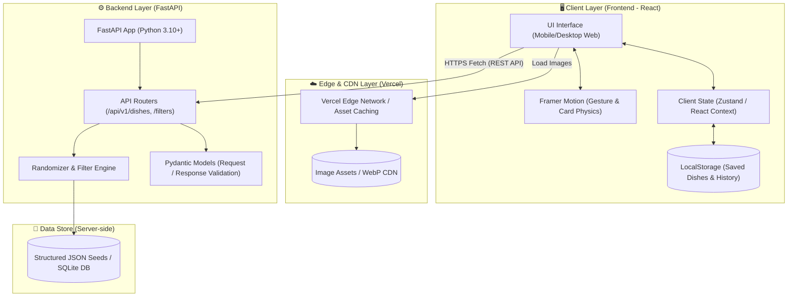
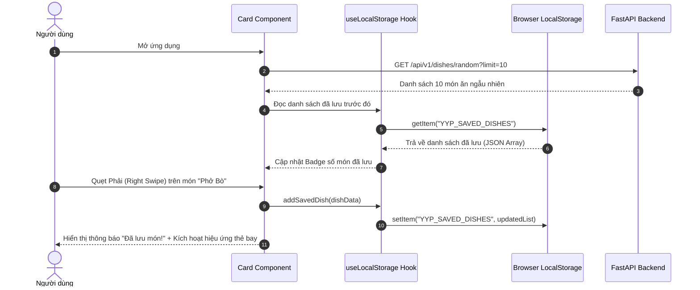
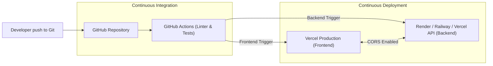

# 🏗️ 02. System Architecture & Design Specification

Tài liệu này định nghĩa chi tiết kiến trúc kỹ thuật của hệ thống **YumYumPick**, bao gồm phân tầng ứng dụng, thiết kế API RESTful, mô hình dữ liệu, cơ chế đồng bộ LocalStorage và giải pháp triển khai (Deployment).

---

## 1. Kiến Trúc Tổng Thể (High-Level Architecture)

YumYumPick được xây dựng theo mô hình **Client-Server Decoupled** (Tách rời Frontend và Backend) nhằm tối đa hóa tốc độ phát triển độc lập giữa các thành viên, tối ưu hiệu năng và dễ dàng kiểm thử.



---

## 2. Công Nghệ Sử Dụng (Technology Stack)

| Tầng (Layer) | Công Nghệ | Phiên Bản | Lý Do Lựa Chọn |
|---|---|---|---|
| **Frontend Framework** | **React.js** (Vite template) | 18.x / 19.x | Tốc độ build siêu nhanh, hệ sinh thái phong phú, tối ưu cho Single Page Application (SPA). |
| **Animation & Gestures** | **Framer Motion** | 11.x | Xử lý cảm ứng kéo quẹt mượt mà, hỗ trợ tính toán vận tốc kéo (velocity), độ nảy (spring physics). |
| **Styling** | **Tailwind CSS** | 3.4+ | Utility-first CSS, thiết kế giao diện nhanh chóng, đảm bảo responsive mobile/PC nhất quán. |
| **Icons & UI Kit** | **Lucide React** | Mới nhất | Bộ icon hiện đại, nhẹ, đầy đủ biểu tượng món ăn, thao tác quẹt. |
| **Backend Framework** | **Python FastAPI** | 0.110+ | Bất đồng bộ (async/await), tự động sinh OpenAPI/Swagger Docs, validation chặt chẽ qua Pydantic. |
| **Data Validation** | **Pydantic v2** | 2.x | Xác thực dữ liệu API chính xác, an toàn kiểu dữ liệu (Type-safe). |
| **Client Storage** | **Browser LocalStorage** | Web Standard | Lưu danh sách món đã quẹt và lịch sử không cần ép người dùng đăng nhập tài khoản. |
| **Deployment** | **Vercel / Render** | Cloud | Frontend deploy tự động qua Vercel CI/CD; Backend host trên Render/Railway hoặc Vercel Serverless. |

---

## 3. Thiết Kế Frontend (Frontend Architecture)

### 3.1. Cấu Trúc Thư Mục Chuẩn (Directory Structure)
```text
frontend/
├── public/
│   ├── favicon.ico
│   └── placeholders/
├── src/
│   ├── assets/             # Hình ảnh logo, icon tĩnh
│   ├── components/         # Reusable UI components
│   │   ├── common/         # Button, Modal, Badge, Spinner
│   │   ├── swipe/          # CardStack, SwipeCard, ActionButtons, UndoButton
│   │   ├── filter/         # FilterModal, CuisineSelector, IngredientTags
│   │   ├── recipe/         # RecipeDrawer, IngredientList, CookingSteps
│   │   └── history/        # HistoryList, SavedDishCard, GroceryExport
│   ├── hooks/              # Custom hooks: useSwipe, useDishes, useLocalStorage
│   ├── services/           # Axios/Fetch API client calls
│   │   └── api.js          # REST API endpoints mapping
│   ├── types/              # TypeScript types hoặc JSDoc model definitions
│   ├── utils/              # Helper functions, formatters, shuffle algorithms
│   ├── App.jsx             # Root layout & routing
│   ├── index.css           # Tailwind directives & global animation styles
│   └── main.jsx            # Entry point
├── package.json
├── tailwind.config.js
└── vite.config.js
```

### 3.2. Luồng Quản Lý State & LocalStorage (State Management Flow)



### 3.3. Định Dạng Lưu Trữ LocalStorage (Storage Keys Spec)

1. **`YYP_SAVED_DISHES`** (Key lưu các món đã quẹt phải):
```json
[
  {
    "id": "dish_vn_001",
    "name": "Phở Bò Tái Lăn",
    "image": "https://images.unsplash.com/...",
    "cuisine": "Vietnam",
    "savedAt": "2026-09-11T12:00:00Z",
    "status": "planned"
  }
]
```
2. **`YYP_USER_PREFERENCES`** (Bộ lọc được lưu lại):
```json
{
  "selectedCuisines": ["Vietnam", "Japan", "Korea"],
  "maxCookTime": 45,
  "isSpicy": false,
  "excludedIngredients": ["hành lá", "đậu phộng"]
}
```
3. **`YYP_SWIPE_HISTORY`** (Lịch sử các thẻ đã quẹt để tránh lặp lại và hỗ trợ Undo):
```json
{
  "lastSwipedId": "dish_vn_001",
  "swipedIds": ["dish_vn_001", "dish_jp_004"]
}
```

---

## 4. Thiết Kế Backend (FastAPI Architecture)

### 4.1. Cấu Trúc Thư Mục Backend
```text
backend/
├── app/
│   ├── api/
│   │   └── v1/
│   │       ├── endpoints/
│   │       │   ├── dishes.py       # API lấy món ăn, random, chi tiết
│   │       │   ├── filters.py      # API lấy danh mục lọc (quốc gia, tag)
│   │       │   └── health.py       # Healthcheck API
│   │       └── api_router.py       # Gom router v1
│   ├── core/
│   │   ├── config.py               # Cấu hình env, CORS, settings
│   │   └── security.py             # Middleware bảo mật
│   ├── data/
│   │   ├── dishes_seed.json        # Dữ liệu 60+ món ăn ban đầu
│   │   └── seed_loader.py          # Hàm load & cache data vào bộ nhớ
│   ├── models/
│   │   └── dish.py                 # Pydantic schemas (Dish, Recipe, Filter)
│   ├── services/
│   │   └── dish_service.py         # Business logic: lọc, random shuffle
│   └── main.py                     # Khởi tạo FastAPI app & CORS
├── tests/
│   ├── test_dishes.py
│   └── test_filters.py
├── requirements.txt
└── Dockerfile                      # Dành cho deploy container nếu cần
```

### 4.2. RESTful API Endpoints Specification

#### 1. Lấy danh sách món ăn ngẫu nhiên (Hỗ trợ quẹt)
- **Endpoint:** `GET /api/v1/dishes/random`
- **Query Parameters:**
  - `limit` (int, default=10, max=30): Số lượng thẻ tải về một lần.
  - `cuisine` (string, optional): Lọc theo quốc gia (vd: `Vietnam`, `Japan`, `Korea`).
  - `meal_type` (string, optional): `breakfast`, `lunch`, `dinner`, `snack`.
  - `max_time` (int, optional): Thời gian nấu tối đa (phút).
  - `exclude_ids` (string, optional): Danh sách ID phân cách bằng dấu phẩy để không trả lại thẻ vừa quẹt (vd: `dish_1,dish_2`).
- **Response `200 OK`:**
```json
{
  "status": "success",
  "count": 10,
  "data": [
    {
      "id": "dish_vn_001",
      "name": "Phở Bò Hà Nội",
      "english_name": "Hanoi Beef Pho",
      "cuisine": "Vietnam",
      "region": "Miền Bắc",
      "image": "https://images.unsplash.com/photo-1582878826629-29b7ad1cdc43?w=800",
      "cook_time_minutes": 60,
      "difficulty": "Trung bình",
      "calories_approx": 450,
      "tags": ["Nước lèo", "Ăn sáng", "Truyền thống", "Không cay"],
      "short_description": "Món phở bò truyền thống với nước dùng hầm xương ngọt thanh, thơm mùi hồi quế thảo quả.",
      "ingredients_summary": ["Bánh phở", "Thịt bò tái/nạm", "Xương bò", "Hành lá", "Hoa hồi"]
    }
  ]
}
```

#### 2. Lấy chi tiết công thức & cách nấu
- **Endpoint:** `GET /api/v1/dishes/{dish_id}`
- **Response `200 OK`:**
```json
{
  "status": "success",
  "data": {
    "id": "dish_vn_001",
    "name": "Phở Bò Hà Nội",
    "image": "https://images.unsplash.com/photo-1582878826629-29b7ad1cdc43?w=800",
    "cuisine": "Vietnam",
    "cook_time_minutes": 60,
    "difficulty": "Trung bình",
    "servings": 4,
    "ingredients": [
      { "name": "Bánh phở tươi", "amount": "500", "unit": "g" },
      { "name": "Thịt bắp bò / thăn bò", "amount": "300", "unit": "g" },
      { "name": "Xương ống bò", "amount": "1", "unit": "kg" },
      { "name": "Gừng, hành tím nướng", "amount": "2", "unit": "củ" },
      { "name": "Hoa hồi, quế, thảo quả", "amount": "1", "unit": "gói nhỏ" }
    ],
    "steps": [
      {
        "step_number": 1,
        "title": "Sơ chế và ninh xương",
        "description": "Chần qua xương bò với nước sôi có pha chút muối gừng để khử mùi hôi, sau đó ninh nhỏ lửa trong 2-3 tiếng."
      },
      {
        "step_number": 2,
        "title": "Nấu nước dùng phở",
        "description": "Rang thơm hoa hồi, quế, thảo quả, cho vào túi lọc thả vào nồi nước dùng cùng hành gừng nướng. Nêm gia vị vừa ăn."
      },
      {
        "step_number": 3,
        "title": "Trình bày và thưởng thức",
        "description": "Trụng bánh phở qua nước sôi, xếp vào tô, thêm thịt bò thái mỏng, hành lá, chan nước dùng đang sôi sùng sục."
      }
    ],
    "tips": "Nước dùng phở phải luôn mở hé vung để nước trong vắt, không bị đục."
  }
}
```

#### 3. Lấy siêu dữ liệu bộ lọc (Filter Metadata)
- **Endpoint:** `GET /api/v1/filters/metadata`
- **Response `200 OK`:**
```json
{
  "status": "success",
  "data": {
    "cuisines": [
      { "code": "Vietnam", "label": "Việt Nam", "flag": "🇻🇳" },
      { "code": "Korea", "label": "Hàn Quốc", "flag": "🇰🇷" },
      { "code": "Japan", "label": "Nhật Bản", "flag": "🇯🇵" },
      { "code": "Thailand", "label": "Thái Lan", "flag": "🇹🇭" },
      { "code": "Italy", "label": "Ý / Phương Tây", "flag": "🇮🇹" }
    ],
    "meal_types": ["Bữa sáng", "Bữa trưa", "Bữa tối", "Ăn vặt / Tráng miệng"],
    "common_ingredients": ["Thịt bò", "Thịt heo", "Thịt gà", "Hải sản", "Trứng", "Đậu hũ", "Rau củ"],
    "difficulties": ["Dễ (Dưới 20p)", "Trung bình (20-45p)", "Kỳ công (Trên 45p)"]
  }
}
```

#### 4. Lấy danh sách chi tiết nhiều món theo Batch ID (Phục vụ danh sách Saved)
- **Endpoint:** `POST /api/v1/dishes/batch`
- **Request Body:**
```json
{
  "dish_ids": ["dish_vn_001", "dish_jp_002", "dish_kr_005"]
}
```
- **Response `200 OK`:** Danh sách chi tiết các món tương ứng.

---

## 5. Chiến Lược Triển Khai & DevOps (Deployment Strategy)



1. **Frontend Hosting (Vercel):**
   - Kết nối trực tiếp repository GitHub.
   - Mỗi Pull Request tự động tạo một **Preview URL** để cả team và QA test giao diện trước khi merge.
   - Build Command: `npm run build`, Output Directory: `dist`.
2. **Backend Hosting (Render / Railway / Vercel Serverless):**
   - Cấu hình Environment Variables:
     - `ALLOWED_ORIGINS=https://yunyumpick.vercel.app,http://localhost:5173`
     - `PORT=8000`
   - Bật CORS Middleware trên FastAPI cho phép Client gọi an toàn.
