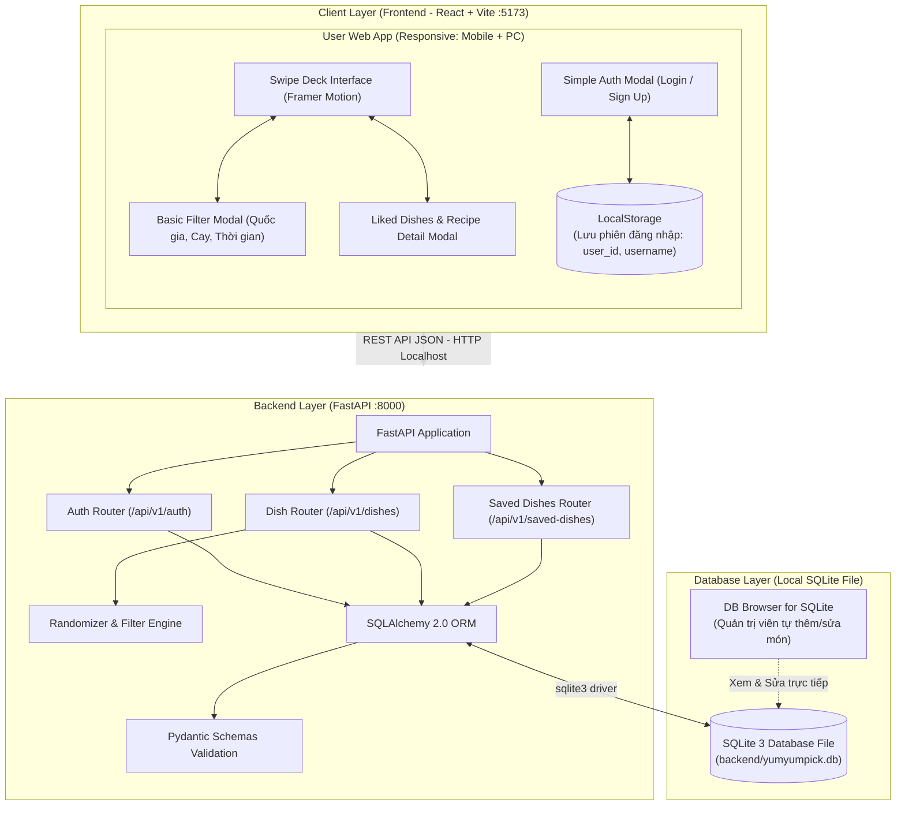
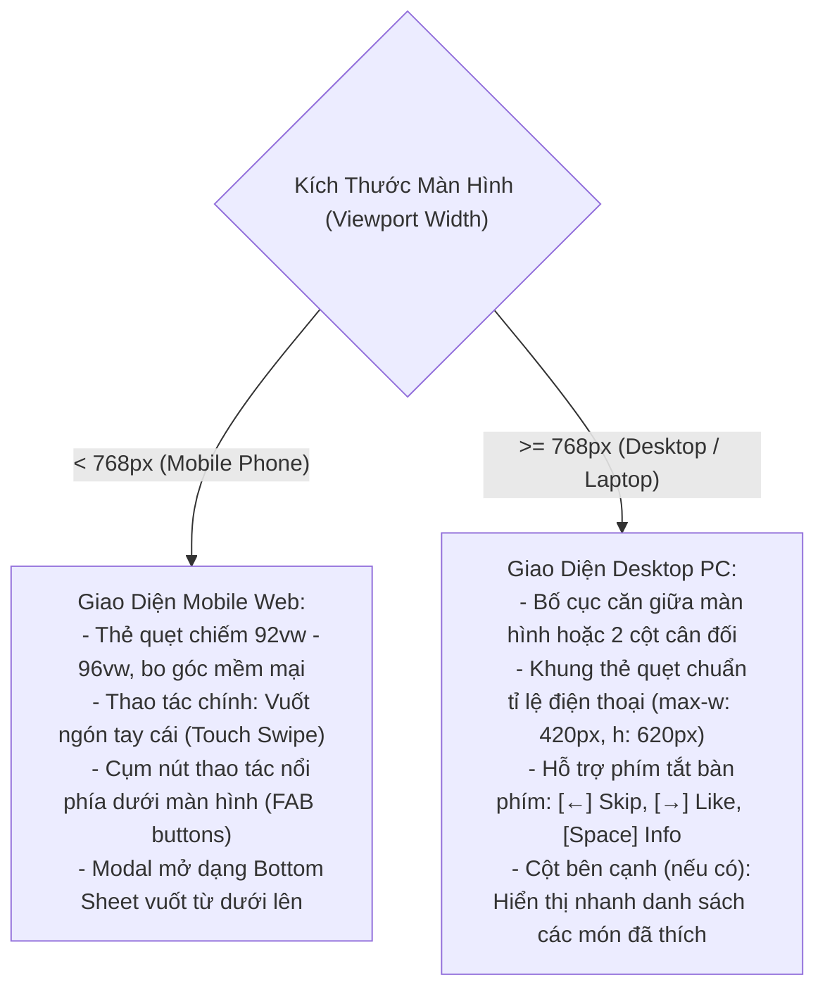
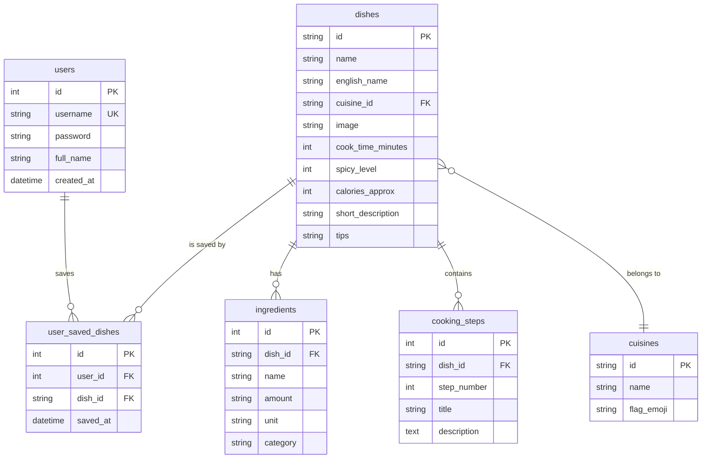

# 02. System Architecture & Design Specification (SQLite & Local 5-Day Plan)

Tài liệu này định nghĩa chi tiết kiến trúc kỹ thuật của hệ thống **YumYumPick** sau khi tinh giản để phát triển và hoàn thiện trong **5 ngày**: sử dụng CSDL **SQLite cục bộ**, bỏ hạ tầng Deploy/Cloud, loại bỏ Admin CMS, bổ sung **Simple User Auth** và quy chuẩn **Responsive Đa Nền Tảng (PC & Mobile)**.

---

## 1. Kiến Trúc Tổng Thể (High-Level Architecture)

Hệ thống được thiết kế theo mô hình **Client-Server Decoupled (Tách rời Frontend và Backend)** chạy hoàn toàn trên máy cục bộ (Localhost):



---

## 2. Công Nghệ Sử Dụng (Technology Stack)

| Tầng (Layer) | Công Nghệ | Phiên Bản | Mục Đích Kỹ Thuật |
|---|---|---|---|
| **Frontend Framework** | **React.js** (Vite template) | 18.x | Ứng dụng SPA gọn nhẹ, hot reload tức thì, khởi tạo nhanh. |
| **Animation & Gestures** | **Framer Motion** | 11.x | Vật lý quẹt thẻ 60 FPS (kéo thả, góc nghiêng đàn hồi, stamp đóng dấu). |
| **Styling & Responsive** | **Tailwind CSS + Lucide** | 3.4+ | Tiện ích CSS responsive đa màn hình (mobile-first), bộ icon ẩm thực hiện đại. |
| **Backend Framework** | **Python FastAPI** | 0.110+ | Framework API siêu tốc, tự động sinh Swagger UI tương tác tại `/docs`. |
| **Database Engine** | **SQLite 3** | Cục bộ | CSDL quan hệ lưu trong file duy nhất `yumyumpick.db`, không cần cài server riêng. |
| **Database ORM** | **SQLAlchemy** | 2.0+ | Trừu tượng hóa truy vấn quan hệ, kết nối qua `sqlite:///./yumyumpick.db`. |
| **Data Validation** | **Pydantic v2** | 2.x | Validate dữ liệu đầu vào/đầu ra JSON chuẩn xác. |
| **Client Storage** | **Browser LocalStorage** | Chuẩn Web | **Chỉ dùng lưu session đăng nhập** (`user_id`, `username`) để giữ trạng thái khi F5. |
| **Database GUI Tool** | **DB Browser for SQLite** | Miễn phí | Công cụ giao diện mở file SQLite để quản lý, sửa dữ liệu món ăn thay thế Admin CMS. |

---

## 3. Phân Tích Kỹ Thuật: Vai Trò Của `LocalStorage`

### 3.1. Tại sao trước đây dùng LocalStorage cho món ăn?
Trong thiết kế ban đầu, hệ thống không có tính năng đăng ký/đăng nhập cho người dùng thường, nên buộc phải dùng `localStorage` (`YYP_SAVED_DISHES`) để lưu toàn bộ dữ liệu món ăn và công thức. Điều này có nhược điểm:
- Dữ liệu bị mất nếu xóa cache trình duyệt hoặc đổi thiết bị.
- Dung lượng lưu trữ bị giới hạn (thường tối đa 5MB).
- Dữ liệu không được liên kết với hồ sơ người dùng.

### 3.2. Vai trò mới của LocalStorage trong kiến trúc 5 ngày
Hiện tại, hệ thống đã bổ sung **Simple User Auth (Đăng nhập đơn giản)** và **CSDL SQLite**:
1. **Dữ liệu món đã lưu (Saved Dishes):** Được chuyển sang lưu trữ bền vững trong bảng `user_saved_dishes` của SQLite thông qua API `POST /api/v1/saved-dishes`.
2. **Vai trò duy nhất của `localStorage` hiện tại:**
   - Lưu trữ thông tin phiên đăng nhập tối giản:
     ```json
     {
       "user_id": 1,
       "username": "minhduc",
       "full_name": "Minh Đức"
     }
     ```
   - Giúp người dùng khi F5 hoặc tải lại trình duyệt vẫn giữ nguyên trạng thái đã đăng nhập mà không cần gọi lại API xác thực phức tạp.
   - **Kết luận:** Giữ lại `localStorage` nhưng chỉ dùng đúng 1 nhiệm vụ lưu session người dùng nhẹ nhàng, loại bỏ hoàn toàn việc lưu các cục JSON công thức món ăn cồng kềnh.

---

## 4. Đặc Tả Responsive Đa Nền Tảng (PC & Mobile Web)

Để người dùng có trải nghiệm tốt nhất trên cả điện thoại (vuốt cảm ứng) lẫn máy tính (chuột và bàn phím), hệ thống quy định thiết kế Responsive theo Tailwind CSS:



### 4.1. Chi Tiết Breakpoints & Kích Thước
- **Mobile (`< 640px`):**
  - Container: `w-full px-4 h-[calc(100vh-80px)] flex items-center justify-center`
  - Thẻ quẹt: `w-full max-w-[360px] h-[520px]`
  - Hành vi: Ưu tiên gesture touch cảm ứng, vuốt thẻ bay mượt.
- **Tablet / Laptop / PC (`>= 768px` đến `1440px+`):**
  - Khung ứng dụng chính: Đặt trong container căn giữa `max-w-md mx-auto` (mô phỏng app điện thoại hiện đại) hoặc layout 2 cột `max-w-5xl mx-auto flex gap-8 items-start`:
    - **Cột trái:** Khung quẹt thẻ kích thước chuẩn ($400\text{px} \times 580\text{px}$) với các phím tắt hướng dẫn trực quan (Badge phím `←` Bỏ qua, `→` Thích).
    - **Cột phải:** Panel xem danh sách món đã thích theo thời gian thực.
  - Ngăn ngừa tình trạng thẻ bị bè ngang làm vỡ tỉ lệ ảnh món ăn trên màn hình PC rộng.

---

## 5. Đặc Tả RESTful API Tinh Gọn (Endpoints Specification)

Toàn bộ API sử dụng chuẩn JSON, tiền tố `/api/v1`:

### 5.1. Nhóm API Xác Thực Đơn Giản (Simple Auth)
Không cần token JWT hay mã hóa phức tạp, xác thực trực tiếp qua CSDL SQLite:

#### 1. Đăng ký tài khoản mới (`POST /api/v1/auth/signup`)
- **Request Body:**
  ```json
  {
    "username": "hoangnam",
    "password": "123",
    "full_name": "Hoàng Nam"
  }
  ```
- **Response (201 Created):**
  ```json
  {
    "success": true,
    "message": "Đăng ký thành công",
    "user": {
      "id": 2,
      "username": "hoangnam",
      "full_name": "Hoàng Nam"
    }
  }
  ```

#### 2. Đăng nhập (`POST /api/v1/auth/login`)
- **Request Body:**
  ```json
  {
    "username": "hoangnam",
    "password": "123"
  }
  ```
- **Response (200 OK):**
  ```json
  {
    "success": true,
    "message": "Đăng nhập thành công",
    "user": {
      "id": 2,
      "username": "hoangnam",
      "full_name": "Hoàng Nam"
    }
  }
  ```

---

### 5.2. Nhóm API Món Ăn (Dishes API)

#### 1. Lấy danh sách thẻ món ăn ngẫu nhiên (`GET /api/v1/dishes/random`)
- **Query Params:**
  - `limit`: Số lượng thẻ trả về (mặc định: `10`)
  - `cuisine`: Lọc theo quốc gia (`Vietnam`, `Korea`, `Japan`, `Thailand`, `Italy`)
  - `max_time`: Lọc thời gian nấu tối đa (phút, vd: `30`)
  - `spicy_level`: Lọc cấp độ cay (`0`, `1`, `2`, `3`)
  - `exclude_ids`: Danh sách ID các món đã xem trong phiên để tránh trùng (vd: `dish_vn_001,dish_kr_002`)
- **Response (200 OK):** Mảng các món ăn kèm nguyên liệu tóm tắt và ảnh WebP.

#### 2. Lấy chi tiết công thức 1 món (`GET /api/v1/dishes/{dish_id}`)
- **Response (200 OK):** Trả về đầy đủ thông tin món ăn, bao gồm danh sách chi tiết `ingredients` (có đơn vị, định lượng) và `steps` (các bước thực hiện 1-2-3).

#### 3. Lấy siêu dữ liệu bộ lọc (`GET /api/v1/filters/metadata`)
- **Response (200 OK):** Danh sách các quốc gia, cờ biểu tượng, các khoảng thời gian nấu để hiển thị trên `FilterModal`.

---

### 5.3. Nhóm API Món Đã Thích (Liked Dishes API)

#### 1. Lưu món ăn khi quẹt phải (`POST /api/v1/saved-dishes`)
- **Request Body:**
  ```json
  {
    "user_id": 2,
    "dish_id": "dish_vn_001"
  }
  ```
- **Response (200 OK):**
  ```json
  {
    "success": true,
    "message": "Đã lưu món vào danh sách yêu thích"
  }
  ```

#### 2. Lấy danh sách món đã lưu của người dùng (`GET /api/v1/saved-dishes/{user_id}`)
- **Response (200 OK):** Danh sách toàn bộ các món kèm công thức chi tiết mà người dùng đã quẹt phải.

#### 3. Xóa món khỏi danh sách đã lưu (`DELETE /api/v1/saved-dishes/{user_id}/{dish_id}`)
- **Response (200 OK):** Xóa bản ghi thành công.

---

## 6. Thiết Kế CSDL SQLite Cục Bộ (SQLite Database Design)

File CSDL được lưu tại đường dẫn: `backend/yumyumpick.db`.



- Không cần tạo bảng `admin_users` hay `admin_audit_logs`.
- Khóa ngoại `FOREIGN KEY (dish_id) REFERENCES dishes(id) ON DELETE CASCADE`.
- Dữ liệu thêm mới món ăn có thể chỉnh sửa trực tiếp bằng ứng dụng **DB Browser for SQLite** bằng cách mở file `backend/yumyumpick.db`.
