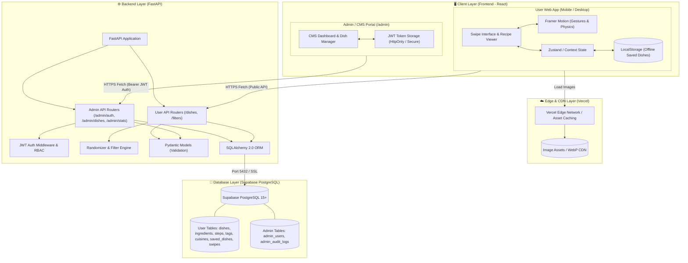
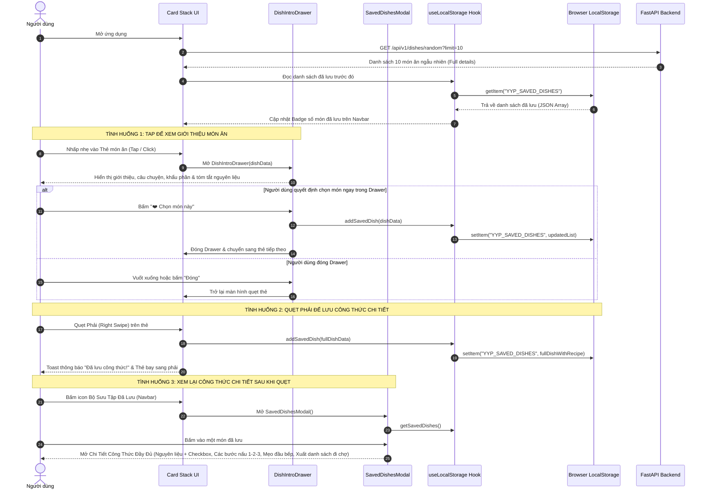

# 🏗️ 02. System Architecture & Design Specification

Tài liệu này định nghĩa chi tiết kiến trúc kỹ thuật của hệ thống **YumYumPick**, bao gồm phân tầng ứng dụng, thiết kế API RESTful, mô hình dữ liệu, cơ chế đồng bộ LocalStorage và giải pháp triển khai (Deployment).

---

## 1. Kiến Trúc Tổng Thể (High-Level Architecture)

YumYumPick được xây dựng theo mô hình **Client-Server Decoupled** (Tách rời Frontend và Backend) nhằm tối đa hóa tốc độ phát triển độc lập giữa các thành viên, tối ưu hiệu năng và dễ dàng kiểm thử.



---

## 2. Công Nghệ Sử Dụng (Technology Stack)

| Tầng (Layer) | Công Nghệ | Phiên Bản | Mục Đích Kỹ Thuật |
|---|---|---|---|
| **Frontend Framework** | **React.js** (Vite template) | 18.x / 19.x | Single Page Application (SPA), tích hợp User App và Admin Portal. |
| **Animation & Gestures** | **Framer Motion** | 11.x | Xử lý vật lý quẹt thẻ (drag, rotation, spring physics) cho User App. |
| **Styling & UI Kit** | **Tailwind CSS + Lucide** | 3.4+ | Utility-first styling cho cả User Swipe Deck và Admin CMS Table/Forms. |
| **Backend Framework** | **Python FastAPI** | 0.110+ | RESTful API bất đồng bộ, phân chia router User vs Admin rõ ràng. |
| **Authentication & Security** | **PyJWT + Passlib (Bcrypt)** | Mới nhất | Mã hóa mật khẩu, sinh và xác thực JSON Web Token cho Admin. |
| **Data Validation** | **Pydantic v2** | 2.x | Xác thực và serialize dữ liệu I/O (Request/Response models). |
| **Database ORM & Driver** | **SQLAlchemy 2.0 + psycopg2** | 2.0+ / 2.9+ | Trừu tượng hóa truy vấn quan hệ, connection pooling kết nối Supabase. |
| **Cloud Database** | **Supabase (PostgreSQL 15+)** | 15+ | Lưu trữ dữ liệu ẩm thực, tương tác người dùng và tài khoản quản trị. |
| **Client Storage** | **Browser LocalStorage** | Web Standard | Cache lịch sử quẹt và món đã lưu offline phía Client. |
| **Cloud Hosting** | **Vercel + Render + Supabase** | Cloud | Frontend trên Vercel, Backend trên Render, Database trên Supabase. |


---

## 3. Thiết Kế Frontend (Frontend Architecture)

### 3.1. Cấu Trúc Thư Mục Chuẩn (Directory Structure)
```text
frontend/
├── public/
│   ├── favicon.ico
│   └── placeholders/
├── src/
│   ├── assets/             # Hình ảnh logo, icon tĩnh
│   ├── components/         # Reusable UI components
│   │   ├── common/         # Button, Modal, Badge, Spinner
│   │   ├── swipe/          # CardStack, SwipeCard, ActionButtons, UndoButton
│   │   ├── filter/         # FilterModal, CuisineSelector, IngredientTags
│   │   ├── recipe/         # RecipeDrawer, IngredientList, CookingSteps
│   │   ├── history/        # HistoryList, SavedDishCard, GroceryExport
│   │   └── admin/          # AdminLayout, DishTable, DishFormModal, StatsOverview, AuditLogView
│   ├── pages/              # Màn hình ứng dụng & CMS
│   │   ├── UserHome.jsx    # Giao diện chính người dùng quẹt thẻ
│   │   └── admin/          # Giao diện Quản trị viên
│   │       ├── AdminLogin.jsx       # Đăng nhập bảo mật JWT
│   │       ├── AdminDashboard.jsx   # Thống kê tổng quan & tương tác
│   │       └── AdminDishes.jsx      # Quản lý CRUD món ăn & công thức
│   ├── hooks/              # Custom hooks: useSwipe, useDishes, useLocalStorage, useAdminAuth
│   ├── services/           # Axios/Fetch API client calls
│   │   ├── api.js          # User REST API endpoints mapping
│   │   └── adminApi.js     # Admin CRUD & Auth API client (kèm Bearer Token Header)
│   ├── types/              # TypeScript types hoặc JSDoc model definitions
│   ├── utils/              # Helper functions, formatters, shuffle algorithms
│   ├── App.jsx             # Root layout & routing (User routes + Protected Admin routes)
│   ├── index.css           # Tailwind directives & global animation styles
│   └── main.jsx            # Entry point
├── package.json
├── tailwind.config.js
└── vite.config.js
```

### 3.2. Luồng Quản Lý State & LocalStorage (State Management Flow)



### 3.3. Định Dạng Lưu Trữ LocalStorage (Storage Keys Spec)

1. **`YYP_SAVED_DISHES`** (Lưu trữ toàn bộ thông tin và công thức chi tiết của các món đã quẹt phải):
```json
[
  {
    "id": "dish_vn_001",
    "name": "Phở Bò Tái Nạm",
    "english_name": "Traditional Beef Pho",
    "cuisine": "Vietnam",
    "region": "Miền Bắc",
    "meal_type": ["breakfast", "lunch", "dinner"],
    "image": "https://images.unsplash.com/photo-1582878826629-29b7ad1cdc43?auto=format&fit=crop&w=800&q=80",
    "cook_time_minutes": 60,
    "prep_time_minutes": 20,
    "difficulty": "Kỳ công",
    "spicy_level": 0,
    "calories_approx": 480,
    "is_vegetarian": false,
    "tags": ["Ăn sáng", "Nước lèo", "Truyền thống", "Món nước"],
    "short_description": "Món quốc hồn quốc túy với bánh phở mềm dai, nước dùng hầm từ xương bò thơm mùi quế hồi thảo quả nức mũi.",
    "ingredients": [
      { "name": "Bánh phở tươi", "amount": "500", "unit": "g", "category": "tinh bột" },
      { "name": "Thịt bò thăn / bắp", "amount": "300", "unit": "g", "category": "thịt" },
      { "name": "Xương ống bò ninh", "amount": "1", "unit": "kg", "category": "thịt" },
      { "name": "Gừng và hành tím nướng", "amount": "3", "unit": "củ", "category": "gia vị" },
      { "name": "Hoa hồi, quế, thảo quả", "amount": "1", "unit": "gói", "category": "gia vị" },
      { "name": "Hành lá, rau mùi, chanh ớt", "amount": "1", "unit": "bó", "category": "rau" }
    ],
    "steps": [
      {
        "step_number": 1,
        "title": "Chần xương và hầm nước dùng",
        "description": "Chần xương bò với nước sôi khử mùi hôi. Cho xương vào nồi lớn hầm nhỏ lửa trong 2 tiếng cùng hành tím, gừng đã nướng cháy xém cạnh."
      },
      {
        "step_number": 2,
        "title": "Nấu thơm hương vị phở",
        "description": "Rang thơm hoa hồi, quế, thảo quả cho vào túi vải buộc chặt rồi thả vào nồi nước dùng. Nêm nước mắm ngon, muối, đường phèn vừa vị."
      },
      {
        "step_number": 3,
        "title": "Hoàn thiện và thưởng thức",
        "description": "Trụng bánh phở qua nước sôi xếp vào tô, đặt thịt bò tái thái mỏng lên trên, rắc hành lá rau mùi rồi chan ngập nước dùng đang sôi sùng sục."
      }
    ],
    "tips": "Nước dùng phở muốn trong thì không được đậy nắp vung kín và phải thường xuyên vớt sạch bọt nổi.",
    "savedAt": "2026-09-11T23:45:00Z",
    "isCooked": false
  }
]
```
> [!NOTE]
> Việc lưu trữ đầy đủ `ingredients`, `steps`, `tips` vào `YYP_SAVED_DISHES` giúp người dùng sau khi quẹt có thể xem lại chi tiết công thức ngay lập tức dù đang offline, đi siêu thị mất sóng hoặc không cần phải gửi request tải lại từ server.

2. **`YYP_USER_PREFERENCES`** (Bộ lọc được lưu lại):
```json
{
  "selectedCuisines": ["Vietnam", "Japan", "Korea"],
  "maxCookTime": 45,
  "isSpicy": false,
  "excludedIngredients": ["hành lá", "đậu phộng"]
}
```

3. **`YYP_SWIPE_HISTORY`** (Lịch sử các thẻ đã quẹt để tránh lặp lại và hỗ trợ Undo):
```json
{
  "lastSwipedId": "dish_vn_001",
  "swipedIds": ["dish_vn_001", "dish_jp_004"]
}
```

### 3.4. Kiến Trúc Xử Lý Cử Chỉ Kéo vs Nhấp (Framer Motion Tap & Swipe Architecture)
Để đảm bảo trải nghiệm người dùng không bị xung đột giữa thao tác **Kéo quẹt (Swipe)** và **Nhấp xem giới thiệu (Tap)**:
- Thẻ sử dụng component `motion.div` với các thuộc tính:
  - `drag="x"`: Chỉ cho phép kéo theo trục ngang để quẹt.
  - `dragConstraints={{ left: 0, right: 0 }}`: Điểm neo đàn hồi quay lại tâm nếu chưa đạt ngưỡng quẹt.
  - `dragElastic={0.9}`: Tạo lực cản vật lý tự nhiên.
  - `onTap`: Framer Motion tự động tách biệt giữa sự kiện nhấp chuột/chạm ngón tay và kéo. Nếu người dùng chỉ chạm và nhấc ngón tay lên trong phạm vi $< 5\text{px}$, sự kiện `onTap` được gọi và kích hoạt mở **DishIntroDrawer**.
  - `onDragStart` / `onDragEnd`: Khi độ dịch chuyển vượt quá ngưỡng kích hoạt, cờ trạng thái `isDragging` được bật, ngăn chặn hoàn toàn việc mở Drawer vô ý.

---

## 4. Thiết Kế Backend (FastAPI Architecture)

### 4.1. Cấu Trúc Thư Mục Backend
```text
backend/
├── app/
│   ├── api/
│   │   └── v1/
│   │       ├── endpoints/
│   │       │   ├── dishes.py       # API người dùng: lấy món ăn, random, chi tiết
│   │       │   ├── filters.py      # API người dùng: danh mục lọc (quốc gia, tag)
│   │       │   ├── health.py       # Healthcheck API
│   │       │   └── admin/          # API Quản trị viên (Admin / CMS)
│   │       │       ├── auth.py     # POST /admin/auth/login, refresh, me
│   │       │       ├── dishes.py   # CRUD món ăn, nguyên liệu, bước nấu
│   │       │       └── stats.py    # Thống kê lượt quẹt, lượt lưu, món trending
│   │       └── api_router.py       # Gom router v1 (User + Admin routers)
│   ├── core/
│   │   ├── config.py               # Cấu hình env (DATABASE_URL, SUPABASE_URL, CORS, JWT_SECRET)
│   │   └── security.py             # Bcrypt hashing, sinh/giải mã JWT, get_current_admin Dependency
│   ├── db/
│   │   ├── session.py              # SQLAlchemy Engine, SessionLocal, get_db Dependency
│   │   ├── base.py                 # Base declarative model
│   │   ├── seed_supabase.py        # Script nạp seed JSON món ăn + tài khoản admin mặc định vào Supabase
│   │   └── schema.sql              # File DDL SQL khởi tạo toàn bộ bảng trên Supabase
│   ├── data/
│   │   └── dishes_seed.json        # Dữ liệu 60+ món ăn ban đầu
│   ├── models/
│   │   ├── orm_models.py           # SQLAlchemy Models (Dishes, Ingredients, Steps, Tags, Cuisines, UserSavedDishes, UserSwipes, AdminUsers, AdminAuditLogs)
│   │   ├── dish.py                 # Pydantic schemas (Dish Request/Response validation)
│   │   └── admin.py                # Pydantic schemas (Admin Login, Token, Dish Create/Update, Analytics)
│   ├── services/
│   │   ├── dish_service.py         # Business logic người dùng: lọc, random shuffle
│   │   └── admin_service.py        # Business logic CMS: CRUD món ăn, quản lý tag, tổng hợp số liệu
│   └── main.py                     # Khởi tạo FastAPI app, CORS, lifespan event
├── alembic/                        # Quản lý Database Migrations (tùy chọn)
├── tests/
│   ├── test_dishes.py
│   ├── test_filters.py
│   └── test_admin_cms.py
├── requirements.txt                # fastapi, uvicorn, sqlalchemy, psycopg2-binary, supabase, pydantic, pyjwt, passlib[bcrypt]
└── Dockerfile                      # Dành cho deploy container
```

### 4.2. RESTful API Endpoints Specification

#### 1. Lấy danh sách món ăn ngẫu nhiên (Hỗ trợ quẹt)
- **Endpoint:** `GET /api/v1/dishes/random`
- **Query Parameters:**
  - `limit` (int, default=10, max=30): Số lượng thẻ tải về một lần.
  - `cuisine` (string, optional): Lọc theo quốc gia (vd: `Vietnam`, `Japan`, `Korea`).
  - `meal_type` (string, optional): `breakfast`, `lunch`, `dinner`, `snack`.
  - `max_time` (int, optional): Thời gian nấu tối đa (phút).
  - `exclude_ids` (string, optional): Danh sách ID phân cách bằng dấu phẩy để không trả lại thẻ vừa quẹt (vd: `dish_1,dish_2`).
- **Response `200 OK`:**
```json
{
  "status": "success",
  "count": 10,
  "data": [
    {
      "id": "dish_vn_001",
      "name": "Phở Bò Hà Nội",
      "english_name": "Hanoi Beef Pho",
      "cuisine": "Vietnam",
      "region": "Miền Bắc",
      "image": "https://images.unsplash.com/photo-1582878826629-29b7ad1cdc43?w=800",
      "cook_time_minutes": 60,
      "difficulty": "Trung bình",
      "calories_approx": 450,
      "tags": ["Nước lèo", "Ăn sáng", "Truyền thống", "Không cay"],
      "short_description": "Món phở bò truyền thống với nước dùng hầm xương ngọt thanh, thơm mùi hồi quế thảo quả.",
      "ingredients_summary": ["Bánh phở", "Thịt bò tái/nạm", "Xương bò", "Hành lá", "Hoa hồi"]
    }
  ]
}
```

#### 2. Lấy chi tiết công thức & cách nấu
- **Endpoint:** `GET /api/v1/dishes/{dish_id}`
- **Response `200 OK`:**
```json
{
  "status": "success",
  "data": {
    "id": "dish_vn_001",
    "name": "Phở Bò Hà Nội",
    "image": "https://images.unsplash.com/photo-1582878826629-29b7ad1cdc43?w=800",
    "cuisine": "Vietnam",
    "cook_time_minutes": 60,
    "difficulty": "Trung bình",
    "servings": 4,
    "ingredients": [
      { "name": "Bánh phở tươi", "amount": "500", "unit": "g" },
      { "name": "Thịt bắp bò / thăn bò", "amount": "300", "unit": "g" },
      { "name": "Xương ống bò", "amount": "1", "unit": "kg" },
      { "name": "Gừng, hành tím nướng", "amount": "2", "unit": "củ" },
      { "name": "Hoa hồi, quế, thảo quả", "amount": "1", "unit": "gói nhỏ" }
    ],
    "steps": [
      {
        "step_number": 1,
        "title": "Sơ chế và ninh xương",
        "description": "Chần qua xương bò với nước sôi có pha chút muối gừng để khử mùi hôi, sau đó ninh nhỏ lửa trong 2-3 tiếng."
      },
      {
        "step_number": 2,
        "title": "Nấu nước dùng phở",
        "description": "Rang thơm hoa hồi, quế, thảo quả, cho vào túi lọc thả vào nồi nước dùng cùng hành gừng nướng. Nêm gia vị vừa ăn."
      },
      {
        "step_number": 3,
        "title": "Trình bày và thưởng thức",
        "description": "Trụng bánh phở qua nước sôi, xếp vào tô, thêm thịt bò thái mỏng, hành lá, chan nước dùng đang sôi sùng sục."
      }
    ],
    "tips": "Nước dùng phở phải luôn mở hé vung để nước trong vắt, không bị đục."
  }
}
```

#### 3. Lấy siêu dữ liệu bộ lọc (Filter Metadata)
- **Endpoint:** `GET /api/v1/filters/metadata`
- **Response `200 OK`:**
```json
{
  "status": "success",
  "data": {
    "cuisines": [
      { "code": "Vietnam", "label": "Việt Nam", "flag": "🇻🇳" },
      { "code": "Korea", "label": "Hàn Quốc", "flag": "🇰🇷" },
      { "code": "Japan", "label": "Nhật Bản", "flag": "🇯🇵" },
      { "code": "Thailand", "label": "Thái Lan", "flag": "🇹🇭" },
      { "code": "Italy", "label": "Ý / Phương Tây", "flag": "🇮🇹" }
    ],
    "meal_types": ["Bữa sáng", "Bữa trưa", "Bữa tối", "Ăn vặt / Tráng miệng"],
    "common_ingredients": ["Thịt bò", "Thịt heo", "Thịt gà", "Hải sản", "Trứng", "Đậu hũ", "Rau củ"],
    "difficulties": ["Dễ (Dưới 20p)", "Trung bình (20-45p)", "Kỳ công (Trên 45p)"]
  }
}
```

#### 4. Lấy danh sách chi tiết nhiều món theo Batch ID (Phục vụ danh sách Saved)
- **Endpoint:** `POST /api/v1/dishes/batch`
- **Request Body:**
```json
{
  "dish_ids": ["dish_vn_001", "dish_jp_002", "dish_kr_005"]
}
```
- **Response `200 OK`:** Danh sách chi tiết các món tương ứng.

---

### 4.3. Admin & CMS API Endpoints Specification (Secured by Bearer JWT)

Tất cả các endpoint trong nhóm Admin (ngoại trừ endpoint Login) đều yêu cầu Header: `Authorization: Bearer <jwt_access_token>`.

#### 5. Đăng nhập Quản trị viên (Admin Login)
- **Endpoint:** `POST /api/v1/admin/auth/login`
- **Request Body:**
```json
{
  "username_or_email": "admin",
  "password": "AdminSecurePassword2026!"
}
```
- **Response `200 OK`:**
```json
{
  "status": "success",
  "access_token": "eyJhbGciOiJIUzI1NiIsInR5cCI6IkpXVCJ9...",
  "token_type": "bearer",
  "expires_in": 86400,
  "admin": {
    "id": "e0b96901-8ecb-43d2-a7cb-6a3f9e9d9e91",
    "username": "admin",
    "email": "admin@yunyumpick.com",
    "role": "SUPER_ADMIN"
  }
}
```
- **Response `401 Unauthorized`:** Sai tên đăng nhập hoặc mật khẩu.

#### 6. Lấy danh sách món ăn CMS (Hỗ trợ phân trang, lọc & tìm kiếm)
- **Endpoint:** `GET /api/v1/admin/dishes`
- **Query Parameters:**
  - `page` (int, default=1): Trang hiện tại.
  - `page_size` (int, default=20, max=100): Kích thước trang.
  - `search` (string, optional): Tìm kiếm theo tên món hoặc tên tiếng Anh.
  - `cuisine_id` (string, optional): Lọc theo quốc gia ẩm thực.
- **Response `200 OK`:**
```json
{
  "status": "success",
  "total": 65,
  "page": 1,
  "page_size": 20,
  "data": [
    {
      "id": "dish_vn_001",
      "name": "Phở Bò Hà Nội",
      "english_name": "Hanoi Beef Pho",
      "cuisine_id": "cui_vn",
      "cook_time_minutes": 60,
      "difficulty": "Trung bình",
      "created_at": "2026-09-11T10:00:00Z",
      "created_by": "admin"
    }
  ]
}
```

#### 7. Thêm mới món ăn & công thức nấu (Create Dish)
- **Endpoint:** `POST /api/v1/admin/dishes`
- **Request Body:**
```json
{
  "id": "dish_vn_015",
  "name": "Bún Bò Huế",
  "english_name": "Hue Spicy Beef Noodle Soup",
  "cuisine_id": "cui_vn",
  "region": "Miền Trung",
  "image_url": "https://images.unsplash.com/photo-example-bunbohue",
  "cook_time_minutes": 90,
  "prep_time_minutes": 30,
  "difficulty": "Kỳ công",
  "spicy_level": 3,
  "calories_approx": 520,
  "is_vegetarian": false,
  "meal_type": ["breakfast", "lunch"],
  "short_description": "Món bún bò cay nồng đặc trưng xứ Huế với nước dùng sả mắm ruốc thơm lừng.",
  "tips": "Nên dùng mắm ruốc Huế xào thơm với dầu màu điều trước khi chắt lấy nước trong.",
  "tag_ids": ["tag_nuocleo", "tag_cay", "tag_truyenthong"],
  "ingredients": [
    { "name": "Bắp bò hoa", "amount": "400", "unit": "g", "category": "thịt", "order_index": 1 },
    { "name": "Giò heo", "amount": "500", "unit": "g", "category": "thịt", "order_index": 2 },
    { "name": "Mắm ruốc Huế", "amount": "2", "unit": "muỗng canh", "category": "gia vị", "order_index": 3 },
    { "name": "Sả cây đập dập", "amount": "6", "unit": "cây", "category": "gia vị", "order_index": 4 }
  ],
  "steps": [
    { "step_number": 1, "title": "Sơ chế thịt và hầm nước dùng", "description": "Chần giò heo và bắp bò qua nước sôi..." },
    { "step_number": 2, "title": "Nêm gia vị ruốc sả", "description": "Pha mắm ruốc với nước lạnh, chờ lắng lấy nước trong châm vào nồi..." }
  ]
}
```
- **Response `201 Created`:** Thông tin món ăn vừa tạo kèm ID và timestamp.

#### 8. Cập nhật thông tin món ăn & công thức (Update Dish)
- **Endpoint:** `PUT /api/v1/admin/dishes/{dish_id}`
- **Request Body:** Các trường cần sửa đổi (hỗ trợ update toàn bộ hoặc từng phần).
- **Response `200 OK`:** Bản ghi món ăn sau khi cập nhật thành công.

#### 9. Xóa món ăn khỏi hệ thống (Delete Dish)
- **Endpoint:** `DELETE /api/v1/admin/dishes/{dish_id}`
- **Response `200 OK`:**
```json
{
  "status": "success",
  "message": "Dish 'dish_vn_015' successfully deleted"
}
```

#### 10. Báo cáo thống kê tương tác hệ thống (Analytics Dashboard Overview)
- **Endpoint:** `GET /api/v1/admin/stats/overview`
- **Response `200 OK`:**
```json
{
  "status": "success",
  "data": {
    "total_dishes": 65,
    "total_cuisines": 5,
    "total_swipes": 12840,
    "total_likes": 7520,
    "total_skips": 5320,
    "like_ratio": 0.585,
    "top_liked_dishes": [
      { "dish_id": "dish_vn_001", "name": "Phở Bò Hà Nội", "likes": 1240 },
      { "dish_id": "dish_jp_001", "name": "Ramen Tonkotsu", "likes": 980 }
    ],
    "top_skipped_dishes": [
      { "dish_id": "dish_it_003", "name": "Risotto Nấm Trắng", "skips": 410 }
    ]
  }
}
```

---

## 5. Chiến Lược Triển Khai & DevOps (Deployment Strategy)

Kiến trúc triển khai hệ thống phân tán 3 tầng (3-Tier Cloud Architecture):

```mermaid
flowchart LR
    Dev["Push Code"] --> GH["GitHub Repository"]
    
    subgraph CI["Continuous Integration"]
        GH --> GHAction["GitHub Actions (Linter & Tests)"]
    end
    
    subgraph CD["Continuous Deployment"]
        GHAction -->|FE Deploy| VercelFE["Vercel Production\n(React SPA + Edge CDN)"]
        GHAction -->|BE Deploy| RenderBE["Render Web Service\n(FastAPI + Uvicorn)"]
    end

    subgraph DataCloud["Cloud Database Layer"]
        SupaDB[("Supabase PostgreSQL\n(Dishes, Swipes & Admins)")]
    end

    VercelFE <-->|REST API (CORS + JWT)| RenderBE
    RenderBE <-->|Port 5432 / SSL| SupaDB
```

1. **Frontend Hosting (Vercel):**
   - Source: Repository GitHub (`main` $\rightarrow$ Production, `develop` $\rightarrow$ Preview).
   - Build Command: `npm run build`, Output Directory: `dist`.
   - Environment Variable: `VITE_API_BASE_URL=https://yunyumpick-api.onrender.com/api/v1`

2. **Backend Hosting (Render):**
   - Command: `uvicorn app.main:app --host 0.0.0.0 --port $PORT`
   - CORS Middleware: cấu hình `ALLOWED_ORIGINS` cho phép domain Vercel và localhost.
   - Environment Variables:
     - `ALLOWED_ORIGINS=https://yunyumpick.vercel.app,http://localhost:5173`
     - `DATABASE_URL=postgresql://postgres:[PASSWORD]@[HOST]:5432/postgres`
     - `SUPABASE_URL=https://[PROJECT_REF].supabase.co`
     - `SUPABASE_KEY=[ANON_OR_SERVICE_KEY]`
     - `JWT_SECRET_KEY=[SECURE_HEX_256_BIT_SECRET]`
     - `JWT_ALGORITHM=HS256`
     - `ACCESS_TOKEN_EXPIRE_MINUTES=1440`

3. **Database Hosting (Supabase - PostgreSQL):**
   - Lưu trữ toàn bộ bảng nghiệp vụ:
     - **Bảng dữ liệu ẩm thực & tương tác người dùng:** `cuisines`, `dishes`, `ingredients`, `cooking_steps`, `tags`, `dish_tags`, `user_saved_dishes`, `user_swipes`.
     - **Bảng quản trị hệ thống (Admin / CMS):** `admin_users`, `admin_audit_logs`.
   - Kết nối qua giao thức PostgreSQL chuẩn (Port 5432) hoặc Supabase REST/Client SDK.
   - Khởi tạo bảng bằng script SQL DDL và nạp dữ liệu qua `python -m app.db.seed_supabase`.


