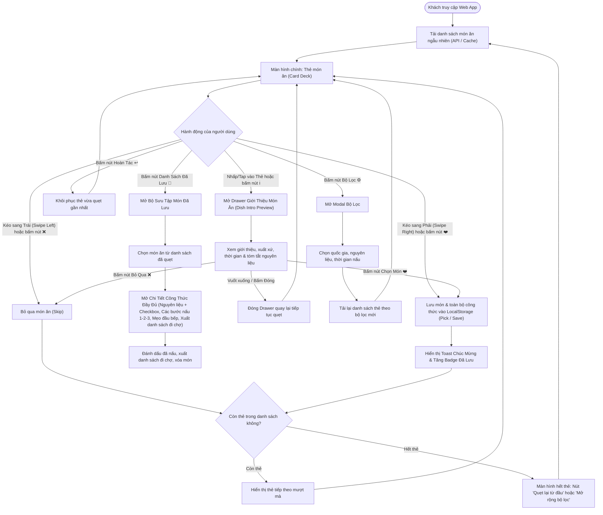
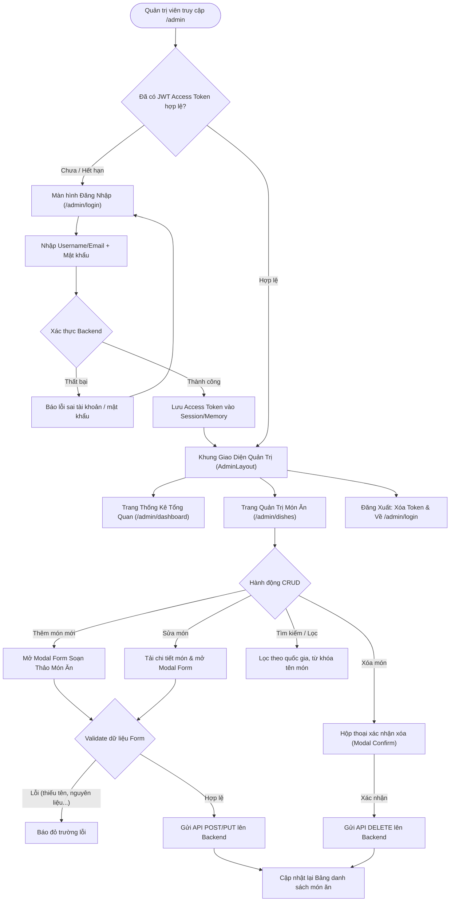

# 🎨 03. User Flow & UI/UX Design Specification

Tài liệu này chi tiết hóa toàn bộ hành trình trải nghiệm người dùng (User Journey), quy tắc vật lý của cơ chế quẹt thẻ Tinder (Card Swiping Physics), thông số thiết kế các màn hình và hệ thống Design System của **YumYumPick**.

---

## 1. Sơ Đồ Luồng Người Dùng (End-to-End User Flow)

---

## 2. Quy Tắc Cơ Học Quẹt Thẻ (Tinder Swipe Physics & Gesture Spec)

Để mang lại cảm giác quẹt "đã tay" và tự nhiên như ứng dụng Tinder thật, nhóm Frontend tuân thủ các quy chuẩn vật lý sau (sử dụng thư viện **Framer Motion**):

### 2.1. Cấu Trúc Ngăn Xếp Thẻ (Card Stack Hierarchy)
- **Thẻ hiển thị trên cùng (Top Card - Index 0):** Nhận tương tác cảm ứng trực tiếp (active drag). `scale: 1`, `opacity: 1`, `zIndex: 10`.
- **Thẻ dự phòng phía sau (Next Card - Index 1):** Nằm ngay bên dưới. `scale: 0.95`, `translateY: 12px`, `opacity: 0.8`, `zIndex: 9`.
- **Thẻ thứ 3 (Background Card - Index 2):** `scale: 0.90`, `translateY: 24px`, `opacity: 0.5`, `zIndex: 8`.
- Khi thẻ trên cùng bị quẹt văng ra khỏi màn hình, thẻ số 2 sẽ phóng to mượt mà (`spring transition`) trở thành thẻ chính.

### 2.2. Ngưỡng Kích Hoạt Thao Tác (Swipe Thresholds)
- **Độ dịch chuyển ngang (Drag Distance X):**
  - Kéo sang phải $> +120\text{px}$ hoặc vận tốc kéo (velocity) $> 500\text{px/s}$ $\rightarrow$ **Kích hoạt PICK (LIKE)**: Tự động lưu toàn bộ dữ liệu món ăn và công thức vào `LocalStorage`.
  - Kéo sang trái $< -120\text{px}$ hoặc vận tốc kéo $< -500\text{px/s}$ $\rightarrow$ **Kích hoạt SKIP**.
  - Nhỏ hơn ngưỡng trên: Thẻ tự động bật nảy (Spring back) trở lại vị trí chính giữa $(x: 0, y: 0, \text{rotate}: 0^\circ)$.
- **Góc nghiêng xoay của thẻ (Dynamic Rotation):**
  $$\text{rotation} = \frac{x}{15}\quad (\text{Giới hạn tối đa } \pm 25^\circ)$$
  *Ví dụ: Kéo sang phải 150px thì thẻ nghiêng một góc $10^\circ$.*

### 2.3. Phản Hồi Thị Giác Tức Thì (Visual Overlays / Stamps)
- **Khi kéo sang Phải:** Lớp phủ mờ màu xanh lá cây nhạt xuất hiện dần cùng huy hiệu đóng dấu nghiêng: **"YUMMY!"** hoặc **"CHỌN MÓN"** viền xanh neon (`#10B981`).
- **Khi kéo sang Trái:** Lớp phủ mờ màu đỏ nhạt xuất hiện dần cùng huy hiệu đóng dấu nghiêng: **"BỎ QUA"** hoặc **"NOPE"** viền đỏ cam (`#EF4444`).
- Độ đậm nhạt (`opacity`) của huy hiệu tăng tỷ lệ thuận với khoảng cách kéo từ $0 \rightarrow 1$.

### 2.4. Phân Biệt Cử Chỉ Kéo (Drag) vs Nhấp (Tap) (Gesture Discrimination)
Để loại bỏ hoàn toàn xung đột giữa hành vi **kéo quẹt thẻ** và **nhấp xem giới thiệu**:
- **Nhấp nhẹ (Tap Event):** Nếu ngón tay/chuột chạm vào thẻ và độ dịch chuyển $\Delta x, \Delta y < 5\text{px}$ trong thời gian $< 250\text{ms}$ $\rightarrow$ Hệ thống nhận diện là **TAP** và mở ngay **Dish Intro Drawer** (Giới thiệu món ăn).
- **Kéo quẹt (Drag Event):** Nếu độ dịch chuyển $> 10\text{px}$ $\rightarrow$ Kích hoạt trạng thái kéo (Dragging), vô hiệu hóa sự kiện Tap để thẻ di chuyển theo ngón tay một cách mượt mà.

---

## 3. Đặc Tả Chi Tiết Các Màn Hình (Screen Specifications)

### 3.1. Màn Hình Chính (Main Swipe Deck Screen)
- **Thanh điều hướng trên cùng (Top Navbar):**
  - Góc trái: Logo YumYumPick (Icon Tô mì/Burger phát sáng + Typography vui nhộn).
  - Góc phải: Nút **Bộ Lọc** (icon Slider/Filter) và Nút **Danh Sách Đã Lưu** (icon Bookmark/Túi đồ ăn kèm con số đỏ báo số lượng món đã chọn).
- **Khu vực Thẻ Trọng Tâm (Card Display Area):**
  - Tỉ lệ khung hình thẻ: `4:5` hoặc `3:4` (chuẩn hiển thị ảnh món ăn trên điện thoại).
  - Hình ảnh món ăn bao phủ toàn bộ thẻ với lớp gradient đen mờ ở phần dưới để nổi bật chữ.
  - Thông tin gắn trên thẻ:
    - Tên món ăn (Font to, đậm, rõ ràng, vd: "Bún Bò Huế").
    - Cờ quốc gia & Tên ẩm thực (vd: 🇻🇳 Việt Nam / Miền Trung).
    - Các chip thông tin nhanh: Thời gian nấu (⏱️ 30p), Độ cay (🌶️ Cay vừa), Lượng calo ước tính.
    - Nhãn gợi ý tương tác nhỏ: *"Chạm thẻ xem giới thiệu • Quẹt phải để lưu"*.
- **Cụm Nút Thao Tác Dưới Cùng (Floating Action Buttons):**
  1. ↩️ **Nút Hoàn Tác (Undo):** Màu vàng hổ phách, kích thước vừa (nhỏ hơn nút chính).
  2. ❌ **Nút Bỏ Qua (Skip):** Màu trắng viền đỏ, icon chữ X đỏ rực, kích thước lớn ($64\times 64\text{px}$).
  3. ℹ️ **Nút Xem Giới Thiệu (Info / Tap Alternative):** Màu xanh dương nhạt, mở nhanh bảng giới thiệu tóm tắt món ăn.
  4. ❤️ **Nút Chọn Món (Pick/Like):** Màu xanh lá gradient hoặc đỏ hồng tình yêu, icon Trái tim / Chiếc dĩa, kích thước lớn ($64\times 64\text{px}$).

### 3.2. Modal / Bottom Sheet Giới Thiệu Món Ăn Khi Tap Vào Thẻ (Dish Intro Drawer)
- **Mục đích:** Cung cấp thông tin tổng quan, hấp dẫn để người dùng hiểu món này trước khi đưa ra quyết định quẹt.
- Hỗ trợ vuốt kéo xuống để đóng (swipe down to close) trên di động.
- **Nội dung bao gồm:**
  1. **Header trực quan:** Ảnh món ăn chất lượng cao, tên tiếng Việt & tên quốc tế, cờ quốc gia, vùng miền ẩm thực.
  2. **Phần Giới Thiệu & Câu Chuyện Món Ăn (`short_description`):** Nguồn gốc, nét độc đáo, trải nghiệm hương vị đặc trưng (vd: vị béo ngậy của nước dùng hầm xương, hương sả ớt nồng nàn...).
  3. **Bảng Thông Số Nhanh (Key Meta Badges):**
     - Thời gian chuẩn bị (`prep_time_minutes`) & thời gian nấu (`cook_time_minutes`).
     - Mức độ cay (`spicy_level` từ 0 - 3 trái ớt).
     - Ước tính năng lượng calo (`calories_approx` kcal).
     - Khẩu phần (Serving size: 1-2 người hoặc 3-4 người).
     - Độ khó chế biến (Dễ / Trung bình / Kỳ công).
  4. **Tóm Tắt Nguyên Liệu Chủ Đạo (Key Ingredients Preview):** Điểm nhanh 4-5 nguyên liệu chính để người dùng nhận diện nhanh xem có đúng sở thích hoặc có thành phần dị ứng không.
  5. **Cụm Nút Hành Động Trực Tiếp (Drawer Action Buttons):**
     - Nút *"❌ Bỏ qua"*: Đóng drawer và quẹt trái món ăn.
     - Nút *"❤️ Chọn món này & Lưu công thức"*: Lưu món vào bộ sưu tập `LocalStorage`, đóng drawer và chuyển thẻ tiếp theo.
     - Nút *"Đóng"*: Đóng drawer để tiếp tục quẹt trên màn hình chính.

### 3.3. Modal Bộ Lọc Nâng Cao (Smart Filter Modal)
- **Lọc theo Quốc Gia / Nền Ẩm Thực:** Dạng các nút bấm Chip (Tất cả, 🇻🇳 Việt Nam, 🇯🇵 Nhật Bản, 🇰🇷 Hàn Quốc, 🇹🇭 Thái Lan, 🇮🇹 Ý...).
- **Lọc theo Bữa Ăn:** Bữa Sáng, Bữa Trưa, Bữa Tối, Ăn Vặt, Giải Khát.
- **Lọc theo Thời Gian Chế Biến:** Thanh kéo Slider từ 10 phút $\rightarrow$ 90 phút.
- **Lọc theo Khẩu Vị:** Không cay, Ăn chay (Vegetarian), Ít dầu mỡ / Eat Clean.
- **Nút bấm:** "Đặt lại mặc định" và "Áp dụng bộ lọc (X món)".

### 3.4. Trang / Drawer Bộ Sưu Tập Món Đã Lưu & Xem Chi Tiết Công Thức (Saved Dishes & Full Recipe Details)
- **Mục đích:** Nơi người dùng truy cập sau khi đã quẹt xong để xem lại thực đơn đã chọn, đọc công thức chi tiết, kiểm tra nguyên liệu và lên kế hoạch nấu nướng/đi chợ.
- **Giao diện Danh Sách Món Đã Lưu:**
  - Hiển thị dạng thẻ Grid (2 cột trên mobile, 3-4 cột trên desktop).
  - Mỗi món hiển thị: Ảnh bìa, tên món, quốc gia, thời gian nấu, nút xóa hoặc đánh dấu đã nấu.
  - Bộ đếm tổng số món đã chọn (vd: "Bạn đã lưu 4 món ngon").
- **Giao diện Chi Tiết Công Thức Đầy Đủ (Khi bấm vào một món đã lưu):**
  1. **Toàn cảnh món ăn:** Tên món, xuất xứ, lượng calo, khẩu phần.
  2. **Danh Sách Nguyên Liệu Tương Tác (Interactive Ingredients Checklist):**
     - Hiển thị đầy đủ số lượng và đơn vị tính (vd: "300g thịt ba chỉ", "2 quả trứng gà", "1 bó hành lá").
     - Có ô Checkbox cho từng nguyên liệu: Người dùng có thể tích chọn những nguyên liệu đã có sẵn trong tủ lạnh hoặc đã mua xong.
     - Phân loại rõ: Nhóm thịt/hải sản, rau củ, gia vị, tinh bột.
  3. **Hướng Dẫn Nấu Chi Tiết Từng Bước (Step-by-Step Cooking Instructions):**
     - Các bước 1, 2, 3 có tiêu đề và mô tả rõ ràng, hướng dẫn nhiệt độ lửa và thời gian cụ thể.
  4. **Mẹo & Bí Quyết Đầu Bếp (Chef's Tips & Secrets):** Các bí quyết đặc biệt giúp món ăn ngon chuẩn vị (vd: mẹo giữ nước dùng trong, cách ướp sườn mềm ngọt).
  5. **Tính Năng Độc Quyền: "Xuất Danh Sách Đi Chợ" (Smart Grocery List Generator):**
     - Tự động gộp nguyên liệu của món đang xem (hoặc của tất cả các món đã lưu) thành 1 danh sách đi chợ hoàn chỉnh.
     - Nút *"Sao chép danh sách đi chợ"* (Copy to Clipboard) để gửi nhanh qua Zalo / Messenger cho người đi chợ hộ.
  6. **Quản trị trạng thái món:** Nút *"Đã nấu xong"* (chuyển sang tab lịch sử đã nấu) hoặc *"Bỏ lưu"*.

---

## 4. Hệ Thống Thiết Kế & Nhận Diện (Design System & Tokens)

### 4.1. Bảng Màu Chuẩn (Color Palette)
Lấy cảm hứng từ sự ngon miệng, năng lượng tươi vui và kích thích vị giác:

| Tên Màu | Mã HEX | Mục Đích Sử Dụng |
|---|---|---|
| **Primary Orange** | `#FF6B35` | Màu thương hiệu chính, nút CTA, điểm nhấn ấm áp, kích thích ăn ngon. |
| **Pick Green (Success)** | `#10B981` | Nút Like / Quẹt phải, trạng thái thành công, nhãn nguyên liệu có sẵn. |
| **Skip Red (Danger)** | `#EF4444` | Nút Skip / Quẹt trái, cảnh báo, nhãn món cay nồng. |
| **Warm Yellow (Warning)** | `#F59E0B` | Nút Hoàn tác (Undo), tag thời gian nấu, đánh giá sao. |
| **Neutral Dark (Background)** | `#0F172A` | Nền tối chế độ Dark Mode hoặc thanh tiêu đề tương phản. |
| **Neutral Light (Surface)** | `#F8FAFC` | Nền trang ứng dụng sáng sủa, sạch sẽ, tôn vinh hình ảnh món ăn. |
| **Text Primary** | `#1E293B` | Chữ văn bản chính, tên món ăn, độ tương phản cao đạt chuẩn WCAG AA. |

### 4.2. Kiểu Chữ (Typography)
- **Font chữ chính:** `Inter` hoặc `Plus Jakarta Sans` (hỗ trợ tiếng Việt trọn vẹn, bo tròn hiện đại).
- **H1 (Tên món ăn trên thẻ):** `24px - 28px`, Bold (700).
- **H2 (Tiêu đề Modal/Section):** `20px`, Semi-bold (600).
- **Body Text:** `14px - 16px`, Regular (400) / Medium (500).
- **Badges & Meta Info:** `12px`, Medium (500), Uppercase tracking.

### 4.3. Responsive Breakpoints
- **Mobile Viewport (Ưu tiên số 1):** `< 640px` (Màn hình điện thoại chiếm toàn màn hình, thanh nút bấm cố định dưới đáy an toàn - Safe Area).
- **Tablet & Desktop:** `≥ 640px` và `≥ 1024px` (Hiển thị thẻ ở khung giữa mô phỏng giao diện app điện thoại thanh lịch hoặc chia 2 cột: Cột trái quẹt thẻ, Cột phải hiển thị ngay danh sách đã lưu và công thức).

---

## 5. Đặc Tả Luồng Quản Trị Viên & CMS (Admin / CMS Portal Flow & UI Spec)

### 5.1. Sơ Đồ Luồng Nghiệp Vụ Quản Trị (Admin Workflow)

### 5.2. Giao Diện Đăng Nhập Quản Trị (Admin Login Screen - `/admin/login`)
- **Bố cục:** Form đăng nhập nằm chính giữa màn hình (Card đặt trên nền tối sang trọng hoặc gradient thương hiệu YumYumPick).
- **Thành phần:**
  - Logo YumYumPick kèm huy hiệu nhãn: **"Admin CMS Portal"**.
  - Ô nhập liệu 1: *Tên đăng nhập hoặc Email* (kèm icon người dùng).
  - Ô nhập liệu 2: *Mật khẩu* (kèm nút ẩn/hiện mật khẩu).
  - Nút bấm: *"Đăng Nhập Quản Trị"* (hiệu ứng spinner khi đang gọi API xác thực).
  - Khung thông báo lỗi (Alert banner) xuất hiện khi mật khẩu sai hoặc tài khoản bị khóa (`is_active = false`).

### 5.3. Bảng Điều Khiển Thống Kê (Admin Dashboard - `/admin/dashboard`)
- **4 Thẻ Chỉ Số Trọng Tâm (KPI Cards):**
  1. 🍲 **Tổng số món ăn đang hoạt động:** Hiển thị tổng số lượng món có trong kho dữ liệu.
  2. 👆 **Tổng lượt quẹt (Total Swipes):** Tổng tương tác từ người dùng web app.
  3. ❤️ **Tổng lượt yêu thích / lưu lại (Total Likes):** Tỉ lệ thích chuyển đổi (Conversion Rate %).
  4. ❌ **Tổng lượt bỏ qua (Total Skips):** Số lượt người dùng vuốt trái.
- **Biểu đồ & Bảng Xếp Hạng Xu Hướng:**
  - **Top 5 Món Được Quẹt Phải Nhiều Nhất (Trending Liked):** Ảnh món, tên món, quốc gia, số lượt thích.
  - **Top 5 Món Bị Bỏ Qua Nhiều Nhất (Most Skipped):** Giúp biên tập viên nhận biết món ăn chưa hấp dẫn để cập nhật lại hình ảnh hoặc mô tả.

### 5.4. Giao Diện Quản Lý Danh Sách Món Ăn (Dishes Table - `/admin/dishes`)
- **Thanh công cụ trên cùng:**
  - Ô tìm kiếm nhanh theo tên món (Live Search debounce 300ms).
  - Bộ lọc dropdown chọn Quốc gia ẩm thực (Tất cả, Việt Nam, Nhật Bản, Hàn Quốc...).
  - Nút chính nổi bật: `+ Thêm món ăn mới` (màu cam thương hiệu Primary Orange).
- **Bảng dữ liệu (Data Table):**
  - Cột 1: Ảnh đại diện thu nhỏ ($48\times 48\text{px}$, bo góc).
  - Cột 2: Tên món ăn (Tiếng Việt) & Tên tiếng Anh.
  - Cột 3: Quốc gia / Vùng miền (Badge màu).
  - Cột 4: Thời gian nấu (⏱️ Phút) & Độ khó.
  - Cột 5: Ngày tạo & Người tạo.
  - Cột 6: Thao tác (Nút sửa ✏️ và Nút xóa 🗑️).
- **Phân trang (Pagination):** Hiển thị số trang 1, 2, 3... và chọn số lượng 20/50 món mỗi trang.

### 5.5. Form Modal Soạn Thảo Món Ăn (Dish Form Modal)
Modal cỡ lớn (Max-width: 4xl) chia thành các Tab hoặc Accordion rõ ràng:
1. **Tab 1: Thông tin định danh & Giới thiệu:**
   - Mã món ăn (`id`, tự sinh hoặc nhập tay, vd: `dish_vn_015`).
   - Tên món ăn tiếng Việt & Tên tiếng Anh.
   - Quốc gia (`cuisine_id`) & Vùng miền (`region`).
   - Đường dẫn ảnh bìa (`image_url`) kèm khung xem trước ảnh (Image Preview).
   - Thời gian nấu (`cook_time_minutes`), thời gian chuẩn bị (`prep_time_minutes`).
   - Mức độ cay (0 đến 3), Lượng calo ước tính, Khẩu phần ăn.
   - Mô tả ngắn / Câu chuyện món ăn (`short_description`).
   - Mẹo nấu ăn đặc biệt (`tips`).
2. **Tab 2: Danh sách Nguyên Liệu (Dynamic Ingredients Rows):**
   - Hỗ trợ thêm/xóa dòng linh hoạt.
   - Mỗi dòng gồm: Tên nguyên liệu, Định lượng (vd: 300), Đơn vị tính (g, ml, muỗng, quả), Nhóm nguyên liệu (thịt, rau, gia vị, tinh bột).
3. **Tab 3: Các Bước Nấu Ăn (Step-by-Step Instructions):**
   - Hỗ trợ thêm/xóa và kéo thả sắp xếp thứ tự bước nấu.
   - Mỗi bước gồm: Số thứ tự bước, Tiêu đề bước (vd: *Sơ chế nguyên liệu*), Mô tả chi tiết cách nấu.
4. **Tab 4: Nhãn Phân Loại (Tags Selector):**
   - Chọn các tag có sẵn (Nước lèo, Ăn sáng, Ít dầu mỡ, Đậm đà...).
