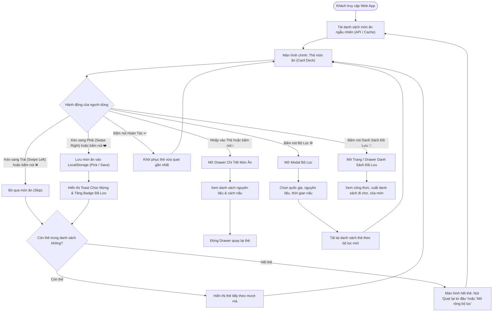

# 🎨 03. User Flow & UI/UX Design Specification

Tài liệu này chi tiết hóa toàn bộ hành trình trải nghiệm người dùng (User Journey), quy tắc vật lý của cơ chế quẹt thẻ Tinder (Card Swiping Physics), thông số thiết kế các màn hình và hệ thống Design System của **YumYumPick**.

---

## 1. Sơ Đồ Luồng Người Dùng (End-to-End User Flow)

---

## 2. Quy Tắc Cơ Học Quẹt Thẻ (Tinder Swipe Physics & Gesture Spec)

Để mang lại cảm giác quẹt "đã tay" và tự nhiên như ứng dụng Tinder thật, nhóm Frontend tuân thủ các quy chuẩn vật lý sau (sử dụng thư viện **Framer Motion**):

### 2.1. Cấu Trúc Ngăn Xếp Thẻ (Card Stack Hierarchy)
- **Thẻ hiển thị trên cùng (Top Card - Index 0):** Nhận tương tác cảm ứng trực tiếp (active drag). `scale: 1`, `opacity: 1`, `zIndex: 10`.
- **Thẻ dự phòng phía sau (Next Card - Index 1):** Nằm ngay bên dưới. `scale: 0.95`, `translateY: 12px`, `opacity: 0.8`, `zIndex: 9`.
- **Thẻ thứ 3 (Background Card - Index 2):** `scale: 0.90`, `translateY: 24px`, `opacity: 0.5`, `zIndex: 8`.
- Khi thẻ trên cùng bị quẹt văng ra khỏi màn hình, thẻ số 2 sẽ phóng to mượt mà (`spring transition`) trở thành thẻ chính.

### 2.2. Ngưỡng Kích Hoạt Thao Tác (Swipe Thresholds)
- **Độ dịch chuyển ngang (Drag Distance X):**
  - Kéo sang phải $> +120\text{px}$ hoặc vận tốc kéo (velocity) $> 500\text{px/s}$ $\rightarrow$ **Kích hoạt PICK (LIKE)**.
  - Kéo sang trái $< -120\text{px}$ hoặc vận tốc kéo $< -500\text{px/s}$ $\rightarrow$ **Kích hoạt SKIP**.
  - Nhỏ hơn ngưỡng trên: Thẻ tự động bật nảy (Spring back) trở lại vị trí chính giữa $(x: 0, y: 0, \text{rotate}: 0^\circ)$.
- **Góc nghiêng xoay của thẻ (Dynamic Rotation):**
  $$\text{rotation} = \frac{x}{15}\quad (\text{Giới hạn tối đa } \pm 25^\circ)$$
  *Ví dụ: Kéo sang phải 150px thì thẻ nghiêng một góc $10^\circ$.*

### 2.3. Phản Hồi Thị Giác Tức Thì (Visual Overlays / Stamps)
- **Khi kéo sang Phải:** Lớp phủ mờ màu xanh lá cây nhạt xuất hiện dần cùng huy hiệu đóng dấu nghiêng: **"YUMMY!"** hoặc **"CHỌN MÓN"** viền xanh neon (`#10B981`).
- **Khi kéo sang Trái:** Lớp phủ mờ màu đỏ nhạt xuất hiện dần cùng huy hiệu đóng dấu nghiêng: **"BỎ QUA"** hoặc **"NOPE"** viền đỏ cam (`#EF4444`).
- Độ đậm nhạt (`opacity`) của huy hiệu tăng tỷ lệ thuận với khoảng cách kéo từ $0 \rightarrow 1$.

---

## 3. Đặc Tả Chi Tiết Các Màn Hình (Screen Specifications)

### 3.1. Màn Hình Chính (Main Swipe Deck Screen)
- **Thanh điều hướng trên cùng (Top Navbar):**
  - Góc trái: Logo YumYumPick (Icon Tô mì/Burger phát sáng + Typography vui nhộn).
  - Góc phải: Nút **Bộ Lọc** (icon Slider/Filter) và Nút **Danh Sách Đã Lưu** (icon Bookmark/Túi đồ ăn kèm con số đỏ báo số lượng món đã chọn).
- **Khu vực Thẻ Trọng Tâm (Card Display Area):**
  - Tỉ lệ khung hình thẻ: `4:5` hoặc `3:4` (chuẩn hiển thị ảnh món ăn trên điện thoại).
  - Hình ảnh món ăn bao phủ toàn bộ thẻ với lớp gradient đen mờ ở phần dưới để nổi bật chữ.
  - Thông tin gắn trên thẻ:
    - Tên món ăn (Font to, đậm, rõ ràng, vd: "Bún Bò Huế").
    - Cờ quốc gia & Tên ẩm thực (vd: 🇻🇳 Việt Nam / Miền Trung).
    - Các chip thông tin nhanh: Thời gian nấu (⏱️ 30p), Độ cay (🌶️ Cay vừa), Lượng calo ước tính.
- **Cụm Nút Thao Tác Dưới Cùng (Floating Action Buttons):**
  1. ↩️ **Nút Hoàn Tác (Undo):** Màu vàng hổ phách, kích thước vừa (nhỏ hơn nút chính).
  2. ❌ **Nút Bỏ Qua (Skip):** Màu trắng viền đỏ, icon chữ X đỏ rực, kích thước lớn ($64\times 64\text{px}$).
  3. ℹ️ **Nút Xem Công Thức (Info):** Màu xanh dương nhạt, mở nhanh bảng chi tiết nguyên liệu.
  4. ❤️ **Nút Chọn Món (Pick/Like):** Màu xanh lá gradient hoặc đỏ hồng tình yêu, icon Trái tim / Chiếc dĩa, kích thước lớn ($64\times 64\text{px}$).

### 3.2. Modal / Bottom Sheet Xem Công Thức Chi Tiết (Recipe Drawer)
- Hỗ trợ vuốt kéo đóng (swipe down to close) trên di động.
- **Nội dung bao gồm:**
  1. Ảnh bìa toàn cảnh và tên món.
  2. Tóm tắt khẩu phần (vd: Phù hợp 2-3 người ăn).
  3. **Danh sách nguyên liệu (Ingredients Checklist):** Có ô tích chọn (checkbox) tiện cho người dùng tích khi mở tủ lạnh kiểm tra đồ.
  4. **Các bước nấu (Step-by-step Instructions):** Số thứ tự 1, 2, 3 có hướng dẫn chi tiết, thời gian từng bước.
  5. Mẹo vặt nấu nướng (Chef's Tips).
  6. Nút hành động nhanh: *"Lưu món này"* hoặc *"Chia sẻ cho bạn bè"*.

### 3.3. Modal Bộ Lọc Nâng Cao (Smart Filter Modal)
- **Lọc theo Quốc Gia / Nền Ẩm Thực:** Dạng các nút bấm Chip (Tất cả, 🇻🇳 Việt Nam, 🇯🇵 Nhật Bản, 🇰🇷 Hàn Quốc, 🇹🇭 Thái Lan, 🇮🇹 Ý...).
- **Lọc theo Bữa Ăn:** Bữa Sáng, Bữa Trưa, Bữa Tối, Ăn Vặt, Giải Khát.
- **Lọc theo Thời Gian Chế Biến:** Thanh kéo Slider từ 10 phút $\rightarrow$ 90 phút.
- **Lọc theo Khẩu Vị:** Không cay, Ăn chay (Vegetarian), Ít dầu mỡ / Eat Clean.
- **Nút bấm:** "Đặt lại mặc định" và "Áp dụng bộ lọc (X món)".

### 3.4. Trang Bộ Sưu Tập Đã Lưu (Saved History & Grocery Page)
- Hiển thị danh sách thẻ dạng Grid (2 cột trên mobile, 4 cột trên desktop).
- Mỗi item có nút: "Xem lại công thức", "Đánh dấu đã ăn/nấu", "Xóa bỏ".
- **Tính năng đặc biệt: "Tạo Danh Sách Đi Chợ" (Smart Grocery List):**
  - Tự động gộp toàn bộ nguyên liệu của các món đã chọn lại thành 1 danh sách duy nhất.
  - Cho phép sao chép nhanh (Copy to Clipboard) để gửi qua Zalo / Messenger cho bạn cùng phòng đi chợ mua hộ!

---

## 4. Hệ Thống Thiết Kế & Nhận Diện (Design System & Tokens)

### 4.1. Bảng Màu Chuẩn (Color Palette)
Lấy cảm hứng từ sự ngon miệng, năng lượng tươi vui và kích thích vị giác:

| Tên Màu | Mã HEX | Mục Đích Sử Dụng |
|---|---|---|
| **Primary Orange** | `#FF6B35` | Màu thương hiệu chính, nút CTA, điểm nhấn ấm áp, kích thích ăn ngon. |
| **Pick Green (Success)** | `#10B981` | Nút Like / Quẹt phải, trạng thái thành công, nhãn nguyên liệu có sẵn. |
| **Skip Red (Danger)** | `#EF4444` | Nút Skip / Quẹt trái, cảnh báo, nhãn món cay nồng. |
| **Warm Yellow (Warning)** | `#F59E0B` | Nút Hoàn tác (Undo), tag thời gian nấu, đánh giá sao. |
| **Neutral Dark (Background)** | `#0F172A` | Nền tối chế độ Dark Mode hoặc thanh tiêu đề tương phản. |
| **Neutral Light (Surface)** | `#F8FAFC` | Nền trang ứng dụng sáng sủa, sạch sẽ, tôn vinh hình ảnh món ăn. |
| **Text Primary** | `#1E293B` | Chữ văn bản chính, tên món ăn, độ tương phản cao đạt chuẩn WCAG AA. |

### 4.2. Kiểu Chữ (Typography)
- **Font chữ chính:** `Inter` hoặc `Plus Jakarta Sans` (hỗ trợ tiếng Việt trọn vẹn, bo tròn hiện đại).
- **H1 (Tên món ăn trên thẻ):** `24px - 28px`, Bold (700).
- **H2 (Tiêu đề Modal/Section):** `20px`, Semi-bold (600).
- **Body Text:** `14px - 16px`, Regular (400) / Medium (500).
- **Badges & Meta Info:** `12px`, Medium (500), Uppercase tracking.

### 4.3. Responsive Breakpoints
- **Mobile Viewport (Ưu tiên số 1):** `< 640px` (Màn hình điện thoại chiếm toàn màn hình, thanh nút bấm cố định dưới đáy an toàn - Safe Area).
- **Tablet & Desktop:** `≥ 640px` và `≥ 1024px` (Hiển thị thẻ ở khung giữa mô phỏng giao diện app điện thoại thanh lịch hoặc chia 2 cột: Cột trái quẹt thẻ, Cột phải hiển thị ngay danh sách đã lưu và công thức).
