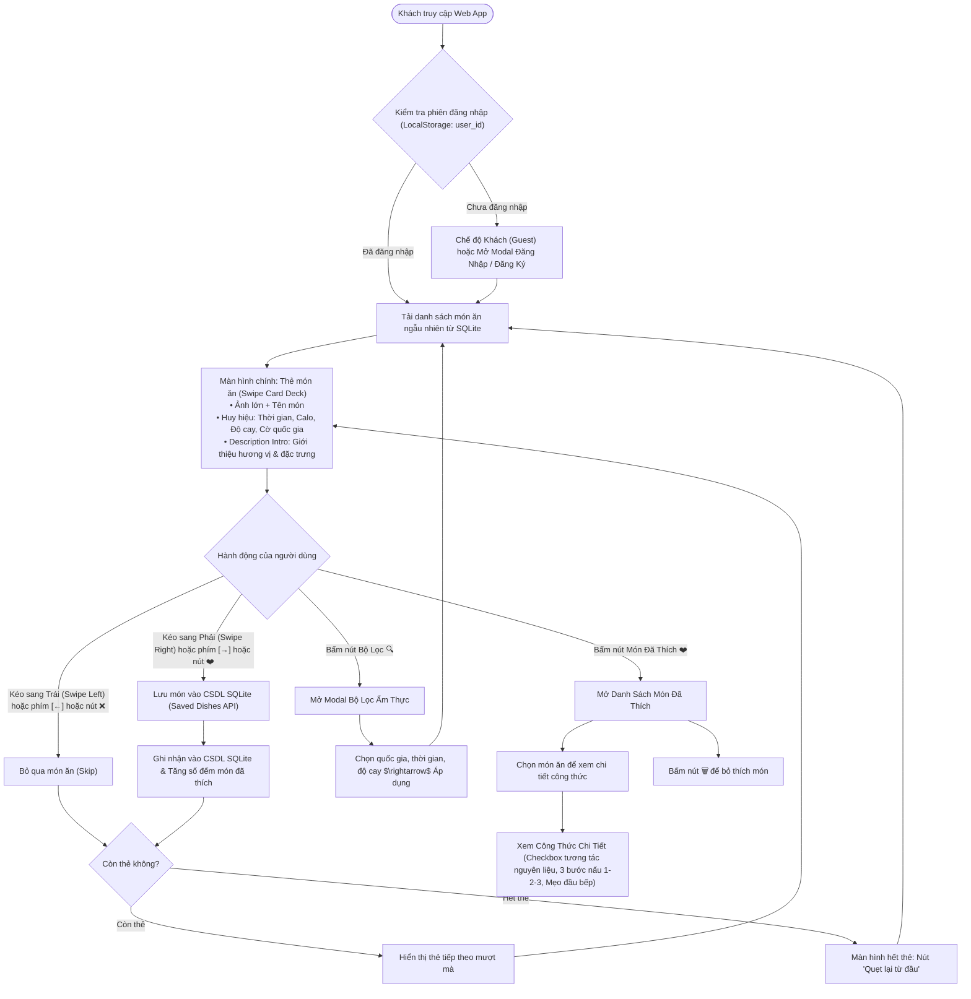
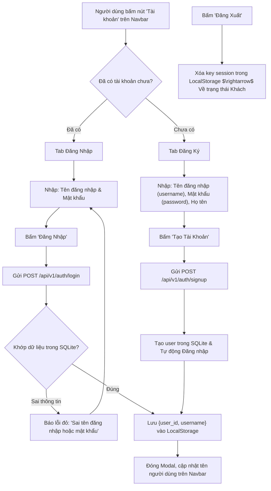
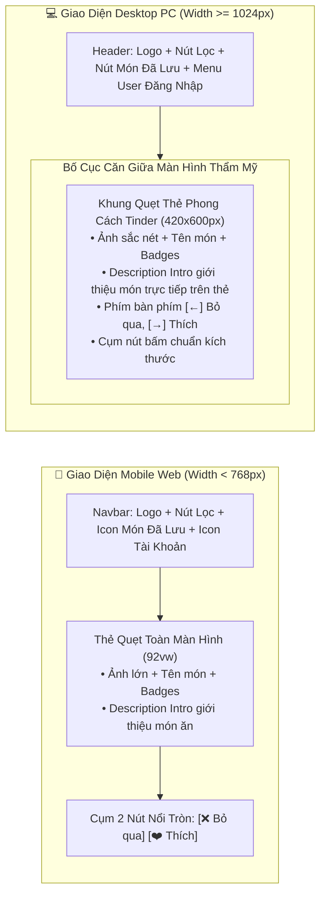

# 🎨 03. User Flow & UI/UX Design Specification (Responsive & Simple Auth)

Tài liệu này chi tiết hóa toàn bộ hành trình trải nghiệm người dùng (User Journey), quy chuẩn vật lý quẹt thẻ Tinder (Card Swiping Physics), luồng xác thực người dùng đơn giản (Simple Auth) và đặc tả chi tiết giao diện Responsive trên cả **Điện Thoại Di Động (Mobile Web)** lẫn **Máy Tính Để Bàn (Desktop PC)**.

---

## 1. Sơ Đồ Luồng Trải Nghiệm Người Dùng (End-to-End User Flow)

---

## 2. Luồng Đăng Nhập & Đăng Ký Siêu Đơn Giản (Simple Auth Flow)

Không yêu cầu xác thực email, OTP SMS hay Captcha, toàn bộ quá trình diễn ra tức thì:

---

## 3. Quy Chuẩn Cơ Học Quẹt Thẻ (Tinder Swipe Gesture Spec)

Sử dụng thư viện **Framer Motion** để tạo trải nghiệm tự nhiên 60 khung hình/giây:

### 3.1. Cấu Trúc Ngăn Xếp Thẻ (Card Stack)
- **Thẻ trên cùng (Top Card - Index 0):** Nhận tương tác drag kéo thả trực tiếp. `scale: 1`, `opacity: 1`, `zIndex: 10`.
- **Thẻ thứ hai (Next Card - Index 1):** Nằm ngay phía dưới. `scale: 0.95`, `translateY: 12px`, `opacity: 0.8`, `zIndex: 9`.
- **Thẻ thứ ba (Bottom Card - Index 2):** `scale: 0.90`, `translateY: 24px`, `opacity: 0.5`, `zIndex: 8`.
- Khi thẻ trên cùng bị quẹt ra khỏi màn hình, thẻ số 2 tự động bung lớn lên (`spring animation`) thành thẻ chính.

### 3.2. Ngưỡng Kích Hoạt Quẹt (Thresholds)
- **Kéo sang phải $> +120\text{px}$:** Kích hoạt thao tác **LIKE / CHỌN MÓN** (bay thẻ sang phải, gọi API lưu món vào SQLite).
- **Kéo sang trái $< -120\text{px}$:** Kích hoạt thao tác **SKIP / BỎ QUA** (bay thẻ sang trái, chuyển món tiếp theo).
- **Nhỏ hơn ngưỡng trên:** Thẻ tự động đàn hồi bung trở về vị trí chính giữa màn hình.
- **Góc nghiêng động:** $\text{rotation} = x / 15$ (giới hạn tối đa $\pm 25^\circ$).

### 3.3. Stamp Phản Hồi Trực Quan
- Khi kéo sang phải: Hiện stamp nghiêng **"YUMMY!"** màu xanh lá tươi (`#10B981`) với độ mờ tăng dần.
- Khi kéo sang trái: Hiện stamp nghiêng **"NOPE"** màu đỏ cam rực (`#EF4444`) với độ mờ tăng dần.

---

## 4. Đặc Tả Responsive Toàn Diện (PC & Mobile Web Spec)

Dự án được thiết kế chuyên biệt để hoạt động mượt mà và trực quan trên cả hai loại thiết bị chính:

### 4.1. Chi Tiết Giao Diện Trên Điện Thoại (Mobile Phone)
- **Viewport:** Tối ưu cho độ phân giải từ $375\text{px}$ đến $430\text{px}$ (iPhone, Android phổ thông).
- **Thao tác:** 100% cảm ứng ngón tay cái:
  - Vuốt sang phải để thích, vuốt trái để bỏ qua.
  - Đọc ngay đoạn giới thiệu ngắn (**Description Intro**) trên mặt thẻ trước khi quẹt mà không cần mở thêm drawer rườm rà.
- **Kích thước thẻ:** `w-[92vw] h-[68vh] max-h-[520px] rounded-3xl overflow-hidden shadow-2xl`.
- **Nút điều hướng:** Cụm 2 nút tròn đường kính $56\text{px}$ vừa vặn tầm với của ngón tay cái (❌ Bỏ qua, ❤️ Thích).

### 4.2. Chi Tiết Giao Diện Trên Máy Tính (Desktop PC / Laptop)
- **Viewport:** Tối ưu cho màn hình $1024\text{px}$ đến $1920\text{px}$.
- **Tránh vỡ giao diện:** Không để ảnh thẻ món ăn kéo giãn ra 100% màn hình PC gây mờ ảnh và biến dạng. Thay vào đó:
  - Khung quẹt thẻ giữ tỉ lệ dọc thẩm mỹ ($420\text{px} \times 600\text{px}$) đặt ở vị trí trung tâm màn hình.
  - Hiển thị đầy đủ hình ảnh, tên món, huy hiệu và đoạn mô tả giới thiệu hương vị trên mặt thẻ.
  - Hỗ trợ **phím tắt bàn phím tiện lợi**:
    - Phím mũi tên sang trái `←`: Bỏ qua (Skip).
    - Phím mũi tên sang phải `→`: Chọn món (Like).
  - Hiển thị badge gợi ý phím tắt nhỏ tinh tế bên dưới các nút bấm (ví dụ: nút Like có nhãn nhỏ "[→]").

---

## 5. Màn Hình Danh Sách Đã Thích & Xem Chi Tiết Công Thức

### 5.1. Danh Sách Món Đã Thích (Liked Dishes List)
- Người dùng bấm vào nút biểu tượng Trái Tim (❤️) trên thanh Header để mở danh sách.
- Hiển thị danh sách các thẻ món ăn đã lưu:
  - Ảnh đại diện thu nhỏ, tên món ăn, quốc gia, thời gian chế biến.
  - Nút **Bỏ thích (🗑️)**: Bấm vào để xóa món ăn khỏi CSDL SQLite nếu không còn nhu cầu nấu.
- **Mục đích duy nhất:** Bấm vào bất kỳ món ăn nào để mở màn hình xem chi tiết công thức nấu ăn.

### 5.2. Xem Chi Tiết Công Thức Nấu Ăn (Detail Recipe Viewer)
Khi người dùng mở một món trong danh sách đã thích:
- **Phần Header:** Ảnh bìa lớn sắc nét, tên món (tiếng Việt & tiếng Anh), thời gian chế biến, lượng calo, mức độ cay và câu chuyện giới thiệu ngắn.
- **Phần Danh Sách Nguyên Liệu kèm Checkbox tương tác (Interactive Ingredients Checklist):**
  - Hiển thị danh sách nguyên liệu với ô Checkbox tương tác `[ ]`: Tên nguyên liệu + Định lượng (ví dụ: `[ ] Thịt ba chỉ: 400g`, `[ ] Nước dừa tươi: 1 trái`).
  - Người dùng có thể chạm/click vào checkbox để đánh dấu nguyên liệu đã mua hoặc đã chuẩn bị sẵn trong bếp (gạch ngang chữ mờ nhẹ giúp theo dõi tiện lợi khi nấu).
- **Phần Hướng Dẫn Từng Bước (Step-by-step 1-2-3):**
  - **Bước 1 — Sơ chế:** Rửa sạch, thái lát, ướp gia vị theo định lượng.
  - **Bước 2 — Chế biến:** Nấu nước dùng, kho, xào, chiên hoặc nướng.
  - **Bước 3 — Trình bày:** Bày biện ra tô/đĩa, rắc rau thơm, thưởng thức khi còn nóng.
- **Mẹo Đầu Bếp (Chef's Tips):** Khung viền vàng nổi bật chia sẻ bí quyết thực tế giúp món ăn đậm đà chuẩn vị.
