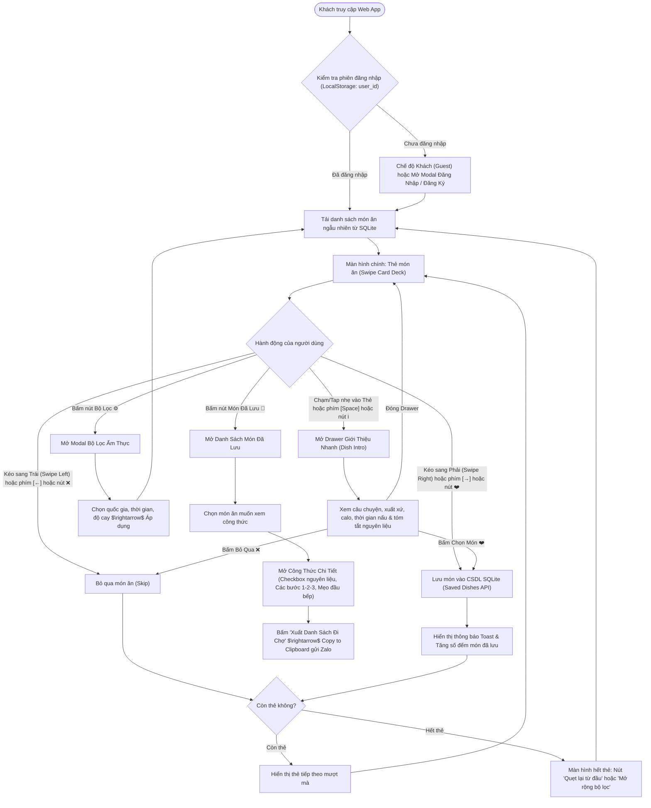
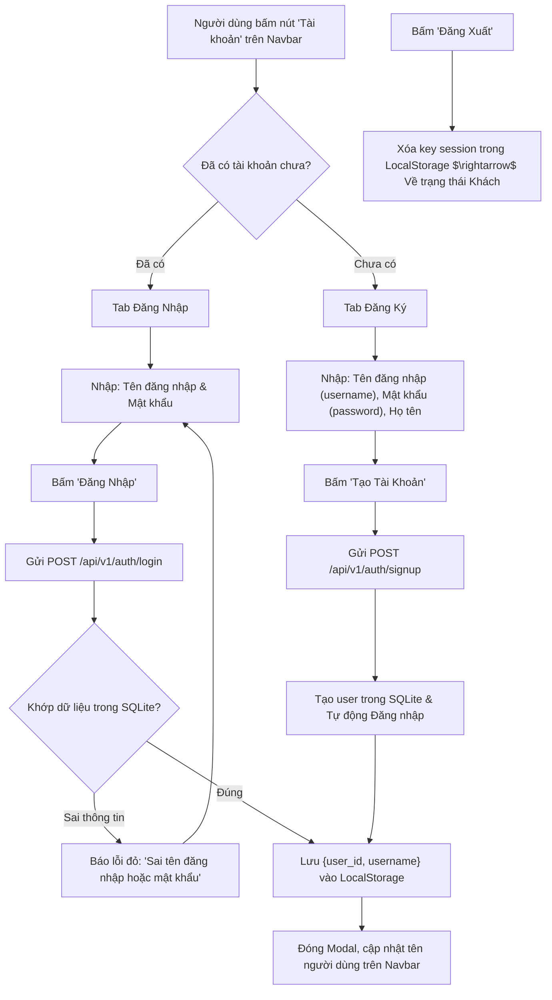
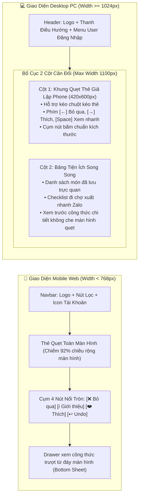

# 🎨 03. User Flow & UI/UX Design Specification (Responsive & Simple Auth)

Tài liệu này chi tiết hóa toàn bộ hành trình trải nghiệm người dùng (User Journey), quy chuẩn vật lý quẹt thẻ Tinder (Card Swiping Physics), luồng xác thực người dùng đơn giản (Simple Auth) và đặc tả chi tiết giao diện Responsive trên cả **Điện Thoại Di Động (Mobile Web)** lẫn **Máy Tính Để Bàn (Desktop PC)**.

---

## 1. Sơ Đồ Luồng Trải Nghiệm Người Dùng (End-to-End User Flow)



---

## 2. Luồng Đăng Nhập & Đăng Ký Siêu Đơn Giản (Simple Auth Flow)

Không yêu cầu xác thực email, OTP SMS hay Captcha, toàn bộ quá trình diễn ra tức thì:



---

## 3. Quy Chuẩn Cơ Học Quẹt Thẻ (Tinder Swipe Gesture Spec)

Sử dụng thư viện **Framer Motion** để tạo trải nghiệm tự nhiên 60 khung hình/giây:

### 3.1. Cấu Trúc Ngăn Xếp Thẻ (Card Stack)
- **Thẻ trên cùng (Top Card - Index 0):** Nhận tương tác drag kéo thả trực tiếp. `scale: 1`, `opacity: 1`, `zIndex: 10`.
- **Thẻ thứ hai (Next Card - Index 1):** Nằm ngay phía dưới. `scale: 0.95`, `translateY: 12px`, `opacity: 0.8`, `zIndex: 9`.
- **Thẻ thứ ba (Bottom Card - Index 2):** `scale: 0.90`, `translateY: 24px`, `opacity: 0.5`, `zIndex: 8`.
- Khi thẻ trên cùng bị quẹt ra khỏi màn hình, thẻ số 2 tự động bung lớn lên (`spring animation`) thành thẻ chính.

### 3.2. Ngưỡng Kích Hoạt Quẹt (Thresholds)
- **Kéo sang phải $> +120\text{px}$:** Kích hoạt thao tác **LIKE / CHỌN MÓN** (bay thẻ sang phải, gọi API lưu món vào SQLite).
- **Kéo sang trái $< -120\text{px}$:** Kích hoạt thao tác **SKIP / BỎ QUA** (bay thẻ sang trái, chuyển món tiếp theo).
- **Nhỏ hơn ngưỡng trên:** Thẻ tự động đàn hồi bung trở về vị trí chính giữa màn hình.
- **Góc nghiêng động:** $\text{rotation} = x / 15$ (giới hạn tối đa $\pm 25^\circ$).

### 3.3. Stamp Phản Hồi Trực Quan
- Khi kéo sang phải: Hiện stamp nghiêng **"YUMMY!"** màu xanh lá tươi (`#10B981`) với độ mờ tăng dần.
- Khi kéo sang trái: Hiện stamp nghiêng **"NOPE"** màu đỏ cam rực (`#EF4444`) với độ mờ tăng dần.

---

## 4. Đặc Tả Responsive Toàn Diện (PC & Mobile Web Spec)

Dự án được thiết kế chuyên biệt để hoạt động mượt mà và trực quan trên cả hai loại thiết bị chính:



### 4.1. Chi Tiết Giao Diện Trên Điện Thoại (Mobile Phone)
- **Viewport:** Tối ưu cho độ phân giải từ $375\text{px}$ đến $430\text{px}$ (iPhone, Android phổ thông).
- **Thao tác:** 100% cảm ứng ngón tay cái:
  - Vuốt sang phải để thích, vuốt trái để bỏ qua.
  - Nhấp (Tap) nhẹ lên thẻ để đẩy **Bottom Sheet** từ dưới lên xem thông số dinh dưỡng và nguyên liệu.
- **Kích thước thẻ:** `w-[92vw] h-[68vh] max-h-[520px] rounded-3xl overflow-hidden shadow-2xl`.
- **Nút điều hướng:** Cụm nút tròn đường kính $56\text{px}$ vừa vặn tầm với của ngón tay cái.

### 4.2. Chi Tiết Giao Diện Trên Máy Tính (Desktop PC / Laptop)
- **Viewport:** Tối ưu cho màn hình $1024\text{px}$ đến $1920\text{px}$.
- **Tránh vỡ giao diện:** Không để ảnh thẻ món ăn kéo giãn ra 100% màn hình PC gây mờ ảnh và biến dạng. Thay vào đó:
  - Khung quẹt thẻ giữ tỉ lệ dọc thẩm mỹ ($420\text{px} \times 600\text{px}$) đặt ở vị trí trung tâm.
  - Hỗ trợ **phím tắt bàn phím tiện lợi**:
    - Phím mũi tên sang trái `←`: Bỏ qua (Skip).
    - Phím mũi tên sang phải `→`: Chọn món (Like).
    - Phím cách `Space`: Mở Drawer giới thiệu món ăn.
  - Hiển thị badge gợi ý phím tắt nhỏ tinh tế bên dưới các nút bấm (ví dụ: nút Like có nhãn nhỏ "[→]").

---

## 5. Màn Hình Công Thức Chi Tiết & Danh Sách Đi Chợ

### 5.1. Xem Công Thức Chi Tiết (Full Recipe Viewer)
Khi người dùng mở một món trong danh sách đã lưu:
- **Phần Header:** Ảnh bìa lớn, tên món (Việt/Anh), thời gian chế biến, lượng calo, mức độ cay.
- **Phần Danh Sách Nguyên Liệu (Interactive Ingredients Checklist):**
  - Hiển thị từng nguyên liệu kèm định lượng rõ ràng (ví dụ: *Thịt ba chỉ: 400g*).
  - Có **Checkbox tích chọn tương tác**: người dùng bấm tích vào các món đã có sẵn trong tủ lạnh hoặc đã mua xong khi đi chợ.
- **Phần Hướng Dẫn Từng Bước (Step-by-step 1-2-3):**
  - Bước 1: Sơ chế nguyên liệu.
  - Bước 2: Nêm nếm và xào nấu.
  - Bước 3: Trình bày và thưởng thức.
- **Mẹo Đầu Bếp (Chef's Tips):** Khung viền vàng nổi bật chia sẻ mẹo vặt nấu nhanh và ngon hơn.

### 5.2. Xuất Danh Sách Đi Chợ Thông Minh (Smart Grocery List)
- Nút bấm nổi bật: **"Xuất Danh Sách Đi Chợ 🛒"**.
- Khi bấm: Hệ thống tự động duyệt qua tất cả các món đã lưu và tổng hợp toàn bộ nguyên liệu lại thành định dạng văn bản súc tích:
  ```text
  🛒 DANH SÁCH ĐI CHỢ - YUMYUMPICK
  ═══════════════════════════════
  [ ] Thịt bò thăn: 300g (Phở bò)
  [ ] Bánh phở tươi: 500g (Phở bò)
  [ ] Kim chi cải thảo: 200g (Canh kim chi)
  [ ] Đậu hũ non: 1 hộp (Canh kim chi)
  [ ] Trứng gà: 4 quả (Cơm trộn Hàn Quốc)
  ═══════════════════════════════
  Chúc bạn nấu những bữa ăn thật ngon miệng!
  ```
- Kèm nút **"Sao chép vào bộ nhớ tạm (Copy)"** hiển thị thông báo "Đã copy thành công! Bạn có thể dán ngay vào Zalo / Messenger".
