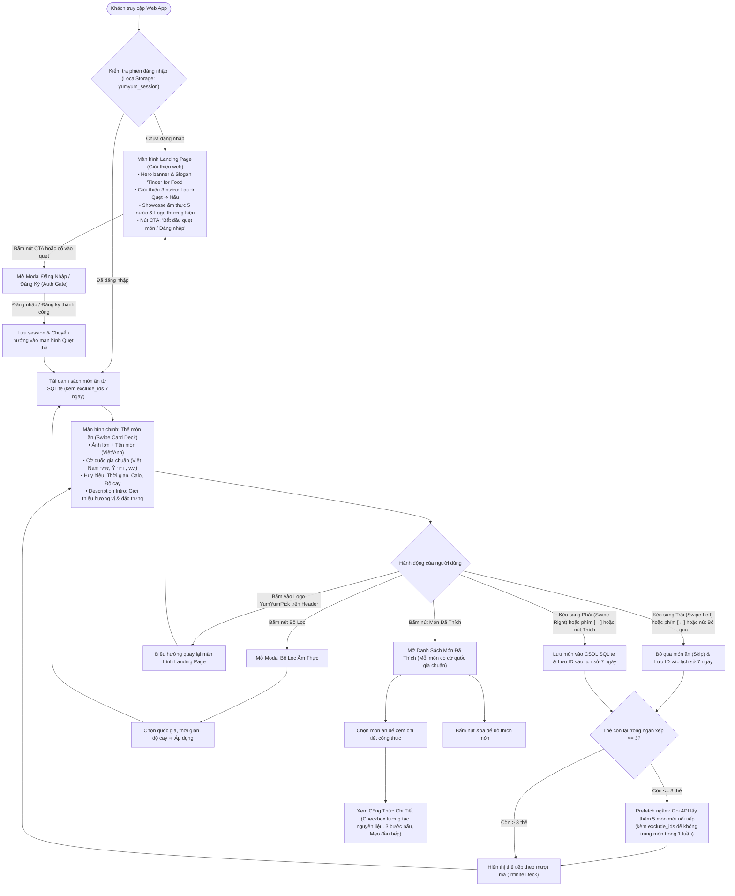
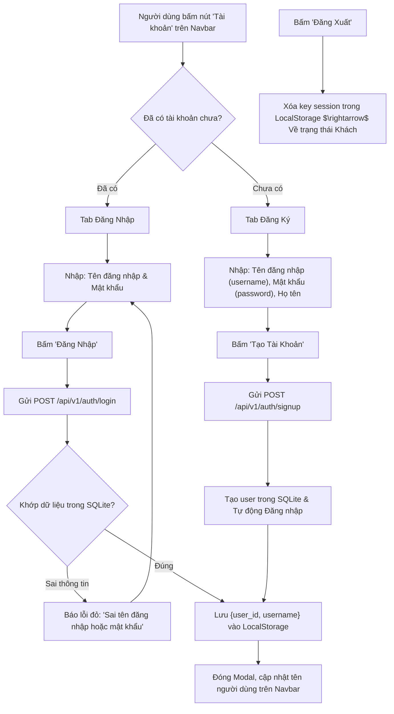
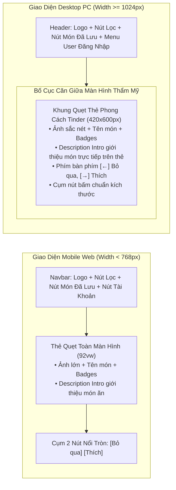

# 03. User Flow & UI/UX Design Specification (Responsive & Simple Auth)

Tài liệu này chi tiết hóa toàn bộ hành trình trải nghiệm người dùng (User Journey), quy chuẩn vật lý quẹt thẻ Tinder (Card Swiping Physics), luồng xác thực người dùng đơn giản (Simple Auth) và đặc tả chi tiết giao diện Responsive trên cả **Điện Thoại Di Động (Mobile Web)** lẫn **Máy Tính Để Bàn (Desktop PC)**.

---

## 1. Sơ Đồ Luồng Trải Nghiệm Người Dùng (End-to-End User Flow với Auth Gate & Landing Page)




---

## 2. Luồng Đăng Nhập & Đăng Ký Siêu Đơn Giản (Simple Auth Flow)

Không yêu cầu xác thực email, OTP SMS hay Captcha, toàn bộ quá trình diễn ra tức thì:



---

## 3. Quy Chuẩn Cơ Học Quẹt Thẻ (Tinder Swipe Gesture Spec)

Sử dụng thư viện **Framer Motion** để tạo trải nghiệm tự nhiên 60 khung hình/giây:

### 3.1. Cấu Trúc Ngăn Xếp Thẻ (Card Stack)
- **Thẻ trên cùng (Top Card - Index 0):** Nhận tương tác drag kéo thả trực tiếp. `scale: 1`, `opacity: 1`, `zIndex: 10`.
- **Thẻ thứ hai (Next Card - Index 1):** Nằm ngay phía dưới. `scale: 0.95`, `translateY: 12px`, `opacity: 0.8`, `zIndex: 9`.
- **Thẻ thứ ba (Bottom Card - Index 2):** `scale: 0.90`, `translateY: 24px`, `opacity: 0.5`, `zIndex: 8`.
- Khi thẻ trên cùng bị quẹt ra khỏi màn hình, thẻ số 2 tự động bung lớn lên (`spring animation`) thành thẻ chính.

### 3.2. Ngưỡng Kích Hoạt Quẹt (Thresholds)
- **Kéo sang phải $> +120\text{px}$:** Kích hoạt thao tác **LIKE / CHỌN MÓN** (bay thẻ sang phải, gọi API lưu món vào SQLite).
- **Kéo sang trái $< -120\text{px}$:** Kích hoạt thao tác **SKIP / BỎ QUA** (bay thẻ sang trái, chuyển món tiếp theo).
- **Nhỏ hơn ngưỡng trên:** Thẻ tự động đàn hồi bung trở về vị trí chính giữa màn hình.
- **Góc nghiêng động:** $\text{rotation} = x / 15$ (giới hạn tối đa $\pm 25^\circ$).

### 3.3. Stamp Phản Hồi Trực Quan
- Khi kéo sang phải: Hiện stamp nghiêng **"YUMMY!"** màu xanh lá tươi (`#10B981`) với độ mờ tăng dần.
- Khi kéo sang trái: Hiện stamp nghiêng **"NOPE"** màu đỏ cam rực (`#EF4444`) với độ mờ tăng dần.

---

## 4. Đặc Tả Responsive Toàn Diện (PC & Mobile Web Spec)

Dự án được thiết kế chuyên biệt để hoạt động mượt mà và trực quan trên cả hai loại thiết bị chính:



### 4.1. Chi Tiết Giao Diện Trên Điện Thoại (Mobile Phone)
- **Viewport:** Tối ưu cho độ phân giải từ $375\text{px}$ đến $430\text{px}$ (iPhone, Android phổ thông).
- **Thao tác:** 100% cảm ứng ngón tay cái:
  - Vuốt sang phải để thích, vuốt trái để bỏ qua.
  - Đọc ngay đoạn giới thiệu ngắn (**Description Intro**) trên mặt thẻ trước khi quẹt mà không cần mở thêm drawer rườm rà.
- **Kích thước thẻ:** `w-[92vw] h-[68vh] max-h-[520px] rounded-3xl overflow-hidden shadow-2xl`.
- **Nút điều hướng:** Cụm 2 nút tròn đường kính $56\text{px}$ vừa vặn tầm với của ngón tay cái (Bỏ qua, Thích).

### 4.2. Chi Tiết Giao Diện Trên Máy Tính (Desktop PC / Laptop)
- **Viewport:** Tối ưu cho màn hình $1024\text{px}$ đến $1920\text{px}$.
- **Tránh vỡ giao diện:** Không để ảnh thẻ món ăn kéo giãn ra 100% màn hình PC gây mờ ảnh và biến dạng. Thay vào đó:
  - Khung quẹt thẻ giữ tỉ lệ dọc thẩm mỹ ($420\text{px} \times 600\text{px}$) đặt ở vị trí trung tâm màn hình.
  - Hiển thị đầy đủ hình ảnh, tên món, huy hiệu và đoạn mô tả giới thiệu hương vị trên mặt thẻ.
  - Hỗ trợ **phím tắt bàn phím tiện lợi**:
    - Phím mũi tên sang trái `←`: Bỏ qua (Skip).
    - Phím mũi tên sang phải `→`: Chọn món (Like).
  - Hiển thị badge gợi ý phím tắt nhỏ tinh tế bên dưới các nút bấm (ví dụ: nút Like có nhãn nhỏ "[→]").

---

## 5. Màn Hình Danh Sách Đã Thích & Xem Chi Tiết Công Thức

### 5.1. Danh Sách Món Đã Thích (Liked Dishes List)
- Người dùng bấm vào nút biểu tượng Món Đã Lưu trên thanh Header để mở danh sách.
- Hiển thị danh sách các thẻ món ăn đã lưu:
  - Ảnh đại diện thu nhỏ, tên món ăn, quốc gia, thời gian chế biến.
  - Nút **Bỏ thích (Xóa)**: Bấm vào để xóa món ăn khỏi CSDL SQLite nếu không còn nhu cầu nấu.
- **Mục đích duy nhất:** Bấm vào bất kỳ món ăn nào để mở màn hình xem chi tiết công thức nấu ăn.

### 5.2. Xem Chi Tiết Công Thức Nấu Ăn (Detail Recipe Viewer)
Khi người dùng mở một món trong danh sách đã thích:
- **Phần Header:** Ảnh bìa lớn sắc nét, tên món (tiếng Việt & tiếng Anh), thời gian chế biến, lượng calo, mức độ cay và câu chuyện giới thiệu ngắn.
- **Phần Danh Sách Nguyên Liệu kèm Checkbox tương tác (Interactive Ingredients Checklist):**
  - Hiển thị danh sách nguyên liệu với ô Checkbox tương tác `[ ]`: Tên nguyên liệu + Định lượng (ví dụ: `[ ] Thịt ba chỉ: 400g`, `[ ] Nước dừa tươi: 1 trái`).
  - Người dùng có thể chạm/click vào checkbox để đánh dấu nguyên liệu đã mua hoặc đã chuẩn bị sẵn trong bếp (gạch ngang chữ mờ nhẹ giúp theo dõi tiện lợi khi nấu).
- **Phần Hướng Dẫn Từng Bước (Step-by-step 1-2-3):**
  - **Bước 1 — Sơ chế:** Rửa sạch, thái lát, ướp gia vị theo định lượng.
  - **Bước 2 — Chế biến:** Nấu nước dùng, kho, xào, chiên hoặc nướng.
  - **Bước 3 — Trình bày:** Bày biện ra tô/đĩa, rắc rau thơm, thưởng thức khi còn nóng.
- **Mẹo Đầu Bếp (Chef's Tips):** Khung viền vàng nổi bật chia sẻ bí quyết thực tế giúp món ăn đậm đà chuẩn vị.

---

## 6. Màn Hình Giới Thiệu (Landing Page) & Điều Hướng Thương Hiệu

### 6.1. Mục Đích & Vai Trò Của Landing Page
- Là **màn hình đầu tiên (Entry Point)** đón tiếp mọi khách truy cập web chưa đăng nhập hoặc khi người dùng click vào **Logo YumYumPick** trên Header từ bất kỳ màn hình nào.
- Giúp người dùng hiểu ngay giá trị sản phẩm trong 5 giây đầu tiên: Giải quyết vấn nạn *"Hôm nay ăn gì?"* bằng trải nghiệm quẹt thẻ tương tác thú vị.

### 6.2. Cấu Trúc Nội Dung Landing Page (`LandingPage.jsx`)
1. **Hero Section Ấn Tượng:**
   - **Logo thương hiệu chính thức:** Đồ họa vector YumYumPick sắc nét kết hợp biểu tượng ẩm thực hiện đại.
   - **Slogan:** *"Tinder For Food — Random món ngon, giải cứu câu hỏi Hôm nay ăn gì?"*.
   - **Nút Call-to-Action (CTA):** Nút *"Bắt Đầu Quẹt Món Ngay"* (kích hoạt mở AuthModal nếu chưa đăng nhập, hoặc vào thẳng Swipe Deck nếu đã có phiên).
2. **Khám Phá 3 Bước Đơn Giản (How It Works):**
   - **Bước 1: Lọc nhanh:** Chọn ẩm thực quốc gia, thời gian và độ cay theo tâm trạng.
   - **Bước 2: Quẹt trực quan:** Đọc mô tả hương vị và quẹt phải món ưng ý trong tích tắc.
   - **Bước 3: Nấu & Thưởng thức:** Xem công thức chi tiết với checkbox nguyên liệu tương tác.
3. **Showcase Ẩm Thực 5 Nước:**
   - Trưng bày các món ăn tiêu biểu của 5 nền văn hóa: Việt Nam 🇻🇳, Hàn Quốc 🇰🇷, Nhật Bản 🇯🇵, Thái Lan 🇹🇭, Ý 🇮🇹.
4. **Quy Tắc Điều Hướng (Navigation Gate):**
   - Click vào Logo YumYumPick trên thanh Header ở bất kỳ đâu $\rightarrow$ Đưa người dùng về màn hình Landing Page này.
   - Nút *"Quay lại quẹt thẻ"* (nếu đã đăng nhập) giúp tiếp tục phiên quẹt dang dở.

---

## 7. Giải Pháp Infinite Deck (Tải Thêm Ngầm — Không Bị Limit, Nhẹ DOM & RAM)

### 7.1. Vấn Đề Kỹ Thuật
- Nếu nạp cùng lúc 100 món ăn từ SQLite vào bộ nhớ trình duyệt, số lượng node DOM và ảnh độ phân giải cao sẽ gây giật lag (frame drop), đặc biệt trên các dòng điện thoại cấu hình tầm trung.
- Nếu chỉ nạp cố định 10 món (`limit=10`), người dùng quẹt nhanh sẽ bị ngắt quãng và rơi vào màn hình "Hết món" liên tục.

### 7.2. Cơ Chế Prefetch Ngầm Tự Động (Background Prefetching)
- **Số thẻ hiển thị trên DOM:** Giữ cố định tối đa 3 thẻ xếp lớp bằng Framer Motion (thẻ 0 tương tác, thẻ 1 lót dưới, thẻ 2 đáy).
- **Ngưỡng kích hoạt (Prefetch Threshold):**
  - Trong `CardStack.jsx`, khi người dùng quẹt đến lúc danh sách thẻ còn lại **$\le 3$ món**, hệ thống ngầm kích hoạt hàm `onNeedMore()`.
  - Frontend âm thầm gọi API:
    ```http
    GET /api/v1/dishes/random?limit=5&exclude_ids=<danh_sách_món_đã_quẹt_7_ngày>
    ```
  - 5 món mới lập tức được nối (`append`) vào đuôi mảng `dishes`.
- **Hiệu quả:**
  - Người dùng có thể quẹt thẻ **vô tận (Infinite Swiping)** không bao giờ bị gián đoạn.
  - Bộ nhớ RAM trình duyệt chỉ duy trì vài thẻ, CPU hoạt động nhẹ nhàng, hiệu ứng spring mượt mà 60 FPS.

---

## 8. Cơ Chế Chống Trùng Món Trong 1 Tuần (7-Day Swipe Exclusion)

### 8.1. Nguyên Lý Hoạt Động
- Khi người dùng quẹt bất kỳ món nào (kể cả LIKE hay SKIP, bằng kéo chuột, vuốt chạm hay phím mũi tên), ID món ăn được ghi nhận vào `localStorage` kèm thời gian:
  ```json
  // Key: yumyum_swiped_history
  {
    "dish_vn_001": 1727062544000,
    "dish_it_003": 1727062610000
  }
  ```
- Trước mỗi lần gọi API lấy món (kể cả khi tải trang, đổi bộ lọc hay prefetch ngầm):
  - Hệ thống tự động lọc ra các món có `(Hiện tại - Thời gian quẹt) < 7 ngày` (604.800.000 ms).
  - Ghép thành chuỗi `exclude_ids=dish_vn_001,dish_it_003,...` gửi lên Backend.
  - Backend SQLite thực thi `WHERE dishes.id NOT IN (...)`, đảm bảo món đã xem **tuyệt đối không xuất hiện lại trong 1 tuần**.
- **Tự động dọn dẹp (Self-pruning):** Các món có timestamp quá 7 ngày sẽ tự động bị xóa khỏi `localStorage` và được phép quay lại danh sách gợi ý.
- **Xoay vòng khi cạn món (Full Cycle Reset):** Nếu người dùng đã quẹt sạch 100 món trong 7 ngày, khi bấm nút "Quay lại từ đầu", hệ thống tự động reset lịch sử để người dùng tiếp tục khám phá chu kỳ mới.

---

## 9. Bảng Chuẩn Hóa Cờ Quốc Gia (Cuisine Flags Specification)

Đảm bảo hiển thị đồng bộ trên thẻ quẹt (`SwipeCard.jsx`), danh sách đã lưu (`LikedDishesView.jsx`) và modal công thức (`DishDetailModal.jsx`):

| Mã Quốc Gia | Tên Hiển Thị | Emoji Cờ Chuẩn | Ghi Chú |
|:---|:---|:---:|:---|
| `Vietnam` / `Việt Nam` | Việt Nam | 🇻🇳 | Quốc kỳ Việt Nam |
| `Korea` / `Hàn Quốc` | Hàn Quốc | 🇰🇷 | Quốc kỳ Hàn Quốc |
| `Japan` / `Nhật Bản` | Nhật Bản | 🇯🇵 | Quốc kỳ Nhật Bản |
| `Thailand` / `Thái Lan` | Thái Lan | 🇹🇭 | Quốc kỳ Thái Lan |
| `Italy` / `Ý` | Ý / Âu | 🇮🇹 | **Quốc kỳ Ý (đã chuẩn hóa, thay thế cho cờ 🌍)** |
