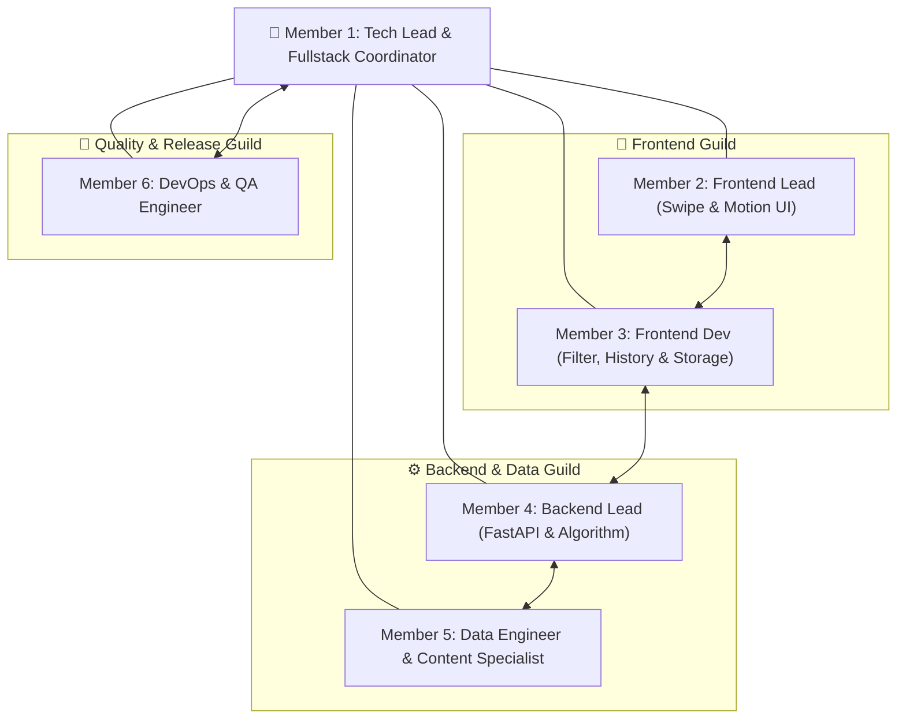

# 👥 04. Team Roles, Responsibilities & RACI Matrix

Để vận hành dự án **YumYumPick** một cách trơn tru, hiệu quả và chuẩn mực như một công ty công nghệ chuyên nghiệp (Tech Company Standard), tài liệu này phân công cụ thể trách nhiệm cho **6 thành viên trong đội ngũ**, định nghĩa ranh giới công việc và bảng ma trận trách nhiệm RACI.

---

## 1. Cơ Cấu Đội Ngũ 6 Thành Viên (Team Structure)

---

## 2. Bản Mô Tả Công Việc Chi Tiết Cho Từng Vai Trò (Job Descriptions)

### 👑 Member 1: Tech Lead & Fullstack Coordinator
- **Sứ mệnh:** Đảm bảo toàn bộ kiến trúc hệ thống hoạt động đồng bộ, giải quyết các khúc mắc kỹ thuật (technical blockers) và kiểm soát chất lượng mã nguồn (Code Review).
- **Trách nhiệm chính:**
  - Khởi tạo Repository GitHub, cấu hình phân nhánh chuẩn (`main`, `develop`), thiết lập rule bảo vệ nhánh (Branch Protection Rules).
  - Thống nhất API Contract (chuẩn định dạng Request/Response JSON) giữa đội Frontend và Backend từ ngày đầu tiên.
  - Hỗ trợ giải quyết Merge Conflict phức tạp khi các thành viên gộp nhánh.
  - Điều phối Daily Standup (họp nhanh 10 phút hàng ngày) và Sprint Review cuối tuần.
  - Đảm bảo dự án bàn giao đúng tiến độ cam kết.

### 🎨 Member 2: Frontend Lead (Swipe Engine & Motion UI)
- **Sứ mệnh:** Hiện thực hóa tính năng "quẹt thẻ" (Tinder-style) đạt độ mượt mà 60 FPS, mang lại cảm xúc thị giác hào hứng cho người dùng.
- **Trách nhiệm chính:**
  - Setup kiến trúc dự án React (Vite + Tailwind CSS).
  - Xây dựng component `CardStack` và `SwipeCard` bằng **Framer Motion**: xử lý cảm ứng (touch swipe), kéo chuột (mouse drag), xoay góc nghiêng và độ nảy khi thả tay.
  - Xử lý phân biệt cử chỉ Kéo (Drag) vs Nhấp (Tap) trên thẻ: Nhấp nhẹ mở nhanh `DishIntroDrawer` giới thiệu món ăn.
  - Thiết kế các hiệu ứng thị giác (stamp "YUMMY" / "NOPE", hiệu ứng đổi màu viền thẻ khi kéo lệch tâm).
  - Xây dựng cụm nút điều hướng nổi (Floating Action Buttons: Undo, Skip, Like, Info).
  - Tối ưu hiệu năng hiển thị thẻ tiếp theo (pre-load hình ảnh thẻ sau để tránh giật lag).

### 📱 Member 3: Frontend Developer (Filter, History, Admin CMS & LocalStorage)
- **Sứ mệnh:** Xây dựng toàn bộ các màn hình chức năng bổ trợ, cổng quản trị Admin/CMS, lưu trữ dữ liệu offline và kết nối dữ liệu từ Backend vào giao diện.
- **Trách nhiệm chính:**
  - Phát triển `FilterModal`: Cho phép người dùng lọc theo quốc gia, bữa ăn, nguyên liệu, thời gian.
  - Phát triển `DishIntroDrawer` (Bottom Sheet / Modal): Hiển thị phần giới thiệu tóm tắt món ăn khi người dùng tap vào thẻ hoặc bấm nút ℹ️.
  - Phát triển `SavedDishesModal` & `FullRecipeView`: Lưu trữ toàn bộ dữ liệu món ăn và công thức chi tiết vào `LocalStorage` khi quẹt phải; cho phép người dùng mở xem công thức đầy đủ (checkbox nguyên liệu, các bước nấu 1-2-3, mẹo đầu bếp) sau khi đã quẹt.
  - Quản trị dữ liệu phía client: Viết Custom Hook `useLocalStorage` để lưu trữ/đọc/xóa danh sách món đã chọn mà không bị mất khi F5 hoặc offline.
  - Phát triển giao diện **Admin / CMS Portal (`/admin`)**:
    - Màn hình Đăng nhập Quản trị (`AdminLogin.jsx`) và lưu JWT token vào session state (`useAdminAuth`).
    - Bảng Thống kê Tổng quan (`AdminDashboard.jsx`) với các thẻ KPI và biểu đồ xếp hạng món thích / bỏ qua.
    - Quản lý danh sách món ăn (`AdminDishes.jsx`) dạng bảng dữ liệu kèm phân trang, tìm kiếm và nút thao tác CRUD.
    - Form Modal soạn thảo món ăn đa tab (`DishFormModal.jsx`): nhập thông tin, danh sách nguyên liệu động và các bước nấu.
  - Viết tính năng "Tạo danh sách đi chợ" (Grocery Checklist Generator) từ các món đã lưu.
  - Tích hợp gọi API Backend thông qua Axios/Fetch (`api.js` và `adminApi.js`).

### ⚙️ Member 4: Backend Lead (FastAPI, Database ORM, Auth & Admin APIs)
- **Nhiệm vụ:** Xây dựng hệ thống Backend hiệu năng cao, cung cấp API ổn định, bảo mật JWT cho CMS và logic gợi ý món ăn dựa trên CSDL Supabase PostgreSQL.
- **Trách nhiệm chính:**
  - Khởi tạo cấu trúc dự án **FastAPI** chuẩn mô hình phân tầng (Clean Architecture: Router $\rightarrow$ Service $\rightarrow$ ORM/Repository $\rightarrow$ Pydantic Schema).
  - Tích hợp **SQLAlchemy 2.0** / driver PostgreSQL (`psycopg2-binary` hoặc `asyncpg`) kết nối an toàn với Supabase.
  - Thiết kế và cài đặt hệ thống **Xác thực & Phân quyền Quản trị (Admin Auth)**:
    - Băm mật khẩu an toàn với Bcrypt (`passlib`).
    - Sinh và xác thực JSON Web Token (JWT) cho các endpoint quản trị qua `security.py`.
    - Dependency `get_current_admin` chặn đứng các truy cập trái phép.
  - Xây dựng hệ thống **RESTful API Quản trị (Admin CMS Endpoints)**:
    - `POST /admin/auth/login` cấp access token.
    - `GET/POST/PUT/DELETE /admin/dishes` phục vụ quản lý thực đơn và công thức nấu nướng đầy đủ.
    - `GET /admin/stats/overview` tổng hợp số liệu tương tác (tổng quẹt, tỉ lệ like, top món).
  - Xây dựng Pydantic Schemas xác thực kiểu dữ liệu chặt chẽ cho Dish, Ingredient, FilterQuery, AdminLogin, DishCreate/Update.
  - Phát triển thuật toán gợi ý & Randomizer:
    - Truy vấn ngẫu nhiên các món ăn từ Supabase không trùng lặp các món đã xem gần đây.
    - Logic lọc nhiều tiêu chí kết hợp (Multi-criteria Filter: quốc gia + độ cay + thời gian nấu).
  - Cấu hình CORS Middleware an toàn cho phép Frontend gọi API từ localhost và domain Vercel.
  - Tự động sinh tài liệu Swagger UI (`/docs`) để Frontend tra cứu và thử nghiệm trực tiếp.

### 🍱 Member 5: Backend & Data Specialist (Supabase DB Design, Admin Schema & Content Curation)
- **Nhiệm vụ:** Thiết kế lược đồ CSDL Supabase toàn diện (User DB + Admin Tables), biên tập dữ liệu món ăn và tự động hóa nạp dữ liệu.
- **Trách nhiệm chính:**
  - Thiết kế lược đồ CSDL quan hệ Supabase: bảng `cuisines`, `dishes`, `ingredients`, `cooking_steps`, `tags`, `dish_tags`, `user_saved_dishes`, `user_swipes`, `admin_users`, `admin_audit_logs`.
  - Viết mã SQL DDL (`schema.sql`) khởi tạo cấu trúc bảng trên Supabase SQL Editor với khóa ngoại, UUID và chỉ mục tìm kiếm.
  - Thu thập, biên tập và chuẩn hóa dữ liệu cho **tối thiểu 60-100 món ăn** thuộc các nền văn hóa ẩm thực lớn (Việt, Hàn, Nhật, Thái, Ý).
  - Sưu tầm hình ảnh bản quyền tự do chất lượng cao (Unsplash, Pexels), tối ưu kích thước chuẩn WebP ($< 150\text{KB}$).
  - Viết script Python tự động (`seed_supabase.py`) nạp toàn bộ dữ liệu từ `dishes_seed.json` và khởi tạo tài khoản quản trị viên mặc định vào Supabase.
  - Hỗ trợ viết Unit Tests cho các câu truy vấn và kiểm thử API Backend.

### 🚀 Member 6: DevOps & QA Engineer (Cloud Infrastructure, Security Config & Quality)
- **Nhiệm vụ:** Đảm bảo hệ thống vận hành liên tục trên hạ tầng Cloud (Vercel + Render + Supabase) và chất lượng phần mềm đạt chuẩn.
- **Trách nhiệm chính:**
  - Khởi tạo project **Supabase**, lấy chuỗi kết nối PostgreSQL (`DATABASE_URL`) và API keys (`SUPABASE_URL`, `SUPABASE_ANON_KEY`).
  - Cấu hình tự động triển khai (CI/CD Pipeline) trên **Vercel** cho Frontend và **Render** cho Backend FastAPI.
  - Quản lý biến môi trường an toàn (`.env`), cấu hình Domain, SSL/HTTPS và các khóa bảo mật JWT (`JWT_SECRET_KEY`).
  - Xây dựng bộ tài liệu kiểm thử Postman Collection cho toàn bộ API endpoints (User API + Admin Protected API).
  - Thực hiện kiểm thử chức năng và phi chức năng:
    - Kiểm thử quẹt thẻ trên nhiều kích thước màn hình (Mobile, Tablet, Desktop).
    - Kiểm thử phân quyền Admin: Đăng nhập sai pass, gọi API không có Token $\rightarrow$ chặn 401.
    - Kiểm thử CRUD món ăn qua CMS: Thêm, sửa, xóa món phản ánh tức thì vào Database Supabase.
    - Kiểm thử các trường hợp biên: Hết thẻ quẹt, mất kết nối DB tạm thời, cache LocalStorage.
  - Đo lường và tối ưu điểm hiệu năng Google Lighthouse ($\ge 90$).

---

## 3. Ma Trận Phân Định Trách Nhiệm RACI (RACI Matrix)

*Giải thích các ký tự:*
- **R (Responsible):** Người trực tiếp thực hiện công việc.
- **A (Accountable):** Người chịu trách nhiệm cao nhất về kết quả cuối cùng (chỉ 1 người).
- **C (Consulted):** Người được tham khảo ý kiến chuyên môn trước khi thực hiện.
- **I (Informed):** Người được thông báo sau khi công việc hoàn thành.

| Gói Công Việc (Work Package) | M1: Tech Lead | M2: FE Lead | M3: FE Dev | M4: BE Lead | M5: Data Eng | M6: DevOps/QA |
|---|:---:|:---:|:---:|:---:|:---:|:---:|
| **Thiết lập Git Repo & Git Rules** | **A / R** | C | C | C | C | I |
| **Thiết kế ERD & Schema Supabase (User + Admin)** | C | I | I | C | **A / R** | I |
| **Khởi tạo Project Supabase & PostgreSQL** | I | I | I | C | C | **A / R** |
| **Cấu hình SQLAlchemy ORM Kết Nối Supabase** | C | I | I | **A / R** | C | I |
| **Bộ dữ liệu 60+ Món Ăn & Script Seed Supabase** | I | I | I | C | **A / R** | I |
| **Đặc tả API Contract (Swagger/OpenAPI)** | **A** | C | C | **R** | C | I |
| **FastAPI Core & Endpoints Routing (User)** | C | I | I | **A / R** | C | I |
| **Thuật toán Random & Multi-criteria Filter** | C | I | I | **A / R** | C | I |
| **Xác thực Admin (JWT + Bcrypt) & Security Middleware** | C | I | C | **A / R** | I | C |
| **Hệ thống API Quản trị (Admin CRUD & Stats)** | C | I | C | **A / R** | C | I |
| **Giao diện Quẹt Thẻ (Swipe Deck & Framer Motion)** | I | **A / R** | C | I | I | C |
| **Giao diện Modal Lọc & Chi Tiết Công Thức** | I | C | **A / R** | I | I | C |
| **Lưu trữ LocalStorage & Export Grocery List** | I | C | **A / R** | I | I | C |
| **Giao diện Admin/CMS Portal (Login, Table, Modal)** | I | C | **A / R** | C | I | C |
| **CI/CD Pipeline & Deploy Cloud (Vercel/Render/Supabase)** | C | I | I | I | I | **A / R** |
| **Kiểm Thử Chức Năng (QA) & Báo Cáo Lỗi (Bugs)** | I | C | C | C | C | **A / R** |
| **Code Review & Phê Duyệt Pull Request (PR)** | **A / R** | **R (FE)** | C | **R (BE)** | C | C |

---

## 4. Nguyên Tắc Phối Hợp Giữa Các Vai Trò (Cross-Role Collaboration Rules)

1. **Giao thức FE $\leftrightarrow$ BE:**
   - Đội Frontend **không được** chờ Backend code xong mới làm. FE sử dụng Mock Data (dữ liệu giả lập chuẩn theo `07_DATA_SCHEMA_AND_SEEDS.md`) để dựng toàn bộ UI và trải nghiệm quẹt ngay từ ngày đầu.
   - Ngay khi Backend deploy xong API dev, FE chỉ cần đổi biến `VITE_API_BASE_URL` sang URL thật.
2. **Giao thức Data $\leftrightarrow$ Backend:**
   - Member 5 cập nhật file JSON seed data; Member 4 viết hàm đọc và validate bằng Pydantic. Nếu dữ liệu thiếu trường (ví dụ thiếu link ảnh), Pydantic sẽ ném lỗi ngay từ lúc khởi động server.
3. **Giao thức DevOps/QA $\leftrightarrow$ Cả Team:**
   - Bất cứ khi nào mở Pull Request mới, Vercel Bot sẽ tạo một liên kết Preview. Member 6 (QA) có trách nhiệm vào link đó kiểm tra trên điện thoại thật và comment xác nhận *"Pass"* hoặc *"Found Bug"* trước khi Tech Lead bấm nút Merge.
