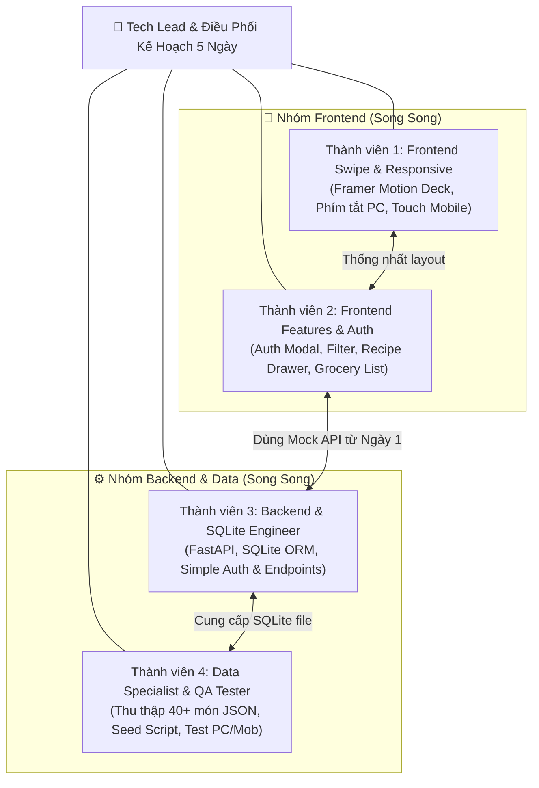

# 👥 04. Team Roles, Responsibilities & RACI Matrix (Kế Hoạch Song Song 5 Ngày)

Để đảm bảo dự án **YumYumPick** hoàn thành đúng tiến độ trong vòng **5 ngày**, khối lượng công việc được chia thành các module độc lập (Decoupled Modules) để các thành viên có thể **làm việc song song 100% mà không bị phụ thuộc (block) lẫn nhau**.

---

## 1. Cơ Cấu Đội Ngũ & Phân Công Song Song

---

## 2. Mô Tả Chi Tiết Từng Vai Trò (Job Descriptions)

### 🎨 Thành viên 1: Frontend Swipe & Responsive Lead
- **Sứ mệnh:** Đảm bảo trải nghiệm "quẹt thẻ" đạt độ mượt mà 60 FPS và giao diện hiển thị chuẩn đẹp trên cả điện thoại lẫn máy tính.
- **Nhiệm vụ chính:**
  - Khởi tạo khung dự án React (Vite + Tailwind CSS + Framer Motion).
  - Xây dựng component `SwipeCard.jsx` và `CardStack.jsx`:
    - Tính toán vật lý kéo thả, góc xoay nghiêng thẻ, lực nảy spring khi thả tay.
    - Hiệu ứng Stamp đóng dấu nổi: "YUMMY!" màu xanh và "NOPE" màu đỏ.
  - Xử lý tương thích đa nền tảng (Responsive):
    - Trên Mobile: vuốt chạm cảm ứng (touch gestures), nút nổi tầm với ngón tay.
    - Trên Desktop PC: khung thẻ căn giữa đẹp mắt, bắt sự kiện phím mũi tên bàn phím (`←` Skip, `→` Like, `Space` Info).
  - Ghép API lấy danh sách thẻ ngẫu nhiên khi Backend hoàn thành.

### 📱 Thành viên 2: Frontend Features & Auth Developer
- **Sứ mệnh:** Xây dựng toàn bộ các màn hình chức năng, giao diện đăng nhập/đăng ký đơn giản và bộ công cụ xem công thức/đi chợ.
- **Nhiệm vụ chính:**
  - Xây dựng component `AuthModal.jsx`: Form Đăng ký & Đăng nhập đơn giản (chỉ cần username & password, lưu session vào `localStorage`).
  - Xây dựng component `FilterModal.jsx`: Bộ lọc quốc gia, độ cay, thời gian chế biến.
  - Xây dựng component `DishIntroDrawer.jsx`: Drawer bật lên khi tap nhẹ vào thẻ để xem thông tin nhanh trước khi quẹt.
  - Xây dựng component `SavedDishesModal.jsx` & `FullRecipeView.jsx`:
    - Danh sách các món người dùng đã quẹt phải.
    - Xem công thức chi tiết: Danh sách nguyên liệu kèm **Checkbox tương tác** (tiện đi chợ/kiểm tra tủ lạnh), các bước nấu 1-2-3 và mẹo đầu bếp.
  - Xây dựng tính năng `Smart Grocery List`: Nút tự động tổng hợp nguyên liệu và nút Copy gửi qua Zalo.

### ⚙️ Thành viên 3: Backend & SQLite Engineer
- **Sứ mệnh:** Xây dựng hệ thống API siêu tốc với FastAPI và CSDL SQLite cục bộ gọn nhẹ.
- **Nhiệm vụ chính:**
  - Setup dự án FastAPI, cấu hình CORS cho phép gọi từ Frontend Localhost.
  - Thiết kế và khởi tạo CSDL SQLite (`yumyumpick.db`) qua SQLAlchemy.
  - Xây dựng module **Simple Auth**:
    - `POST /api/v1/auth/signup`: Tạo tài khoản mới.
    - `POST /api/v1/auth/login`: Xác thực đăng nhập đơn giản.
  - Xây dựng module **Dishes API**:
    - `GET /api/v1/dishes/random`: Lấy ngẫu nhiên món ăn có hỗ trợ bộ lọc và loại trừ món đã xem.
    - `GET /api/v1/dishes/{dish_id}`: Lấy chi tiết công thức.
  - Xây dựng module **Saved Dishes API**:
    - `POST /api/v1/saved-dishes`: Lưu món khi quẹt phải.
    - `GET /api/v1/saved-dishes/{user_id}`: Lấy danh sách món đã lưu.
    - `DELETE /api/v1/saved-dishes/{user_id}/{dish_id}`: Xóa món khỏi bộ sưu tập.
  - Cung cấp file **Mock API Data (JSON)** ngay ngày đầu tiên để Frontend không phải chờ đợi.

### 🍱 Thành viên 4: Data Specialist & QA Tester
- **Sứ mệnh:** Chuẩn bị kho dữ liệu ẩm thực phong phú, chất lượng cao và kiểm soát chất lượng sản phẩm trên mọi thiết bị.
- **Nhiệm vụ chính:**
  - **Chuẩn bị dữ liệu (Data Curation):**
    - Thu thập đầy đủ 100 món ăn chuẩn thuộc 5 nền ẩm thực (Việt Nam, Hàn Quốc, Nhật Bản, Thái Lan, Ý).
    - Tìm kiếm và chọn lọc link ảnh chất lượng cao (Unsplash / Pexels) cho từng món, hỗ trợ tải ảnh offline qua script.
    - Soạn thảo danh sách nguyên liệu chi tiết (định lượng, đơn vị tính) và các bước nấu 1-2-3 rõ ràng.
  - **Tự động hóa nạp CSDL (Seeding Script):**
    - Đóng gói dữ liệu vào file `dishes_seed.json`.
    - Viết script Python `seed_sqlite.py` nạp tự động toàn bộ dữ liệu vào file `yumyumpick.db`.
  - **Kiểm thử chất lượng (QA Testing):**
    - Kiểm thử giao diện trên trình duyệt PC (Chrome, Edge) và giả lập Mobile DevTools.
    - Kiểm thử trực tiếp trên điện thoại thật qua mạng Wi-Fi nội bộ.
    - Bắt các lỗi tràn chữ, lỗi vỡ layout ảnh, lỗi không lưu được session đăng nhập.

---

## 3. Ma Trận Trách Nhiệm RACI (RACI Matrix)

- **R (Responsible):** Người trực tiếp thực hiện công việc.
- **A (Accountable):** Người chịu trách nhiệm phê duyệt và kết quả cuối cùng.
- **C (Consulted):** Người được hỏi ý kiến / phối hợp chuyên môn.
- **I (Informed):** Người nhận thông báo kết quả.

| Hạng Mục Công Việc | TV 1 (FE Swipe) | TV 2 (FE Features) | TV 3 (BE & SQLite) | TV 4 (Data & QA) |
|---|:---:|:---:|:---:|:---:|
| Thống nhất API Contract & DDL SQLite | **C** | **C** | **A / R** | **I** |
| Xây dựng Khung Quẹt Thẻ Framer Motion | **A / R** | **C** | **I** | **I** |
| Xử lý Responsive PC (Phím tắt) & Mobile (Touch) | **A / R** | **C** | **I** | **C** |
| Modal Đăng Ký / Đăng Nhập Đơn Giản (UI) | **I** | **A / R** | **C** | **I** |
| Modal Lọc Ẩm Thực & Dish Intro Drawer | **C** | **A / R** | **I** | **I** |
| Màn hình Món Đã Lưu & Xuất List Đi Chợ | **I** | **A / R** | **C** | **I** |
| Xây dựng FastAPI Server & SQLite ORM | **I** | **I** | **A / R** | **C** |
| Xây dựng API Simple Auth & Saved Dishes | **I** | **C** | **A / R** | **I** |
| Thu thập 100 Món Ăn, Tải Ảnh & Script Seed SQLite | **I** | **I** | **C** | **A / R** |
| Kiểm thử chéo E2E trên PC & Mobile | **C** | **C** | **C** | **A / R** |
| Chuẩn bị Kịch Bản Demo Ngày 5 | **R** | **R** | **R** | **A / R** |

---

## 4. Cơ Chế Làm Việc Song Song Không Block Nhau (Decoupling Strategy)

1. **Ngày 1 chốt cứng Mock Data:** Thành viên 3 (Backend) cung cấp ngay file JSON mẫu cho các API. Thành viên 1 & 2 (Frontend) import file JSON này để code giao diện và hiệu ứng ngay lập tức mà không cần đợi server chạy xong.
2. **Data độc lập hoàn toàn:** Thành viên 4 (Data) chỉ cần điền thông tin vào file JSON theo đúng mẫu quy định sẵn, sau đó chạy script `seed_sqlite.py` để nạp vào DB khi Backend dựng xong bảng.
3. **Daily Sync 10 phút:** Mỗi sáng họp nhanh 10 phút để nắm tình hình và xử lý ngay các vướng mắc tích hợp.
