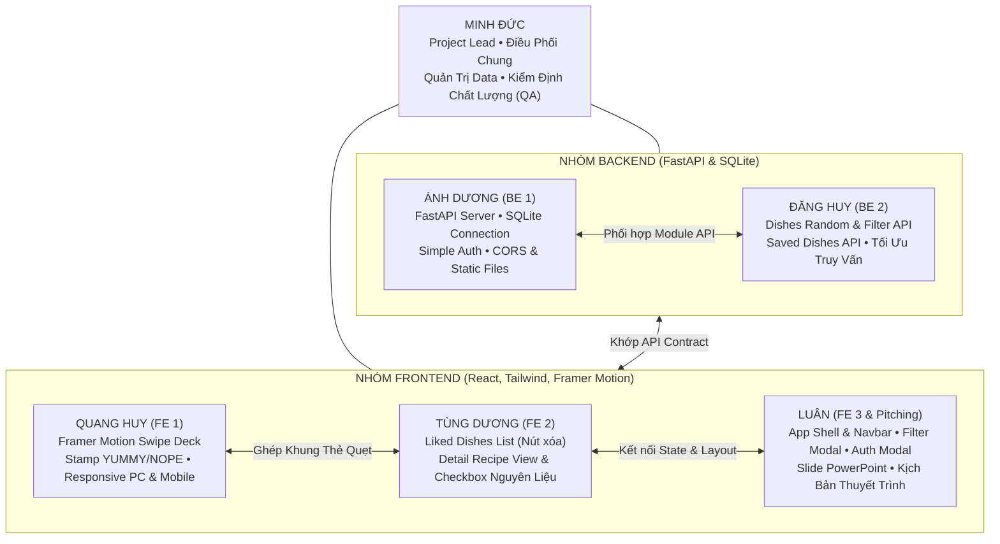

# 04. Phân Công Vai Trò Thành Viên & Ma Trận RACI (Team Roles & RACI Matrix)

Để đảm bảo dự án **YumYumPick** hoàn thành xuất sắc trong vòng **5 ngày**, toàn bộ đội ngũ gồm **6 thành viên** được chỉ định vai trò chuyên biệt, rõ ràng và làm việc song song 100% không phụ thuộc (block) lẫn nhau.

---

## 1. Sơ Đồ Tổ Chức & Cơ Cấu Đội Ngũ (Team Structure)

---

## 2. Bảng Mô Tả Chi Tiết Nhiệm Vụ Từng Thành Viên

### 1. Minh Đức — Project Lead, Quản Trị Data & Kiểm Định (QA Lead)
* **Sứ mệnh:** Giữ nhịp độ dự án 5 ngày, đảm bảo kho dữ liệu món ăn hoàn hảo và kiểm soát chất lượng phần mềm không lỗi.
* **Nhiệm vụ cụ thể:**
  1. **Điều phối tiến độ (Sprint Master):** Chủ trì cuộc họp Daily Sync 10 phút mỗi sáng; tháo gỡ điểm nghẽn (blockers) cho 2 nhóm Frontend và Backend.
  2. **Quản trị kho dữ liệu (Data Curation):**
     - Đảm bảo tính toàn vẹn của **100 món ăn** đa dạng (30 Việt Nam, 20 Hàn Quốc, 18 Nhật Bản, 16 Thái Lan, 16 Ý) trong file `backend/app/data/dishes_seed.json`.
     - Quản lý kho **100 ảnh offline** sắc nét tại `backend/images/dishes/`.
     - Quản lý file CSDL SQLite chuẩn `backend/yumyumpick.db` (495 nguyên liệu, 300 bước nấu ăn, tài khoản test `demo`/`123`).
  3. **Kiểm định chất lượng (QA Testing):**
     - Xây dựng kịch bản kiểm thử (Test Matrix) cho toàn bộ tính năng: Đăng ký/Đăng nhập, Quẹt thẻ (kèm description intro), Lọc sơ bộ, Xem công thức, Checkbox tương tác nguyên liệu.
     - Kiểm thử giao diện chéo trên PC (Chrome, Edge) và Mobile thật qua mạng nội bộ LAN (`http://<IP_LAN>:5173`).
     - Bắt và phân loại bug để các lập trình viên fix ngay trong ngày 4 và 5.
     - Phối hợp với Luân kiểm tra kịch bản Live Demo trước giờ thuyết trình.

---

### 2. Ánh Dương — Backend Engineer 1 (Server Core & Simple Auth)
* **Sứ mệnh:** Dựng nền tảng server FastAPI vững chắc, kết nối SQLite và cung cấp luồng xác thực đơn giản.
* **Nhiệm vụ cụ thể:**
  1. Khởi tạo dự án FastAPI, cấu hình `uvicorn`, CORS middleware cho phép Frontend Localhost gọi thông suốt.
  2. Mount thư mục tĩnh `backend/images/dishes/` phục vụ 100 ảnh offline với tốc độ cực nhanh.
  3. Xây dựng Simple Auth API: `POST /api/v1/auth/signup` và `POST /api/v1/auth/login` (kết nối trực tiếp bảng `users` trong CSDL SQLite `yumyumpick.db`).
  4. Cung cấp Mock Data JSON cho đội ngũ Frontend test độc lập trong Ngày 1 & 2.
  5. Tối ưu hóa truy vấn SQLite, chống khóa file đồng thời (concurrency lock).

---

### 3. Đăng Huy — Backend Engineer 2 (Dishes API & Saved Dishes)
* **Sứ mệnh:** Xây dựng bộ API xử lý nghiệp vụ quẹt món, lọc và lưu trữ món ăn vào CSDL SQLite. *(Đã hoàn thành 100% Milestone 1 & Milestone 1.x)*
* **Nhiệm vụ cụ thể:**
  1. [x] Khởi tạo cấu trúc ORM / Query kết nối với `backend/yumyumpick.db`.
  2. [x] Xây dựng API gợi ý món ăn ngẫu nhiên: `GET /api/v1/dishes/random` (hỗ trợ lọc theo `cuisine`, `spicy_level`, `max_cook_time`, loại trừ món đã xem/đã lưu, trả về đầy đủ `short_description`).
  3. [x] Xây dựng API chi tiết món: `GET /api/v1/dishes/{dish_id}` (kèm danh sách nguyên liệu và các bước nấu).
  4. [x] Xây dựng Saved Dishes API:
     - `POST /api/v1/saved-dishes`: Lưu món ăn khi quẹt phải (LIKE).
     - `GET /api/v1/saved-dishes/{user_id}`: Lấy danh sách món đã thích của người dùng.
     - `DELETE /api/v1/saved-dishes/{user_id}/{dish_id}`: Xóa/bỏ thích món ăn.

---

### 4. Quang Huy — Frontend Engineer 1 (Swipe Deck & Responsive Experience)
* **Sứ mệnh:** Tạo linh hồn cho ứng dụng với hiệu ứng quẹt thẻ mượt mà 60 FPS chuẩn phong cách Tinder và tối ưu trải nghiệm đa thiết bị.
* **Nhiệm vụ cụ thể:**
  1. Khởi tạo dự án React bằng Vite + Tailwind CSS + Framer Motion.
  2. Xây dựng component `SwipeCard.jsx` & `CardStack.jsx`:
     - Tích hợp đầy đủ trên mặt thẻ: Hình ảnh món lớn sắc nét, tên món (Việt/Anh), huy hiệu thông số và **đoạn mô tả giới thiệu (`short_description`)** giúp người dùng hiểu rõ món ăn để quyết định quẹt trái hay quẹt phải.
     - Xử lý cử chỉ vuốt kéo (drag gesture), góc nghiêng thẻ $\text{rotate} = \text{dragX}/15$, lực nảy đàn hồi (spring physics).
     - Hiển thị hiệu ứng Stamp đồ họa: "YUMMY!" (màu xanh lá khi kéo phải) và "NOPE" (màu đỏ khi kéo trái).
     - Hiệu ứng xếp chồng 3 thẻ, thẻ sau nổi lên khi thẻ trước bay đi.
     - Xử lý màn hình hết thẻ (Empty State) với nút "Khám phá lại".
  3. **Tối ưu hóa Responsive toàn diện (Mobile + PC):**
     - **Trên Mobile:** Giao diện tràn viền (100vw), thao tác vuốt 1 chạm thuận tay cái.
     - **Trên Desktop PC:** Khung thẻ căn giữa ($420\text{px} \times 600\text{px}$), hỗ trợ phím mũi tên bàn phím (`←` Bỏ qua, `→` Thích).
  4. Cụm nút bấm nổi phía dưới: Bỏ qua và Thích.

---

### 5. Tùng Dương — Frontend Engineer 2 (Liked Dishes & Detail Recipe View)
* **Sứ mệnh:** Xây dựng màn hình hiển thị danh sách món đã thích và giao diện xem chi tiết công thức nấu ăn trực quan.
* **Nhiệm vụ cụ thể:**
  1. Xây dựng component `LikedDishesView.jsx` (Danh sách món đã quẹt phải):
     - Hiển thị danh sách các món ăn đã thích từ SQLite qua API của Đăng Huy.
     - Nút xóa/bỏ thích để loại món khỏi danh sách lưu.
  2. Xây dựng component `DishDetailModal.jsx` (Xem chi tiết công thức):
     - Bấm vào món trong danh sách $\rightarrow$ Mở popup xem chi tiết công thức.
     - **Danh sách nguyên liệu kèm Checkbox tương tác:** Mỗi dòng nguyên liệu có ô checkbox `[ ]` để tích chọn đánh dấu nguyên liệu đã chuẩn bị/đã có khi nấu.
     - Hướng dẫn chế biến chuẩn 3 bước (Sơ chế $\rightarrow$ Nấu $\rightarrow$ Trình bày) và khung mẹo đầu bếp (`tips`).

---

### 6. Luân — Frontend Engineer 3 & Pitching Lead (App Shell, Filter, Auth & Presentation)
* **Sứ mệnh:** Xây dựng khung ứng dụng chung, bộ lọc sơ bộ, modal xác thực tài khoản; đồng thời đóng gói toàn bộ nỗ lực của nhóm thành bài thuyết trình đạt điểm tối đa.
* **Nhiệm vụ cụ thể:**
  1. **Frontend Core:**
     - Xây dựng bố cục chung (App Layout) và thanh Header/Navbar: Logo thương hiệu, nút Bộ Lọc, nút Món Đã Thích, nút Tài khoản.
     - Xây dựng component `FilterModal.jsx` (Bộ lọc sơ bộ): Lọc quốc gia (5 nước), lọc độ cay (0-3), lọc thời gian nấu (<20', >=20') và nút Áp dụng tải lại thẻ.
     - Xây dựng component `AuthModal.jsx`: Form Đăng nhập & Đăng ký đơn giản, lưu session vào `localStorage` (khôi phục trạng thái tự động khi F5).
  2. **Thiết kế bộ Slide PowerPoint báo cáo (12 - 15 slides):**
     - Thiết kế theo phong cách hiện đại, phối màu cam-đỏ ẩm thực đồng bộ với ứng dụng YumYumPick.
     - Chèn hình ảnh món ăn thực tế từ kho 100 ảnh và ảnh chụp màn hình ứng dụng trên cả PC lẫn Mobile.
     - Trình bày trực quan: Sơ đồ kiến trúc SQLite Offline, quy trình quẹt thẻ, ma trận RACI và kết quả 5 ngày sprint.
  3. **Xây dựng Kịch bản Thuyết trình (Presentation Script):**
     - Mở đầu ấn tượng: Đặt câu hỏi nhức nhối hàng ngày *"Hôm nay ăn gì?"* và sự quá tải của các app đặt đồ ăn thông thường.
     - Giới thiệu giải pháp: *"Tinder cho món ăn"* — Vuốt là chọn, lọc sơ bộ và xem ngay công thức nấu chi tiết.
     - Nêu bật điểm sáng kỹ thuật: Kiến trúc Offline 100%, CSDL SQLite cục bộ siêu nhẹ, không phụ thuộc cloud hay server phức tạp.
  4. **Tổ chức & Điều phối Live Demo:**
     - Lên kịch bản Demo chi tiết từng bước (Step-by-step Demo Guide).
     - Phối hợp với Minh Đức chuẩn bị video demo dự phòng (Backup Video) để ứng phó rủi ro kỹ thuật.
  5. **Bộ câu hỏi phản biện (Q&A Cheat Sheet):** Soạn sẵn câu trả lời cho các câu hỏi tiềm năng của hội đồng (về hiệu năng, mở rộng dữ liệu, lưu trữ SQLite, tính tiện dụng).

---

## 3. Ma Trận Trách Nhiệm RACI (RACI Matrix Chi Tiết)

* **R (Responsible):** Người trực tiếp thực hiện công việc.
* **A (Accountable):** Người chịu trách nhiệm phê duyệt và kết quả cuối cùng.
* **C (Consulted):** Người được hỏi ý kiến / tư vấn chuyên môn.
* **I (Informed):** Người nhận thông báo kết quả.

| Hạng Mục Công Việc | Minh Đức (Lead/Data/QA) | Ánh Dương (BE 1) | Đăng Huy (BE 2) | Quang Huy (FE 1) | Tùng Dương (FE 2) | Luân (FE 3/Pitch) |
|---|:---:|:---:|:---:|:---:|:---:|:---:|
| **Kế hoạch 5 ngày & Điều phối Daily Sync** | **A / R** | **I** | **I** | **I** | **I** | **I** |
| **Quản trị 100 Món Ăn, 100 Ảnh & CSDL SQLite** | **A / R** | **C** | **C** | **I** | **I** | **C** |
| **Setup FastAPI Server, CORS & Static Files** | **C** | **A / R** | **C** | **I** | **I** | **I** |
| **API Simple Auth (Signup/Login SQLite)** | **I** | **A / R** | **C** | **I** | **I** | **C** |
| **API Dishes Random & Filter Engine** | **I** | **C** | **A / R** | **C** | **I** | **C** |
| **API Saved Dishes (Lưu, Lấy, Xóa món)** | **I** | **C** | **A / R** | **C** | **C** | **I** |
| **Khung Quẹt Thẻ Framer Motion & Stamp** | **I** | **I** | **I** | **A / R** | **C** | **C** |
| **Responsive PC (Phím tắt) & Mobile (Touch)** | **C** | **I** | **I** | **A / R** | **C** | **C** |
| **App Layout & Navbar (Header, Badge count)** | **I** | **I** | **I** | **C** | **C** | **A / R** |
| **UI Auth Modal & LocalStorage Session** | **I** | **C** | **I** | **I** | **C** | **A / R** |
| **UI Filter Modal (Bộ lọc ẩm thực sơ bộ)** | **I** | **I** | **C** | **C** | **I** | **A / R** |
| **UI Liked Dishes (Món đã thích) & Nút Xóa** | **C** | **I** | **C** | **I** | **A / R** | **C** |
| **UI Detail Recipe View & Checkbox Nguyên Liệu** | **C** | **I** | **C** | **I** | **A / R** | **C** |
| **Kiểm Định Chất Lượng (QA Testing PC & Mobile)** | **A / R** | **C** | **C** | **C** | **C** | **C** |
| **Thiết Kế Slide PowerPoint Báo Cáo** | **C** | **I** | **I** | **I** | **I** | **A / R** |
| **Kịch Bản Thuyết Trình, Demo Story & Q&A** | **C** | **I** | **I** | **C** | **C** | **A / R** |
| **Duyệt Thử Nghiệm Live Demo (Ngày 5)** | **A / R** | **R** | **R** | **R** | **R** | **A / R** |

---

## 4. Cơ Chế Làm Việc Song Song 100% Không Bị Block (Decoupling Strategy)

1. **Ngày 1 chốt cứng Mock Contract:** Ánh Dương & Đăng Huy cung cấp file JSON mẫu cho các API. Ba thành viên Frontend (Quang Huy, Tùng Dương, Luân) lập tức chia nhỏ các component để dựng toàn bộ giao diện mà không cần đợi server backend chạy xong.
2. **Dữ liệu & CSDL đã sẵn sàng 100%:** Minh Đức đã chuẩn bị sẵn file CSDL `backend/yumyumpick.db` và 100 ảnh offline tại `backend/images/dishes/`. Backend chỉ việc kết nối vào file DB có sẵn này để query, không cần tốn thời gian thiết kế schema hay tạo dữ liệu giả.
3. **Slide & Story song hành từ Ngày 2:** Luân kết hợp code phần Filter/Auth với việc dựng khung slide PowerPoint và kịch bản thuyết trình ngay từ ngày thứ 2, cập nhật dần ảnh chụp tiến độ và video demo từ cả nhóm.
4. **Daily Sync 10 phút:** Đúng 09:00 sáng mỗi ngày, Minh Đức điều phối họp nhanh 10 phút online/offline để:
   - Từng thành viên báo cáo 3 câu hỏi: *Hôm qua đã làm gì? Hôm nay sẽ làm gì? Có vướng mắc gì không?*
   - Xử lý dứt điểm các vướng mắc tích hợp trong ngày.
