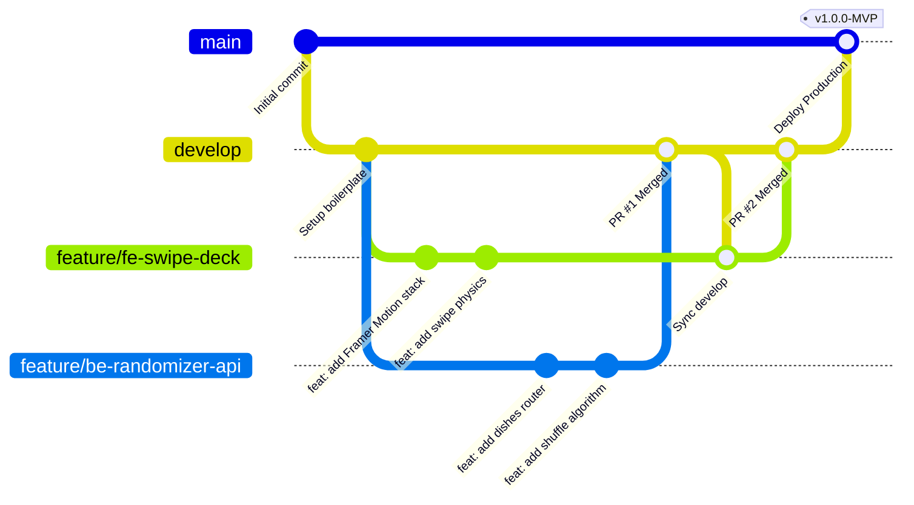
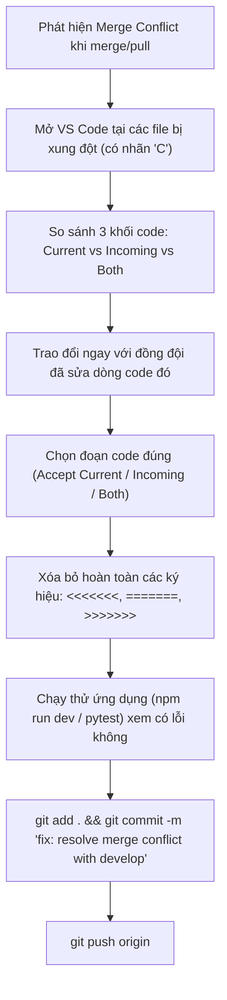

# 🐙 05. Git Workflow & Professional Collaboration Guidelines

Tài liệu này là "kim chỉ nam" bắt buộc áp dụng cho toàn bộ 6 thành viên của dự án **YumYumPick**. Mọi quy trình từ đặt tên nhánh, viết commit, tạo Pull Request cho tới review code đều được chuẩn hóa theo tiêu chuẩn của các công ty công nghệ chuyên nghiệp (Enterprise / Silicon Valley Standard).

---

## 1. Mô Hình Phân Nhánh (Branching Strategy)

Dự án áp dụng mô hình **Git Feature Branching Workflow** (biến thể tinh gọn của Git Flow), tách bạch hoàn toàn giữa mã nguồn sản phẩm thực tế và mã nguồn đang phát triển.



### Các Nhánh Chính (Permanent Branches)
1. **`main` (Production Branch):**
   - Chứa mã nguồn hoàn thiện, đã kiểm thử kỹ càng và chạy trực tiếp cho người dùng cuối trên Vercel Production.
   - **Tuyệt đối không commit trực tiếp.** Chỉ có Tech Lead được quyền merge từ `develop` vào `main`.
2. **`develop` (Staging / Integration Branch):**
   - Nhánh tích hợp trung tâm của cả team. Toàn bộ các tính năng mới sau khi hoàn thành sẽ được gộp về đây để kiểm thử tổng hợp (Integration Testing).

### Các Nhánh Tạm Thời (Temporary Branches)
- **`feature/<guild>-<feature-name>`:** Dùng để phát triển tính năng mới. Luôn rẽ nhánh từ `develop` và merge lại vào `develop`.
  - Ví dụ: `feature/fe-swipe-card-physics`, `feature/be-random-dish-endpoint`, `feature/data-vietnamese-dishes`.
- **`fix/<guild>-<issue-name>`:** Dùng để sửa lỗi phát sinh trên môi trường phát triển (`develop`).
  - Ví dụ: `fix/fe-safari-gesture-stuck`, `fix/be-cors-wildcard`.
- **`hotfix/<issue-name>`:** Dùng để vá lỗi khẩn cấp trực tiếp trên môi trường `main`.

---

## 2. Quy Chuẩn Đặt Tên Nhánh & Viết Commit

### 2.1. Quy Ước Đặt Tên Nhánh (Branch Naming Convention)
Cú pháp chuẩn: `<loại>/<tiền-tố-vai-trò>-<tên-ngắn-gọn-tiếng-anh>`

| Loại Nhánh | Vai Trò | Ví Dụ Đặt Tên |
|---|---|---|
| Tính năng mới | Frontend | `feature/fe-recipe-detail-drawer` |
| Tính năng mới | Backend | `feature/be-filter-by-cuisine` |
| Tính năng mới | Data | `feature/data-60-curated-dishes` |
| Sửa lỗi thường | Frontend | `fix/fe-localstorage-quota-error` |
| Tối ưu hạ tầng | DevOps | `chore/devops-vercel-preview-ci` |

### 2.2. Chuẩn Viết Commit (Conventional Commits 1.0.0)
Mọi commit bắt buộc tuân theo cú pháp:
```text
<type>(<scope>): <mô tả ngắn gọn bằng tiếng Anh hoặc tiếng Việt rõ nghĩa>
```

- **Các `type` được chấp nhận:**
  - `feat`: Tính năng mới cho người dùng.
  - `fix`: Sửa một lỗi (bug).
  - `docs`: Sửa đổi hoặc bổ sung tài liệu.
  - `style`: Thay đổi định dạng code (khoảng trắng, dấu chấm phẩy, format) không ảnh hưởng logic.
  - `refactor`: Tái cấu trúc mã nguồn (không sửa bug, không thêm feature).
  - `perf`: Cải thiện hiệu năng xử lý hoặc tốc độ tải.
  - `test`: Thêm hoặc chỉnh sửa các bài kiểm thử (Unit test, Integration test).
  - `chore`: Cập nhật cấu hình build, dependencies, thư mục...

- **Bảng Ví Dụ Thực Tế:**

| ✅ Commit Đạt Chuẩn (Chuyên Nghiệp) | ❌ Commit Không Hợp Lệ (Cấm Sử Dụng) |
|---|---|
| `feat(swipe): add rotation and drag threshold using Framer Motion` | `update code` |
| `fix(api): fix NoneType error when query params are missing` | `fix bug` |
| `docs(readme): add local development setup instructions` | `update readme` |
| `refactor(storage): separate LocalStorage helpers into custom hook` | `chỉnh sửa lại một tí` |
| `chore(deps): install lucide-react and tailwindcss` | `push code tối muộn` |

---

## 3. Hướng Dẫn Thao Tác Git Từng Bước (Step-by-Step Git Guide)

### Bước 1: Khởi Tạo Dự Án & Clone Về Máy Cá Nhân
```bash
# Clone repository về máy
git clone <URL_REPO_GITHUB>
cd YunYumPick

# Kiểm tra các nhánh hiện có và chuyển sang nhánh develop
git checkout develop
git pull origin develop
```

### Bước 2: Tạo Nhánh Mới Để Làm Việc
*Quy tắc vàng: Luôn kéo mã nguồn mới nhất từ `develop` trước khi tạo nhánh mới!*
```bash
# 1. Chuyển về develop và cập nhật mới nhất
git checkout develop
git pull origin develop

# 2. Tạo nhánh tính năng mới của bạn
git checkout -b feature/fe-card-component
```

### Bước 3: Lập Trình & Lưu Trữ Thay Đổi (Commit)
```bash
# Xem các file vừa thay đổi
git status

# Đưa file vào staging area
git add src/components/swipe/SwipeCard.jsx

# Tạo commit theo đúng chuẩn Conventional Commits
git commit -m "feat(swipe): build TinderCard component with like/skip stamps"
```

### Bước 4: Đồng Bộ Nhánh Trước Khi Đẩy Lên (Sync with Develop)
Trong quá trình bạn làm việc, đồng đội có thể đã merge code mới vào `develop`. Để tránh xung đột, hãy đồng bộ:
```bash
git checkout develop
git pull origin develop
git checkout feature/fe-card-component
git merge develop
# (Giải quyết xung đột nếu có, sau đó commit)
```

### Bước 5: Đẩy Nhánh Lên GitHub & Mở Pull Request
```bash
# Đẩy nhánh của bạn lên remote repository
git push -u origin feature/fe-card-component
```
- Sau khi push, vào giao diện GitHub của dự án $\rightarrow$ Click vào nút xanh **"Compare & pull request"**.
- Chọn Base: `develop` $\leftarrow$ Compare: `feature/fe-card-component`.

---

## 4. Quy Chuẩn Mở Pull Request (PR) & Code Review

### 4.1. Tiêu Chuẩn Một Pull Request Chuẩn Mực
1. **Tiêu đề PR rõ ràng:** Theo đúng chuẩn commit, ví dụ: `feat(fe): Implement Tinder Swipe gesture with Framer Motion`.
2. **Kèm hình ảnh minh chứng (Proof of Work):**
   - Đối với Frontend: Bắt buộc đính kèm ảnh chụp màn hình (Screenshot) hoặc ảnh động (GIF) minh họa chuyển động quẹt thẻ trên mobile/desktop.
   - Đối với Backend: Đính kèm ảnh chụp màn hình kết quả gọi API thành công từ Swagger UI hoặc Postman.
3. **Phạm vi nhỏ gọn (Small PRs):**
   - Một PR lý tưởng không nên thay đổi quá 400 dòng code. PR càng nhỏ thì đồng đội review càng kỹ, ít lỗi sót.

### 4.2. Quy Tắc Code Review & Phê Duyệt (Review Policy)
- **Tối thiểu 1-2 Approve:**
  - Code Frontend cần được Member 2 (FE Lead) hoặc Member 3 duyệt.
  - Code Backend cần được Member 4 (BE Lead) hoặc Member 5 duyệt.
  - Tech Lead (Member 1) là người có thẩm quyền merge cuối cùng sau khi mọi thảo luận đã được thống nhất.
- **Không tự ý Merge:** Người tạo PR **tuyệt đối không** tự bấm Merge code của chính mình.
- **Văn hóa góp ý tích cực (Constructive Feedback):**
  - Đưa ra lý do kỹ thuật rõ ràng khi yêu cầu sửa: *"Nên dùng `useCallback` ở đây để tránh tạo lại hàm khi thẻ re-render"*.
  - Dùng thẻ phân loại: `[Nitpick]` (góp ý nhỏ không bắt buộc sửa), `[Blocking]` (lỗi nghiêm trọng bắt buộc phải sửa trước khi merge).

---

## 5. Hướng Dẫn Giải Quyết Xung Đột Mã Nguồn (Merge Conflict Resolution)

Merge Conflict xảy ra khi hai người cùng sửa vào một dòng code trên cùng một file. Hãy bình tĩnh xử lý theo 4 bước:



---

## 6. Lễ Nghi Làm Việc Nhóm Hàng Ngày (Professional Team Rituals)

Để duy trì tính gắn kết như một công ty thực thụ:
1. **Daily Standup (10 phút mỗi ngày - Online hoặc Chat):**
   Mỗi thành viên trả lời nhanh 3 câu hỏi trước 9h30 sáng:
   - *Hôm qua tôi đã hoàn thành việc gì?*
   - *Hôm nay tôi sẽ làm việc gì?*
   - *Tôi có đang bị vướng mắc (blocker) gì cần ai hỗ trợ không?*
2. **Kênh Chat Quy Củ:**
   - `#announcements`: Thông báo lịch họp, deadline, demo.
   - `#frontend`: Thảo luận kỹ thuật UI, CSS, animation.
   - `#backend-data`: Thảo luận database, API contract, format JSON.
   - `#random-chill`: Khen ngợi nhau, chia sẻ đồ ăn vặt.
