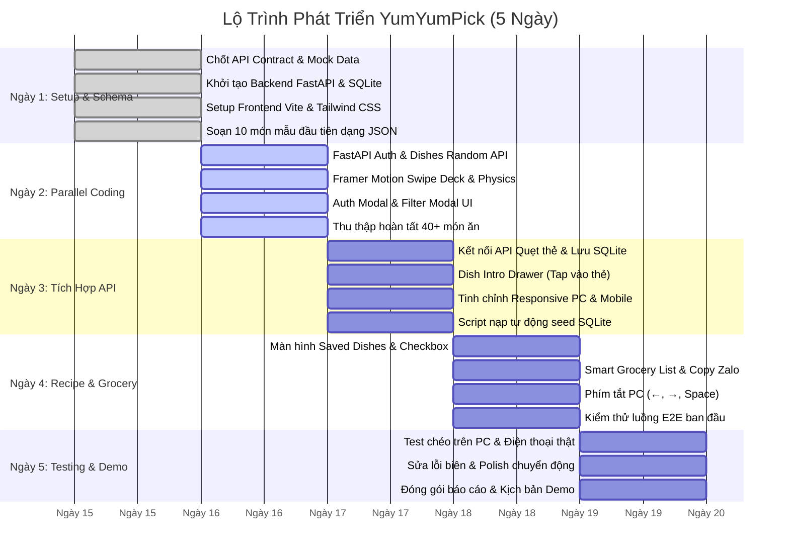

# 📋 06. Lộ Trình Triển Khai 5 Ngày & TODO Checklist Từng Vai Trò

Tài liệu này vạch ra lộ trình phát triển cấp tốc trong **5 Ngày (Crash Sprint)** với phương pháp làm việc song song (Parallel Workstreams), kèm danh sách đầu việc (Actionable Checklist) chi tiết từng ngày cho 4 thành viên chủ chốt của dự án **YumYumPick**.

---

## 1. Lộ Trình Triển Khai Chi Tiết 5 Ngày (5-Day Gantt Timeline)

---

## 2. Tiêu Chuẩn Nghiệm Thu Công Việc (Definition of Done - DoD)

Mỗi tính năng chỉ được xem là hoàn thành khi đáp ứng đủ các tiêu chí sau:
- [ ] Code chạy cục bộ trơn tru, không có lỗi console báo đỏ hay crash server.
- [ ] Đã kiểm tra hiển thị trên cả 2 chế độ: Màn hình PC (1024px+) và Màn hình Mobile (giả lập 390px trên DevTools).
- [ ] Dữ liệu kết nối đúng với file CSDL SQLite `yumyumpick.db`.
- [ ] Đã xóa bỏ các đoạn `console.log` và dữ liệu debug thừa.

---

## 3. Bảng TODO Chi Tiết Từng Ngày Cho Từng Thành Viên

### 🎨 Thành viên 1: Frontend Swipe & Responsive Lead

#### Ngày 1: Setup Dự Án & Spike Framer Motion
- [ ] Tạo dự án React bằng Vite (`npm create vite@latest frontend -- --template react`).
- [ ] Cài đặt các package cần thiết: `framer-motion`, `lucide-react`, `clsx`, `tailwind-merge`.
- [ ] Cấu hình Tailwind CSS, thiết lập font chữ và bảng màu chủ đạo (Cam/Đỏ ẩm thực).
- [ ] Tạo file mock data cục bộ từ JSON mẫu của Ngày 1 để thử nghiệm thẻ quẹt.

#### Ngày 2: Hoàn Thiện Cơ Chế Quẹt Thẻ (Swipe Deck)
- [ ] Xây dựng component `SwipeCard.jsx` bằng Framer Motion:
  - [ ] Bắt cử chỉ kéo chuột (mouse drag) và vuốt ngón tay (touch gesture).
  - [ ] Công thức xoay nghiêng động: $\text{rotate} = \text{dragX} / 15$.
  - [ ] Ngưỡng quẹt: Sang phải $> 120\text{px}$ là LIKE, sang trái $< -120\text{px}$ là SKIP.
  - [ ] Hiển thị stamp đồ họa nổi: "YUMMY!" (xanh) và "NOPE" (đỏ) tăng dần độ đậm khi kéo.
- [ ] Xây dựng component `CardStack.jsx`: Xếp lớp 3 thẻ kế tiếp nhau, hiệu ứng phóng to mượt khi thẻ trên cùng bay đi.
- [ ] Xử lý trạng thái hết thẻ (Empty State) kèm nút "Quẹt lại từ đầu".

#### Ngày 3: Tích Hợp API & Bố Cục Responsive PC/Mobile
- [ ] Kết nối hàm lấy danh sách thẻ từ API Backend `GET /api/v1/dishes/random`.
- [ ] Khi quẹt phải: Gửi request `POST /api/v1/saved-dishes` để lưu món vào SQLite.
- [ ] Tinh chỉnh giao diện Responsive:
  - [ ] Trên Mobile: Thẻ chiếm toàn màn hình, nút bấm vừa vặn ngón tay cái.
  - [ ] Trên PC: Giới hạn khung thẻ trong kích thước $420\text{px} \times 600\text{px}$ căn giữa.

#### Ngày 4: Bổ Sung Phím Tắt PC & Điều Hướng
- [ ] Bắt sự kiện bàn phím trên máy tính:
  - [ ] Phím `←` (Mũi tên trái): Bỏ qua thẻ hiện tại.
  - [ ] Phím `→` (Mũi tên phải): Thích và lưu thẻ hiện tại.
  - [ ] Phím `Space` (Phím cách): Mở nhanh Drawer giới thiệu món ăn.
- [ ] Xây dựng cụm nút bấm nổi: Undo (hoàn tác thẻ vừa quẹt), Skip, Like, Info.

#### Ngày 5: Tối Ưu Animation & Phối Hợp Demo
- [ ] Tinh chỉnh độ đàn hồi (spring physics) đạt 60 FPS không giật lag.
- [ ] Kiểm thử chuyển động trên các trình duyệt khác nhau (Chrome, Edge, Safari di động).
- [ ] Cùng team tổng duyệt kịch bản demo sản phẩm.

---

### 📱 Thành viên 2: Frontend Features & Auth Developer

#### Ngày 1: Setup Layout Chung & Navbar
- [ ] Xây dựng khung ứng dụng chính: Navbar phía trên (Logo, Nút Lọc, Nút Món đã lưu, Nút Tài khoản).
- [ ] Xây dựng cấu trúc state quản lý phiên đăng nhập (lấy từ `localStorage` key `auth_user`).
- [ ] Thiết lập thư mục `components/` và `services/api.js`.

#### Ngày 2: Xây Dựng Auth Modal & Filter Modal
- [ ] Xây dựng component `AuthModal.jsx`:
  - [ ] Form Đăng nhập: Ô nhập `username`, `password`, nút "Đăng Nhập".
  - [ ] Form Đăng ký: Ô nhập `username`, `password`, `full_name`, nút "Tạo Tài Khoản".
  - [ ] Gọi API Backend tương ứng và lưu thông tin `{user_id, username}` vào `localStorage`.
  - [ ] Hiển thị thông báo lỗi trực quan nếu sai mật khẩu hoặc trùng tên đăng nhập.
- [ ] Xây dựng component `FilterModal.jsx`:
  - [ ] Chip chọn quốc gia: Việt Nam, Hàn Quốc, Nhật Bản, Thái Lan, Ý.
  - [ ] Bộ chọn thời gian nấu: Dưới 20 phút, 20-45 phút, Mọi thời gian.
  - [ ] Bộ chọn độ cay: Không cay, Cay nhẹ, Cay nhiều.
  - [ ] Nút "Áp dụng bộ lọc" kích hoạt tải lại danh sách thẻ mới.

#### Ngày 3: Xây Dựng Dish Intro Drawer (Xem Nhanh Khi Tap)
- [ ] Xây dựng component `DishIntroDrawer.jsx` (Bottom sheet trượt từ đáy lên):
  - [ ] Kích hoạt khi người dùng chạm (Tap) nhẹ vào thẻ hoặc bấm nút ℹ️.
  - [ ] Hiển thị hình ảnh lớn, xuất xứ, calo, độ cay, thời gian chế biến và tóm tắt các nguyên liệu chính.
  - [ ] Cung cấp nút thao tác nhanh: "Bỏ qua ❌" hoặc "Chọn món này ❤️".
- [ ] Tinh chỉnh drawer hoạt động trơn tru cả khi vuốt xuống trên điện thoại hoặc bấm nút đóng trên PC.

#### Ngày 4: Màn Hình Công Thức Chi Tiết & Danh Sách Đi Chợ
- [ ] Xây dựng component `SavedDishesModal.jsx`: Danh sách các món ăn đã lưu lấy từ API Backend `GET /api/v1/saved-dishes/{user_id}`.
- [ ] Xây dựng component `FullRecipeView.jsx`:
  - [ ] Danh sách nguyên liệu kèm **Checkbox tương tác** để đánh dấu khi đi chợ hoặc kiểm tra đồ trong tủ lạnh.
  - [ ] Các bước nấu chi tiết 1-2-3 có hướng dẫn rõ ràng.
  - [ ] Mẹo đầu bếp (`tips`) trong khung viền vàng bắt mắt.
  - [ ] Nút "Bỏ lưu món" (gọi API xóa khỏi SQLite).
- [ ] Xây dựng tính năng `Smart Grocery List`:
  - [ ] Nút bấm "Xuất Danh Sách Đi Chợ 🛒".
  - [ ] Tự động gộp nguyên liệu của tất cả món đã lưu thành định dạng văn bản tiện lợi.
  - [ ] Nút "Sao chép (Copy)" để gửi nhanh qua Zalo/Messenger.

#### Ngày 5: Kiểm Thử Giao Diện & Sửa Lỗi Tương Tác
- [ ] Kiểm tra tính toàn vẹn khi đăng xuất và đăng nhập bằng tài khoản khác.
- [ ] Xử lý các tình huống biên: Chưa có món nào được lưu, mất kết nối mạng cục bộ.
- [ ] Hoàn thiện giao diện và phối hợp tổng duyệt demo.

---

### ⚙️ Thành viên 3: Backend & SQLite Engineer

#### Ngày 1: Khởi Tạo FastAPI & CSDL SQLite
- [ ] Khởi tạo môi trường ảo Python (`venv`), file `requirements.txt` (`fastapi`, `uvicorn`, `sqlalchemy>=2.0`, `pydantic>=2.0`).
- [ ] Cấu hình kết nối CSDL SQLite trong `app/db/session.py`: `sqlite:///./yumyumpick.db`.
- [ ] Xây dựng ORM models (`app/models/orm_models.py`): `User`, `Cuisine`, `Dish`, `Ingredient`, `CookingStep`, `UserSavedDish`.
- [ ] Thiết lập CORS Middleware cho phép gọi API từ `http://localhost:5173`.
- [ ] Cung cấp file định dạng API Contract JSON cho đội Frontend.

#### Ngày 2: Xây Dựng Simple Auth & Dishes Random API
- [ ] Endpoint `POST /api/v1/auth/signup`:
  - [ ] Kiểm tra trùng username trong SQLite.
  - [ ] Tạo bản ghi user mới và trả về ID, username, họ tên.
- [ ] Endpoint `POST /api/v1/auth/login`:
  - [ ] Kiểm tra username và password khớp với CSDL SQLite.
  - [ ] Trả về thông tin user nếu đúng, trả về mã 401 nếu sai.
- [ ] Endpoint `GET /api/v1/dishes/random`:
  - [ ] Truy vấn ngẫu nhiên danh sách món ăn từ SQLite.
  - [ ] Hỗ trợ các query params: `cuisine`, `max_time`, `spicy_level`, `exclude_ids`.
- [ ] Endpoint `GET /api/v1/dishes/{dish_id}`: Trả về chi tiết món ăn kèm toàn bộ nguyên liệu và bước nấu.

#### Ngày 3: Xây Dựng Saved Dishes API & Tích Hợp
- [ ] Endpoint `POST /api/v1/saved-dishes`: Lưu món vào bảng `user_saved_dishes`.
- [ ] Endpoint `GET /api/v1/saved-dishes/{user_id}`: Lấy danh sách các món kèm công thức chi tiết của user.
- [ ] Endpoint `DELETE /api/v1/saved-dishes/{user_id}/{dish_id}`: Xóa món khỏi danh sách lưu.
- [ ] Endpoint `GET /api/v1/filters/metadata`: Trả về danh sách quốc gia và siêu dữ liệu bộ lọc.
- [ ] Kiểm thử toàn bộ API qua Swagger UI tại `http://localhost:8000/docs`.

#### Ngày 4: Hỗ Trợ Tích Hợp & Tinh Chỉnh Hiệu Năng
- [ ] Hỗ trợ Frontend ghép nối các API, xử lý lỗi CORS hoặc format dữ liệu nếu có.
- [ ] Tối ưu hóa truy vấn SQLite với Index trên các trường `cuisine_id` và `cook_time_minutes`.
- [ ] Đảm bảo cơ chế SQLite không bị khóa file (SQLite concurrency timeout).

#### Ngày 5: Kiểm Thử An Toàn & Chuẩn Bị Tài Liệu Kỹ Thuật
- [ ] Kiểm tra tính toàn vẹn dữ liệu: Xóa user hoặc món ăn cascade an toàn.
- [ ] Backup file CSDL SQLite sạch sẵn sàng cho buổi trình diễn Demo.
- [ ] Hỗ trợ đội ngũ chạy thử nghiệm E2E.

---

### 🍱 Thành viên 4: Data Specialist & QA Tester

#### Ngày 1: Thiết Lập Danh Mục & Chuẩn Bị 10 Món Đầu Tiên
- [ ] Thống nhất taxonomy ẩm thực: 5 quốc gia (`Vietnam`, `Korea`, `Japan`, `Thailand`, `Italy`).
- [ ] Soạn thảo 10 món ăn đầu tiên vào file `dishes_seed.json` theo đúng cấu trúc schema quy định:
  - 4 món Việt Nam (Phở bò, Cơm tấm sườn nướng, Bún chả Hà Nội, Bánh mì chảo).
  - 2 món Hàn Quốc (Bibimbap, Canh kim chi thịt heo).
  - 2 món Nhật Bản (Mì Ramen xá xíu, Cơm cà ri Nhật).
  - 1 món Thái Lan (Pad Thai tôm).
  - 1 món Ý (Mì Spaghetti Bolognese).
- [ ] Tìm link ảnh độ nét cao trên Unsplash/Pexels cho 10 món này.

#### Ngày 2: Thu Thập Đầy Đủ 40+ Món Ăn Phong Phú
- [ ] Mở rộng danh sách lên **tối thiểu 40-50 món ăn hoàn chỉnh**:
  - [ ] 15 món Việt Nam (bổ sung: Bún bò Huế, Gỏi cuốn, Canh chua cá, Bánh xèo, Bò kho...).
  - [ ] 8 món Hàn Quốc (Tokbokki, Gà sốt cay cay chua, Miến xào Japchae, Thịt nướng Bulgogi...).
  - [ ] 8 món Nhật Bản (Mì Udon bò, Cơm bò Gyudon, Trứng cuộn Tamagoyaki, Cơm lươn Unadon...).
  - [ ] 8 món Thái Lan (Tom Yum Goong, Heo xào lá quế Pad Krapow, Gỏi đu đủ Som Tum...).
  - [ ] 8 món Ý / Âu (Mì Ý sốt kem Carbonara, Pizza Margherita, Salad cá ngừ, Beefsteak sốt tiêu...).
- [ ] Đảm bảo mỗi món có đủ: Định lượng nguyên liệu, 3-4 bước nấu chi tiết, mẹo đầu bếp và thông số calo/độ cay hợp lý.

#### Ngày 3: Tự Động Hóa Nạp Dữ Liệu Vào SQLite (Seed Script)
- [ ] Viết script Python `backend/app/db/seed_sqlite.py`:
  - [ ] Đọc file `dishes_seed.json`.
  - [ ] Kết nối SQLite và nạp toàn bộ danh mục ẩm thực, món ăn, nguyên liệu, bước nấu vào CSDL.
  - [ ] Tạo sẵn 1 tài khoản người dùng mẫu (`demo` / mật khẩu `123`).
- [ ] Kiểm tra dữ liệu trong SQLite bằng công cụ trực quan **DB Browser for SQLite**.

#### Ngày 4: Kiểm Thử Toàn Diện Trên PC & Mobile
- [ ] Xây dựng bảng kịch bản kiểm thử (Test Matrix):
  - [ ] Test luồng tạo tài khoản mới và đăng nhập.
  - [ ] Test quẹt liên tục 20 món ăn, kiểm tra độ mượt.
  - [ ] Test bộ lọc: Lọc chỉ món Việt Nam $\rightarrow$ Kiểm tra danh sách thẻ có đúng 100% món Việt không.
  - [ ] Test lưu món và xem công thức: Kiểm tra checkbox nguyên liệu có lưu trạng thái không.
  - [ ] Test nút "Xuất danh sách đi chợ" và dán thử nội dung vào Zalo.
- [ ] Ghi lại danh sách lỗi phát sinh (Bug List) để Frontend/Backend xử lý ngay trong ngày.

#### Ngày 5: Kiểm Thử Trên Thiết Bị Thật & Hỗ Trợ Demo
- [ ] Chạy kiểm thử trên điện thoại thật bằng cách mở địa chỉ IP LAN của máy tính chạy server (ví dụ: `http://192.168.1.x:5173`).
- [ ] Kiểm tra cử chỉ vuốt ngón tay thật trên màn hình cảm ứng điện thoại.
- [ ] Soạn thảo tài liệu tóm tắt kết quả dự án và hỗ trợ thuyết trình Demo.
