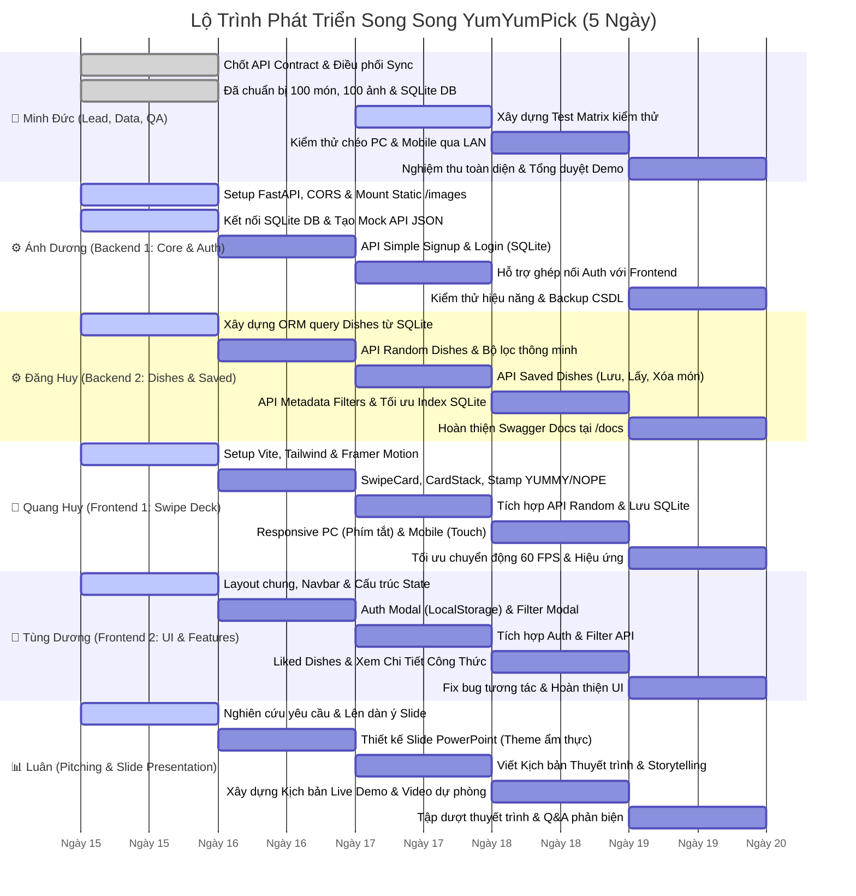

# 📋 06. Lộ Trình Triển Khai 5 Ngày & TODO Chi Tiết Từng Thành Viên

Tài liệu này vạch ra lộ trình phát triển cấp tốc trong **5 Ngày (Crash Sprint)** với phương pháp làm việc song song (Parallel Workstreams), kèm danh sách đầu việc chi tiết từng ngày được chỉ định đích danh cho **6 thành viên** của dự án **YumYumPick**.

---

## 1. Lộ Trình Triển Khai Chi Tiết 5 Ngày (5-Day Gantt Timeline)

---

## 2. Tiêu Chuẩn Nghiệm Thu Công Việc (Definition of Done - DoD)

Mỗi tính năng chỉ được xem là hoàn thành khi đáp ứng đủ các tiêu chí sau:
- [ ] Code chạy cục bộ trơn tru, không có lỗi console báo đỏ hay crash server.
- [ ] Đã kiểm tra hiển thị trên cả 2 chế độ: Màn hình PC (1024px+) và Màn hình Mobile (giả lập 390px trên DevTools).
- [ ] Dữ liệu kết nối đúng với file CSDL SQLite `backend/yumyumpick.db`.
- [ ] Ảnh hiển thị mượt mà từ kho ảnh offline `backend/images/dishes/`.
- [ ] Đã xóa bỏ các đoạn `console.log` và dữ liệu debug thừa.

---

## 3. Bảng TODO Chi Tiết Từng Ngày Cho 6 Thành Viên

---

### 👑 1. Minh Đức — Project Lead, Quản Trị Data & Kiểm Định (QA Lead)

#### Ngày 1: Chốt Kế Hoạch & Đồng Bộ Dữ Liệu
- [x] Soạn thảo toàn bộ hồ sơ kiến trúc, tài liệu đặc tả và phân công vai trò 6 người.
- [x] Khởi tạo và kiểm toán kho dữ liệu **100 món ăn** tại `backend/app/data/dishes_seed.json`.
- [x] Tải và lưu trữ trọn vẹn **100 ảnh offline** tại `backend/images/dishes/<id>.jpg`.
- [x] Khởi tạo file CSDL SQLite chuẩn `backend/yumyumpick.db` (495 nguyên liệu, 300 bước nấu, user test `demo`/`123`).
- [ ] Chủ trì buổi kickoff ngắn, phân phát tài liệu và file CSDL cho Ánh Dương & Đăng Huy.

#### Ngày 2: Điều Phối Sprint & Xây Dựng Test Matrix
- [ ] Điều phối cuộc họp Daily Sync 09:00 (10 phút): Kiểm tra tiến độ setup của FE và BE.
- [ ] Xây dựng bảng kịch bản kiểm thử (Test Matrix) bao gồm 20 ca kiểm thử (Test Cases):
  - Luồng Auth: Đăng ký user mới, đăng nhập đúng/sai, giữ session sau khi F5.
  - Luồng Swipe: Quẹt phải (LIKE) có lưu vào CSDL không, quẹt trái (SKIP) có loại bỏ món không.
  - Luồng Filter: Lọc theo quốc gia (Việt, Hàn, Nhật, Thái, Ý), lọc độ cay, lọc thời gian.
  - Luồng Recipe: Mở danh sách món đã thích, bấm vào xem chi tiết công thức 3 bước và danh sách nguyên liệu.
- [ ] Cung cấp các thông số kỹ thuật và số liệu dữ liệu cho Luân làm Slide PowerPoint.

#### Ngày 3: Giám Sát Tích Hợp API
- [ ] Điều phối Daily Sync 09:00: Đôn đốc việc kết nối giữa Frontend (Quang Huy, Tùng Dương) và Backend (Ánh Dương, Đăng Huy).
- [ ] Kiểm tra kết nối CSDL: Đảm bảo khi Frontend quẹt thẻ thì dữ liệu được ghi nhận chính xác vào bảng `user_saved_dishes` trong `yumyumpick.db`.
- [ ] Tháo gỡ các vướng mắc về định dạng dữ liệu (JSON keys, timestamp, đường dẫn ảnh).

#### Ngày 4: Kiểm Định Chất Lượng Toàn Diện (QA Testing)
- [ ] Thực hiện kiểm thử toàn bộ 20 Test Cases trên trình duyệt máy tính (Chrome, Edge).
- [ ] Mở server LAN, dùng điện thoại thật kết nối vào `http://<IP_LAN>:5173` để test vuốt chạm cảm ứng thực tế.
- [ ] Lập danh sách lỗi phát sinh (Bug Tracker) với mức độ ưu tiên: Critical, Major, Minor.
- [ ] Phân bổ bug về cho các thành viên phụ trách để fix dứt điểm trong ngày.

#### Ngày 5: Nghiệm Thu Sản Phẩm & Tổng Duyệt Demo
- [ ] Chạy lại toàn bộ kịch bản kiểm thử hồi quy (Regression Test) đảm bảo 0 lỗi nghiêm trọng.
- [ ] Nghiệm thu sản phẩm cuối cùng theo đúng tiêu chí Definition of Done.
- [ ] Cùng Luân và toàn đội tổng duyệt kịch bản Live Demo và trả lời câu hỏi phản biện.

---

### ⚙️ 2. Ánh Dương — Backend Engineer 1 (Server Core & Simple Auth)

#### Ngày 1: Setup Dự Án FastAPI & Mount Static Files
- [ ] Tạo môi trường ảo Python (`python -m venv venv`), cài đặt `fastapi`, `uvicorn`, `sqlalchemy`.
- [ ] Cấu hình CORS Middleware cho phép gọi API từ `http://localhost:5173` (Vite dev server).
- [ ] Cấu hình Static Files Mount: `app.mount("/images", StaticFiles(directory="backend/images"), name="images")`.
- [ ] Cung cấp file **Mock API Data JSON** cho Quang Huy & Tùng Dương để đội Frontend làm việc ngay.

#### Ngày 2: Kết Nối CSDL SQLite & Simple Auth API
- [ ] Cấu hình SQLAlchemy kết nối trực tiếp đến file CSDL sẵn có: `sqlite:///./backend/yumyumpick.db`.
- [ ] Xây dựng endpoint `POST /api/v1/auth/signup`:
  - Kiểm tra xem username đã tồn tại trong bảng `users` chưa.
  - Thêm bản ghi mới (id, username, password, full_name).
  - Trả về thông tin `{ id, username, full_name }`.
- [ ] Xây dựng endpoint `POST /api/v1/auth/login`:
  - Kiểm tra username và password khớp với CSDL.
  - Trả về thông tin user nếu đúng; trả về mã `401 Unauthorized` nếu sai.

#### Ngày 3: Hỗ Trợ Tích Hợp Auth & Lưu Session
- [ ] Phối hợp với Tùng Dương ghép nối `AuthModal.jsx` với các API đăng nhập/đăng ký.
- [ ] Kiểm thử việc giữ phiên đăng nhập qua `localStorage` phía client.
- [ ] Viết hàm middleware/helper lấy thông tin user hiện tại từ `user_id`.

#### Ngày 4: Tối Ưu Hóa Hiệu Năng & SQLite Lock Prevention
- [ ] Cấu hình tham số kết nối SQLite an toàn: `check_same_thread=False`, `timeout=15`.
- [ ] Kiểm tra việc phục vụ ảnh tĩnh: Đảm bảo ảnh load nhanh dưới 50ms khi quẹt thẻ.
- [ ] Phối hợp xử lý các bug backend do Minh Đức phát hiện trong ngày kiểm thử.

#### Ngày 5: Đóng Gói Server & Sẵn Sàng Demo
- [ ] Tạo file hướng dẫn chạy Backend 1 lệnh duy nhất: `uvicorn app.main:app --reload --host 0.0.0.0 --port 8000`.
- [ ] Sao lưu file CSDL SQLite sạch để sẵn sàng khôi phục trước giờ Demo.
- [ ] Trực kỹ thuật trong suốt buổi báo cáo Demo.

---

### ⚙️ 3. Đăng Huy — Backend Engineer 2 (Dishes & Saved Recipes API)

#### Ngày 1: Khởi Tạo ORM Models Cho Dishes & Recipes
- [ ] Tạo các SQLAlchemy Models khớp với cấu trúc bảng SQLite:
  - `Dish` (id, name, english_name, cuisine_id, image, cook_time_minutes, spicy_level, calories_approx, short_description, tips).
  - `Ingredient` (id, dish_id, name, amount, unit, category).
  - `CookingStep` (id, dish_id, step_number, title, description).
  - `UserSavedDish` (id, user_id, dish_id, saved_at).
- [ ] Viết hàm query thử nghiệm để kiểm tra việc đọc dữ liệu từ `backend/yumyumpick.db`.

#### Ngày 2: Xây Dựng Dishes Core API & Bộ Lọc
- [ ] Xây dựng endpoint `GET /api/v1/dishes/random`:
  - Lấy ngẫu nhiên các món ăn (sử dụng `ORDER BY RANDOM() LIMIT :limit`).
  - Hỗ trợ tham số lọc: `cuisine` (Việt, Hàn, Nhật, Thái, Ý), `spicy_level` (0-3), `max_cook_time` (phút).
  - Hỗ trợ tham số loại trừ: `exclude_ids` (danh sách ID món người dùng đã quẹt để không lặp lại).
- [ ] Xây dựng endpoint `GET /api/v1/dishes/{dish_id}`:
  - Trả về thông tin chi tiết của món kèm danh sách nguyên liệu và 3 bước nấu ăn.

#### Ngày 3: Xây Dựng Saved Dishes Collection API
- [ ] Xây dựng endpoint `POST /api/v1/saved-dishes`:
  - Lưu cặp `{ user_id, dish_id }` vào bảng `user_saved_dishes` khi người dùng quẹt phải.
- [ ] Xây dựng endpoint `GET /api/v1/saved-dishes/{user_id}`:
  - Lấy danh sách toàn bộ các món đã lưu kèm đầy đủ nguyên liệu và các bước nấu ăn.
- [ ] Xây dựng endpoint `DELETE /api/v1/saved-dishes/{user_id}/{dish_id}`:
  - Bỏ lưu món ăn khỏi bộ sưu tập của người dùng.
- [ ] Xây dựng endpoint `GET /api/v1/filters/metadata`:
  - Trả về danh sách quốc gia (5 nước), các mức độ cay và khoảng thời gian nấu phục vụ vẽ Filter UI.

#### Ngày 4: Hỗ Trợ Ghép Nối API Với Frontend
- [ ] Phối hợp với Quang Huy ghép nối API lấy thẻ ngẫu nhiên và lưu món khi quẹt phải.
- [ ] Phối hợp với Tùng Dương ghép nối API lấy danh sách món đã thích và chi tiết công thức.
- [ ] Xử lý các bug liên quan đến logic lọc và truy vấn do Minh Đức báo cáo.

#### Ngày 5: Kiểm Thử Swagger UI & Hoàn Thiện Tài Liệu API
- [ ] Kiểm tra toàn bộ các endpoint trên Swagger UI (`http://localhost:8000/docs`).
- [ ] Bổ sung mô tả (Docstrings) rõ ràng cho từng API để phục vụ phần thuyết trình kỹ thuật của Luân.
- [ ] Tham gia tổng duyệt Demo.

---

### 🎨 4. Quang Huy — Frontend Engineer 1 (Swipe Deck & Responsive Experience)

#### Ngày 1: Setup Dự Án Vite & Cài Đặt Framer Motion
- [ ] Khởi tạo dự án React bằng Vite: `npm create vite@latest frontend -- --template react`.
- [ ] Cài đặt các thư viện: `framer-motion`, `lucide-react`, `tailwindcss`, `clsx`.
- [ ] Cấu hình Tailwind CSS, định nghĩa bảng màu cam/đỏ ẩm thực.
- [ ] Sử dụng mock data Ngày 1 để bắt đầu dựng thử nghiệm thẻ kéo thả.

#### Ngày 2: Xây Dựng Hiệu Ứng Quẹt Thẻ (Swipe Card Deck)
- [ ] Xây dựng component `SwipeCard.jsx`:
  - Hiển thị trực tiếp trên mặt thẻ: Hình ảnh món lớn sắc nét, tên món (Việt & Anh), huy hiệu thông số và **đoạn mô tả giới thiệu (description intro / `short_description`)** giúp người dùng hiểu rõ món ăn để quyết định quẹt trái hay quẹt phải.
  - Bắt cử chỉ kéo thả chuột (Mouse Drag) và vuốt cảm ứng (Touch Gesture).
  - Góc nghiêng động: $\text{rotate} = \text{dragX} / 15$.
  - Ngưỡng kích hoạt: kéo sang phải $> 120\text{px}$ là LIKE, sang trái $< -120\text{px}$ là SKIP.
  - Hiển thị hiệu ứng Stamp đồ họa: "YUMMY!" (xanh lá) và "NOPE" (đỏ) hiện rõ dần theo độ kéo.
- [ ] Xây dựng component `CardStack.jsx`:
  - Xếp lớp 3 thẻ đồng thời, thẻ dưới tự động trượt lên khi thẻ trên bay đi.
  - Xử lý màn hình hết thẻ (Empty State) với nút bấm "Khám phá lại từ đầu".

#### Ngày 3: Tích Hợp API Dishes & Thao Tác Quẹt Thẻ
- [ ] Kết nối hàm gọi API `GET /api/v1/dishes/random` từ Backend của Đăng Huy (nhận đầy đủ trường `short_description`).
- [ ] Khi quẹt phải (LIKE): Tự động gọi API `POST /api/v1/saved-dishes` để ghi nhận vào CSDL SQLite.
- [ ] Khi quẹt trái (SKIP): Bỏ qua và thêm ID vào danh sách đã xem để không lặp lại.
- [ ] Xây dựng cụm nút điều khiển nổi phía dưới:
  - Nút ❌ Bỏ qua.
  - Nút ❤️ Thích & Lưu.

#### Ngày 4: Bố Cục Responsive Chuẩn PC & Mobile
- [ ] **Tối ưu chế độ Desktop PC:**
  - Khung thẻ quẹt căn giữa màn hình ($420\text{px} \times 600\text{px}$).
  - Bắt sự kiện phím tắt bàn phím:
    - `←` (Mũi tên trái): Bỏ qua.
    - `→` (Mũi tên phải): Thích & Lưu.
- [ ] **Tối ưu chế độ Mobile:**
  - Giao diện tràn viền (100vw), các nút bấm nằm ở vị trí thuận tiện ngón tay cái.
- [ ] Sửa các lỗi giật khung hình (frame drop), đảm bảo hoạt ảnh mượt 60 FPS.

#### Ngày 5: Polish Giao Diện & Hỗ Trợ Demo
- [ ] Bổ sung hiệu ứng âm thanh nhẹ (hoặc rung haptic phản hồi nếu có thể).
- [ ] Cùng Tùng Dương kiểm tra độ đồng bộ giao diện toàn ứng dụng.
- [ ] Tham gia buổi tổng duyệt và điều khiển màn hình quẹt thẻ trong buổi Demo.

---

### 📱 5. Tùng Dương — Frontend Engineer 2 (Modals, Recipes & Liked Dishes)

#### Ngày 1: Xây Dựng Khung Layout & Thanh Điều Hướng (Navbar)
- [ ] Xây dựng Header/Navbar trên cùng:
  - Logo thương hiệu **YumYumPick** (icon nổi bật).
  - Nút Lọc món ăn (mở Filter Modal).
  - Nút Món đã lưu kèm badge đếm số món (mở Saved Dishes).
  - Nút Tài khoản người dùng (mở Auth Modal).
- [ ] Xây dựng state quản lý phiên người dùng từ `localStorage` (key `yumyum_user`).

#### Ngày 2: Xây Dựng Auth Modal & Filter Modal
- [ ] Xây dựng component `AuthModal.jsx`:
  - Tab Đăng Nhập: Input username, password, nút "Đăng Nhập".
  - Tab Đăng Ký: Input username, password, họ tên, nút "Đăng Ký".
  - Kết nối với API của Ánh Dương; lưu thông tin user vào `localStorage`.
  - Hiển thị tên người dùng và nút "Đăng Xuất" khi đã đăng nhập.
- [ ] Xây dựng component `FilterModal.jsx`:
  - Chọn quốc gia: Việt Nam, Hàn Quốc, Nhật Bản, Thái Lan, Ý.
  - Chọn độ cay: 0 (Không cay), 1 (Nhẹ), 2 (Vừa), 3 (Nồng).
  - Chọn thời gian: <20 phút, 20-45 phút, Mọi thời gian.
  - Nút "Áp dụng": Kích hoạt tải lại danh sách thẻ quẹt tương ứng.

#### Ngày 3: Tích Hợp Auth Modal & Filter Modal Với API
- [ ] Ghép nối `AuthModal.jsx` với API của Ánh Dương:
  - Đăng ký tài khoản mới $\rightarrow$ Lưu thông tin `{ user_id, username }` vào `localStorage`.
  - Đăng nhập tài khoản $\rightarrow$ Khôi phục phiên làm việc và hiển thị tên người dùng trên Navbar.
  - Xử lý thông báo lỗi nhẹ nhàng nếu sai mật khẩu hoặc trùng tài khoản.
- [ ] Ghép nối `FilterModal.jsx` với API của Đăng Huy:
  - Truyền các tham số `cuisine`, `spicy_level`, `max_cook_time` vào hàm gọi thẻ quẹt.
  - Kiểm tra xem khi bấm "Áp dụng", bộ thẻ quẹt của Quang Huy có tải đúng món theo bộ lọc không.

#### Ngày 4: Màn Hình Món Đã Thích & Xem Chi Tiết Công Thức
- [ ] Xây dựng component `LikedDishesView.jsx`:
  - Lấy danh sách món đã lưu từ API `GET /api/v1/saved-dishes/{user_id}` của Đăng Huy.
  - Danh sách thẻ món ăn dạng lưới/cuộn đơn giản, hiển thị ảnh nhỏ, tên món, quốc gia, thời gian nấu.
  - Nút biểu tượng thùng rác (🗑️): Bấm vào gọi API `DELETE /api/v1/saved-dishes/{user_id}/{dish_id}` để bỏ thích món.
- [ ] Xây dựng component `DishDetailModal.jsx`:
  - Bấm vào bất kỳ món nào trong danh sách đã thích $\rightarrow$ Mở popup xem chi tiết công thức nấu ăn.
  - Hiển thị ảnh lớn, tên món và đoạn giới thiệu câu chuyện món ăn (`short_description`).
  - **Danh sách nguyên liệu kèm Checkbox tương tác `[ ]`:** Mỗi dòng nguyên liệu có ô checkbox cho phép người dùng click tích chọn đánh dấu nguyên liệu đã mua/đã chuẩn bị trong bếp.
  - Hiển thị 3 bước nấu chi tiết (Sơ chế $\rightarrow$ Nấu $\rightarrow$ Bày biện) và khung mẹo đầu bếp (`tips`).

#### Ngày 5: Kiểm Thử Giao Diện & Tinh Chỉnh Cuối Cùng
- [ ] Kiểm tra các tình huống biên: Danh sách món đã lưu trống, người dùng chưa đăng nhập.
- [ ] Sửa chữa các lỗi vỡ layout hoặc hiển thị không đẹp do Minh Đức báo cáo.
- [ ] Tham gia tổng duyệt Demo.

---

### 📊 6. Luân — Pitching Lead (Slide PowerPoint, Kịch Bản & Demo Story)

#### Ngày 1: Nghiên Cứu Đề Tài & Lên Dàn Ý Bài Báo Cáo
- [ ] Đọc và hiểu toàn bộ ý tưởng sản phẩm, đối tượng người dùng mục tiêu và bài toán cần giải quyết.
- [ ] Lập dàn ý cấu trúc bộ Slide thuyết trình gồm 12 - 15 slide chuẩn học thuật kết hợp thực tiễn:
  1. Slide Bìa & Thành viên nhóm (6 người).
  2. Bối cảnh & Vấn đề nhức nhối: "Hôm nay ăn gì?" và nghịch lý của sự lựa chọn.
  3. Giải pháp YumYumPick: "Tinder cho ẩm thực".
  4. Trải nghiệm người dùng: Cơ chế quẹt thẻ trực giác & Responsive PC/Mobile.
  5. Bộ tính năng tinh gọn: Quẹt thẻ Tinder, Bộ lọc sơ bộ & Xem công thức chi tiết.
  6. Kiến trúc hệ thống: Client-Server độc lập, CSDL SQLite cục bộ, 100% Offline.
  7. Dữ liệu chuẩn bị: 100 món ăn 5 quốc gia, 100 ảnh offline, 495 nguyên liệu.
  8. Lộ trình triển khai 5 ngày & Phân công vai trò RACI.
  9. Trình diễn sản phẩm trực tiếp (Live Demo).
  10. Bài học kinh nghiệm & Tiềm năng phát triển.
  11. Lời cảm ơn & Phiên hỏi đáp (Q&A).

#### Ngày 2: Thiết Kế Slide PowerPoint Chuyên Nghiệp
- [ ] Lựa chọn mẫu thiết kế (Template) hiện đại với gam màu ẩm thực ấm áp (Cam, Đỏ, Trắng kem).
- [ ] Thiết kế các slide từ 1 đến 5: Đưa hình ảnh món ăn thực tế từ kho ảnh của Minh Đức vào slide để tạo sự hấp dẫn thị giác.
- [ ] Tạo các sơ đồ trực quan (Icons, Infographics) mô tả cơ chế quẹt thẻ trái/phải.

#### Ngày 3: Hoàn Thiện Slide Kiến Trúc Kỹ Thuật & Dữ Liệu
- [ ] Thiết kế các slide từ 6 đến 10:
  - Minh họa kiến trúc FastAPI + SQLite gọn nhẹ, chạy 100% Offline.
  - Bảng thống kê kho dữ liệu: 100 món, 495 nguyên liệu, 300 bước nấu ăn.
  - Bảng phân công vai trò 6 người rõ ràng, minh bạch.
- [ ] Lấy ảnh chụp giao diện thực tế (Screenshots) từ Quang Huy & Tùng Dương đưa vào slide.

#### Ngày 4: Soạn Kịch Bản Thuyết Trình & Chuẩn Bị Live Demo
- [ ] Soạn tài liệu **Kịch Bản Thuyết Trình Chi Tiết (Word/PDF)** chia thời lượng từng phần (Tổng thời gian trình bày: 10 - 12 phút).
- [ ] Xây dựng cốt truyện thuyết trình (Storytelling) lôi cuốn, tự nhiên, không đọc máy móc:
  - Mở đầu bằng tình huống đời thường gần gũi.
  - Dẫn dắt người nghe trải nghiệm tính năng quẹt thẻ.
- [ ] Lập kịch bản Live Demo chi tiết từng bước: Ai bấm gì, màn hình chiếu gì, nói câu gì.
- [ ] Phối hợp với Minh Đức quay 1 video màn hình dự phòng (Backup Demo Video phòng khi máy chiếu/mạng gặp sự cố).

#### Ngày 5: Tổng Duyệt & Chuẩn Bị Phản Biện (Q&A Cheat Sheet)
- [ ] Soạn bộ câu hỏi phản biện tiềm năng của hội đồng/giảng viên và câu trả lời gợi ý:
  - *Tại sao chọn SQLite thay vì PostgreSQL/MySQL?* (Gọn nhẹ, không cần setup server rườm rà, phù hợp ứng dụng cá nhân/gia đình, chạy offline mượt mà).
  - *Làm sao xử lý khi có hàng ngàn món ăn?* (Đã đánh Index trên trường `cuisine_id`, `cook_time_minutes`, dễ dàng mở rộng).
  - *Tại sao ứng dụng lại tối giản không thêm nhiều tính năng phụ?* (Tập trung tối đa vào trải nghiệm quẹt thẻ mượt mà, giải quyết dứt điểm nỗi đau "Hôm nay ăn gì?" trong 30 giây thay vì làm người dùng phân tâm).
- [ ] Cùng cả nhóm chạy thử nghiệm thuyết trình và Live Demo 2 lần trước giờ G.
- [ ] Tự tin đại diện nhóm tỏa sáng trong buổi báo cáo đồ án!
