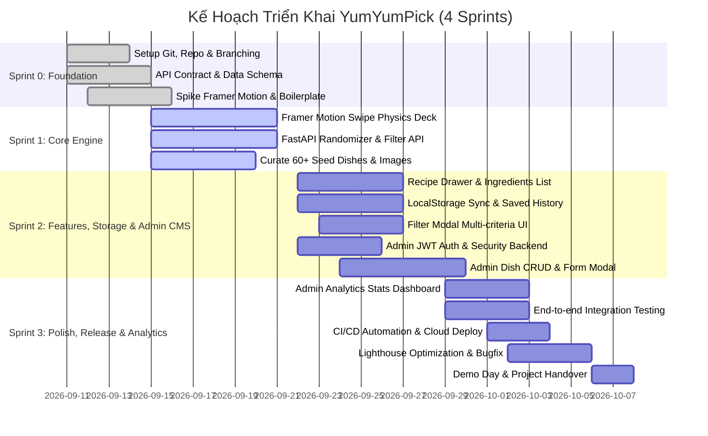

# 📋 06. Sprint Roadmap & Role-Based Actionable TODOs

Tài liệu này vạch ra lộ trình phát triển theo phương pháp Agile/Scrum qua 4 Sprint (tương ứng 4 tuần), kèm danh sách đầu việc (TODO Checklist) chi tiết và có thể tích chọn (checkbox) cho từng thành viên trong số 6 kỹ sư của dự án **YumYumPick**.

---

## 1. Lộ Trình Phát Triển 4 Sprints (Sprint Timeline)

---

## 2. Tiêu Chuẩn Nghiệm Thu Công Việc (DoR & DoD)

### 2.1. Definition of Ready (DoR - Điều kiện để BẮT ĐẦU làm Task)
- [ ] Task có mô tả rõ ràng: Người dùng muốn làm gì và kết quả mong muốn là gì.
- [ ] Đã có giao diện phác thảo (Wireframe) hoặc API Contract (định dạng JSON).
- [ ] Không bị phụ thuộc (block) bởi một task chưa hoàn thành khác.

### 2.2. Definition of Done (DoD - Điều kiện để ĐÓNG Task)
- [ ] Code chạy ổn định trên máy cá nhân, không có lỗi runtime hoặc crash.
- [ ] Đã qua định dạng code (Prettier/Black), xóa sạch `console.log` và debug thừa.
- [ ] Đã test giao diện trên ít nhất 2 kích thước màn hình: Mobile (390px) và Laptop (1440px).
- [ ] Đã tạo Pull Request, có ít nhất 1 phê duyệt (Approved) từ đồng đội.
- [ ] Đã merge thành công vào nhánh `develop` mà không làm hỏng build.

---

## 3. Bảng TODO Chi Tiết Cho Từng Thành Viên (Actionable Checklists)

### 👑 Member 1: Tech Lead & Fullstack Coordinator
- [ ] **Khởi tạo & Cấu hình Repo:**
  - [ ] Tạo repository GitHub, khởi tạo nhánh `main` và `develop`.
  - [ ] Thiết lập file `.gitignore`, README và bộ tài liệu trong thư mục `docs/`.
  - [ ] Thiết lập Branch Protection Rules trên GitHub (cấm force push, yêu cầu 1 review trước khi merge).
- [ ] **Kiến trúc & Tiêu chuẩn:**
  - [ ] Khóa đặc tả API Contract với Member 4 (Backend Lead).
  - [ ] Tổ chức cuộc họp Kick-off phân chia task đầu tuần.
  - [ ] Điều phối Daily Standup (10 phút mỗi ngày lúc 9:00 AM).
- [ ] **Code Review & Tích hợp:**
  - [ ] Review toàn bộ các Pull Request lớn kết nối giữa Frontend và Backend.
  - [ ] Hỗ trợ đồng đội xử lý Merge Conflicts phức tạp nếu phát sinh.
  - [ ] Chuẩn bị kịch bản Demo Day cho buổi báo cáo cuối kỳ.

---

### 🎨 Member 2: Frontend Lead (Swipe UI & Framer Motion)
- [ ] **Khởi tạo Dự Án Frontend:**
  - [ ] Khởi tạo dự án bằng Vite (`npm create vite@latest frontend -- --template react`).
  - [ ] Cấu hình Tailwind CSS, cài đặt các thư viện `framer-motion`, `lucide-react`, `clsx`, `tailwind-merge`.
- [ ] **Phát triển Cơ Chế Quẹt Thẻ (Core Swipe Deck):**
  - [ ] Xây dựng component `SwipeCard.jsx` với motion drag của Framer Motion.
  - [ ] Viết công thức vật lý tính toán góc xoay thẻ (`rotate = dragX / 15`) và độ đàn hồi (`spring`).
  - [ ] Thiết lập ngưỡng quẹt: Quẹt sang phải $> 120\text{px}$ là LIKE, sang trái $< -120\text{px}$ là SKIP.
  - [ ] Hiển thị stamp đồ họa nổi: Stamp xanh "YUMMY!" khi kéo sang phải, Stamp đỏ "NOPE" khi kéo sang trái.
- [ ] **Cơ Chế Nhấp Thẻ Xem Giới Thiệu (Tap on Card Gesture):**
  - [ ] Tách biệt cử chỉ Tap và Drag trong Framer Motion (khoảng cách kéo $< 5\text{px}$ nhận diện là Tap).
  - [ ] Khi tap thẻ: Kích hoạt mở ngay `DishIntroDrawer.jsx` hiển thị giới thiệu món, xuất xứ, calo, thời gian nấu và tóm tắt nguyên liệu.
- [ ] **Component Ngăn Xếp Thẻ (CardStack):**
  - [ ] Xây dựng component `CardStack.jsx` xếp tầng 3 thẻ liên tiếp (Top, Middle, Bottom).
  - [ ] Tối ưu hiệu ứng thẻ số 2 tự động phóng to khi thẻ số 1 bị quẹt bay ra khỏi màn hình.
  - [ ] Xử lý màn hình "Hết thẻ" (Empty State) kèm nút "Quẹt lại" và icon hoạt hình.
- [ ] **Thanh Điều Hướng & Cụm Nút Thao Tác (Action Buttons):**
  - [ ] Xây dựng cụm nút: Nút Hoàn tác (Undo), Nút Bỏ qua (X), Nút Giới thiệu (Info), Nút Chọn món (Heart).
  - [ ] Bắt sự kiện bàn phím trên máy tính (Phím $\leftarrow$ để Skip, $\rightarrow$ để Like, Space để mở giới thiệu).

---

### 📱 Member 3: Frontend Dev (Filter, History & LocalStorage)
- [ ] **Quản Trị Lưu Trữ Trình Duyệt (LocalStorage Integration):**
  - [ ] Viết Custom Hook `useLocalStorage.js` để đọc/ghi dữ liệu an toàn, xử lý ngoại lệ khi bộ nhớ đầy.
  - [ ] **Lưu công thức chi tiết:** Lưu toàn bộ thông tin món ăn (bao gồm cả danh sách `ingredients`, `steps`, `tips`) vào key `YYP_SAVED_DISHES` ngay khi quẹt phải để phục vụ xem lại chi tiết sau này.
  - [ ] Lưu lịch sử các ID đã quẹt vào `YYP_SWIPE_HISTORY` để phục vụ nút Hoàn tác (Undo).
- [ ] **Modal Bộ Lọc Nâng Cao (Filter Modal):**
  - [ ] Xây dựng component `FilterModal.jsx` dạng popup hoặc bottom sheet.
  - [ ] Các chip chọn quốc gia: Việt Nam, Nhật Bản, Hàn Quốc, Thái Lan, Ý...
  - [ ] Bộ chọn thời gian nấu: Dưới 20 phút, 20-45 phút, Mọi thời gian.
  - [ ] Nút "Áp dụng" gọi lại hàm tải thẻ mới theo tiêu chí lọc.
- [ ] **Giới Thiệu Món Ăn (Dish Intro Drawer):**
  - [ ] Xây dựng component `DishIntroDrawer.jsx` (Bottom sheet vuốt mở khi tap vào thẻ).
  - [ ] Hiển thị hình ảnh, câu chuyện món ăn (`short_description`), meta calo, độ cay, thời gian và tóm tắt nguyên liệu.
  - [ ] Có nút chuyển đổi trực tiếp: "Chọn món này ❤️" (lưu vào LocalStorage) hoặc "Bỏ qua ❌".
- [ ] **Bộ Sưu Tập Món Đã Lưu & Xem Chi Tiết Công Thức Đầy Đủ:**
  - [ ] Xây dựng component `SavedDishesModal.jsx`: Hiển thị danh sách các món đã quẹt phải kèm ảnh, cờ quốc gia, thời gian nấu.
  - [ ] Xây dựng component `FullRecipeView.jsx`: Hiển thị chi tiết công thức khi người dùng bấm vào một món đã lưu:
    - [ ] Danh sách nguyên liệu kèm checkbox tương tác để đánh dấu khi đi chợ hoặc kiểm tra tủ lạnh.
    - [ ] Hướng dẫn từng bước nấu (Step 1, 2, 3...) có thời gian và nhiệt lượng chi tiết.
    - [ ] Mẹo vặt từ đầu bếp (`tips`).
    - [ ] Nút "Đã nấu xong" và nút "Bỏ lưu".
  - [ ] **Tính năng thông minh:** Nút "Xuất Danh Sách Đi Chợ" (Smart Grocery List) tự động tổng hợp nguyên liệu của các món đã lưu và có nút sao chép (Copy to Clipboard) gửi qua Zalo / Messenger.
- [ ] **Phát triển Cổng Quản Trị Admin / CMS (`/admin`):**
  - [ ] Màn hình Đăng nhập Quản trị (`AdminLogin.jsx`): Form đăng nhập, xử lý lưu JWT token an toàn, hiển thị lỗi khi sai credentials.
  - [ ] Khung Layout Quản trị (`AdminLayout.jsx`): Sidebar điều hướng, Header hiển thị thông tin Admin hiện tại, nút Đăng xuất.
  - [ ] Dashboard Thống kê (`AdminDashboard.jsx`): 4 thẻ KPI (Tổng món, Lượt quẹt, Lượt like, Lượt skip), bảng xếp hạng Top 5 món được thích nhất & bị bỏ qua nhiều nhất.
  - [ ] Quản lý Món ăn (`AdminDishes.jsx`): Bảng danh sách món ăn kèm bộ lọc theo quốc gia, thanh tìm kiếm live-search, phân trang, nút Thêm món mới, Sửa và Xóa.
  - [ ] Modal Soạn thảo Món ăn Đa Tab (`DishFormModal.jsx`):
    - Tab 1: Nhập thông tin tổng quan, thời gian nấu, mức độ cay, calo, link ảnh và preview.
    - Tab 2: Quản lý danh sách nguyên liệu động (thêm/xóa dòng, định lượng, đơn vị, nhóm nguyên liệu).
    - Tab 3: Quản lý các bước nấu động (thêm/xóa bước, thứ tự, tiêu đề, mô tả).
    - Tab 4: Gắn thẻ (Tags multi-select).
  - [ ] Viết module `src/services/adminApi.js` đóng gói các hàm gọi API Admin đính kèm Header `Authorization: Bearer <token>`.
- [ ] **Kết Nối API Backend:**
  - [ ] Viết module `src/services/api.js` sử dụng `fetch` hoặc `axios` gọi đến FastAPI server.
  - [ ] Xử lý trạng thái Loading (Skeleton loader khi đang tải thẻ) và trạng thái Error khi mất mạng.

---

### ⚙️ Member 4: Backend Lead (FastAPI, Database ORM, Auth & Admin APIs)
- [ ] **Khởi tạo Kiến Trúc FastAPI & Database Connection:**
  - [ ] Khởi tạo môi trường ảo Python (`venv`), cập nhật `requirements.txt` (`fastapi`, `uvicorn`, `sqlalchemy>=2.0`, `psycopg2-binary`, `pydantic>=2.0`, `supabase`, `pyjwt`, `passlib[bcrypt]`).
  - [ ] Cấu hình thư mục phân tầng: `app/api/v1`, `app/db`, `app/models`, `app/services`, `app/core`.
  - [ ] Module kết nối CSDL `app/db/session.py`: Cấu hình SQLAlchemy Engine, SessionLocal và dependency `get_db` kết nối Supabase PostgreSQL.
  - [ ] Cấu hình CORS Middleware (`CORSMiddleware`) cho phép Frontend gọi an toàn từ localhost và Vercel.
- [ ] **Hệ Thống Bảo Mật & Xác Thực Quản Trị (Admin Auth & Security):**
  - [ ] Xây dựng `app/core/security.py`:
    - [ ] Hàm băm mật khẩu `get_password_hash(password)` bằng Bcrypt.
    - [ ] Hàm xác thực mật khẩu `verify_password(plain, hashed)`.
    - [ ] Hàm sinh JSON Web Token `create_access_token(data, expires_delta)`.
    - [ ] Dependency `get_current_admin`: Giải mã JWT từ Header `Authorization: Bearer <token>`, tra cứu tài khoản trong DB, chặn 401 nếu token không hợp lệ hoặc hết hạn.
  - [ ] Endpoint `POST /api/v1/admin/auth/login`: Xác thực tài khoản admin, trả về access token và thông tin người dùng.
- [ ] **Xây Dựng Data Models (Pydantic & SQLAlchemy ORM):**
  - [ ] Xây dựng ORM models (`app/models/orm_models.py`): `Dish`, `Ingredient`, `CookingStep`, `Tag`, `Cuisine`, `UserSavedDish`, `UserSwipe`, `AdminUser`, `AdminAuditLog`.
  - [ ] Xây dựng Pydantic schemas:
    - [ ] `app/models/dish.py`: Validation món ăn phía User.
    - [ ] `app/models/admin.py`: `AdminLoginRequest`, `TokenResponse`, `DishCreateRequest`, `DishUpdateRequest`, `StatsOverviewResponse`.
- [ ] **Hệ Thống API Quản Trị CMS (Admin CRUD & Stats):**
  - [ ] `GET /api/v1/admin/dishes`: Phân trang, tìm kiếm theo tên món, lọc theo quốc gia.
  - [ ] `POST /api/v1/admin/dishes`: Thêm món ăn mới kèm toàn bộ nguyên liệu, bước nấu và tags trong cùng một Database transaction.
  - [ ] `PUT /api/v1/admin/dishes/{dish_id}`: Cập nhật thông tin chi tiết món ăn và công thức.
  - [ ] `DELETE /api/v1/admin/dishes/{dish_id}`: Xóa món ăn khỏi hệ thống (cascade xóa nguyên liệu & bước nấu).
  - [ ] `GET /api/v1/admin/stats/overview`: Thống kê tổng số món, tổng lượt quẹt, tỷ lệ like, top 5 món yêu thích nhất và top món bị bỏ qua.
- [ ] **Thuật Toán Gợi Ý & Truy Vấn Supabase Cho Người Dùng:**
  - [ ] Viết hàm truy vấn ngẫu nhiên món ăn từ Supabase PostgreSQL tối ưu thời gian phản hồi $< 100\text{ms}$.
  - [ ] Xử lý tham số `exclude_ids` để loại trừ các món vừa xem trong session.
  - [ ] Truy vấn lọc kết hợp nhiều điều kiện (Cuisine, spicy_level, max_time) sử dụng Index trên PostgreSQL.
- [ ] **Triển Khai Các Endpoints RESTful Người Dùng:**
  - [ ] `GET /api/v1/health` (Kiểm tra trạng thái server & kết nối CSDL Supabase).
  - [ ] `GET /api/v1/dishes/random` (Lấy thẻ ngẫu nhiên có bộ lọc).
  - [ ] `GET /api/v1/dishes/{dish_id}` (Lấy chi tiết công thức 1 món kèm nguyên liệu & các bước nấu).
  - [ ] `GET /api/v1/filters/metadata` (Lấy danh mục cờ quốc gia, nhãn bộ lọc từ bảng `cuisines`).
  - [ ] `POST /api/v1/dishes/batch` (Lấy thông tin nhiều món từ mảng ID).
- [ ] **Tài Liệu Hóa API:**
  - [ ] Tự động sinh Swagger UI tại `/docs` phân tách rõ 2 nhóm tags: `Users` và `Admin / CMS`.

---

### 🍱 Member 5: Data Engineer & Content Specialist (Supabase Schema, Admin Tables & Content)
- [ ] **Thiết Kế & Khởi Tạo Cơ Sở Dữ Liệu Supabase (Full System Schema):**
  - [ ] Thiết kế sơ đồ thực thể liên kết (Full ERD): các bảng `cuisines`, `dishes`, `ingredients`, `cooking_steps`, `tags`, `dish_tags`, `user_saved_dishes`, `user_swipes`, `admin_users`, `admin_audit_logs`.
  - [ ] Viết file kịch bản SQL DDL (`app/db/schema.sql`) cho Supabase SQL Editor: kiểu dữ liệu, khóa ngoại `ON DELETE CASCADE`, chỉ mục tìm kiếm và tài khoản admin mặc định.
- [ ] **Nghiên Cứu & Thu Thập Dữ Liệu Ẩm Thực:**
  - [ ] Lập danh sách **tối thiểu 60 món ăn** quen thuộc thuộc 5 nhóm văn hóa:
    - 20 món Việt Nam (Phở bò, Bún chả, Bánh mì chảo, Cơm sườn, Gỏi cuốn...).
    - 10 món Hàn Quốc (Cơm trộn Bibimbap, Canh kim chi, Gà sốt cay...).
    - 10 món Nhật Bản (Mì Udon, Cơm cà ri, Trứng cuộn Tamagoyaki...).
    - 10 món Thái Lan (Pad Thai, Canh Tom Yum, Heo xào Pad Krapow...).
    - 10 món Âu / Ý (Mì Ý Carbonara, Bolognese, Pizza, Steak...).
- [ ] **Biên Tập Nội Dung Công Thức:**
  - [ ] Viết danh sách nguyên liệu cụ thể có định lượng.
  - [ ] Viết 3-5 bước thực hiện ngắn gọn, dễ hiểu.
  - [ ] Thêm mẹo vặt nấu nướng (Tips) cho từng món.
- [ ] **Thu Thập & Tối Ưu Hình Ảnh:**
  - [ ] Tìm hình ảnh món ăn độ phân giải cao từ Unsplash, Pexels.
  - [ ] Nén ảnh sang định dạng WebP (dưới 150KB/ảnh).
- [ ] **Tự Động Hóa Nạp Dữ Liệu Vào Supabase (Seeding Automation):**
  - [ ] Đóng gói toàn bộ dữ liệu vào file `backend/app/data/dishes_seed.json`.
  - [ ] Viết script Python `app/db/seed_supabase.py` tự động import toàn bộ bản ghi JSON vào Supabase PostgreSQL và tự động tạo tài khoản quản trị mặc định (`admin` / `AdminSecurePassword2026!`).
  - [ ] Kiểm tra tính toàn vẹn dữ liệu: không có món nào bị thiếu thông tin bắt buộc.

---

### 🚀 Member 6: DevOps & QA Engineer (Cloud Infrastructure, Security Config & Testing)
- [ ] **Thiết Lập Cơ Sở Dữ Liệu Supabase:**
  - [ ] Khởi tạo project Supabase (khu vực Singapore để ping thấp).
  - [ ] Lấy chuỗi kết nối PostgreSQL (`DATABASE_URL`) và API keys (`SUPABASE_URL`, `SUPABASE_ANON_KEY`).
  - [ ] Chạy script DDL tạo bảng trên Supabase SQL Editor và thực thi script seed data ban đầu.
- [ ] **Cấu Hình Tự Động Hóa CI/CD:**
  - [ ] Tạo workflow GitHub Actions tự động chạy linter (ESLint, Flake8) khi có PR mới.
  - [ ] Kết nối repository với **Vercel** để cấp phát URL xem trước (Preview Deployment) cho mỗi Pull Request.
- [ ] **Triển Khai Hệ Thống 3 Tầng Trực Tuyến:**
  - [ ] Deploy Frontend lên **Vercel** (React SPA + CDN).
  - [ ] Deploy Backend FastAPI lên **Render** (Web Service).
  - [ ] Cấu hình biến môi trường:
    - Frontend: `VITE_API_BASE_URL` trỏ về Render API.
    - Backend: `DATABASE_URL` trỏ về Supabase PostgreSQL, `ALLOWED_ORIGINS` cho phép Vercel, `JWT_SECRET_KEY`, `JWT_ALGORITHM=HS256`, `ACCESS_TOKEN_EXPIRE_MINUTES=1440`.
- [ ] **Xây Dựng Tài Liệu Kiểm Thử Postman:**
  - [ ] Tạo Postman Collection kiểm thử toàn bộ các API endpoints:
    - Nhóm User API (Health, Random, Detail, Filter metadata).
    - Nhóm Admin Auth API (Login thành công, login sai pass 401).
    - Nhóm Admin CRUD API (Bearer Token, Create Dish, Update Dish, Delete Dish, Overview Stats).
  - [ ] Xuất file `postman_collection.json` đặt trong thư mục `docs/`.
- [ ] **Kiểm Thử Toàn Diện (QA Testing Matrix):**
  - [ ] Kiểm thử độ trễ truy vấn dữ liệu từ Supabase ($< 200\text{ms}$).
  - [ ] Kiểm thử bảo mật: Gọi API Admin khi không có Header hoặc Token hết hạn phải trả về `401 Unauthorized`.
  - [ ] Kiểm thử độ mượt mà của cử chỉ quẹt thẻ trên nhiều trình duyệt: Chrome, Safari iOS, Edge.
  - [ ] Kiểm thử các tình huống biên: Quẹt nhanh 20 thẻ, mất kết nối mạng, cache LocalStorage.
  - [ ] Chạy kiểm toán Google Lighthouse: Tối ưu điểm Performance $\ge 90$, Accessibility $\ge 95$.
