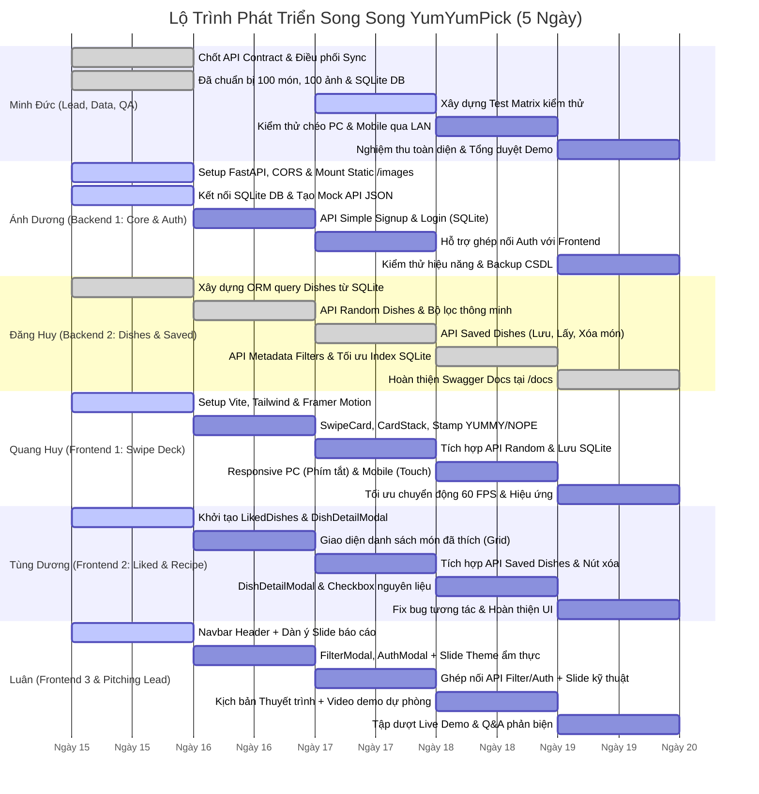

# 06. Lộ Trình Triển Khai 5 Ngày & TODO Chi Tiết Từng Thành Viên

Tài liệu này vạch ra lộ trình phát triển cấp tốc trong **5 Ngày (Crash Sprint)** với phương pháp làm việc song song (Parallel Workstreams), kèm danh sách đầu việc chi tiết từng ngày được chỉ định đích danh cho **6 thành viên** của dự án **YumYumPick**.

---

## 1. Lộ Trình Triển Khai Chi Tiết 5 Ngày (5-Day Gantt Timeline)

---

## 2. Tiêu Chuẩn Nghiệm Thu Công Việc (Definition of Done - DoD)

Mỗi tính năng chỉ được xem là hoàn thành khi đáp ứng đủ các tiêu chí sau:
- [ ] Code chạy cục bộ trơn tru, không có lỗi console báo đỏ hay crash server.
- [ ] Đã kiểm tra hiển thị trên cả 2 chế độ: Màn hình PC (1024px+) và Màn hình Mobile (giả lập 390px trên DevTools).
- [ ] Dữ liệu kết nối đúng với file CSDL SQLite `backend/yumyumpick.db`.
- [ ] Ảnh hiển thị mượt mà từ kho ảnh offline `backend/images/dishes/`.
- [ ] Đã xóa bỏ các đoạn `console.log` và dữ liệu debug thừa.

---

## 3. Bảng TODO Chi Tiết Từng Ngày Cho 6 Thành Viên

---

### 1. Minh Đức — Project Lead, Quản Trị Data & Kiểm Định (QA Lead)

#### Ngày 1: Chốt Kế Hoạch & Đồng Bộ Dữ Liệu
- [x] Soạn thảo toàn bộ hồ sơ kiến trúc, tài liệu đặc tả và phân công vai trò 6 người.
- [x] Khởi tạo và kiểm toán kho dữ liệu **100 món ăn** tại `backend/app/data/dishes_seed.json`.
- [x] Tải và lưu trữ trọn vẹn **100 ảnh offline** tại `backend/images/dishes/<id>.jpg`.
- [x] Khởi tạo file CSDL SQLite chuẩn `backend/yumyumpick.db` (495 nguyên liệu, 300 bước nấu, user test `demo`/`123`).
- [ ] Chủ trì buổi kickoff ngắn, phân phát tài liệu và file CSDL cho Ánh Dương & Đăng Huy.

#### Ngày 2: Điều Phối Sprint & Xây Dựng Test Matrix
- [ ] Điều phối cuộc họp Daily Sync 09:00 (10 phút): Kiểm tra tiến độ setup của FE và BE.
- [ ] Xây dựng bảng kịch bản kiểm thử (Test Matrix) bao gồm 20 ca kiểm thử (Test Cases):
  - Luồng Auth: Đăng ký user mới, đăng nhập đúng/sai, giữ session sau khi F5.
  - Luồng Swipe: Quẹt phải (LIKE) có lưu vào CSDL không, quẹt trái (SKIP) có loại bỏ món không.
  - Luồng Filter: Lọc theo quốc gia (Việt, Hàn, Nhật, Thái, Ý), lọc độ cay, lọc thời gian.
  - Luồng Recipe: Mở danh sách món đã thích, bấm vào xem chi tiết công thức 3 bước và danh sách nguyên liệu.
- [ ] Cung cấp các thông số kỹ thuật và số liệu dữ liệu cho Luân làm Slide PowerPoint.

#### Ngày 3: Giám Sát Tích Hợp API
- [ ] Điều phối Daily Sync 09:00: Đôn đốc việc kết nối giữa Frontend (Quang Huy, Tùng Dương) và Backend (Ánh Dương, Đăng Huy).
- [ ] Kiểm tra kết nối CSDL: Đảm bảo khi Frontend quẹt thẻ thì dữ liệu được ghi nhận chính xác vào bảng `user_saved_dishes` trong `yumyumpick.db`.
- [ ] Tháo gỡ các vướng mắc về định dạng dữ liệu (JSON keys, timestamp, đường dẫn ảnh).

#### Ngày 4: Kiểm Định Chất Lượng Toàn Diện (QA Testing)
- [ ] Thực hiện kiểm thử toàn bộ 20 Test Cases trên trình duyệt máy tính (Chrome, Edge).
- [ ] Mở server LAN, dùng điện thoại thật kết nối vào `http://<IP_LAN>:5173` để test vuốt chạm cảm ứng thực tế.
- [ ] Lập danh sách lỗi phát sinh (Bug Tracker) với mức độ ưu tiên: Critical, Major, Minor.
- [ ] Phân bổ bug về cho các thành viên phụ trách để fix dứt điểm trong ngày.

#### Ngày 5: Nghiệm Thu Sản Phẩm & Tổng Duyệt Demo
- [ ] Chạy lại toàn bộ kịch bản kiểm thử hồi quy (Regression Test) đảm bảo 0 lỗi nghiêm trọng.
- [ ] Nghiệm thu sản phẩm cuối cùng theo đúng tiêu chí Definition of Done.
- [ ] Cùng Luân và toàn đội tổng duyệt kịch bản Live Demo và trả lời câu hỏi phản biện.

---

### 2. Ánh Dương — Backend Engineer 1 (Server Core & Simple Auth)

#### Ngày 1: Setup Dự Án FastAPI & Mount Static Files
- [ ] Tạo môi trường ảo Python (`python -m venv venv`), cài đặt `fastapi`, `uvicorn`, `sqlalchemy`.
- [ ] Cấu hình CORS Middleware cho phép gọi API từ `http://localhost:5173` (Vite dev server).
- [ ] Cấu hình Static Files Mount: `app.mount("/images", StaticFiles(directory="backend/images"), name="images")`.
- [ ] Cung cấp file **Mock API Data JSON** cho Quang Huy & Tùng Dương để đội Frontend làm việc ngay.

#### Ngày 2: Kết Nối CSDL SQLite & Simple Auth API
- [ ] Cấu hình SQLAlchemy kết nối trực tiếp đến file CSDL sẵn có: `sqlite:///./backend/yumyumpick.db`.
- [ ] Xây dựng endpoint `POST /api/v1/auth/signup`:
  - Kiểm tra xem username đã tồn tại trong bảng `users` chưa.
  - Thêm bản ghi mới (id, username, password, full_name).
  - Trả về thông tin `{ id, username, full_name }`.
- [ ] Xây dựng endpoint `POST /api/v1/auth/login`:
  - Kiểm tra username và password khớp với CSDL.
  - Trả về thông tin user nếu đúng; trả về mã `401 Unauthorized` nếu sai.

#### Ngày 3: Hỗ Trợ Tích Hợp Auth & Lưu Session
- [ ] Phối hợp với Tùng Dương ghép nối `AuthModal.jsx` với các API đăng nhập/đăng ký.
- [ ] Kiểm thử việc giữ phiên đăng nhập qua `localStorage` phía client.
- [ ] Viết hàm middleware/helper lấy thông tin user hiện tại từ `user_id`.

#### Ngày 4: Tối Ưu Hóa Hiệu Năng & SQLite Lock Prevention
- [ ] Cấu hình tham số kết nối SQLite an toàn: `check_same_thread=False`, `timeout=15`.
- [ ] Kiểm tra việc phục vụ ảnh tĩnh: Đảm bảo ảnh load nhanh dưới 50ms khi quẹt thẻ.
- [ ] Phối hợp xử lý các bug backend do Minh Đức phát hiện trong ngày kiểm thử.

#### Ngày 5: Đóng Gói Server & Sẵn Sàng Demo
- [ ] Tạo file hướng dẫn chạy Backend 1 lệnh duy nhất: `uvicorn app.main:app --reload --host 0.0.0.0 --port 8000`.
- [ ] Sao lưu file CSDL SQLite sạch để sẵn sàng khôi phục trước giờ Demo.
- [ ] Trực kỹ thuật trong suốt buổi báo cáo Demo.

---

### 3. Đăng Huy — Backend Engineer 2 (Dishes & Saved Recipes API)

#### Ngày 1: Khởi Tạo ORM Models Cho Dishes & Recipes
- [x] Tạo các SQLAlchemy Models khớp với cấu trúc bảng SQLite:
  - `Dish` (id, name, english_name, cuisine_id, image, cook_time_minutes, spicy_level, calories_approx, short_description, tips).
  - `Ingredient` (id, dish_id, name, amount, unit, category).
  - `CookingStep` (id, dish_id, step_number, title, description).
  - `UserSavedDish` (id, user_id, dish_id, saved_at).
- [x] Viết hàm query thử nghiệm để kiểm tra việc đọc dữ liệu từ `backend/yumyumpick.db`.

#### Ngày 2: Xây Dựng Dishes Core API & Bộ Lọc
- [x] Xây dựng endpoint `GET /api/v1/dishes/random`:
  - Lấy ngẫu nhiên các món ăn (sử dụng `ORDER BY RANDOM() LIMIT :limit`).
  - Hỗ trợ tham số lọc: `cuisine` (Việt, Hàn, Nhật, Thái, Ý), `spicy_level` (0-3), `max_cook_time` (phút).
  - Hỗ trợ tham số loại trừ: `exclude_ids` (danh sách ID món người dùng đã quẹt để không lặp lại).
- [x] Xây dựng endpoint `GET /api/v1/dishes/{dish_id}`:
  - Trả về thông tin chi tiết của món kèm danh sách nguyên liệu và 3 bước nấu ăn.

#### Ngày 3: Xây Dựng Saved Dishes Collection API
- [x] Xây dựng endpoint `POST /api/v1/saved-dishes`:
  - Lưu cặp `{ user_id, dish_id }` vào bảng `user_saved_dishes` khi người dùng quẹt phải.
- [x] Xây dựng endpoint `GET /api/v1/saved-dishes/{user_id}`:
  - Lấy danh sách toàn bộ các món đã lưu kèm đầy đủ nguyên liệu và các bước nấu ăn.
- [x] Xây dựng endpoint `DELETE /api/v1/saved-dishes/{user_id}/{dish_id}`:
  - Bỏ lưu món ăn khỏi bộ sưu tập của người dùng.
- [x] Xây dựng endpoint `GET /api/v1/filters/metadata`:
  - Trả về danh sách quốc gia (5 nước), các mức độ cay và khoảng thời gian nấu phục vụ vẽ Filter UI.

#### Ngày 4: Hỗ Trợ Ghép Nối API Với Frontend
- [x] Phối hợp với Quang Huy ghép nối API lấy thẻ ngẫu nhiên và lưu món khi quẹt phải.
- [x] Phối hợp với Tùng Dương ghép nối API lấy danh sách món đã thích và chi tiết công thức.
- [x] Xử lý các bug liên quan đến logic lọc và truy vấn do Minh Đức báo cáo.

#### Ngày 5: Kiểm Thử Swagger UI & Hoàn Thiện Tài Liệu API
- [x] Kiểm tra toàn bộ các endpoint trên Swagger UI (`http://localhost:8000/docs`).
- [x] Bổ sung mô tả (Docstrings) rõ ràng cho từng API để phục vụ phần thuyết trình kỹ thuật của Luân.
- [x] Tham gia tổng duyệt Demo.

---

### 4. Quang Huy — Frontend Engineer 1 (Swipe Deck & Responsive Experience)

#### Ngày 1: Setup Dự Án Vite & Cài Đặt Framer Motion
- [ ] Khởi tạo dự án React bằng Vite: `npm create vite@latest frontend -- --template react`.
- [ ] Cài đặt các thư viện: `framer-motion`, `lucide-react`, `tailwindcss`, `clsx`.
- [ ] Cấu hình Tailwind CSS, định nghĩa bảng màu cam/đỏ ẩm thực.
- [ ] Sử dụng mock data Ngày 1 để bắt đầu dựng thử nghiệm thẻ kéo thả.

#### Ngày 2: Xây Dựng Hiệu Ứng Quẹt Thẻ (Swipe Card Deck)
- [ ] Xây dựng component `SwipeCard.jsx`:
  - Hiển thị trực tiếp trên mặt thẻ: Hình ảnh món lớn sắc nét, tên món (Việt & Anh), huy hiệu thông số và **đoạn mô tả giới thiệu (description intro / `short_description`)** giúp người dùng hiểu rõ món ăn để quyết định quẹt trái hay quẹt phải.
  - Bắt cử chỉ kéo thả chuột (Mouse Drag) và vuốt cảm ứng (Touch Gesture).
  - Góc nghiêng động: $\text{rotate} = \text{dragX} / 15$.
  - Ngưỡng kích hoạt: kéo sang phải $> 120\text{px}$ là LIKE, sang trái $< -120\text{px}$ là SKIP.
  - Hiển thị hiệu ứng Stamp đồ họa: "YUMMY!" (xanh lá) và "NOPE" (đỏ) hiện rõ dần theo độ kéo.
- [ ] Xây dựng component `CardStack.jsx`:
  - Xếp lớp 3 thẻ đồng thời, thẻ dưới tự động trượt lên khi thẻ trên bay đi.
  - Xử lý màn hình hết thẻ (Empty State) với nút bấm "Khám phá lại từ đầu".

#### Ngày 3: Tích Hợp API Dishes & Thao Tác Quẹt Thẻ
- [ ] Kết nối hàm gọi API `GET /api/v1/dishes/random` từ Backend của Đăng Huy (nhận đầy đủ trường `short_description`).
- [ ] Khi quẹt phải (LIKE): Tự động gọi API `POST /api/v1/saved-dishes` để ghi nhận vào CSDL SQLite.
- [ ] Khi quẹt trái (SKIP): Bỏ qua và thêm ID vào danh sách đã xem để không lặp lại.
- [ ] Xây dựng cụm nút điều khiển nổi phía dưới:
  - Nút Bỏ qua (SKIP).
  - Nút Thích & Lưu (LIKE).

#### Ngày 4: Bố Cục Responsive Chuẩn PC & Mobile, Chống Trùng Món
- [x] **Tối ưu chế độ Desktop PC:**
  - Khung thẻ quẹt căn giữa màn hình ($420\text{px} \times 600\text{px}$).
  - Bắt sự kiện phím tắt bàn phím:
    - `←` (Mũi tên trái): Bỏ qua.
    - `→` (Mũi tên phải): Thích & Lưu.
  - Sửa lỗi chặn phím tắt khi người dùng đang nhập vào input/textarea.
- [x] **Tối ưu chế độ Mobile:**
  - Giao diện tràn viền (100vw), các nút bấm nằm ở vị trí thuận tiện ngón tay cái.
- [x] **Cơ chế chống trùng món 7 ngày:**
  - Tích hợp `swipeHistory.recordSwipe(dish.id)` vào `handleSwipe` để ghi nhận món đã lướt qua.

#### Ngày 5: Triển Khai Infinite Deck & Chỉnh Cờ Ý 🇮🇹
- [ ] **Triển khai Infinite Deck (Tải Thêm Ngầm — Không Bị Limit, Nhẹ Máy):**
  - Trong `CardStack.jsx`: Khi ngăn xếp thẻ còn $\le 3$ món, kích hoạt callback prefetch ngầm gọi API `GET /api/v1/dishes/random?limit=5&exclude_ids=...` và nối tiếp vào danh sách thẻ hiện tại.
  - Đảm bảo hiệu ứng quẹt mượt 60 FPS, không bao giờ bị dừng lại ở màn hình "Hết món" giữa chừng.
- [ ] **Chỉnh sửa cờ ẩm thực Ý (`SwipeCard.jsx`):**
  - Cập nhật bảng `CUISINE_FLAGS`: Thêm `Italy: '🇮🇹'` và `'Ý': '🇮🇹'` để các món Ý hiển thị đúng cờ Ý 🇮🇹.
- [ ] Tham gia buổi tổng duyệt và điều khiển màn hình quẹt thẻ trong buổi Demo.

---

### 5. Tùng Dương — Frontend Engineer 2 (Liked Dishes & Detail Recipe View)

#### Ngày 1: Setup Khung Component Món Đã Lưu & Chi Tiết Công Thức
- [x] Khởi tạo thư mục và file component: `LikedDishesView.jsx` và `DishDetailModal.jsx`.
- [x] Định nghĩa cấu trúc dữ liệu hiển thị (Dish Title, Image, Badges, Ingredients, Steps, Tips) dựa trên Mock JSON của Backend.
- [x] Phối hợp với Luân để thống nhất điểm gắn kết (trigger) mở LikedDishesView từ nút Trái Tim trên Header.

#### Ngày 2: Xây Dựng Giao Diện Danh Sách Món Đã Thích
- [x] Xây dựng component `LikedDishesView.jsx`:
  - Hiển thị danh sách các món ăn đã thích dưới dạng lưới (Grid) hoặc danh sách thẻ trực quan.
  - Mỗi item gồm: Ảnh thu nhỏ sắc nét, tên món (Việt/Anh), quốc gia, thời gian chế biến.
  - Nút biểu tượng thùng rác: Thao tác xóa/bỏ thích món ăn khỏi danh sách.
  - Xử lý trạng thái trống (Empty State): *"Bạn chưa lưu món ăn nào. Hãy quẹt phải để thêm món nhé!"*.

#### Ngày 3: Tích Hợp API Saved Dishes Với Backend
- [x] Ghép nối `LikedDishesView.jsx` với API của Đăng Huy:
  - Gọi `GET /api/v1/saved-dishes/{user_id}` để tải danh sách món đã lưu vào SQLite.
  - Gọi `DELETE /api/v1/saved-dishes/{user_id}/{dish_id}` khi bấm nút thùng rác để cập nhật CSDL SQLite tức thì.
  - Cập nhật số đếm badge hiển thị trên Header (phối hợp với Luân).

#### Ngày 4: Hoàn Thiện Modal Chi Tiết Công Thức & Checkbox Nguyên Liệu
- [x] Xây dựng hoàn thiện component `DishDetailModal.jsx`:
  - Bấm vào bất kỳ món nào trong danh sách đã thích $\rightarrow$ Mở modal chi tiết công thức nấu ăn.
  - **Header:** Ảnh lớn sắc nét, tên món (Việt/Anh), badges thông số và đoạn giới thiệu ngắn (`short_description`).
  - **Danh sách nguyên liệu kèm Checkbox tương tác `[ ]`:**
    - Mỗi dòng nguyên liệu có ô checkbox cho phép người dùng click/chạm để tích chọn đánh dấu nguyên liệu đã mua/đã chuẩn bị trong bếp (gạch ngang chữ mờ nhẹ).
  - **Hướng dẫn chế biến chuẩn 3 bước:** Bước 1 (Sơ chế) $\rightarrow$ Bước 2 (Nấu/chế biến) $\rightarrow$ Bước 3 (Trình bày & thưởng thức).
  - **Khung Mẹo đầu bếp (`tips`):** Hộp viền vàng nổi bật chia sẻ bí quyết nấu ngon.

#### Ngày 5: Kiểm Thử Giao Diện, Đồng Bộ Cờ Ý 🇮🇹 & Tinh Chỉnh Cuối Cùng
- [x] Kiểm tra responsive trên cả màn hình Mobile và Desktop PC.
- [x] Đảm bảo cờ Ý 🇮🇹 hiển thị chính xác và đồng bộ trên danh sách đã lưu và modal công thức (đồng bộ toàn bộ 16 nước).
- [ ] Tham gia tổng duyệt Demo.

---

### 6. Luân — Frontend Engineer 3 & Pitching Lead (App Shell, Filter, Auth, Landing Page & Presentation)

#### Ngày 1: Khung Layout Chung, Navbar & Dàn Ý Báo Cáo
- [ ] **Frontend Core:**
  - Xây dựng Header/Navbar trên cùng:
    - Logo thương hiệu **YumYumPick**.
    - Nút Lọc món ăn mở Filter Modal.
    - Nút Món đã lưu kèm badge đếm số món (mở Liked Dishes).
    - Nút Tài khoản người dùng (mở Auth Modal).
  - Xây dựng state quản lý phiên người dùng từ `localStorage` (key `yumyum_session`).
- [ ] **Pitching & Slide:**
  - Lập dàn ý cấu trúc bộ Slide thuyết trình gồm 12 - 15 slide chuẩn học thuật kết hợp thực tiễn (Bối cảnh, Giải pháp, Trải nghiệm Tinder, Kiến trúc SQLite 100% Offline, Demo, Q&A).

#### Ngày 2: Xây Dựng Filter Modal, Auth Modal & Slide Nhận Diện Ẩm Thực
- [ ] **Frontend Core:**
  - Xây dựng component `FilterModal.jsx`:
    - Chọn quốc gia: Tất cả, Việt Nam, Hàn Quốc, Nhật Bản, Thái Lan, Ý.
    - Chọn độ cay: 0 (Không cay), 1-3 (Có cay).
    - Chọn thời gian nấu: <20 phút, >=20 phút, Mọi thời gian.
    - Nút "Áp dụng" và nút "Đặt lại".
  - Xây dựng component `AuthModal.jsx`:
    - Tab Đăng Nhập: Input username, password, nút "Đăng Nhập".
    - Tab Đăng Ký: Input username, password, họ tên, nút "Đăng Ký".
- [ ] **Pitching & Slide:**
  - Thiết kế các slide từ 1 đến 5: Chọn template hiện đại với gam màu cam-đỏ ẩm thực, đưa kho ảnh thực tế vào slide tạo ấn tượng thị giác.

#### Ngày 3: Ghép Nối API Filter/Auth & Hoàn Thiện Slide Kỹ Thuật
- [ ] **Frontend Core:**
  - Ghép nối `AuthModal.jsx` với Simple Auth API của Ánh Dương; kiểm tra tự khôi phục phiên đăng nhập khi F5 trang.
  - Ghép nối `FilterModal.jsx` với Dishes API của Đăng Huy; kiểm tra kích hoạt bộ thẻ quẹt của Quang Huy tải lại đúng danh sách món đã lọc.
- [ ] **Pitching & Slide:**
  - Thiết kế các slide từ 6 đến 10: Sơ đồ kiến trúc FastAPI + SQLite cục bộ, phân bổ kho 100 món ăn và phân công vai trò trong nhóm.
  - Lấy ảnh chụp màn hình giao diện thực tế từ Quang Huy & Tùng Dương đưa vào slide.

#### Ngày 4: Thiết Kế Landing Page, Luồng Auth Gate & Logo Thương Hiệu
- [ ] **Xây dựng màn hình Landing Page (`LandingPage.jsx`):**
  - Hero banner với slogan "Tinder for Food - Hôm nay ăn gì?", giới thiệu 3 bước (Lọc $\rightarrow$ Quẹt $\rightarrow$ Nấu), showcase ẩm thực 5 nước.
  - Nút CTA "Bắt đầu quẹt món" kích hoạt luồng đăng nhập nếu chưa có phiên.
- [ ] **Cấu hình điều hướng Click Logo Header:**
  - Bấm vào Logo thương hiệu trên Header ở bất kỳ màn hình nào $\rightarrow$ Điều hướng về Landing Page.
- [ ] **Tích hợp Logo chính thức cho web:**
  - Chuẩn bị file asset Logo thương hiệu vector/hình ảnh sắc nét, áp dụng trên Header/Navbar, Favicon và Landing Page.
- [ ] **Kịch bản thuyết trình:**
  - Soạn tài liệu **Kịch Bản Thuyết Trình Chi Tiết (10 - 12 phút)** với phong cách dẫn dắt lôi cuốn, tự nhiên.
  - Lập kịch bản Live Demo chi tiết từng bước: Ai bấm gì, màn hình chiếu gì, nói câu gì.

#### Ngày 5: Hoàn Thiện Auth Gate, Tổng Duyệt & Chuẩn Bị Phản Biện (Q&A Cheat Sheet)
- [ ] **Kích hoạt Auth Gate hoàn chỉnh:**
  - Khách chưa đăng nhập vào web $\rightarrow$ Hiện Landing Page.
  - Bấm quẹt thẻ hoặc CTA $\rightarrow$ Bắt buộc mở AuthModal đăng nhập/đăng ký.
  - Đăng nhập xong $\rightarrow$ Chuyển thẳng vào màn hình Swipe Deck.
- [ ] Soạn bộ câu hỏi phản biện tiềm năng của hội đồng/giảng viên và câu trả lời gợi ý (về kiến trúc SQLite, cơ chế chống trùng món 7 ngày, prefetch ngầm, lý do tối giản tính năng).
- [ ] Cùng cả nhóm chạy thử nghiệm thuyết trình và Live Demo 2 lần trước giờ G.
- [ ] Tự tin đại diện nhóm tỏa sáng trong buổi báo cáo đồ án!
