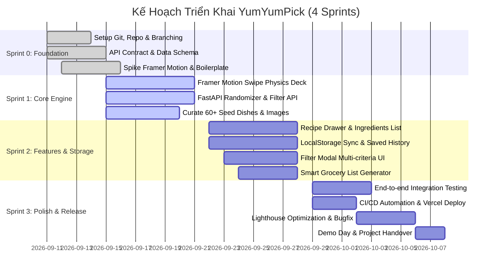

# 📋 06. Sprint Roadmap & Role-Based Actionable TODOs

Tài liệu này vạch ra lộ trình phát triển theo phương pháp Agile/Scrum qua 4 Sprint (tương ứng 4 tuần), kèm danh sách đầu việc (TODO Checklist) chi tiết và có thể tích chọn (checkbox) cho từng thành viên trong số 6 kỹ sư của dự án **YumYumPick**.

---

## 1. Lộ Trình Phát Triển 4 Sprints (Sprint Timeline)

---

## 2. Tiêu Chuẩn Nghiệm Thu Công Việc (DoR & DoD)

### 2.1. Definition of Ready (DoR - Điều kiện để BẮT ĐẦU làm Task)
- [ ] Task có mô tả rõ ràng: Người dùng muốn làm gì và kết quả mong muốn là gì.
- [ ] Đã có giao diện phác thảo (Wireframe) hoặc API Contract (định dạng JSON).
- [ ] Không bị phụ thuộc (block) bởi một task chưa hoàn thành khác.

### 2.2. Definition of Done (DoD - Điều kiện để ĐÓNG Task)
- [ ] Code chạy ổn định trên máy cá nhân, không có lỗi runtime hoặc crash.
- [ ] Đã qua định dạng code (Prettier/Black), xóa sạch `console.log` và debug thừa.
- [ ] Đã test giao diện trên ít nhất 2 kích thước màn hình: Mobile (390px) và Laptop (1440px).
- [ ] Đã tạo Pull Request, có ít nhất 1 phê duyệt (Approved) từ đồng đội.
- [ ] Đã merge thành công vào nhánh `develop` mà không làm hỏng build.

---

## 3. Bảng TODO Chi Tiết Cho Từng Thành Viên (Actionable Checklists)

### 👑 Member 1: Tech Lead & Fullstack Coordinator
- [ ] **Khởi tạo & Cấu hình Repo:**
  - [ ] Tạo repository GitHub, khởi tạo nhánh `main` và `develop`.
  - [ ] Thiết lập file `.gitignore`, README và bộ tài liệu trong thư mục `docs/`.
  - [ ] Thiết lập Branch Protection Rules trên GitHub (cấm force push, yêu cầu 1 review trước khi merge).
- [ ] **Kiến trúc & Tiêu chuẩn:**
  - [ ] Khóa đặc tả API Contract với Member 4 (Backend Lead).
  - [ ] Tổ chức cuộc họp Kick-off phân chia task đầu tuần.
  - [ ] Điều phối Daily Standup (10 phút mỗi ngày lúc 9:00 AM).
- [ ] **Code Review & Tích hợp:**
  - [ ] Review toàn bộ các Pull Request lớn kết nối giữa Frontend và Backend.
  - [ ] Hỗ trợ đồng đội xử lý Merge Conflicts phức tạp nếu phát sinh.
  - [ ] Chuẩn bị kịch bản Demo Day cho buổi báo cáo cuối kỳ.

---

### 🎨 Member 2: Frontend Lead (Swipe UI & Framer Motion)
- [ ] **Khởi tạo Dự Án Frontend:**
  - [ ] Khởi tạo dự án bằng Vite (`npm create vite@latest frontend -- --template react`).
  - [ ] Cấu hình Tailwind CSS, cài đặt các thư viện `framer-motion`, `lucide-react`, `clsx`, `tailwind-merge`.
- [ ] **Phát triển Cơ Chế Quẹt Thẻ (Core Swipe Deck):**
  - [ ] Xây dựng component `SwipeCard.jsx` với motion drag của Framer Motion.
  - [ ] Viết công thức vật lý tính toán góc xoay thẻ (`rotate = dragX / 15`) và độ đàn hồi (`spring`).
  - [ ] Thiết lập ngưỡng quẹt: Quẹt sang phải $> 120\text{px}$ là LIKE, sang trái $< -120\text{px}$ là SKIP.
  - [ ] Hiển thị stamp đồ họa nổi: Stamp xanh "YUMMY!" khi kéo sang phải, Stamp đỏ "NOPE" khi kéo sang trái.
- [ ] **Component Ngăn Xếp Thẻ (CardStack):**
  - [ ] Xây dựng component `CardStack.jsx` xếp tầng 3 thẻ liên tiếp (Top, Middle, Bottom).
  - [ ] Tối ưu hiệu ứng thẻ số 2 tự động phóng to khi thẻ số 1 bị quẹt bay ra khỏi màn hình.
  - [ ] Xử lý màn hình "Hết thẻ" (Empty State) kèm nút "Quẹt lại" và icon hoạt hình.
- [ ] **Thanh Điều Hướng & Cụm Nút Thao Tác (Action Buttons):**
  - [ ] Xây dựng cụm nút: Nút Hoàn tác (Undo), Nút Bỏ qua (X), Nút Chi tiết (Info), Nút Chọn món (Heart).
  - [ ] Bắt sự kiện bàn phím trên máy tính (Phím $\leftarrow$ để Skip, $\rightarrow$ để Like, Space để xem công thức).

---

### 📱 Member 3: Frontend Dev (Filter, History & LocalStorage)
- [ ] **Quản Trị Lưu Trữ Trình Duyệt (LocalStorage Integration):**
  - [ ] Viết Custom Hook `useLocalStorage.js` để đọc/ghi dữ liệu an toàn, xử lý ngoại lệ khi bộ nhớ đầy.
  - [ ] Lưu danh sách món đã quẹt phải vào key `YYP_SAVED_DISHES`.
  - [ ] Lưu lịch sử các ID đã quẹt vào `YYP_SWIPE_HISTORY` để phục vụ nút Hoàn tác (Undo).
- [ ] **Modal Bộ Lọc Nâng Cao (Filter Modal):**
  - [ ] Xây dựng component `FilterModal.jsx` dạng popup hoặc bottom sheet.
  - [ ] Các chip chọn quốc gia: Việt Nam, Nhật Bản, Hàn Quốc, Thái Lan, Ý...
  - [ ] Bộ chọn thời gian nấu: Dưới 20 phút, 20-45 phút, Mọi thời gian.
  - [ ] Nút "Áp dụng" gọi lại hàm tải thẻ mới theo tiêu chí lọc.
- [ ] **Chi Tiết Công Thức Món Ăn (Recipe Drawer):**
  - [ ] Xây dựng component `RecipeDrawer.jsx` vuốt mở từ dưới lên (Swipe-to-close Bottom Sheet).
  - [ ] Danh sách nguyên liệu kèm checkbox tương tác cho người dùng đánh dấu khi kiểm tra tủ lạnh.
  - [ ] Danh sách các bước nấu kèm số thứ tự rõ ràng, mẹo vặt của đầu bếp.
- [ ] **Trang Danh Sách Món Đã Lưu & Danh Sách Đi Chợ:**
  - [ ] Xây dựng giao diện hiển thị các món đã chọn kèm ảnh thumbnail, nút xóa từng món hoặc xóa tất cả.
  - [ ] **Tính năng độc đáo:** Nút "Xuất Danh Sách Đi Chợ" tự động gộp tất cả nguyên liệu các món đã lưu thành 1 danh sách, có nút Copy to Clipboard để gửi Zalo/Messenger.
- [ ] **Kết Nối API Backend:**
  - [ ] Viết module `src/services/api.js` sử dụng `fetch` hoặc `axios` gọi đến FastAPI server.
  - [ ] Xử lý trạng thái Loading (Skeleton loader khi đang tải thẻ) và trạng thái Error khi mất mạng.

---

### ⚙️ Member 4: Backend Lead (FastAPI & Randomizer Engine)
- [ ] **Khởi tạo Kiến Trúc FastAPI:**
  - [ ] Cài đặt môi trường ảo Python (`venv`), khởi tạo file `requirements.txt` (`fastapi`, `uvicorn`, `pydantic`).
  - [ ] Cấu hình cấu trúc thư mục phân tầng: `app/api/v1`, `app/models`, `app/services`, `app/core`.
  - [ ] Cấu hình CORS Middleware (`CORSMiddleware`) cho phép Frontend gọi an toàn.
- [ ] **Xây Dựng Data Models (Pydantic):**
  - [ ] Tạo model `Dish`, `IngredientItem`, `CookingStep`, `FilterParams`.
  - [ ] Đảm bảo dữ liệu trả về có đầy đủ kiểu dữ liệu, có schema mẫu hiển thị trên Swagger UI.
- [ ] **Thuật Toán Gợi Ý & Randomizer:**
  - [ ] Viết hàm xáo trộn danh sách món ăn ngẫu nhiên (sử dụng thuật toán Fisher-Yates shuffle).
  - [ ] Xử lý tham số `exclude_ids` để loại bỏ các món người dùng vừa xem trong phiên hiện tại.
  - [ ] Viết hàm lọc linh hoạt: Hỗ trợ lọc đồng thời nhiều quốc gia, lọc theo khoảng thời gian nấu, khẩu vị.
- [ ] **Triển Khai Các Endpoints RESTful:**
  - [ ] `GET /api/v1/health` (Kiểm tra trạng thái server).
  - [ ] `GET /api/v1/dishes/random` (Lấy thẻ ngẫu nhiên có lọc).
  - [ ] `GET /api/v1/dishes/{dish_id}` (Lấy chi tiết công thức 1 món).
  - [ ] `GET /api/v1/filters/metadata` (Lấy danh mục cờ quốc gia, nhãn bộ lọc).
  - [ ] `POST /api/v1/dishes/batch` (Lấy thông tin nhiều món từ mảng ID).
- [ ] **Tài Liệu Hóa API:**
  - [ ] Viết mô tả chi tiết (Summary, Description, Example Responses) hiển thị tại `/docs` (Swagger UI).

---

### 🍱 Member 5: Data Engineer & Content Specialist (Dishes Curation)
- [ ] **Nghiên Cứu & Thu Thập Dữ Liệu Ẩm Thực:**
  - [ ] Lập danh sách **tối thiểu 60 món ăn** quen thuộc và hấp dẫn thuộc 5 nhóm văn hóa:
    - 20 món Việt Nam (Phở bò, Bún chả, Bánh mì chảo, Cơm sườn trứng ốp la, Gỏi cuốn...).
    - 10 món Hàn Quốc (Cơm trộn Bibimbap, Canh kim chi thịt heo, Gà sốt cay...).
    - 10 món Nhật Bản (Mì Udon bò, Cơm cà ri Nhật, Trứng cuộn Tamagoyaki...).
    - 10 món Thái Lan (Pad Thai, Canh Tom Yum, Heo xào lá quế Pad Krapow...).
    - 10 món Âu / Ý (Mì Ý sốt bò bằm Bolognese, Pizza phô mai, Steak sốt tiêu đen...).
- [ ] **Biên Tập Nội Dung Công Thức Chuẩn:**
  - [ ] Viết danh sách nguyên liệu cụ thể có định lượng (gam, thìa, quả, lát).
  - [ ] Viết 3-5 bước thực hiện ngắn gọn, dễ hiểu, người không biết nấu ăn cũng làm theo được.
  - [ ] Thêm mẹo vặt nấu nướng (Tips) hữu ích cho từng món.
- [ ] **Thu Thập & Tối Ưu Hình Ảnh:**
  - [ ] Tìm hình ảnh món ăn góc chụp đẹp, độ phân giải cao từ nguồn miễn phí bản quyền (Unsplash, Pexels).
  - [ ] Nén ảnh sang định dạng WebP, kích thước tối ưu (dưới 150KB/ảnh) để tải nhanh trên di động.
- [ ] **Tạo File Dữ Liệu JSON & Viết Script Nạp:**
  - [ ] Đóng gói toàn bộ dữ liệu vào file `backend/app/data/dishes_seed.json`.
  - [ ] Viết script `seed_loader.py` tự động kiểm tra tính hợp lệ của dữ liệu trước khi server khởi động.
  - [ ] Viết Unit Tests kiểm tra không có món ăn nào bị thiếu hình ảnh hoặc thiếu nguyên liệu.

---

### 🚀 Member 6: DevOps & QA Engineer (Cloud, CI/CD & Testing)
- [ ] **Cấu Hình Tự Động Hóa CI/CD:**
  - [ ] Tạo workflow GitHub Actions tự động chạy linter (ESLint cho React, Flake8/Black cho Python) khi có PR mới.
  - [ ] Kết nối repository với **Vercel** để tự động build và cấp phát URL xem trước (Preview Deployment) cho mỗi Pull Request.
- [ ] **Triển Khai Môi Trường Trực Tuyến (Hosting):**
  - [ ] Deploy Frontend lên **Vercel**. Cấu hình Custom Domain hoặc subdomain Vercel miễn phí.
  - [ ] Deploy Backend FastAPI lên **Render / Railway / Fly.io** (hoặc tích hợp Vercel Serverless Functions).
  - [ ] Cấu hình an toàn biến môi trường: `VITE_API_BASE_URL` trên Frontend và `ALLOWED_ORIGINS` trên Backend.
- [ ] **Xây Dựng Tài Liệu Kiểm Thử Postman:**
  - [ ] Tạo Postman Collection kiểm thử toàn bộ các API endpoints với các trường hợp dữ liệu hợp lệ và không hợp lệ.
  - [ ] Xuất file `postman_collection.json` đặt trong thư mục `docs/`.
- [ ] **Kiểm Thử Toàn Diện (QA Testing Matrix):**
  - [ ] Kiểm thử độ mượt mà của cử chỉ quẹt thẻ trên nhiều trình duyệt: Chrome, Safari iOS, Edge, Samsung Internet.
  - [ ] Kiểm thử các tình huống biên:
    - Người dùng quẹt liên tục 20 thẻ với tốc độ cao (không bị vỡ layout hoặc kẹt thẻ).
    - Người dùng bật bộ lọc không có món nào thỏa mãn (kiểm tra giao diện thông báo).
    - Xóa lịch sử trong LocalStorage và kiểm tra ứng dụng khởi tạo lại bình thường.
  - [ ] Chạy kiểm toán Google Lighthouse: Tối ưu điểm Performance $\ge 90$, Accessibility $\ge 95$.
