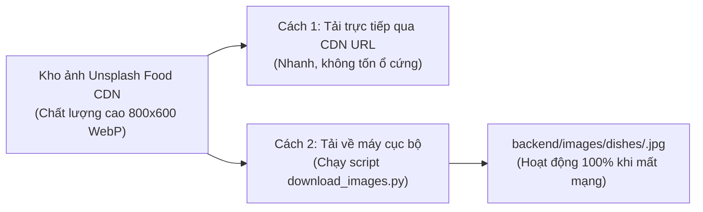

# 07. Cẩm Nang Chuẩn Bị Dữ Liệu & Danh Mục 100 Món Ăn (Data Preparation & Catalog)

Tài liệu này là cẩm nang toàn diện về **Quy trình chuẩn bị dữ liệu**, từ điển phân loại, cấu trúc CSDL SQLite, **danh mục đầy đủ 100 món ăn kèm link ảnh sắc nét**, bộ công cụ tải ảnh offline (`download_images.py`), script kiểm toán (`validate_data.py`) và script tự động nạp CSDL (`seed_sqlite.py`) cho dự án **YumYumPick**.

---

## 1. Kịch Bản Tạo Bảng CSDL SQLite (SQLite DDL Schema)

Toàn bộ CSDL được lưu trữ trong file duy nhất: `backend/yumyumpick.db`. File SQL khởi tạo đặt tại `backend/app/db/schema.sql`.

```sql
PRAGMA foreign_keys = ON;

-- 1. Bảng người dùng đơn giản (Simple Users)
CREATE TABLE IF NOT EXISTS users (
    id INTEGER PRIMARY KEY AUTOINCREMENT,
    username TEXT NOT NULL UNIQUE,
    password TEXT NOT NULL,
    full_name TEXT NOT NULL,
    created_at DATETIME DEFAULT CURRENT_TIMESTAMP
);

-- 2. Bảng danh mục quốc gia / ẩm thực (Cuisines)
CREATE TABLE IF NOT EXISTS cuisines (
    id TEXT PRIMARY KEY,
    name TEXT NOT NULL,
    flag_emoji TEXT NOT NULL
);

-- 3. Bảng món ăn chính (Dishes)
CREATE TABLE IF NOT EXISTS dishes (
    id TEXT PRIMARY KEY,
    name TEXT NOT NULL,
    english_name TEXT,
    cuisine_id TEXT NOT NULL,
    region TEXT,
    image TEXT NOT NULL,
    image_url TEXT,
    cook_time_minutes INTEGER NOT NULL,
    prep_time_minutes INTEGER DEFAULT 10,
    difficulty TEXT DEFAULT 'Dễ',
    spicy_level INTEGER DEFAULT 0,
    calories_approx INTEGER DEFAULT 400,
    short_description TEXT NOT NULL,
    tips TEXT,
    created_at DATETIME DEFAULT CURRENT_TIMESTAMP,
    FOREIGN KEY (cuisine_id) REFERENCES cuisines(id) ON UPDATE CASCADE
);

-- 4. Bảng nguyên liệu chi tiết (Ingredients)
CREATE TABLE IF NOT EXISTS ingredients (
    id INTEGER PRIMARY KEY AUTOINCREMENT,
    dish_id TEXT NOT NULL,
    name TEXT NOT NULL,
    amount TEXT NOT NULL,
    unit TEXT NOT NULL,
    category TEXT DEFAULT 'nguyên liệu chính',
    FOREIGN KEY (dish_id) REFERENCES dishes(id) ON DELETE CASCADE
);

-- 5. Bảng các bước nấu ăn (Cooking Steps)
CREATE TABLE IF NOT EXISTS cooking_steps (
    id INTEGER PRIMARY KEY AUTOINCREMENT,
    dish_id TEXT NOT NULL,
    step_number INTEGER NOT NULL,
    title TEXT NOT NULL,
    description TEXT NOT NULL,
    FOREIGN KEY (dish_id) REFERENCES dishes(id) ON DELETE CASCADE
);

-- 6. Bảng món ăn đã lưu của người dùng (User Saved Dishes)
CREATE TABLE IF NOT EXISTS user_saved_dishes (
    id INTEGER PRIMARY KEY AUTOINCREMENT,
    user_id INTEGER NOT NULL,
    dish_id TEXT NOT NULL,
    saved_at DATETIME DEFAULT CURRENT_TIMESTAMP,
    UNIQUE(user_id, dish_id),
    FOREIGN KEY (user_id) REFERENCES users(id) ON DELETE CASCADE,
    FOREIGN KEY (dish_id) REFERENCES dishes(id) ON DELETE CASCADE
);

-- Tạo chỉ mục tìm kiếm tối ưu
CREATE INDEX IF NOT EXISTS idx_dishes_cuisine ON dishes(cuisine_id);
CREATE INDEX IF NOT EXISTS idx_dishes_cook_time ON dishes(cook_time_minutes);
CREATE INDEX IF NOT EXISTS idx_saved_user ON user_saved_dishes(user_id);
```

---

## 2. Chiến Lược Quản Lý Hình Ảnh Món Ăn (Image Strategy)

Ứng dụng quẹt thẻ "Tinder For Food" đòi hỏi hình ảnh phải **bắt mắt, sắc nét và tải nhanh**:



1. **Phương án Online (Khuyến nghị khi code):** Sử dụng trực tiếp link ảnh Unsplash đã gắn sẵn tham số tối ưu nén: `?auto=format&fit=crop&w=800&q=80`. Ảnh tải siêu nhanh dưới 150KB và tự động hiển thị mượt mà.
2. **Phương án Offline (Tải về máy):** Nếu máy tính không có internet ổn định, nhóm chỉ cần chạy 1 lệnh:
   ```bash
   python backend/app/db/download_images.py
   ```
   Script sẽ tự động tải toàn bộ 100 ảnh và lưu vào thư mục `backend/images/dishes/` với tên file chuẩn `dish_vn_001.jpg`, `dish_kr_002.jpg`...

---

## 3. Báo Cáo Tổng Hợp Dữ Liệu 100 Món Ăn (Data Audit)

File dữ liệu chuẩn [`backend/app/data/dishes_seed.json`](file:///D:/LT/YunYumPick/backend/app/data/dishes_seed.json) đã được nạp sẵn vào file CSDL [`backend/yumyumpick.db`](file:///D:/LT/YunYumPick/backend/yumyumpick.db):

* **Tổng số món ăn:** **100 món**
* **Tổng số nguyên liệu chi tiết:** **495 bản ghi nguyên liệu** (đầy đủ định lượng, đơn vị tính và phân loại nhóm nguyên liệu phục vụ Smart Grocery List).
* **Tổng số bước nấu ăn:** **300 bước thực hiện** (mỗi món chuẩn hóa đúng 3 bước: Sơ chế $\rightarrow$ Chế biến nhiệt $\rightarrow$ Trình bày).
* **Tổng số mẹo đầu bếp:** **100 bí quyết thực tế** cho từng món.
* **Tài khoản test có sẵn:** `username: demo` / `password: 123`.

---

## 4. Bảng Tra Cứu Toàn Bộ 100 Món Ăn Kèm Ảnh Chi Tiết

### 1. Ẩm Thực Việt Nam (30 Món)

| # | ID | Tên Món Ăn | English Name | Link Ảnh Minh Họa | Thời Gian | Calo | Cay | Khó |
|---|---|---|---|:---:|:---:|:---:|:---:|:---:|
| 1 | `dish_vn_001` | **Phở Bò Tái Nạm** | Traditional Beef Pho | [Xem ảnh](https://images.unsplash.com/photo-1582878826629-29b7ad1cdc43?auto=format&fit=crop&w=800&q=80) | 45' | 480 | 0 | TB |
| 2 | `dish_vn_002` | **Cơm Tấm Sườn Bì Chả** | Broken Rice with Grilled Pork | [Xem ảnh](https://images.unsplash.com/photo-1544025162-d76694265947?auto=format&fit=crop&w=800&q=80) | 35' | 650 | 0 | TB |
| 3 | `dish_vn_003` | **Bún Chả Hà Nội** | Hanoi Grilled Pork Noodles | [Xem ảnh](https://images.unsplash.com/photo-1559847844-5315695dadae?auto=format&fit=crop&w=800&q=80) | 30' | 520 | 1 | TB |
| 4 | `dish_vn_004` | **Bánh Mì Chảo Thập Cẩm** | Combination Pan Bread | [Xem ảnh](https://images.unsplash.com/photo-1626082927389-6cd097cdc6ec?auto=format&fit=crop&w=800&q=80) | 15' | 550 | 0 | Dễ |
| 5 | `dish_vn_005` | **Bún Bò Huế Đậm Đà** | Hue Spicy Beef Noodle Soup | [Xem ảnh](https://images.unsplash.com/photo-1569718212165-3a8278d5f624?auto=format&fit=crop&w=800&q=80) | 50' | 580 | 2 | Khó |
| 6 | `dish_vn_006` | **Gỏi Cuốn Tôm Thịt** | Fresh Spring Rolls | [Xem ảnh](https://images.unsplash.com/photo-1534422298391-e4f8c172dddb?auto=format&fit=crop&w=800&q=80) | 20' | 320 | 0 | Dễ |
| 7 | `dish_vn_007` | **Canh Chua Cá Lóc Nam Bộ** | Mekong Sour Fish Soup | [Xem ảnh](https://images.unsplash.com/photo-1541832676-9b763b0239ab?auto=format&fit=crop&w=800&q=80) | 25' | 350 | 1 | Dễ |
| 8 | `dish_vn_008` | **Bánh Xèo Miền Tây** | Crispy Sizzling Pancake | [Xem ảnh](https://images.unsplash.com/photo-1563245372-f21724e3856d?auto=format&fit=crop&w=800&q=80) | 30' | 520 | 0 | TB |
| 9 | `dish_vn_009` | **Bò Kho Bánh Mì** | Braised Beef Stew | [Xem ảnh](https://images.unsplash.com/photo-1547592166-23ac45744acd?auto=format&fit=crop&w=800&q=80) | 45' | 590 | 1 | TB |
| 10 | `dish_vn_010` | **Chả Giò Tôm Thịt Giòn Tan** | Crispy Spring Rolls | [Xem ảnh](https://images.unsplash.com/photo-1541544741938-0af808871cc0?auto=format&fit=crop&w=800&q=80) | 25' | 450 | 0 | Dễ |
| 11 | `dish_vn_011` | **Cá Lóc Kho Tộ Nam Bộ** | Claypot Braised Fish | [Xem ảnh](https://images.unsplash.com/photo-1519708227418-c8fd9a32b7a2?auto=format&fit=crop&w=800&q=80) | 30' | 380 | 1 | Dễ |
| 12 | `dish_vn_012` | **Cơm Chiên Dương Châu** | Yangzhou Fried Rice | [Xem ảnh](https://images.unsplash.com/photo-1603133872878-684f208fb84b?auto=format&fit=crop&w=800&q=80) | 15' | 520 | 0 | Dễ |
| 13 | `dish_vn_013` | **Hủ Tiếu Nam Vang** | Nam Vang Noodle Soup | [Xem ảnh](https://images.unsplash.com/photo-1594041680534-e8c8cdebd659?auto=format&fit=crop&w=800&q=80) | 35' | 490 | 0 | TB |
| 14 | `dish_vn_014` | **Bún Riêu Cua Đồng** | Crab Paste Noodle Soup | [Xem ảnh](https://images.unsplash.com/photo-1617093727343-374698b1b08d?auto=format&fit=crop&w=800&q=80) | 30' | 460 | 1 | TB |
| 15 | `dish_vn_015` | **Gà Kho Gừng Ấm Nồng** | Braised Ginger Chicken | [Xem ảnh](https://images.unsplash.com/photo-1604908176997-125f25cc6f3d?auto=format&fit=crop&w=800&q=80) | 25' | 420 | 1 | Dễ |
| 16 | `dish_vn_016` | **Bánh Cuốn Nóng Hà Nội** | Hanoi Steamed Rice Rolls | [Xem ảnh](https://images.unsplash.com/photo-1541544741938-0af808871cc0?auto=format&fit=crop&w=800&q=80) | 20' | 390 | 0 | TB |
| 17 | `dish_vn_017` | **Mì Quảng Tôm Thịt Trứng Cút** | Quang Turmeric Noodles | [Xem ảnh](https://images.unsplash.com/photo-1569718212165-3a8278d5f624?auto=format&fit=crop&w=800&q=80) | 30' | 510 | 1 | TB |
| 18 | `dish_vn_018` | **Bún Đậu Mắm Tôm Thập Cẩm** | Tofu & Pork Vermicelli | [Xem ảnh](https://images.unsplash.com/photo-1540420773420-3366772f4999?auto=format&fit=crop&w=800&q=80) | 25' | 580 | 2 | Dễ |
| 19 | `dish_vn_019` | **Thịt Kho Tàu Nước Dừa** | Caramelized Pork with Eggs | [Xem ảnh](https://images.unsplash.com/photo-1544025162-d76694265947?auto=format&fit=crop&w=800&q=80) | 50' | 680 | 0 | TB |
| 20 | `dish_vn_020` | **Canh Khổ Qua Nhồi Thịt** | Stuffed Bitter Melon Soup | [Xem ảnh](https://images.unsplash.com/photo-1541832676-9b763b0239ab?auto=format&fit=crop&w=800&q=80) | 30' | 310 | 0 | Dễ |
| 21 | `dish_vn_021` | **Sườn Xào Chua Ngọt** | Sweet & Sour Pork Ribs | [Xem ảnh](https://images.unsplash.com/photo-1544025162-d76694265947?auto=format&fit=crop&w=800&q=80) | 25' | 520 | 0 | Dễ |
| 22 | `dish_vn_022` | **Bánh Canh Cua Giò Heo** | Crab Pork Hock Noodles | [Xem ảnh](https://images.unsplash.com/photo-1569718212165-3a8278d5f624?auto=format&fit=crop&w=800&q=80) | 40' | 590 | 1 | TB |
| 23 | `dish_vn_023` | **Lẩu Thái Chua Cay Hải Sản** | Seafood Hotpot | [Xem ảnh](https://images.unsplash.com/photo-1541832676-9b763b0239ab?auto=format&fit=crop&w=800&q=80) | 30' | 480 | 2 | Dễ |
| 24 | `dish_vn_024` | **Bánh Canh Chả Cá Nha Trang** | Fish Cake Noodle Soup | [Xem ảnh](https://images.unsplash.com/photo-1559847844-5315695dadae?auto=format&fit=crop&w=800&q=80) | 25' | 420 | 1 | Dễ |
| 25 | `dish_vn_025` | **Nem Nướng Nha Trang Cuốn** | Nha Trang Grilled Pork Rolls | [Xem ảnh](https://images.unsplash.com/photo-1534422298391-e4f8c172dddb?auto=format&fit=crop&w=800&q=80) | 25' | 560 | 0 | TB |
| 26 | `dish_vn_026` | **Cháo Sườn Hà Nội Quẩy Giòn** | Creamy Rib Porridge | [Xem ảnh](https://images.unsplash.com/photo-1547592166-23ac45744acd?auto=format&fit=crop&w=800&q=80) | 35' | 410 | 0 | Dễ |
| 27 | `dish_vn_027` | **Bò Lúc Lắc Khoai Tây Chiên** | Shaking Beef with Fries | [Xem ảnh](https://images.unsplash.com/photo-1544025162-d76694265947?auto=format&fit=crop&w=800&q=80) | 15' | 620 | 1 | Dễ |
| 28 | `dish_vn_028` | **Cơm Gà Hội An Xé Phay** | Hoi An Shredded Chicken Rice | [Xem ảnh](https://images.unsplash.com/photo-1544025162-d76694265947?auto=format&fit=crop&w=800&q=80) | 35' | 580 | 1 | TB |
| 29 | `dish_vn_029` | **Vịt Nấu Chao Cần Nước** | Duck Stewed with Fermented Tofu | [Xem ảnh](https://images.unsplash.com/photo-1547592166-23ac45744acd?auto=format&fit=crop&w=800&q=80) | 40' | 610 | 1 | TB |
| 30 | `dish_vn_030` | **Xôi Xéo Hà Nội Ruốc Gà** | Hanoi Mung Bean Sticky Rice | [Xem ảnh](https://images.unsplash.com/photo-1546069901-ba9599a7e63c?auto=format&fit=crop&w=800&q=80) | 30' | 520 | 0 | Dễ |

---

### 2. Ẩm Thực Hàn Quốc (20 Món)

| # | ID | Tên Món Ăn | English Name | Link Ảnh Minh Họa | Thời Gian | Calo | Cay | Khó |
|---|---|---|---|:---:|:---:|:---:|:---:|:---:|
| 31 | `dish_kr_001` | **Cơm Trộn Bibimbap** | Korean Mixed Rice | [Xem ảnh](https://images.unsplash.com/photo-1553163147-622ab57be1c7?auto=format&fit=crop&w=800&q=80) | 25' | 520 | 1 | Dễ |
| 32 | `dish_kr_002` | **Canh Kim Chi Thịt Ba Chỉ** | Kimchi Jjigae with Pork | [Xem ảnh](https://images.unsplash.com/photo-1547592166-23ac45744acd?auto=format&fit=crop&w=800&q=80) | 20' | 420 | 2 | Dễ |
| 33 | `dish_kr_003` | **Bánh Gạo Cay Tokbokki** | Spicy Korean Rice Cakes | [Xem ảnh](https://images.unsplash.com/photo-1628294895950-9805252327bc?auto=format&fit=crop&w=800&q=80) | 15' | 460 | 2 | Dễ |
| 34 | `dish_kr_004` | **Thịt Bò Xào Bulgogi** | Marinated Beef Bulgogi | [Xem ảnh](https://images.unsplash.com/photo-1590301157890-4810ed352733?auto=format&fit=crop&w=800&q=80) | 15' | 480 | 0 | Dễ |
| 35 | `dish_kr_005` | **Miến Xào Rau Củ Japchae** | Stir-fried Glass Noodles | [Xem ảnh](https://images.unsplash.com/photo-1546069901-ba9599a7e63c?auto=format&fit=crop&w=800&q=80) | 25' | 450 | 0 | TB |
| 36 | `dish_kr_006` | **Gà Rán Sốt Cay Yangnyeom** | Sweet & Spicy Fried Chicken | [Xem ảnh](https://images.unsplash.com/photo-1626082927389-6cd097cdc6ec?auto=format&fit=crop&w=800&q=80) | 25' | 650 | 2 | Dễ |
| 37 | `dish_kr_007` | **Canh Rong Biển Miyeok-guk**| Seaweed Soup with Beef | [Xem ảnh](https://images.unsplash.com/photo-1547592166-23ac45744acd?auto=format&fit=crop&w=800&q=80) | 20' | 280 | 0 | Dễ |
| 38 | `dish_kr_008` | **Trứng Hấp Gyeran-jjim** | Volcano Steamed Eggs | [Xem ảnh](https://images.unsplash.com/photo-1525351484163-7529414344d8?auto=format&fit=crop&w=800&q=80) | 10' | 210 | 0 | Dễ |
| 39 | `dish_kr_009` | **Ba Chỉ Nướng Samgyeopsal** | Grilled Pork Belly | [Xem ảnh](https://images.unsplash.com/photo-1544025162-d76694265947?auto=format&fit=crop&w=800&q=80) | 20' | 650 | 1 | Dễ |
| 40 | `dish_kr_010` | **Mì Tương Đen Jajangmyeon** | Black Bean Noodles | [Xem ảnh](https://images.unsplash.com/photo-1569718212165-3a8278d5f624?auto=format&fit=crop&w=800&q=80) | 20' | 580 | 0 | Dễ |
| 41 | `dish_kr_011` | **Mì Cay Hải Sản Jjamppong** | Spicy Seafood Noodles | [Xem ảnh](https://images.unsplash.com/photo-1569718212165-3a8278d5f624?auto=format&fit=crop&w=800&q=80) | 25' | 540 | 3 | TB |
| 42 | `dish_kr_012` | **Canh Sườn Bò Galbitang** | Short Rib Soup Galbitang | [Xem ảnh](https://images.unsplash.com/photo-1547592166-23ac45744acd?auto=format&fit=crop&w=800&q=80) | 50' | 520 | 0 | Khó |
| 43 | `dish_kr_013` | **Bánh Xèo Kim Chi Kimchijeon**| Crispy Kimchi Pancake | [Xem ảnh](https://images.unsplash.com/photo-1563245372-f21724e3856d?auto=format&fit=crop&w=800&q=80) | 15' | 380 | 1 | Dễ |
| 44 | `dish_kr_014` | **Canh Đậu Non Sundubu** | Spicy Soft Tofu Stew | [Xem ảnh](https://images.unsplash.com/photo-1541832676-9b763b0239ab?auto=format&fit=crop&w=800&q=80) | 15' | 340 | 3 | Dễ |
| 45 | `dish_kr_015` | **Cơm Cuộn Rong Biển Kimbap**| Seaweed Rice Rolls | [Xem ảnh](https://images.unsplash.com/photo-1553163147-622ab57be1c7?auto=format&fit=crop&w=800&q=80) | 25' | 420 | 0 | Dễ |
| 46 | `dish_kr_016` | **Gà Hầm Sâm Samgyetang** | Ginseng Chicken Soup | [Xem ảnh](https://images.unsplash.com/photo-1547592166-23ac45744acd?auto=format&fit=crop&w=800&q=80) | 55' | 650 | 0 | Khó |
| 47 | `dish_kr_017` | **Lẩu Quân Đội Budae Jjigae** | Army Base Stew | [Xem ảnh](https://images.unsplash.com/photo-1569718212165-3a8278d5f624?auto=format&fit=crop&w=800&q=80) | 20' | 620 | 2 | Dễ |
| 48 | `dish_kr_018` | **Chả Cá Xiên Eomuk Tang** | Fish Cake Skewers | [Xem ảnh](https://images.unsplash.com/photo-1628294895950-9805252327bc?auto=format&fit=crop&w=800&q=80) | 15' | 280 | 0 | Dễ |
| 49 | `dish_kr_019` | **Cơm Chiên Kim Chi Trứng** | Kimchi Fried Rice with Egg | [Xem ảnh](https://images.unsplash.com/photo-1603133872878-684f208fb84b?auto=format&fit=crop&w=800&q=80) | 12' | 480 | 1 | Dễ |
| 50 | `dish_kr_020` | **Mì Lạnh Naengmyeon** | Korean Cold Noodles | [Xem ảnh](https://images.unsplash.com/photo-1618841557871-b4664fbf0cb3?auto=format&fit=crop&w=800&q=80) | 15' | 390 | 0 | TB |

---

### 3. Ẩm Thực Nhật Bản (18 Món)

| # | ID | Tên Món Ăn | English Name | Link Ảnh Minh Họa | Thời Gian | Calo | Cay | Khó |
|---|---|---|---|:---:|:---:|:---:|:---:|:---:|
| 51 | `dish_jp_001` | **Mì Ramen Thịt Xá Xíu** | Japanese Chashu Ramen | [Xem ảnh](https://images.unsplash.com/photo-1569718212165-3a8278d5f624?auto=format&fit=crop&w=800&q=80) | 30' | 580 | 0 | TB |
| 52 | `dish_jp_002` | **Cơm Cà Ri Bò Nhật Bản** | Beef Curry Rice | [Xem ảnh](https://images.unsplash.com/photo-1588166524941-3bf61a9c41db?auto=format&fit=crop&w=800&q=80) | 35' | 620 | 1 | Dễ |
| 53 | `dish_jp_003` | **Cơm Bò Sốt Hành Gyudon** | Beef Bowl Gyudon | [Xem ảnh](https://images.unsplash.com/photo-1552611052-33e04de081de?auto=format&fit=crop&w=800&q=80) | 15' | 540 | 0 | Dễ |
| 54 | `dish_jp_004` | **Mì Udon Bò Xào Teriyaki** | Stir-fried Beef Udon | [Xem ảnh](https://images.unsplash.com/photo-1618841557871-b4664fbf0cb3?auto=format&fit=crop&w=800&q=80) | 15' | 490 | 0 | Dễ |
| 55 | `dish_jp_005` | **Trứng Cuộn Tamagoyaki** | Rolled Sweet Omelette | [Xem ảnh](https://images.unsplash.com/photo-1540420773420-3366772f4999?auto=format&fit=crop&w=800&q=80) | 12' | 240 | 0 | TB |
| 56 | `dish_jp_006` | **Cơm Lươn Nướng Unadon** | Grilled Eel Rice Bowl | [Xem ảnh](https://images.unsplash.com/photo-1534422298391-e4f8c172dddb?auto=format&fit=crop&w=800&q=80) | 15' | 590 | 0 | Dễ |
| 57 | `dish_jp_007` | **Bánh Xèo Okonomiyaki** | Savory Cabbage Pancake | [Xem ảnh](https://images.unsplash.com/photo-1559847844-5315695dadae?auto=format&fit=crop&w=800&q=80) | 20' | 510 | 0 | Dễ |
| 58 | `dish_jp_008` | **Gà Chiên Giòn Karaage** | Crispy Fried Chicken | [Xem ảnh](https://images.unsplash.com/photo-1562967914-608f82629710?auto=format&fit=crop&w=800&q=80) | 20' | 530 | 0 | Dễ |
| 59 | `dish_jp_009` | **Thịt Heo Chiên Xù Tonkatsu**| Crispy Pork Cutlet | [Xem ảnh](https://images.unsplash.com/photo-1544025162-d76694265947?auto=format&fit=crop&w=800&q=80) | 20' | 580 | 0 | Dễ |
| 60 | `dish_jp_010` | **Cơm Gà Trứng Oyakodon** | Chicken & Egg Rice Bowl | [Xem ảnh](https://images.unsplash.com/photo-1525351484163-7529414344d8?auto=format&fit=crop&w=800&q=80) | 15' | 510 | 0 | Dễ |
| 61 | `dish_jp_011` | **Sushi Cá Hồi & Bơ** | Salmon Avocado Roll | [Xem ảnh](https://images.unsplash.com/photo-1553163147-622ab57be1c7?auto=format&fit=crop&w=800&q=80) | 20' | 380 | 0 | Dễ |
| 62 | `dish_jp_012` | **Mì Soba Kiều Mạch Lạnh** | Chilled Buckwheat Soba | [Xem ảnh](https://images.unsplash.com/photo-1618841557871-b4664fbf0cb3?auto=format&fit=crop&w=800&q=80) | 10' | 310 | 0 | Dễ |
| 63 | `dish_jp_013` | **Bạch Tuộc Nướng Takoyaki** | Octopus Balls Takoyaki | [Xem ảnh](https://images.unsplash.com/photo-1559847844-5315695dadae?auto=format&fit=crop&w=800&q=80) | 20' | 460 | 0 | TB |
| 64 | `dish_jp_014` | **Mì Udon Nước Thịt Bò** | Hot Beef Noodle Niku Udon | [Xem ảnh](https://images.unsplash.com/photo-1618841557871-b4664fbf0cb3?auto=format&fit=crop&w=800&q=80) | 18' | 480 | 0 | Dễ |
| 65 | `dish_jp_015` | **Há Cảo Nhật Gyoza** | Pan-fried Pork Dumplings | [Xem ảnh](https://images.unsplash.com/photo-1541544741938-0af808871cc0?auto=format&fit=crop&w=800&q=80) | 15' | 420 | 0 | Dễ |
| 66 | `dish_jp_016` | **Tôm Chiên Xù Tempura** | Crispy Prawn Tempura | [Xem ảnh](https://images.unsplash.com/photo-1562967914-608f82629710?auto=format&fit=crop&w=800&q=80) | 15' | 450 | 0 | TB |
| 67 | `dish_jp_017` | **Súp Tương Miso Đậu Hũ** | Classic Miso Soup | [Xem ảnh](https://images.unsplash.com/photo-1547592166-23ac45744acd?auto=format&fit=crop&w=800&q=80) | 10' | 160 | 0 | Dễ |
| 68 | `dish_jp_018` | **Bò Nướng Sốt Teriyaki** | Teppanyaki Beef Teriyaki | [Xem ảnh](https://images.unsplash.com/photo-1544025162-d76694265947?auto=format&fit=crop&w=800&q=80) | 15' | 590 | 0 | Dễ |

---

### 4. Ẩm Thực Thái Lan (16 Món)

| # | ID | Tên Món Ăn | English Name | Link Ảnh Minh Họa | Thời Gian | Calo | Cay | Khó |
|---|---|---|---|:---:|:---:|:---:|:---:|:---:|
| 69 | `dish_th_001` | **Pad Thai Tôm Tươi** | Traditional Pad Thai | [Xem ảnh](https://images.unsplash.com/photo-1559847844-5315695dadae?auto=format&fit=crop&w=800&q=80) | 20' | 460 | 2 | Dễ |
| 70 | `dish_th_002` | **Canh Chua Tôm Tom Yum** | Spicy Shrimp Soup Tom Yum | [Xem ảnh](https://images.unsplash.com/photo-1541832676-9b763b0239ab?auto=format&fit=crop&w=800&q=80) | 20' | 310 | 3 | Dễ |
| 71 | `dish_th_003` | **Cơm Heo Băm Pad Krapow** | Thai Basil Minced Pork | [Xem ảnh](https://images.unsplash.com/photo-1563245372-f21724e3856d?auto=format&fit=crop&w=800&q=80) | 12' | 510 | 3 | Dễ |
| 72 | `dish_th_004` | **Gỏi Đu Đủ Som Tum** | Green Papaya Salad | [Xem ảnh](https://images.unsplash.com/photo-1540420773420-3366772f4999?auto=format&fit=crop&w=800&q=80) | 15' | 220 | 2 | Dễ |
| 73 | `dish_th_005` | **Cà Ri Xanh Thịt Gà** | Thai Green Chicken Curry | [Xem ảnh](https://images.unsplash.com/photo-1455619452474-d2be8b1e70cd?auto=format&fit=crop&w=800&q=80) | 25' | 520 | 3 | Dễ |
| 74 | `dish_th_006` | **Cơm Chiên Trái Thơm** | Pineapple Seafood Fried Rice | [Xem ảnh](https://images.unsplash.com/photo-1512058564366-18510be2db19?auto=format&fit=crop&w=800&q=80) | 20' | 560 | 1 | Dễ |
| 75 | `dish_th_007` | **Súp Gà Nước Dừa Tom Kha** | Coconut Chicken Soup | [Xem ảnh](https://images.unsplash.com/photo-1547592166-23ac45744acd?auto=format&fit=crop&w=800&q=80) | 20' | 390 | 1 | Dễ |
| 76 | `dish_th_008` | **Xôi Xoài Nước Cốt Dừa** | Mango Sticky Rice | [Xem ảnh](https://images.unsplash.com/photo-1546069901-ba9599a7e63c?auto=format&fit=crop&w=800&q=80) | 25' | 480 | 0 | Dễ |
| 77 | `dish_th_009` | **Cà Ri Đỏ Vịt Quay Khóm** | Red Curry with Roast Duck | [Xem ảnh](https://images.unsplash.com/photo-1455619452474-d2be8b1e70cd?auto=format&fit=crop&w=800&q=80) | 25' | 590 | 2 | TB |
| 78 | `dish_th_010` | **Cà Ri Massaman Thịt Bò** | Massaman Beef Curry | [Xem ảnh](https://images.unsplash.com/photo-1547592166-23ac45744acd?auto=format&fit=crop&w=800&q=80) | 45' | 650 | 1 | TB |
| 79 | `dish_th_011` | **Mì Cà Ri Giòn Khao Soi** | Crispy Noodle Curry | [Xem ảnh](https://images.unsplash.com/photo-1569718212165-3a8278d5f624?auto=format&fit=crop&w=800&q=80) | 30' | 570 | 2 | TB |
| 80 | `dish_th_012` | **Cá Chẽm Hấp Chanh Ớt** | Steamed Sea Bass with Lime | [Xem ảnh](https://images.unsplash.com/photo-1519708227418-c8fd9a32b7a2?auto=format&fit=crop&w=800&q=80) | 20' | 350 | 3 | Dễ |
| 81 | `dish_th_013` | **Gỏi Miến Hải Sản Yum Woon**| Spicy Glass Noodle Salad | [Xem ảnh](https://images.unsplash.com/photo-1559847844-5315695dadae?auto=format&fit=crop&w=800&q=80) | 15' | 320 | 2 | Dễ |
| 82 | `dish_th_014` | **Heo Xiên Nướng Moo Ping** | Grilled Coconut Pork Skewers | [Xem ảnh](https://images.unsplash.com/photo-1544025162-d76694265947?auto=format&fit=crop&w=800&q=80) | 20' | 520 | 0 | Dễ |
| 83 | `dish_th_015` | **Cua Xào Cà Ri Trứng** | Yellow Curry Stir-fried Crab | [Xem ảnh](https://images.unsplash.com/photo-1559847844-5315695dadae?auto=format&fit=crop&w=800&q=80) | 20' | 540 | 1 | TB |
| 84 | `dish_th_016` | **Canh Sườn Núi Lửa Laeng**| Volcano Spicy Rib Soup | [Xem ảnh](https://images.unsplash.com/photo-1547592166-23ac45744acd?auto=format&fit=crop&w=800&q=80) | 50' | 560 | 3 | TB |

---

### 5. Ẩm Thực Ý / Phương Tây (16 Món)

| # | ID | Tên Món Ăn | English Name | Link Ảnh Minh Họa | Thời Gian | Calo | Cay | Khó |
|---|---|---|---|:---:|:---:|:---:|:---:|:---:|
| 85 | `dish_it_001` | **Mì Ý Bò Băm Bolognese** | Spaghetti Bolognese | [Xem ảnh](https://images.unsplash.com/photo-1551183053-bf91a1d81141?auto=format&fit=crop&w=800&q=80) | 25' | 510 | 0 | Dễ |
| 86 | `dish_it_002` | **Mì Ý Sốt Kem Carbonara** | Spaghetti Carbonara | [Xem ảnh](https://images.unsplash.com/photo-1612874742237-6526221588e3?auto=format&fit=crop&w=800&q=80) | 18' | 560 | 0 | TB |
| 87 | `dish_it_003` | **Pizza Margherita Cổ Điển** | Margherita Pizza | [Xem ảnh](https://images.unsplash.com/photo-1513104890138-7c749659a591?auto=format&fit=crop&w=800&q=80) | 15' | 580 | 0 | Dễ |
| 88 | `dish_it_004` | **Bò Bít Tết Sốt Tiêu Đen** | Beefsteak with Pepper Sauce | [Xem ảnh](https://images.unsplash.com/photo-1544025162-d76694265947?auto=format&fit=crop&w=800&q=80) | 15' | 610 | 1 | TB |
| 89 | `dish_it_005` | **Salad Cá Ngừ Địa Trung Hải** | Mediterranean Tuna Salad | [Xem ảnh](https://images.unsplash.com/photo-1512621776951-a57141f2eefd?auto=format&fit=crop&w=800&q=80) | 10' | 310 | 0 | Dễ |
| 90 | `dish_it_006` | **Súp Bí Đỏ Kem Tươi** | Creamy Roasted Pumpkin Soup | [Xem ảnh](https://images.unsplash.com/photo-1476718406336-bb5a9690ee2a?auto=format&fit=crop&w=800&q=80) | 20' | 260 | 0 | Dễ |
| 91 | `dish_it_007` | **Mì Ý Hải Sản Pescatora** | Seafood Spaghetti | [Xem ảnh](https://images.unsplash.com/photo-1563379091339-03b21ab4a4f8?auto=format&fit=crop&w=800&q=80) | 22' | 520 | 1 | TB |
| 92 | `dish_it_008` | **Pizza Hải Sản Sốt Pesto** | Seafood Basil Pesto Pizza | [Xem ảnh](https://images.unsplash.com/photo-1513104890138-7c749659a591?auto=format&fit=crop&w=800&q=80) | 15' | 590 | 0 | Dễ |
| 93 | `dish_it_009` | **Cơm Ý Nấm Truffle Risotto** | Mushroom Truffle Risotto | [Xem ảnh](https://images.unsplash.com/photo-1546069901-ba9599a7e63c?auto=format&fit=crop&w=800&q=80) | 25' | 520 | 0 | TB |
| 94 | `dish_it_010` | **Mì Ống Sốt Cà Cay Arrabbiata**| Spicy Penne all'Arrabbiata | [Xem ảnh](https://images.unsplash.com/photo-1563379091339-03b21ab4a4f8?auto=format&fit=crop&w=800&q=80) | 15' | 460 | 2 | Dễ |
| 95 | `dish_it_011` | **Mì Lasagna Bò Phô Mai** | Baked Beef Lasagna | [Xem ảnh](https://images.unsplash.com/photo-1574894709920-11b28e7367e3?auto=format&fit=crop&w=800&q=80) | 35' | 670 | 0 | TB |
| 96 | `dish_it_012` | **Súp Hành Tây Kiểu Pháp** | French Onion Soup Gratinée | [Xem ảnh](https://images.unsplash.com/photo-1476718406336-bb5a9690ee2a?auto=format&fit=crop&w=800&q=80) | 35' | 420 | 0 | TB |
| 97 | `dish_it_013` | **Gà Áp Chảo Bơ Chanh Piccata**| Chicken Piccata with Lemon | [Xem ảnh](https://images.unsplash.com/photo-1604908176997-125f25cc6f3d?auto=format&fit=crop&w=800&q=80) | 15' | 450 | 0 | Dễ |
| 98 | `dish_it_014` | **Bánh Mì Kẹp Panini Gà Pesto**| Grilled Chicken Panini | [Xem ảnh](https://images.unsplash.com/photo-1528735602780-2552fd46c7af?auto=format&fit=crop&w=800&q=80) | 12' | 520 | 0 | Dễ |
| 99 | `dish_it_015` | **Salad Hoàng Đế Caesar Gà** | Classic Chicken Caesar Salad | [Xem ảnh](https://images.unsplash.com/photo-1512621776951-a57141f2eefd?auto=format&fit=crop&w=800&q=80) | 15' | 390 | 0 | Dễ |
| 100 | `dish_it_016` | **Cánh Gà Nướng Rosemary** | Honey Rosemary Wings | [Xem ảnh](https://images.unsplash.com/photo-1567620832903-9fc6debc209f?auto=format&fit=crop&w=800&q=80) | 25' | 520 | 0 | Dễ |

---

## 5. Chiến Lược Lưu Trữ Hình Ảnh: Phương Án 2 (Offline Cục Bộ - Tải Về Máy)

Dự án YumYumPick chính thức áp dụng **Phương án 2 (Offline Cục bộ - Tải về máy)** làm giải pháp hình ảnh tiêu chuẩn:

* **Thư mục lưu trữ vật lý:** Toàn bộ 100/100 ảnh chất lượng cao (50KB - 280KB/ảnh, tổng ~15MB) đã được tải và lưu trữ trực tiếp tại thư mục:
  `backend/images/dishes/<dish_id>.jpg`
* **Đường dẫn trong CSDL SQLite:**
  - Cột `image`: Lưu đường dẫn offline cục bộ (Ví dụ: `/images/dishes/dish_vn_001.jpg`). Backend mount static files tại `/images` để cả Frontend và Mobile load ảnh mượt mà, không phụ thuộc kết nối Internet.
  - Cột `image_url`: Lưu link gốc trực tuyến (Unsplash CDN) đóng vai trò dự phòng (fallback) và kiểm tra nguồn ảnh.
* **Quy chuẩn tinh giản dữ liệu (Không data file thừa):**
  - Chỉ duy trì **01 file master seed data duy nhất**: `backend/app/data/dishes_seed.json`.
  - Không tạo ra bất kỳ file JSON nháp, file CSV trung gian hay bản sao lưu thừa thãi nào trong repository.
  - CSDL SQLite duy nhất được vận hành tại `backend/yumyumpick.db`.

---

## 6. Hướng Dẫn Quản Trị & Sử Dụng Dữ Liệu Trực Tiếp

Dữ liệu và hình ảnh đã được chuẩn bị hoàn tất sẵn sàng (Ready-to-use). Repository không chứa bất kỳ file code phụ trợ nào:

1. **CSDL SQLite Đã Nạp Sẵn Đầy Đủ (`backend/yumyumpick.db`):**
   - Chứa sẵn 100 món ăn, 495 nguyên liệu, 300 bước nấu ăn, 5 danh mục ẩm thực, và tài khoản test (`demo` / `123`).
   - Cột `image` trong bảng `dishes` đã trỏ sẵn đến `/images/dishes/<dish_id>.jpg`.
   - Lập trình viên Backend chỉ cần kết nối trực tiếp đến file CSDL này để xây dựng REST API.

2. **Kho Ảnh Cục Bộ Đầy Đủ 100% (`backend/images/dishes/`):**
   - 100 hình ảnh tương ứng 100 món (`dish_vn_001.jpg` đến `dish_it_016.jpg`) đã được tải về sẵn sàng, phục vụ ứng dụng chạy 100% Offline.

3. **Tệp Dữ Liệu Gốc JSON (`backend/app/data/dishes_seed.json`):**
   - Lưu trữ bản snapshot JSON đầy đủ thuộc tính của 100 món ăn để tham khảo hoặc nạp vào các hệ thống khác nếu cần.

4. **Xem và chỉnh sửa trực quan CSDL bằng DB Browser for SQLite:**
   - Tải và mở ứng dụng miễn phí **[DB Browser for SQLite](https://sqlitebrowser.org/)** $\rightarrow$ chọn file `backend/yumyumpick.db`.
   - Vào tab **Browse Data** để duyệt các bảng `dishes`, `ingredients`, `cooking_steps`, `users`. Có thể thêm bớt, chỉnh sửa món ăn trực tiếp như trong bảng tính Excel mà không cần viết lệnh code.
