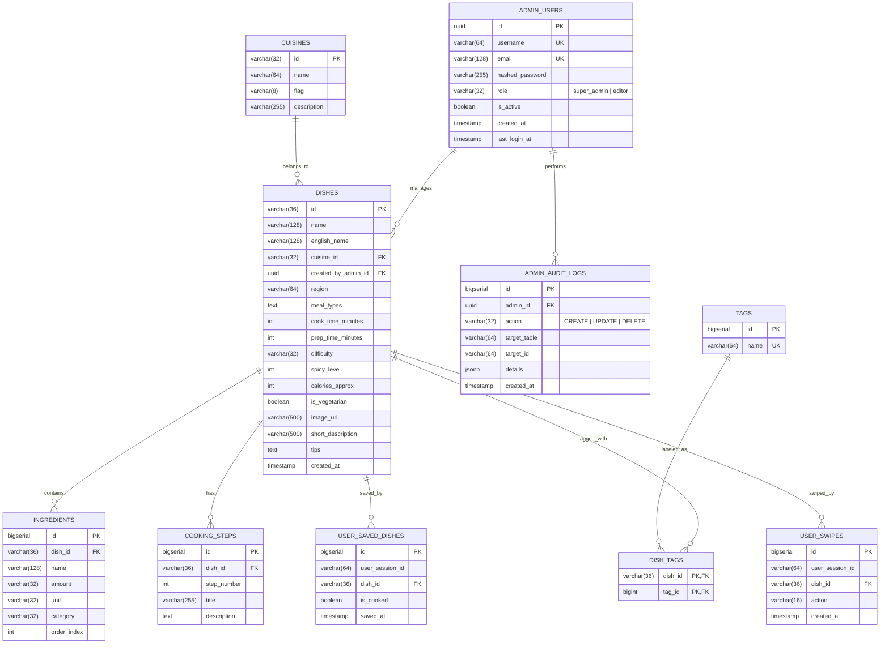

# 🍲 07. Data Schema & Food Seed Data Specification

Tài liệu này định nghĩa cấu trúc dữ liệu JSON chuẩn (Data Schema), từ điển phân loại (Taxonomy) và cung cấp bộ dữ liệu mẫu (Seed Data) đại diện cho các nền ẩm thực phổ biến để đội Backend và Data Collector có thể sử dụng ngay mà không phải chờ đợi.

---

## 1. Cấu Trúc JSON Schema Món Ăn (Dish Schema)

Mỗi bản ghi món ăn trong hệ thống **YumYumPick** tuân thủ cấu trúc JSON đầy đủ sau:

```json
{
  "id": "dish_vn_001",
  "name": "Tên món ăn (tiếng Việt)",
  "english_name": "Tên tiếng Anh của món ăn",
  "cuisine": "Vietnam | Korea | Japan | Thailand | Italy",
  "region": "Vùng miền (vd: Miền Bắc, Miền Nam, Seoul, Tokyo...)",
  "meal_type": ["breakfast", "lunch", "dinner", "snack"],
  "image": "URL ảnh WebP chất lượng cao (Unsplash / CDN)",
  "cook_time_minutes": 30,
  "prep_time_minutes": 15,
  "difficulty": "Dễ | Trung bình | Kỳ công",
  "spicy_level": 0,
  "calories_approx": 450,
  "is_vegetarian": false,
  "tags": ["Ăn sáng", "Nước lèo", "Truyền thống", "Dễ làm"],
  "short_description": "Mô tả ngắn 1-2 câu hiển thị tóm tắt trên thẻ quẹt.",
  "ingredients": [
    {
      "name": "Tên nguyên liệu",
      "amount": "Số lượng (chuỗi)",
      "unit": "Đơn vị tính (g, ml, muỗng, quả, lạng)",
      "category": "thịt | rau | gia vị | tinh bột"
    }
  ],
  "steps": [
    {
      "step_number": 1,
      "title": "Tiêu đề bước",
      "description": "Hướng dẫn chi tiết cách làm bước này."
    }
  ],
  "tips": "Mẹo nhỏ của đầu bếp giúp món ăn ngon hơn hoặc bảo quản tốt hơn."
}
```

---

## 2. Từ Điển Phân Loại Chuẩn (Controlled Taxonomies)

Để đảm bảo bộ lọc hoạt động chính xác tuyệt đối, toàn bộ dữ liệu phải sử dụng các giá trị chuẩn sau:

### 2.1. Quốc Gia / Nền Ẩm Thực (`cuisine`)
- `Vietnam`: Ẩm thực Việt Nam (Phở, Cơm tấm, Bún bò, Bánh mì...)
- `Korea`: Ẩm thực Hàn Quốc (Bibimbap, Kimchi Jjigae, Tokbokki, Bulgogi...)
- `Japan`: Ẩm thực Nhật Bản (Ramen, Udon, Gyudon, Curry, Sushi...)
- `Thailand`: Ẩm thực Thái Lan (Pad Thai, Tom Yum, Pad Krapow, Som Tum...)
- `Italy`: Ẩm thực Ý / Phương Tây (Pasta, Pizza, Steak, Risotto, Salad...)

### 2.2. Cấp Độ Cay (`spicy_level`)
- `0`: Hoàn toàn không cay (trẻ em và người không ăn cay ăn thoải mái).
- `1`: Cay nhẹ (thoang thoảng vị tiêu hoặc ớt dịu).
- `2`: Cay vừa (chuẩn vị Thái, Hàn, bún bò Huế).
- `3`: Cay nồng (dành cho tín đồ thích ăn cay rực lưỡi).

### 2.3. Độ Khó Chế Biến (`difficulty`)
- `Dễ`: Dưới 20 phút chuẩn bị và nấu, dụng cụ nấu ăn cơ bản (chảo/nồi đơn giản).
- `Trung bình`: 20 - 45 phút, cần một chút kỹ năng nêm nếm và kiểm soát lửa.
- `Kỳ công`: Trên 45 phút, cần ninh hầm lâu hoặc nhiều bước sơ chế tỉ mỉ.

---

## 3. Bộ Dữ Liệu Mẫu Đại Diện (Seed Data Samples)

Đội Backend/Data có thể lưu trữ dữ liệu này tại `backend/app/data/dishes_seed.json`:

```json
[
  {
    "id": "dish_vn_001",
    "name": "Phở Bò Tái Nạm",
    "english_name": "Traditional Beef Pho",
    "cuisine": "Vietnam",
    "region": "Miền Bắc",
    "meal_type": ["breakfast", "lunch", "dinner"],
    "image": "https://images.unsplash.com/photo-1582878826629-29b7ad1cdc43?auto=format&fit=crop&w=800&q=80",
    "cook_time_minutes": 60,
    "prep_time_minutes": 20,
    "difficulty": "Kỳ công",
    "spicy_level": 0,
    "calories_approx": 480,
    "is_vegetarian": false,
    "tags": ["Ăn sáng", "Nước lèo", "Truyền thống", "Món nước"],
    "short_description": "Món quốc hồn quốc túy với bánh phở mềm dai, nước dùng hầm từ xương bò thơm mùi quế hồi thảo quả nức mũi.",
    "ingredients": [
      { "name": "Bánh phở tươi", "amount": "500", "unit": "g", "category": "tinh bột" },
      { "name": "Thịt bò thăn / bắp", "amount": "300", "unit": "g", "category": "thịt" },
      { "name": "Xương ống bò ninh", "amount": "1", "unit": "kg", "category": "thịt" },
      { "name": "Gừng và hành tím nướng", "amount": "3", "unit": "củ", "category": "gia vị" },
      { "name": "Hoa hồi, quế, thảo quả", "amount": "1", "unit": "gói", "category": "gia vị" },
      { "name": "Hành lá, rau mùi, chanh ớt", "amount": "1", "unit": "bó", "category": "rau" }
    ],
    "steps": [
      {
        "step_number": 1,
        "title": "Chần xương và hầm nước dùng",
        "description": "Chần xương bò với nước sôi khử mùi hôi. Cho xương vào nồi lớn hầm nhỏ lửa trong 2 tiếng cùng hành tím, gừng đã nướng cháy xém cạnh."
      },
      {
        "step_number": 2,
        "title": "Nấu thơm hương vị phở",
        "description": "Rang thơm hoa hồi, quế, thảo quả cho vào túi vải buộc chặt rồi thả vào nồi nước dùng. Nêm nước mắm ngon, muối, đường phèn vừa vị."
      },
      {
        "step_number": 3,
        "title": "Hoàn thiện và thưởng thức",
        "description": "Trụng bánh phở qua nước sôi xếp vào tô, đặt thịt bò tái thái mỏng lên trên, rắc hành lá rau mùi rồi chan ngập nước dùng đang sôi sùng sục."
      }
    ],
    "tips": "Nước dùng phở muốn trong thì không được đậy nắp vung kín và phải thường xuyên vớt sạch bọt nổi."
  },
  {
    "id": "dish_vn_002",
    "name": "Cơm Tấm Sườn Bì Chả",
    "english_name": "Saigon Broken Rice with Grilled Pork",
    "cuisine": "Vietnam",
    "region": "Miền Nam",
    "meal_type": ["breakfast", "lunch", "dinner"],
    "image": "https://images.unsplash.com/photo-1574484284002-952d92456975?auto=format&fit=crop&w=800&q=80",
    "cook_time_minutes": 35,
    "prep_time_minutes": 20,
    "difficulty": "Trung bình",
    "spicy_level": 0,
    "calories_approx": 650,
    "is_vegetarian": false,
    "tags": ["Cơm", "Đậm đà", "Đặc sản Sài Gòn", "Bình dân"],
    "short_description": "Đĩa cơm tấm dẻo thơm ăn kèm sườn cốt lết nướng mật ong vàng óng, mỡ hành béo ngậy và nước mắm chua ngọt.",
    "ingredients": [
      { "name": "Gạo tấm thơm", "amount": "300", "unit": "g", "category": "tinh bột" },
      { "name": "Sườn cốt lết heo", "amount": "400", "unit": "g", "category": "thịt" },
      { "name": "Bì heo trộn thính", "amount": "100", "unit": "g", "category": "thịt" },
      { "name": "Chả trứng hấp", "amount": "2", "unit": "miếng", "category": "thịt" },
      { "name": "Hành lá làm mỡ hành", "amount": "1", "unit": "bó", "category": "rau" },
      { "name": "Đồ chua củ cải cà rốt", "amount": "1", "unit": "chén nhỏ", "category": "rau" }
    ],
    "steps": [
      {
        "step_number": 1,
        "title": "Ướp sườn nướng",
        "description": "Ướp sườn với sữa đặc, sả băm, tỏi băm, mật ong, nước mắm và chút dầu hào trong ít nhất 30 phút để thịt mềm thấm vị."
      },
      {
        "step_number": 2,
        "title": "Nướng sườn vàng óng",
        "description": "Nướng sườn trên than hoa hoặc nồi chiên không dầu ở nhiệt độ 180°C trong 15 phút, lật mặt và quét nước ướp nướng thêm 5 phút."
      },
      {
        "step_number": 3,
        "title": "Bày đĩa hoàn chỉnh",
        "description": "Xới cơm tấm nóng hổi ra đĩa, xếp miếng sườn nướng xém cạnh, bì sợi, chả trứng, rưới đẫm mỡ hành và ăn cùng nước mắm chua ngọt kẹo."
      }
    ],
    "tips": "Ướp sườn cùng một chút sữa đặc hoặc nước ép táo/lê sẽ giúp thịt nướng cực kỳ mềm ngọt mà không bị khô dai."
  },
  {
    "id": "dish_kr_001",
    "name": "Cơm Trộn Hàn Quốc (Bibimbap)",
    "english_name": "Korean Mixed Rice Bowl (Bibimbap)",
    "cuisine": "Korea",
    "region": "Seoul",
    "meal_type": ["lunch", "dinner"],
    "image": "https://images.unsplash.com/photo-1590301157890-4810ed352733?auto=format&fit=crop&w=800&q=80",
    "cook_time_minutes": 25,
    "prep_time_minutes": 15,
    "difficulty": "Dễ",
    "spicy_level": 2,
    "calories_approx": 520,
    "is_vegetarian": false,
    "tags": ["Nhanh gọn", "Nhiều rau", "Cay cay", "Healthy"],
    "short_description": "Tô cơm nóng đầy màu sắc với rau củ xào, thịt bò băm, trứng lòng đào quyện cùng tương ớt Gochujang thơm lừng dầu mè.",
    "ingredients": [
      { "name": "Cơm trắng nóng", "amount": "2", "unit": "bát", "category": "tinh bột" },
      { "name": "Thịt bò băm", "amount": "150", "unit": "g", "category": "thịt" },
      { "name": "Rau bina (cải bó xôi)", "amount": "100", "unit": "g", "category": "rau" },
      { "name": "Cà rốt thái sợi", "amount": "1", "unit": "củ", "category": "rau" },
      { "name": "Giá đỗ tương", "amount": "100", "unit": "g", "category": "rau" },
      { "name": "Nấm đông cô hoặc nấm hương", "amount": "50", "unit": "g", "category": "rau" },
      { "name": "Trứng gà", "amount": "2", "unit": "quả", "category": "thịt" },
      { "name": "Sốt tương ớt Gochujang + dầu mè", "amount": "2", "unit": "muỗng canh", "category": "gia vị" }
    ],
    "steps": [
      {
        "step_number": 1,
        "title": "Sơ chế rau củ",
        "description": "Chần sơ rau bina và giá đỗ, vắt ráo nước rồi trộn với chút muối và dầu mè. Cà rốt và nấm xào chín tới trên chảo nóng."
      },
      {
        "step_number": 2,
        "title": "Xào thịt bò và ốp la trứng",
        "description": "Xào thịt bò băm với tỏi băm và xì dầu. Chiên ốp la 2 quả trứng gà giữ nguyên lòng đào thơm ngậy."
      },
      {
        "step_number": 3,
        "title": "Trình bày và trộn đều",
        "description": "Cho cơm vào tô lớn, xếp từng loại rau và thịt theo hình nan quạt xung quanh, đặt quả trứng lòng đào ở chính giữa, cho sốt Gochujang rồi trộn đều khi ăn."
      }
    ],
    "tips": "Nếu có âu đá (Dolsot), làm nóng âu đá với chút dầu mè trước khi cho cơm vào để đáy cơm giòn rụm như cơm cháy."
  },
  {
    "id": "dish_jp_001",
    "name": "Mì Ramen Thịt Heo Chashu",
    "english_name": "Tonkotsu Pork Ramen",
    "cuisine": "Japan",
    "region": "Kyushu",
    "meal_type": ["lunch", "dinner"],
    "image": "https://images.unsplash.com/photo-1569718212165-3a8278d5f624?auto=format&fit=crop&w=800&q=80",
    "cook_time_minutes": 45,
    "prep_time_minutes": 20,
    "difficulty": "Trung bình",
    "spicy_level": 0,
    "calories_approx": 580,
    "is_vegetarian": false,
    "tags": ["Món nước", "Béo ngậy", "Nhật Bản", "Mì"],
    "short_description": "Mì ramen sợi dai vàng óng trong làn nước súp xương hầm béo ngậy, lát thịt chashu cuộn mềm tan và trứng ngâm tương Ajitsuke.",
    "ingredients": [
      { "name": "Mì Ramen tươi", "amount": "2", "unit": "vắt", "category": "tinh bột" },
      { "name": "Thịt ba chỉ cuộn Chashu", "amount": "200", "unit": "g", "category": "thịt" },
      { "name": "Trứng lòng đào ngâm tương", "amount": "2", "unit": "quả", "category": "thịt" },
      { "name": "Rong biển Nori sấy", "amount": "2", "unit": "lá", "category": "rau" },
      { "name": "Hành baro thái mỏng", "amount": "1", "unit": "cây", "category": "rau" },
      { "name": "Nước cốt súp Tonkotsu cô đặc", "amount": "1", "unit": "gói", "category": "gia vị" }
    ],
    "steps": [
      {
        "step_number": 1,
        "title": "Nấu nước dùng súp ramen",
        "description": "Hòa gói súp Tonkotsu với 600ml nước sôi, đun liu riu để nước súp hòa quyện vị béo ngậy của tủy xương."
      },
      {
        "step_number": 2,
        "title": "Luộc mì Ramen",
        "description": "Luộc mì trong nước sôi khoảng 1 phút 30 giây đến 2 phút cho mì đạt độ dai chuẩn (al dente), vớt ra xóc ráo nước."
      },
      {
        "step_number": 3,
        "title": "Bày tô mì",
        "description": "Cho mì vào bát, chan ngập súp nóng, xếp các lát thịt chashu áp chảo thơm lừng, nửa quả trứng ngâm tương, rong biển và hành baro lên trên."
      }
    ],
    "tips": "Luôn tráng nóng bát sứ đựng ramen bằng nước sôi trước khi cho mì vào để giữ nhiệt độ món ăn luôn nóng hổi trọn vị."
  },
  {
    "id": "dish_th_001",
    "name": "Hủ Tiếu Xào Thái Lan (Pad Thai)",
    "english_name": "Traditional Shrimp Pad Thai",
    "cuisine": "Thailand",
    "region": "Bangkok",
    "meal_type": ["lunch", "dinner"],
    "image": "https://images.unsplash.com/photo-1559847844-5315695dadae?auto=format&fit=crop&w=800&q=80",
    "cook_time_minutes": 20,
    "prep_time_minutes": 10,
    "difficulty": "Dễ",
    "spicy_level": 1,
    "calories_approx": 460,
    "is_vegetarian": false,
    "tags": ["Xào", "Chua ngọt", "Hải sản", "Nhanh gọn"],
    "short_description": "Món xào đường phố trứ danh của xứ sở Chùa Vàng: bánh phở xào tôm tươi, đậu hũ chiên, trứng và sốt me chua cay bùi béo.",
    "ingredients": [
      { "name": "Bánh phở xào Pad Thai khô", "amount": "200", "unit": "g", "category": "tinh bột" },
      { "name": "Tôm tươi bóc vỏ", "amount": "150", "unit": "g", "category": "thịt" },
      { "name": "Đậu hũ cắt hạt lựu chiên vàng", "amount": "1", "unit": "bìa", "category": "rau" },
      { "name": "Trứng gà", "amount": "2", "unit": "quả", "category": "thịt" },
      { "name": "Giá đỗ và hẹ lá", "amount": "100", "unit": "g", "category": "rau" },
      { "name": "Đậu phộng rang giã dập", "amount": "2", "unit": "muỗng canh", "category": "gia vị" },
      { "name": "Nước cốt me, đường thốt nốt, nước mắm", "amount": "3", "unit": "muỗng canh", "category": "gia vị" }
    ],
    "steps": [
      {
        "step_number": 1,
        "title": "Ngâm phở và pha sốt me",
        "description": "Ngâm phở trong nước ấm 20 phút cho mềm dẻo. Khuấy đều nước cốt me, đường thốt nốt và nước mắm thành sốt sánh chua ngọt."
      },
      {
        "step_number": 2,
        "title": "Xào tôm và trứng",
        "description": "Phi thơm hành tỏi trên chảo lớn với lửa to, cho tôm và đậu hũ vào đảo chín. Gạt tôm sang một góc, đập trứng vào đảo đều cho tơi."
      },
      {
        "step_number": 3,
        "title": "Xào phở và hoàn thiện",
        "description": "Cho phở và sốt me vào đảo liên tục trong 2 phút trên lửa lớn. Thêm giá đỗ và hẹ lá đảo nhanh 30 giây rồi tắt bếp. Rắc đậu phộng rang và vắt chanh khi ăn."
      }
    ],
    "tips": "Nấu Pad Thai bắt buộc chảo phải thật nóng và xào lửa lớn thì sợi phở mới dậy mùi khói đặc trưng (Wok hei)."
  },
  {
    "id": "dish_it_001",
    "name": "Mì Ý Sốt Kem Thịt Xông Khói (Spaghetti Carbonara)",
    "english_name": "Classic Italian Spaghetti Carbonara",
    "cuisine": "Italy",
    "region": "Rome",
    "meal_type": ["lunch", "dinner"],
    "image": "https://images.unsplash.com/photo-1612874742237-6526221588e3?auto=format&fit=crop&w=800&q=80",
    "cook_time_minutes": 15,
    "prep_time_minutes": 10,
    "difficulty": "Dễ",
    "spicy_level": 0,
    "calories_approx": 540,
    "is_vegetarian": false,
    "tags": ["Mì Ý", "Béo bùi", "Chuẩn vị Âu", "Dưới 20 phút"],
    "short_description": "Món mì Ý truyền thống sốt trứng và phô mai Parmesan béo ngậy, hạt tiêu đen cay nhẹ quyện cùng thịt xông khói áp chảo giòn tan.",
    "ingredients": [
      { "name": "Mì sợi dài Spaghetti No.5", "amount": "200", "unit": "g", "category": "tinh bột" },
      { "name": "Thịt xông khói (Bacon / Guanciale)", "amount": "100", "unit": "g", "category": "thịt" },
      { "name": "Lòng đỏ trứng gà tươi", "amount": "3", "unit": "quả", "category": "thịt" },
      { "name": "Phô mai Parmesan hoặc Pecorino bào mịn", "amount": "50", "unit": "g", "category": "gia vị" },
      { "name": "Tiêu đen xay thô", "amount": "1", "unit": "muỗng cà phê", "category": "gia vị" }
    ],
    "steps": [
      {
        "step_number": 1,
        "title": "Luộc mì Ý chuẩn Al Dente",
        "description": "Đun sôi nước với nhiều muối, cho mì vào luộc trong 8-9 phút. Giữ lại 1 cốc nước luộc mì trước khi vớt ra ráo nước."
      },
      {
        "step_number": 2,
        "title": "Áp chảo thịt xông khói và trộn sốt",
        "description": "Áp chảo thịt xông khói trên lửa vừa đến khi ra mỡ và giòn xém. Đánh tan lòng đỏ trứng cùng phô mai bào và tiêu đen trong một chiếc âu nhỏ."
      },
      {
        "step_number": 3,
        "title": "Trộn sốt mượt mà không vón cục",
        "description": "Tắt bếp trên chảo thịt, cho mì nóng vào đảo đều. Đổ hỗn hợp sốt trứng phô mai vào đảo nhanh tay cùng 2 muỗng nước luộc mì để tạo độ sánh mượt."
      }
    ],
    "tips": "Tuyệt đối không trộn sốt trứng khi chảo còn đang bật lửa lớn vì nhiệt độ cao sẽ làm trứng chín vón cục như món trứng bác."
  }
]
```

---

## 4. Hướng Dẫn Thu Thập & Tối Ưu Hình Ảnh (Image Guidelines)

1. **Nguồn ảnh chất lượng cao, miễn phí bản quyền:**
   - [Unsplash.com](https://unsplash.com): Tìm từ khóa tiếng Anh (vd: `vietnamese pho`, `korean bibimbap`, `ramen`, `pad thai`, `pasta`).
   - Chọn ảnh có bố cục chụp từ trên xuống (Flat lay) hoặc chụp nghiêng $45^\circ$, ánh sáng tự nhiên ấm áp, màu sắc tươi tắn.
2. **Tham số URL tối ưu (URL Optimization Parameters):**
   - Thêm các query param vào đuôi ảnh Unsplash: `?auto=format&fit=crop&w=800&q=80`
   - Điều này giúp Unsplash tự động trả về định dạng **WebP** nhẹ nhất với chiều rộng $800\text{px}$, tải siêu nhanh trên cả 3G/4G di động.

---

---

## 5. Thiết Kế Cơ Sở Dữ Liệu Supabase (PostgreSQL Schema & ERD)

Hệ thống sử dụng **Supabase (PostgreSQL 15+)** làm cơ sở dữ liệu trung tâm, phục vụ cả người dùng cuối (User App) và ban quản trị nội dung (Admin/CMS Portal).

### 5.1. Sơ Đồ Thực Thể - Mối Quan Hệ (Full System ERD)



### 5.2. Kịch Bản SQL DDL (Supabase SQL Editor)

```sql
-- Kích hoạt extension UUID
CREATE EXTENSION IF NOT EXISTS "uuid-ossp";

-- 1. Bảng Quản Trị Viên (Admin Users)
CREATE TABLE IF NOT EXISTS public.admin_users (
    id UUID PRIMARY KEY DEFAULT gen_random_uuid(),
    username VARCHAR(64) NOT NULL UNIQUE,
    email VARCHAR(128) NOT NULL UNIQUE,
    hashed_password VARCHAR(255) NOT NULL,
    role VARCHAR(32) NOT NULL DEFAULT 'editor', -- 'super_admin', 'editor'
    is_active BOOLEAN NOT NULL DEFAULT TRUE,
    created_at TIMESTAMPTZ NOT NULL DEFAULT NOW(),
    last_login_at TIMESTAMPTZ
);

-- Tài khoản Admin mặc định khởi tạo (User: admin / Pass: admin123)
INSERT INTO public.admin_users (id, username, email, hashed_password, role, is_active)
VALUES (
    'a0000000-0000-0000-0000-000000000001',
    'admin',
    'admin@yunyumpick.com',
    '$2b$12$K1jE7C8zB1sWqQkXg4oXeOU6a9mO1nZ6zK9zV7jG3bH8dJ5kL2m1O', -- hashed bcrypt
    'super_admin',
    TRUE
) ON CONFLICT (username) DO NOTHING;

-- 2. Bảng Nhật Ký Hoạt Động Quản Trị (Admin Audit Logs)
CREATE TABLE IF NOT EXISTS public.admin_audit_logs (
    id BIGSERIAL PRIMARY KEY,
    admin_id UUID NOT NULL REFERENCES public.admin_users(id) ON DELETE CASCADE,
    action VARCHAR(32) NOT NULL, -- 'CREATE_DISH', 'UPDATE_DISH', 'DELETE_DISH'
    target_table VARCHAR(64) NOT NULL,
    target_id VARCHAR(64) NOT NULL,
    details JSONB,
    created_at TIMESTAMPTZ NOT NULL DEFAULT NOW()
);

CREATE INDEX IF NOT EXISTS idx_audit_admin ON public.admin_audit_logs(admin_id);

-- 3. Bảng Quốc Gia / Nền Ẩm Thực
CREATE TABLE IF NOT EXISTS public.cuisines (
    id VARCHAR(32) PRIMARY KEY,
    name VARCHAR(64) NOT NULL,
    flag VARCHAR(8) NOT NULL,
    description VARCHAR(255)
);

-- 4. Bảng Món Ăn (Dishes)
CREATE TABLE IF NOT EXISTS public.dishes (
    id VARCHAR(36) PRIMARY KEY,
    name VARCHAR(128) NOT NULL,
    english_name VARCHAR(128),
    cuisine_id VARCHAR(32) NOT NULL REFERENCES public.cuisines(id) ON UPDATE CASCADE,
    created_by_admin_id UUID REFERENCES public.admin_users(id) ON DELETE SET NULL,
    region VARCHAR(64),
    meal_types TEXT[] DEFAULT ARRAY['lunch', 'dinner']::TEXT[],
    cook_time_minutes INT NOT NULL DEFAULT 30,
    prep_time_minutes INT NOT NULL DEFAULT 15,
    difficulty VARCHAR(32) NOT NULL DEFAULT 'Trung bình',
    spicy_level SMALLINT NOT NULL DEFAULT 0,
    calories_approx INT NOT NULL DEFAULT 400,
    is_vegetarian BOOLEAN NOT NULL DEFAULT FALSE,
    image_url VARCHAR(500) NOT NULL,
    short_description VARCHAR(500) NOT NULL,
    tips TEXT,
    created_at TIMESTAMPTZ NOT NULL DEFAULT NOW()
);

CREATE INDEX IF NOT EXISTS idx_dishes_cuisine ON public.dishes(cuisine_id);
CREATE INDEX IF NOT EXISTS idx_dishes_difficulty ON public.dishes(difficulty);
CREATE INDEX IF NOT EXISTS idx_dishes_cook_time ON public.dishes(cook_time_minutes);

-- 5. Bảng Nguyên Liệu (Ingredients)
CREATE TABLE IF NOT EXISTS public.ingredients (
    id BIGSERIAL PRIMARY KEY,
    dish_id VARCHAR(36) NOT NULL REFERENCES public.dishes(id) ON DELETE CASCADE,
    name VARCHAR(128) NOT NULL,
    amount VARCHAR(32) NOT NULL,
    unit VARCHAR(32) NOT NULL,
    category VARCHAR(32) NOT NULL DEFAULT 'khác',
    order_index INT NOT NULL DEFAULT 1
);

CREATE INDEX IF NOT EXISTS idx_ingredients_dish ON public.ingredients(dish_id);

-- 6. Bảng Các Bước Nấu Ăn (Cooking Steps)
CREATE TABLE IF NOT EXISTS public.cooking_steps (
    id BIGSERIAL PRIMARY KEY,
    dish_id VARCHAR(36) NOT NULL REFERENCES public.dishes(id) ON DELETE CASCADE,
    step_number INT NOT NULL,
    title VARCHAR(255) NOT NULL,
    description TEXT NOT NULL
);

CREATE INDEX IF NOT EXISTS idx_steps_dish ON public.cooking_steps(dish_id, step_number);

-- 7. Bảng Nhãn Món Ăn (Tags)
CREATE TABLE IF NOT EXISTS public.tags (
    id BIGSERIAL PRIMARY KEY,
    name VARCHAR(64) NOT NULL UNIQUE
);

CREATE TABLE IF NOT EXISTS public.dish_tags (
    dish_id VARCHAR(36) NOT NULL REFERENCES public.dishes(id) ON DELETE CASCADE,
    tag_id BIGINT NOT NULL REFERENCES public.tags(id) ON DELETE CASCADE,
    PRIMARY KEY (dish_id, tag_id)
);

-- 8. Bảng Món Đã Lưu Của Người Dùng (User Saved Dishes)
CREATE TABLE IF NOT EXISTS public.user_saved_dishes (
    id BIGSERIAL PRIMARY KEY,
    user_session_id VARCHAR(64) NOT NULL,
    dish_id VARCHAR(36) NOT NULL REFERENCES public.dishes(id) ON DELETE CASCADE,
    is_cooked BOOLEAN NOT NULL DEFAULT FALSE,
    saved_at TIMESTAMPTZ NOT NULL DEFAULT NOW(),
    CONSTRAINT uq_user_dish UNIQUE (user_session_id, dish_id)
);

CREATE INDEX IF NOT EXISTS idx_saved_session ON public.user_saved_dishes(user_session_id);

-- 9. Bảng Lịch Sử Quẹt Của Người Dùng (User Swipes)
CREATE TABLE IF NOT EXISTS public.user_swipes (
    id BIGSERIAL PRIMARY KEY,
    user_session_id VARCHAR(64) NOT NULL,
    dish_id VARCHAR(36) NOT NULL REFERENCES public.dishes(id) ON DELETE CASCADE,
    action VARCHAR(16) NOT NULL CHECK (action IN ('like', 'skip')),
    created_at TIMESTAMPTZ NOT NULL DEFAULT NOW()
);

CREATE INDEX IF NOT EXISTS idx_swipes_session ON public.user_swipes(user_session_id);
```

---

## 6. Kịch Bản Tự Động Nạp Dữ Liệu (Seed Script for Supabase)

Script Python nạp dữ liệu ban đầu và khởi tạo tài khoản quản trị mặc định:

```python
import json
import os
from sqlalchemy import create_engine, text
from sqlalchemy.orm import sessionmaker

DATABASE_URL = os.getenv("DATABASE_URL")

engine = create_engine(DATABASE_URL)
SessionLocal = sessionmaker(bind=engine)

def seed_supabase():
    db = SessionLocal()
    
    # 1. Khởi tạo tài khoản Admin mặc định
    db.execute(text("""
        INSERT INTO public.admin_users (id, username, email, hashed_password, role, is_active)
        VALUES (
            'a0000000-0000-0000-0000-000000000001',
            'admin',
            'admin@yunyumpick.com',
            '$2b$12$K1jE7C8zB1sWqQkXg4oXeOU6a9mO1nZ6zK9zV7jG3bH8dJ5kL2m1O',
            'super_admin',
            TRUE
        ) ON CONFLICT (username) DO NOTHING;
    """))

    # 2. Nạp danh mục Cuisines
    cuisines = [
        ("Vietnam", "Việt Nam", "🇻🇳", "Ẩm thực truyền thống Việt Nam đậm đà, tươi ngon."),
        ("Korea", "Hàn Quốc", "🇰🇷", "Món ăn cay nồng, đậm vị lên men xứ sở kim chi."),
        ("Japan", "Nhật Bản", "🇯🇵", "Hương vị thanh tao, tôn vinh nguyên liệu tự nhiên nguyên bản."),
        ("Thailand", "Thái Lan", "🇹🇭", "Sự bùng nổ hài hòa giữa chua, cay, mặn, ngọt đặc sắc."),
        ("Italy", "Ý / Phương Tây", "🇮🇹", "Ẩm thực Ý tinh tế với phô mai, dầu ô liu và thảo mộc.")
    ]
    for cid, name, flag, desc in cuisines:
        db.execute(text("""
            INSERT INTO public.cuisines (id, name, flag, description)
            VALUES (:id, :name, :flag, :description)
            ON CONFLICT (id) DO NOTHING;
        """), {"id": cid, "name": name, "flag": flag, "description": desc})

    # 3. Nạp dữ liệu món ăn từ file JSON
    json_path = os.path.join(os.path.dirname(__file__), "..", "data", "dishes_seed.json")
    with open(json_path, "r", encoding="utf-8") as f:
        dishes = json.load(f)

    for item in dishes:
        db.execute(text("""
            INSERT INTO public.dishes (
                id, name, english_name, cuisine_id, created_by_admin_id, region, cook_time_minutes,
                prep_time_minutes, difficulty, spicy_level, calories_approx,
                is_vegetarian, image_url, short_description, tips
            ) VALUES (
                :id, :name, :english_name, :cuisine_id, 'a0000000-0000-0000-0000-000000000001',
                :region, :cook_time_minutes, :prep_time_minutes, :difficulty, :spicy_level,
                :calories_approx, :is_vegetarian, :image_url, :short_description, :tips
            ) ON CONFLICT (id) DO NOTHING;
        """), {
            "id": item["id"],
            "name": item["name"],
            "english_name": item.get("english_name"),
            "cuisine_id": item["cuisine"],
            "region": item.get("region"),
            "cook_time_minutes": item["cook_time_minutes"],
            "prep_time_minutes": item.get("prep_time_minutes", 15),
            "difficulty": item["difficulty"],
            "spicy_level": item.get("spicy_level", 0),
            "calories_approx": item.get("calories_approx", 400),
            "is_vegetarian": item.get("is_vegetarian", False),
            "image_url": item["image"],
            "short_description": item["short_description"],
            "tips": item.get("tips")
        })

        for idx, ing in enumerate(item.get("ingredients", [])):
            db.execute(text("""
                INSERT INTO public.ingredients (dish_id, name, amount, unit, category, order_index)
                VALUES (:dish_id, :name, :amount, :unit, :category, :order_index);
            """), {
                "dish_id": item["id"],
                "name": ing["name"],
                "amount": str(ing.get("amount", "")),
                "unit": ing.get("unit", ""),
                "category": ing.get("category", "khác"),
                "order_index": idx + 1
            })

        for step in item.get("steps", []):
            db.execute(text("""
                INSERT INTO public.cooking_steps (dish_id, step_number, title, description)
                VALUES (:dish_id, :step_number, :title, :description);
            """), {
                "dish_id": item["id"],
                "step_number": step["step_number"],
                "title": step["title"],
                "description": step["description"]
            })

    db.commit()
    db.close()
    print("Seed Supabase database and admin account completed.")

if __name__ == "__main__":
    seed_supabase()
```


