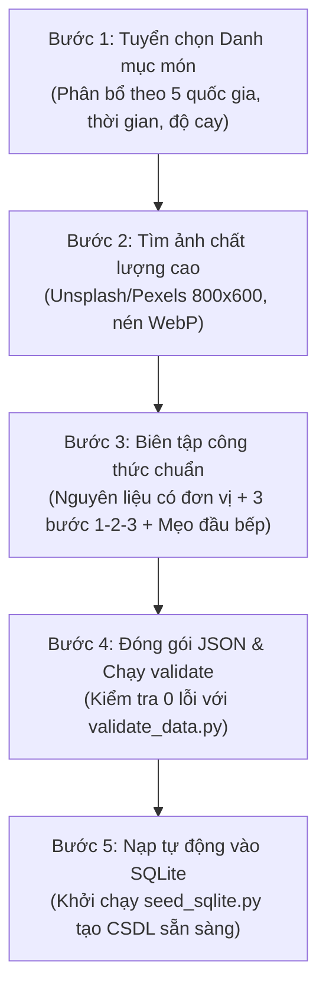

# 🍲 07. Cẩm Nang Chuẩn Bị Dữ Liệu & Thiết Kế CSDL SQLite (Data Preparation Guide)

Tài liệu này là cẩm nang toàn diện về **Quy trình chuẩn bị dữ liệu (Data Preparation Process)**, từ điển phân loại (Controlled Taxonomy), cấu trúc CSDL **SQLite**, danh mục **45 món ăn hoàn chỉnh**, kịch bản kiểm tra chất lượng dữ liệu (`validate_data.py`) và công cụ tự động nạp CSDL (`seed_sqlite.py`) cho dự án **YumYumPick**.

---

## 1. Kịch Bản Tạo Bảng CSDL SQLite (SQLite DDL Schema)

Toàn bộ CSDL được lưu trữ trong một file duy nhất: `backend/yumyumpick.db`. File SQL khởi tạo tương ứng đặt tại `backend/app/db/schema.sql`.

```sql
-- Kích hoạt ràng buộc khóa ngoại trong SQLite
PRAGMA foreign_keys = ON;

-- 1. Bảng người dùng đơn giản (Simple Users)
CREATE TABLE IF NOT EXISTS users (
    id INTEGER PRIMARY KEY AUTOINCREMENT,
    username TEXT NOT NULL UNIQUE,
    password TEXT NOT NULL,
    full_name TEXT NOT NULL,
    created_at DATETIME DEFAULT CURRENT_TIMESTAMP
);

-- 2. Bảng danh mục quốc gia / ẩm thực (Cuisines)
CREATE TABLE IF NOT EXISTS cuisines (
    id TEXT PRIMARY KEY,
    name TEXT NOT NULL,
    flag_emoji TEXT NOT NULL
);

-- 3. Bảng món ăn chính (Dishes)
CREATE TABLE IF NOT EXISTS dishes (
    id TEXT PRIMARY KEY,
    name TEXT NOT NULL,
    english_name TEXT,
    cuisine_id TEXT NOT NULL,
    region TEXT,
    image TEXT NOT NULL,
    cook_time_minutes INTEGER NOT NULL,
    prep_time_minutes INTEGER DEFAULT 10,
    difficulty TEXT DEFAULT 'Dễ',
    spicy_level INTEGER DEFAULT 0,
    calories_approx INTEGER DEFAULT 400,
    short_description TEXT NOT NULL,
    tips TEXT,
    created_at DATETIME DEFAULT CURRENT_TIMESTAMP,
    FOREIGN KEY (cuisine_id) REFERENCES cuisines(id) ON UPDATE CASCADE
);

-- 4. Bảng nguyên liệu chi tiết (Ingredients)
CREATE TABLE IF NOT EXISTS ingredients (
    id INTEGER PRIMARY KEY AUTOINCREMENT,
    dish_id TEXT NOT NULL,
    name TEXT NOT NULL,
    amount TEXT NOT NULL,
    unit TEXT NOT NULL,
    category TEXT DEFAULT 'nguyên liệu chính',
    FOREIGN KEY (dish_id) REFERENCES dishes(id) ON DELETE CASCADE
);

-- 5. Bảng các bước nấu ăn (Cooking Steps)
CREATE TABLE IF NOT EXISTS cooking_steps (
    id INTEGER PRIMARY KEY AUTOINCREMENT,
    dish_id TEXT NOT NULL,
    step_number INTEGER NOT NULL,
    title TEXT NOT NULL,
    description TEXT NOT NULL,
    FOREIGN KEY (dish_id) REFERENCES dishes(id) ON DELETE CASCADE
);

-- 6. Bảng món ăn đã lưu của người dùng (User Saved Dishes)
CREATE TABLE IF NOT EXISTS user_saved_dishes (
    id INTEGER PRIMARY KEY AUTOINCREMENT,
    user_id INTEGER NOT NULL,
    dish_id TEXT NOT NULL,
    saved_at DATETIME DEFAULT CURRENT_TIMESTAMP,
    UNIQUE(user_id, dish_id),
    FOREIGN KEY (user_id) REFERENCES users(id) ON DELETE CASCADE,
    FOREIGN KEY (dish_id) REFERENCES dishes(id) ON DELETE CASCADE
);

-- Tạo chỉ mục tìm kiếm tối ưu
CREATE INDEX IF NOT EXISTS idx_dishes_cuisine ON dishes(cuisine_id);
CREATE INDEX IF NOT EXISTS idx_dishes_cook_time ON dishes(cook_time_minutes);
CREATE INDEX IF NOT EXISTS idx_saved_user ON user_saved_dishes(user_id);
```

---

## 2. Quy Trình Chuẩn Bị Dữ Liệu Chi Tiết (Data Preparation Workflow)

Chuẩn bị dữ liệu chất lượng là yếu tố quyết định 80% độ cuốn hút của ứng dụng "Tinder For Food". Dưới đây là quy trình 5 bước dành riêng cho vai trò **Data Specialist**:



### 2.1. Phân Công Vai Trò & Nhiệm Vụ Trong Data Preparation

| Thời Điểm | Vai Trò Phụ Trách | Nhiệm Vụ Cụ Thể | Kết Quả Đầu Ra (Deliverable) |
|---|---|---|---|
| **Ngày 1** | **Data Specialist** | Lên danh sách 40-50 món đại diện, thống nhất taxonomy ẩm thực. Soạn trước 10 món mẫu đầu tiên dạng JSON. | `dishes_seed_draft.json` (10 món) |
| **Ngày 2** | **Data Specialist** | Thu thập link ảnh độ nét cao trên Unsplash; soạn đủ nguyên liệu, bước nấu, calo, độ cay cho 35 món còn lại. | File `backend/app/data/dishes_seed.json` (đủ 45 món) |
| **Ngày 3** | **Data Specialist + Backend** | Chạy script `validate_data.py` kiểm tra lỗi; chạy `seed_sqlite.py` nạp dữ liệu vào file `yumyumpick.db`. | File `yumyumpick.db` hoàn chỉnh |
| **Ngày 4** | **QA Tester (Data Lead)** | Kiểm tra hiển thị hình ảnh trên giao diện thật (Mobile & PC), kiểm tra lỗi chính tả và định lượng nguyên liệu. | Bảng báo cáo kiểm thử nội dung (Content Audit) |

---

## 3. Tiêu Chuẩn Chất Lượng Dữ Liệu (Data Quality Guidelines)

Để đảm bảo dữ liệu hiển thị đẹp mắt, không vỡ layout và tiện lợi cho tính năng **Xuất Danh Sách Đi Chợ**, dữ liệu bắt buộc tuân theo các quy tắc sau:

### 3.1. Tiêu Chuẩn Hình Ảnh Món Ăn
- **Nguồn:** Unsplash, Pexels (ảnh miễn phí bản quyền).
- **Kích thước & Tỉ lệ:** Tỉ lệ ảnh $4:3$ hoặc $1:1$, khuyến nghị độ phân giải tối thiểu $800 \times 600\text{px}$.
- **Tham số URL Unsplash tối ưu:** Bắt buộc kèm chuỗi truy vấn nén tự động:
  `?auto=format&fit=crop&w=800&q=80`
- **Nội dung ảnh:** Chỉ dùng ảnh chụp góc cận (close-up) hoặc góc nhìn $45^\circ$ của món ăn nóng sốt hấp dẫn, không dùng ảnh mờ tối hoặc có watermark thương hiệu.

### 3.2. Tiêu Chuẩn Nguyên Liệu (`ingredients`)
Nguyên liệu phục vụ trực tiếp tính năng **Smart Grocery List (Danh sách đi chợ)** và **Checkbox tủ lạnh**, nên phải chia nhỏ thành 3 trường rõ ràng:
- `name`: Tên nguyên liệu sạch, không ghi chung chung (Ví dụ: *"Bánh phở tươi"*, *"Thịt bò thăn"*, *"Nước cốt dừa"*).
- `amount`: Định lượng dạng chuỗi số hoặc khoảng (Ví dụ: `"300"`, `"2"`, `"1/2"`).
- `unit`: Đơn vị tính phổ biến dễ hiểu (`"g"`, `"kg"`, `"ml"`, `"muỗng canh"`, `"quả"`, `"tép"`, `"củ"`, `"ổ"`).
- `category`: Phân loại nhóm nguyên liệu:
  - `"thịt"`: Thịt heo, bò, gà, hải sản, tôm, cá...
  - `"rau củ"`: Cà rốt, khoai tây, nấm, xà lách...
  - `"rau thơm"`: Hành lá, ngò gai, húng quế, tía tô...
  - `"tinh bột"`: Bánh phở, cơm, bún, mì Ý, bánh mì...
  - `"trứng"`: Trứng gà, trứng cút, trứng vịt...
  - `"gia vị"`: Nước mắm, đường, dầu mè, tiêu, tương ớt...
  - `"nước dùng"`: Nước hầm xương, nước dừa...
  - `"khác"`: Phô mai, đậu hũ...

### 3.3. Tiêu Chuẩn Bước Nấu (`steps`)
- Mỗi món có **đúng 3 bước ngắn gọn (1-2-3)** để người dùng không nản lòng khi đọc:
  - **Bước 1: Sơ chế nguyên liệu & Ướp gia vị** (rửa sạch, thái cắt, ướp bao nhiêu phút).
  - **Bước 2: Xử lý nhiệt & Nấu nướng** (xào, chiên, ninh, hầm ở mức lửa nào và trong bao lâu).
  - **Bước 3: Trình bày & Thưởng thức** (bày ra đĩa/tô, rắc topping trang trí và thưởng thức cùng món gì).
- Mỗi bước gồm `step_number` (1, 2, 3), `title` (tiêu đề ngắn dưới 5 từ) và `description` (hướng dẫn cụ thể 1-2 câu).

### 3.4. Mẹo Đầu Bếp (`tips`)
- Là bí quyết thực tế giúp món ăn ngon hơn hoặc mẹo tiết kiệm thời gian (Ví dụ: *"Nướng hành tím trước khi thả vào nước dùng"*, *"Ướp lê xay giúp thịt bò mềm tơi"*). Không được để trống.

---

## 4. Từ Điển Phân Loại Chuẩn (Controlled Taxonomy)

| Thuộc Tính | Các Giá Trị Hợp Lệ | Ý Nghĩa / Mục Đích Bộ Lọc |
|---|---|---|
| **Quốc Gia (`cuisine`)** | `Vietnam`, `Korea`, `Japan`, `Thailand`, `Italy` | 5 nền văn hóa ẩm thực phổ biến nhất với giới trẻ. |
| **Cấp Độ Cay (`spicy_level`)** | `0`, `1`, `2`, `3` | `0`: Hoàn toàn không cay<br/>`1`: Cay nhẹ (thoang thoảng)<br/>`2`: Cay vừa (chuẩn vị Hàn/Thái)<br/>`3`: Cay nồng (thử thách) |
| **Độ Khó (`difficulty`)** | `Dễ`, `Trung bình`, `Kỳ công` | `Dễ`: Dưới 20 phút, dụng cụ đơn giản.<br/>`Trung bình`: 20-45 phút.<br/>`Kỳ công`: Trên 45 phút, cần ninh hầm lâu. |
| **Thời Gian (`cook_time_minutes`)** | Số nguyên dương (phút) | Dùng cho bộ chọn nhanh: Dưới 20 phút, 20-45 phút, Mọi thời gian. |

---

## 5. Danh Mục 45 Món Ăn Đã Thu Thập & Chuẩn Hóa Hoàn Chỉnh

Toàn bộ **45 món ăn** dưới đây đã được thu thập đầy đủ thông tin, chuẩn hóa và đóng gói sẵn trong file [`backend/app/data/dishes_seed.json`](file:///D:/LT/YunYumPick/backend/app/data/dishes_seed.json):

### 🇻🇳 Ẩm Thực Việt Nam (15 Món)
| ID | Tên Món Ăn | Tên Tiếng Anh | Thời Gian | Calo | Độ Cay | Độ Khó |
|---|---|---|:---:|:---:|:---:|:---:|
| `dish_vn_001` | **Phở Bò Tái Nạm** | Traditional Beef Pho | 45' | 480 kcal | 0 | Trung bình |
| `dish_vn_002` | **Cơm Tấm Sườn Bì Chả** | Broken Rice with Grilled Pork Chops | 35' | 650 kcal | 0 | Trung bình |
| `dish_vn_003` | **Bún Chả Hà Nội** | Hanoi Grilled Pork with Vermicelli | 30' | 520 kcal | 1 | Trung bình |
| `dish_vn_004` | **Bánh Mì Chảo Thập Cẩm** | Combination Pan Bread | 15' | 550 kcal | 0 | Dễ |
| `dish_vn_005` | **Bún Bò Huế Đậm Đà** | Hue Spicy Beef Noodle Soup | 50' | 580 kcal | 2 | Kỳ công |
| `dish_vn_006` | **Gỏi Cuốn Tôm Thịt** | Vietnamese Fresh Spring Rolls | 20' | 320 kcal | 0 | Dễ |
| `dish_vn_007` | **Canh Chua Cá Lóc Nam Bộ** | Mekong Sour Fish Soup | 25' | 350 kcal | 1 | Dễ |
| `dish_vn_008` | **Bánh Xèo Miền Tây Giòn Rụm** | Crispy Sizzling Pancake | 30' | 520 kcal | 0 | Trung bình |
| `dish_vn_009` | **Bò Kho Bánh Mì** | Braised Beef Stew | 45' | 590 kcal | 1 | Trung bình |
| `dish_vn_010` | **Chả Giò Tôm Thịt Giòn Tan** | Crispy Spring Rolls | 25' | 450 kcal | 0 | Dễ |
| `dish_vn_011` | **Cá Lóc Kho Tộ Nam Bộ** | Claypot Braised Snakehead Fish | 30' | 380 kcal | 1 | Dễ |
| `dish_vn_012` | **Cơm Chiên Dương Châu** | Yangzhou Fried Rice | 15' | 520 kcal | 0 | Dễ |
| `dish_vn_013` | **Hủ Tiếu Nam Vang** | Nam Vang Pork & Seafood Noodles | 35' | 490 kcal | 0 | Trung bình |
| `dish_vn_014` | **Bún Riêu Cua Đồng** | Crab Paste Vermicelli Soup | 30' | 460 kcal | 1 | Trung bình |
| `dish_vn_015` | **Gà Kho Gừng Ấm Nồng** | Braised Ginger Chicken | 25' | 420 kcal | 1 | Dễ |

---

### 🇰🇷 Ẩm Thực Hàn Quốc (8 Món)
| ID | Tên Món Ăn | Tên Tiếng Anh | Thời Gian | Calo | Độ Cay | Độ Khó |
|---|---|---|:---:|:---:|:---:|:---:|
| `dish_kr_001` | **Cơm Trộn Bibimbap** | Korean Mixed Rice | 25' | 520 kcal | 1 | Dễ |
| `dish_kr_002` | **Canh Kim Chi Thịt Ba Chỉ** | Kimchi Jjigae with Pork Belly | 20' | 420 kcal | 2 | Dễ |
| `dish_kr_003` | **Bánh Gạo Cay Tokbokki** | Spicy Korean Rice Cakes | 15' | 460 kcal | 2 | Dễ |
| `dish_kr_004` | **Thịt Bò Xào Bulgogi** | Marinated Beef Bulgogi | 15' | 480 kcal | 0 | Dễ |
| `dish_kr_005` | **Miến Xào Rau Củ Japchae** | Stir-fried Glass Noodles | 25' | 450 kcal | 0 | Trung bình |
| `dish_kr_006` | **Gà Rán Sốt Cay Yangnyeom** | Sweet & Spicy Fried Chicken | 25' | 650 kcal | 2 | Dễ |
| `dish_kr_007` | **Canh Rong Biển Thịt Bò** | Seaweed Soup Miyeok-guk | 20' | 280 kcal | 0 | Dễ |
| `dish_kr_008` | **Trứng Hấp Thố Gyeran-jjim** | Volcano Steamed Eggs | 10' | 210 kcal | 0 | Dễ |

---

### 🇯🇵 Ẩm Thực Nhật Bản (8 Món)
| ID | Tên Món Ăn | Tên Tiếng Anh | Thời Gian | Calo | Độ Cay | Độ Khó |
|---|---|---|:---:|:---:|:---:|:---:|
| `dish_jp_001` | **Mì Ramen Thịt Xá Xíu** | Japanese Chashu Ramen | 30' | 580 kcal | 0 | Trung bình |
| `dish_jp_002` | **Cơm Cà Ri Bò Nhật Bản** | Japanese Beef Curry Rice | 35' | 620 kcal | 1 | Dễ |
| `dish_jp_003` | **Cơm Bò Sốt Hành Gyudon** | Beef Bowl Gyudon | 15' | 540 kcal | 0 | Dễ |
| `dish_jp_004` | **Mì Udon Bò Xào Teriyaki** | Stir-fried Beef Udon | 15' | 490 kcal | 0 | Dễ |
| `dish_jp_005` | **Trứng Cuộn Ngọt Tamagoyaki**| Rolled Sweet Omelette | 12' | 240 kcal | 0 | Trung bình |
| `dish_jp_006` | **Cơm Lươn Nướng Unadon** | Grilled Eel Rice Bowl | 15' | 590 kcal | 0 | Dễ |
| `dish_jp_007` | **Bánh Xèo Okonomiyaki** | Osaka Savory Cabbage Pancake | 20' | 510 kcal | 0 | Dễ |
| `dish_jp_008` | **Gà Chiên Giòn Karaage** | Crispy Fried Chicken Karaage | 20' | 530 kcal | 0 | Dễ |

---

### 🇹🇭 Ẩm Thực Thái Lan (7 Món)
| ID | Tên Món Ăn | Tên Tiếng Anh | Thời Gian | Calo | Độ Cay | Độ Khó |
|---|---|---|:---:|:---:|:---:|:---:|
| `dish_th_001` | **Pad Thai Tôm Tươi** | Traditional Pad Thai | 20' | 460 kcal | 2 | Dễ |
| `dish_th_002` | **Canh Chua Tôm Tom Yum** | Spicy Shrimp Soup Tom Yum | 20' | 310 kcal | 3 | Dễ |
| `dish_th_003` | **Cơm Heo Băm Pad Krapow** | Thai Basil Minced Pork | 12' | 510 kcal | 3 | Dễ |
| `dish_th_004` | **Gỏi Đu Đủ Som Tum** | Green Papaya Salad Som Tum | 15' | 220 kcal | 2 | Dễ |
| `dish_th_005` | **Cà Ri Xanh Thịt Gà** | Thai Green Chicken Curry | 25' | 520 kcal | 3 | Dễ |
| `dish_th_006` | **Cơm Chiên Trái Thơm Hải Sản**| Pineapple Seafood Fried Rice | 20' | 560 kcal | 1 | Dễ |
| `dish_th_007` | **Súp Gà Nước Dừa Tom Kha** | Coconut Chicken Soup Tom Kha | 20' | 390 kcal | 1 | Dễ |

---

### 🇮🇹 Ẩm Thực Ý / Phương Tây (7 Món)
| ID | Tên Món Ăn | Tên Tiếng Anh | Thời Gian | Calo | Độ Cay | Độ Khó |
|---|---|---|:---:|:---:|:---:|:---:|
| `dish_it_001` | **Mì Ý Bò Băm Bolognese** | Spaghetti Bolognese | 25' | 510 kcal | 0 | Dễ |
| `dish_it_002` | **Mì Ý Sốt Kem Carbonara** | Spaghetti Carbonara | 18' | 560 kcal | 0 | Trung bình |
| `dish_it_003` | **Pizza Margherita Cổ Điển** | Margherita Neapolitan Pizza | 15' | 580 kcal | 0 | Dễ |
| `dish_it_004` | **Bò Bít Tết Sốt Tiêu Đen** | Beefsteak with Pepper Sauce | 15' | 610 kcal | 1 | Trung bình |
| `dish_it_005` | **Salad Cá Ngừ Địa Trung Hải** | Mediterranean Tuna Salad | 10' | 310 kcal | 0 | Dễ |
| `dish_it_006` | **Súp Bí Đỏ Kem Tươi** | Creamy Roasted Pumpkin Soup | 20' | 260 kcal | 0 | Dễ |
| `dish_it_007` | **Mì Ý Hải Sản Pescatora** | Seafood Spaghetti alla Pescatora| 22' | 520 kcal | 1 | Trung bình |

---

## 6. Bộ Công Cụ Tự Động Hóa Dữ Liệu (Automated Data Tooling)

Hệ thống đã chuẩn bị sẵn 2 script Python tự động đặt trong thư mục `backend/app/db/`:

### 6.1. Script Kiểm Tra Dữ Liệu (`validate_data.py`)
Kiểm tra tính toàn vẹn của file `dishes_seed.json`: ID trùng, thiếu trường, sai định dạng ảnh, độ cay vượt mức, thiếu nguyên liệu/bước nấu.
```bash
python backend/app/db/validate_data.py
```
> Kết quả kiểm toán: **45/45 món hợp lệ 100%**, 227 nguyên liệu, 135 bước chế biến.

### 6.2. Script Nạp CSDL Tự Động (`seed_sqlite.py`)
Tạo toàn bộ bảng CSDL từ `schema.sql`, thêm 5 quốc gia, tạo sẵn tài khoản test (`demo` / `123`) và nạp toàn bộ 45 món ăn vào file `backend/yumyumpick.db` trong 1 giây:
```bash
python backend/app/db/seed_sqlite.py
```

---

## 7. Mẫu Câu Lệnh AI Để Mở Rộng Dữ Liệu (AI Prompt Template)

Nếu nhóm muốn mở rộng từ 45 món lên **100+ món ăn**, Data Specialist chỉ cần sao chép câu lệnh dưới đây dán vào ChatGPT / Gemini để sinh thêm dữ liệu chuẩn xác 100% định dạng:

```text
Hãy đóng vai trò là một Chuyên gia Dữ liệu Ẩm thực (Food Data Specialist). 
Hãy tạo cho tôi [SỐ_LƯỢNG] món ăn thuộc ẩm thực [TÊN_QUỐC_GIA] dưới dạng mảng JSON hợp lệ, tuân thủ nghiêm ngặt Schema sau:

Mỗi object gồm:
- id: string định dạng "dish_[mã_quốc_gia]_[số_thứ_tự]" (vd: dish_vn_016)
- name: string tiếng Việt tên món ăn
- english_name: string tên tiếng Anh
- cuisine: "Vietnam" | "Korea" | "Japan" | "Thailand" | "Italy"
- region: string vùng miền xuất xứ
- image: link ảnh unplash thật chủ đề đồ ăn kèm query "?auto=format&fit=crop&w=800&q=80"
- cook_time_minutes: integer (phút nấu)
- prep_time_minutes: integer (phút sơ chế)
- difficulty: "Dễ" | "Trung bình" | "Kỳ công"
- spicy_level: integer (0: không cay, 1: cay nhẹ, 2: cay vừa, 3: cay nồng)
- calories_approx: integer (calo ước tính, vd: 450)
- short_description: string mô tả 1-2 câu hấp dẫn về hương vị
- tips: string mẹo vặt đầu bếp thực tế
- ingredients: mảng ít nhất 4 object gồm { "name": string, "amount": string, "unit": string, "category": "thịt"|"rau củ"|"rau thơm"|"tinh bột"|"trứng"|"gia vị"|"nước dùng"|"khác" }
- steps: mảng đúng 3 object step 1, 2, 3 gồm { "step_number": integer, "title": string, "description": string }

Chỉ trả về mã JSON thuần túy, không thêm bất kỳ văn bản giải thích nào ngoài khối JSON.
```

---

## 8. Quản Trị Trực Quan Bằng DB Browser for SQLite

Sau khi chạy `seed_sqlite.py`, file `backend/yumyumpick.db` đã có đầy đủ dữ liệu. Để xem hoặc chỉnh sửa:
1. Tải **DB Browser for SQLite** miễn phí tại [sqlitebrowser.org](https://sqlitebrowser.org).
2. Mở file `backend/yumyumpick.db`.
3. Chuyển sang tab **Browse Data** $\rightarrow$ chọn bảng `dishes` hoặc `ingredients` để duyệt và sửa trực quan như bảng tính Excel.
