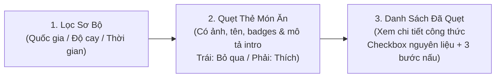

# 08. Đặc Tả Tính Năng Cốt Lõi (Core Features Specification)

Tài liệu này định nghĩa chính xác và tinh gọn **bộ tính năng cốt lõi (Core Features)** của ứng dụng **YumYumPick**. Mọi tính năng đều tập trung vào trải nghiệm quẹt món trực quan, quyết định nhanh chóng và xem chi tiết công thức nấu ăn chuẩn xác để hoàn thành xuất sắc đồ án trong 5 ngày.

---

## 1. Triết Lý Sản Phẩm: Tối Giản & Trọng Tâm (Lean Product Vision)

> **"Làm ít đi, nhưng làm thật mượt mà."**  
> YumYumPick giải quyết duy nhất một bài toán: **"Trưa nay / Tối nay ăn gì?"**  
> Người dùng chỉ cần làm 3 việc: **Lọc sơ bộ $\rightarrow$ Quẹt chọn món trên thẻ (đã có sẵn mô tả giới thiệu) $\rightarrow$ Vào danh sách đã quẹt để xem chi tiết công thức nấu ăn.**

---

## 2. Danh Sách 3 Tính Năng Cốt Lõi (In-Scope Core Features)

---

### Feature 1: Cơ Chế Quẹt Thẻ Món Ăn Phong Cách Tinder (Swipe Card Deck)

* **Mục đích:** Giúp người dùng đưa ra quyết định ăn uống nhanh chóng trong vòng 30 giây thông qua thị giác và tóm tắt giới thiệu trực tiếp trên mặt thẻ.
* **Nội dung trên mặt thẻ (Card Content):**
  - **Hình ảnh món ăn:** Kích thước lớn, góc bo tròn hiện đại, sắc nét (load 100% từ kho ảnh offline cục bộ `images/dishes/<id>.jpg`).
  - **Tên món ăn:** Tên tiếng Việt in đậm, cỡ chữ lớn, dễ đọc; kèm tên tiếng Anh/phiên âm nhỏ thanh lịch bên dưới.
  - **Đoạn giới thiệu ngắn (Description Intro / Short Description):** 
    - Hiển thị 2-3 câu giới thiệu súc tích về hương vị đặc trưng, nguồn gốc hoặc cảm giác món ăn mang lại (lấy từ trường `short_description` trong CSDL SQLite).
    - **Ý nghĩa:** Người dùng đọc ngay trên mặt thẻ để biết món này cay hay thanh, chua ngọt hay đậm đà, từ đó quyết định chính xác **quẹt Trái (Bỏ qua)** hay **quẹt Phải (Thích)** mà không cần mở thêm bất kỳ drawer hay màn hình phụ nào.
  - **Thông số nhanh dạng huy hiệu (Badges):**
    - Thời gian chế biến: `20'`
    - Mức calo ước tính: `480 kcal`
    - Mức độ cay: `Cấp 1` hoặc `Không cay`
    - Quốc gia ẩm thực: `Việt Nam`, `Hàn Quốc`, `Nhật Bản`, `Thái Lan`, `Ý`
* **Cơ chế cử chỉ quẹt (Swipe Gestures):**
  - **Quẹt sang Phải (Swipe Right / Thích):**
    - Thẻ bay sang phải kèm hiệu ứng stamp **"YUMMY!"** màu xanh lá tươi sáng.
    - Gọi API tự động ghi nhận món ăn vào bảng món đã lưu trong CSDL SQLite cho tài khoản hiện tại.
    - Cập nhật số lượng món đã thích trên Header.
  - **Quẹt sang Trái (Swipe Left / Bỏ qua):**
    - Thẻ bay sang trái kèm hiệu ứng stamp **"NOPE"** màu đỏ cam.
    - Bỏ qua món ăn và tự động đẩy thẻ tiếp theo lên vị trí chính.
* **Hỗ trợ đa phương thức điều khiển:**
  - **Mobile:** Vuốt ngón tay cảm ứng tự nhiên mượt mà (Touch Drag với hiệu ứng vật lý nhún của Framer Motion).
  - **Desktop PC:** Kéo chuột hoặc ấn phím mũi tên bàn phím (`←` để Bỏ qua, `→` để Thích).
  - **Nút bấm trợ năng:** Cụm 2 nút tròn nổi bật bên dưới thẻ: nút tròn Bỏ qua và nút tròn Thích & Lưu.
* **Trạng thái hết thẻ (Empty State):** Khi quẹt hết danh sách món ăn, hiển thị thông báo nhẹ nhàng: *"Bạn đã duyệt hết món ăn!"* kèm nút *"Quẹt lại từ đầu"*.

---

### Feature 2: Bộ Lọc Món Ăn Sơ Bộ (Basic Quick Filter)

* **Mục đích:** Thu hẹp nhanh danh sách món gợi ý trước khi bắt đầu quẹt thẻ, tránh gợi ý các món không hợp khẩu vị hôm nay.
* **Mô tả giao diện & Tương tác:**
  - Nút bấm biểu tượng Bộ lọc trên thanh Header góc phải.
  - Bấm vào mở Modal/Popup nhỏ gọn, trực quan:
    1. **Quốc gia / Nền ẩm thực:** 5 chip lựa chọn: `Tất cả` | `Việt Nam` | `Hàn Quốc` | `Nhật Bản` | `Thái Lan` | `Ý`.
    2. **Độ cay:** `Tất cả` | `Không cay (Cấp 0)` | `Có cay (Cấp 1-3)`.
    3. **Thời gian nấu:** `Tất cả` | `Nấu nhanh (< 20 phút)` | `Kỳ công (>= 20 phút)`.
  - **Nút "Áp dụng bộ lọc":** Đóng popup và tải lại danh sách thẻ quẹt tương ứng từ CSDL SQLite.
  - **Nút "Đặt lại":** Quay về mặc định ngẫu nhiên toàn bộ 100 món.

---

### Feature 3: Danh Sách Món Đã Quẹt & Xem Chi Tiết Công Thức (Liked Dishes & Full Recipe Details)

* **Mục đích:** Vào phần đã quẹt chỉ để xem chi tiết công thức nấu ăn của các món người dùng đã lựa chọn.
* **Mô tả giao diện & Tương tác:**
  - Nút bấm Món Đã Lưu trên thanh Header kèm số đếm (ví dụ: `5`).
  - **Phần 1: Màn hình Danh sách món đã lưu (Liked Dishes List):**
    - Hiển thị danh sách các món đã thích dưới dạng lưới hoặc danh sách thẻ gọn gàng.
    - Mỗi item gồm: Ảnh thu nhỏ, tên món ăn (Việt & Anh), quốc gia, thời gian nấu.
    - Nút Xóa: Bấm vào để xóa/bỏ thích món ăn khỏi CSDL SQLite nếu không muốn nấu nữa.
    - **Bấm vào bất kỳ món nào $\rightarrow$ Mở màn hình xem chi tiết công thức.**
  - **Phần 2: Xem chi tiết công thức nấu ăn (Dish Detail Recipe View):**
    - **Header:** Ảnh món ăn sắc nét + Tên món + Câu chuyện giới thiệu chi tiết (`short_description`).
    - **Danh Sách Nguyên Liệu kèm Checkbox tương tác (Interactive Ingredients Checklist):**
      - Mỗi nguyên liệu hiển thị kèm một ô **Checkbox tương tác** `[ ]` (ví dụ: `[ ] Thịt bò nạc: 300g`, `[ ] Bánh phở tươi: 500g`, `[ ] Hành lá & ngò gai: 1 ít`).
      - Người dùng bấm tích chọn vào checkbox để đánh dấu nguyên liệu đã chuẩn bị hoặc đã có trong bếp (chữ gạch ngang mờ nhẹ trực quan).
      - Tương tác mượt mà trong giao diện, hỗ trợ người nấu kiểm tra đồ cực kỳ tiện lợi khi vào bếp.
    - **Hướng dẫn chế biến chuẩn mực 3 bước (Cooking Steps):**
      - **Bước 1 — Sơ chế nguyên liệu:** Rửa, cắt thái, ướp gia vị chuẩn định lượng.
      - **Bước 2 — Chế biến nhiệt:** Nấu nước dùng, kho, xào, chiên, nướng đúng thời gian và kỹ thuật.
      - **Bước 3 — Trình bày & Thưởng thức:** Xếp ra tô/đĩa, trang trí rau thơm, dùng nóng chuẩn vị.
    - **Khung Mẹo đầu bếp (`tips`):** Hộp ghi chú viền vàng nổi bật chia sẻ bí quyết thực tế giúp món ăn ngon chuẩn vị nhà hàng.

---

---

### Tính Năng Bổ Trợ: Đăng Nhập / Đăng Ký Đơn Giản & Auth Gate (Bắt Buộc Đăng Nhập Mới Được Quẹt)

* Biểu mẫu tài khoản đơn giản: Chỉ cần nhập `username` và `password` để tạo tài khoản hoặc đăng nhập.
* **Cơ chế Auth Gate bắt buộc:**
  - Khách chưa đăng nhập khi truy cập web sẽ ở màn hình **Landing Page**.
  - Không cho phép quẹt thẻ ở chế độ Khách (Guest) nhằm đảm bảo dữ liệu món đã thích và lịch sử loại trừ 7 ngày gắn chặt với tài khoản.
  - Khi người dùng bấm CTA "Bắt đầu quẹt món" hoặc bấm tab Quẹt Thẻ: Tự động kích hoạt mở `AuthModal`.
  - Đăng nhập/Đăng ký thành công $\rightarrow$ Tự động chuyển hướng (redirect) vào màn hình quẹt thẻ (Swipe Deck).
  - Khi Đăng xuất: Xóa session và chuyển ngay về Landing Page.
* Lưu `user_id` và `username` vào `localStorage` (`yumyum_session`) để duy trì trạng thái đăng nhập khi tải lại trang (F5).

---

### Feature 4: Màn Hình Giới Thiệu (Landing Page) & Điều Hướng Click Logo

* **Mục đích:** Giới thiệu giá trị cốt lõi của YumYumPick, phong cách "Tinder for Food" và giải quyết câu hỏi "Hôm nay ăn gì?" cho khách truy cập lần đầu.
* **Nội dung hiển thị (`LandingPage.jsx`):**
  - **Hero Section:** Logo thương hiệu chính thức, Slogan ẩm thực lôi cuốn, Nút CTA *"Bắt đầu quẹt món ngay"*.
  - **3 Bước Trải Nghiệm:** Hướng dẫn trực quan (Lọc ẩm thực $\rightarrow$ Quẹt chọn món $\rightarrow$ Nấu theo công thức chuẩn).
  - **Showcase Ẩm Thực 5 Nước:** Trưng bày hình ảnh đặc sản Việt Nam, Hàn Quốc, Nhật Bản, Thái Lan, Ý.
* **Quy tắc điều hướng (Logo Navigation):**
  - Bấm vào Logo thương hiệu YumYumPick ở Header tại bất kỳ màn hình nào sẽ lập tức điều hướng về trang Landing Page.
  - Có nút quay lại màn hình Quẹt thẻ cho người dùng đã đăng nhập.

---

### Feature 5: Cơ Chế Infinite Deck (Prefetch Ngầm — Quẹt Vô Hạn Mà Nhẹ Máy)

* **Giải pháp không giới hạn:** Thay vì nạp toàn bộ 100 món cùng lúc làm nặng DOM và tốn RAM trình duyệt, hoặc bị ngắt quãng bởi limit 10 món:
  - Frontend áp dụng cơ chế **Prefetch ngầm:** Khi ngăn xếp thẻ trong `CardStack.jsx` còn lại $\le 3$ món, hệ thống tự động gọi API `GET /api/v1/dishes/random?limit=5&exclude_ids=...` để nạp thêm 5 món nối tiếp vào mảng.
  - Framer Motion chỉ render tối đa 3 thẻ xếp lớp trên màn hình cùng lúc $\rightarrow$ Bộ nhớ cực nhẹ, chuyển động nhún mượt mà 60 FPS, quẹt liên tục không giới hạn.

---

### Feature 6: Cơ Chế Chống Trùng Món 7 Ngày & Chuẩn Hóa Cờ Quốc Gia

* **Chống trùng món 1 tuần:**
  - Ghi nhận ID các món đã quẹt (cả LIKE và SKIP) vào `localStorage` (`yumyum_swiped_history: { [dish_id]: timestamp }`).
  - Gửi `exclude_ids` lên Backend để loại trừ món đã xem trong 7 ngày gần nhất.
  - Tự động dọn dẹp các món quá 7 ngày để cho phép xuất hiện lại.
* **Chuẩn hóa cờ ẩm thực Ý:**
  - Cập nhật mapping trong `SwipeCard.jsx`: `Italy` / `Ý` hiển thị đúng quốc kỳ **🇮🇹** (thay vì cờ địa cầu 🌍).
* **Logo nhận diện chính thức:**
  - Cập nhật logo vector thương hiệu YumYumPick chuẩn trên Header, Favicon và Landing Page.

---

## 3. Phân Bổ Triển Khai Cho Đội Ngũ 6 Thành Viên (Task Mapping)

* **Quang Huy (Frontend 1 — Swipe Card Deck & Motion):**
  - Phụ trách **Feature 1 (Swipe Card Deck)** & **Feature 5 (Infinite Deck)**:
    - Xây dựng component `SwipeCard.jsx` và `CardStack.jsx` bằng Framer Motion.
    - Hiển thị đầy đủ ảnh, tên món, huy hiệu thông số và **đoạn giới thiệu ngắn (`short_description`)** ngay trên mặt thẻ.
    - Triển khai **Infinite Deck Prefetch:** Tự động gọi lấy thêm 5 món ngầm khi còn $\le 3$ thẻ (quẹt vô tận, không bị limit, nhẹ máy).
    - Cập nhật cờ ẩm thực Ý thành **🇮🇹** trong `SwipeCard.jsx`.
    - Tối ưu hiệu ứng stamp YUMMY/NOPE, cử chỉ vuốt chạm trên Mobile và phím tắt bàn phím `←`, `→` trên PC (có chặn khi gõ input).
* **Tùng Dương (Frontend 2 — Liked Dishes & Detail Recipe View):**
  - Phụ trách **Feature 3 (Liked Dishes & Detail Recipe View)**:
    - Xây dựng `LikedDishesView.jsx`: Giao diện danh sách món đã thích (kèm nút xóa món).
    - Xây dựng `DishDetailModal.jsx`: Màn hình/modal chi tiết công thức nấu ăn (**Checkbox tương tác trong danh sách nguyên liệu** + Hướng dẫn 3 bước nấu + Khung Mẹo đầu bếp).
    - Đảm bảo cờ Ý 🇮🇹 hiển thị đồng bộ trong danh sách đã lưu và modal công thức.
* **Luân (Frontend 3 & Pitching Lead):**
  - Phụ trách **Feature 4 (Landing Page)** & **App Shell / Auth Gate**:
    - Xây dựng `LandingPage.jsx` và cấu hình click Logo Header điều hướng về Landing Page.
    - Xây dựng cơ chế **Auth Gate**: Bắt buộc đăng nhập mới được vào quẹt thẻ (Khách vào web xem Landing Page $\rightarrow$ Đăng nhập $\rightarrow$ Chuyển sang Swipe Deck).
    - Tích hợp **Logo thương hiệu chính thức** của YumYumPick vào Header, Favicon và Landing Page.
    - Xây dựng `FilterModal.jsx` và `AuthModal.jsx`.
    - Phụ trách thiết kế bộ Slide PowerPoint báo cáo đồ án (12-15 slide) và Kịch bản Thuyết trình/Demo 10 phút.
* **Ánh Dương (Backend 1):**
  - Khởi tạo FastAPI Server, CORS, Static Files mount `/images/dishes/` phục vụ ảnh offline.
  - Xây dựng Simple Auth API (`POST /api/v1/auth/signup`, `POST /api/v1/auth/login`).
  - Đảm bảo bảo mật và tính ổn định phiên phục vụ luồng Auth Gate.
* **Đăng Huy (Backend 2):**
  - Xây dựng Dishes API (`GET /api/v1/dishes/random`) hỗ trợ lọc theo quốc gia, độ cay, thời gian nấu, loại trừ món đã quẹt `exclude_ids`.
  - Tối ưu hóa API query random phục vụ prefetch 5 món cho Infinite Deck.
  - Xây dựng Saved Dishes API (`POST`, `GET`, `DELETE /api/v1/saved-dishes/{user_id}`) kết nối SQLite.
* **Minh Đức (Lead, Data, QA):**
  - Cung cấp và bảo toàn kho dữ liệu 100 món, 100 ảnh offline, CSDL SQLite `yumyumpick.db`.
  - Điều phối tiến độ 5 ngày, nghiệm thu cơ chế loại trừ món 7 ngày (`swipeHistory.js`), luồng Auth Gate và Infinite Deck.
  - Kiểm định chất lượng toàn diện (Test Matrix) trên PC và Mobile thật qua mạng LAN.

