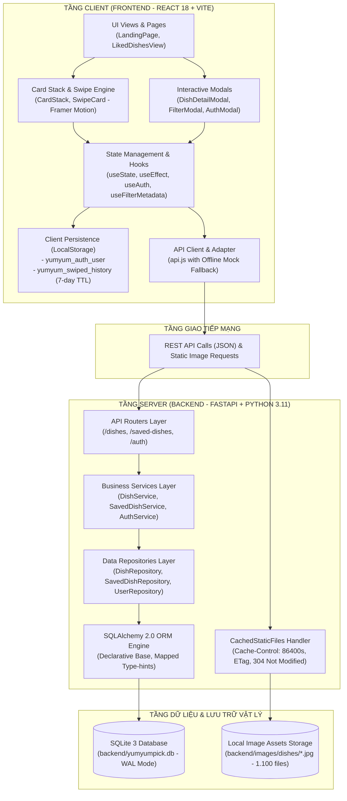
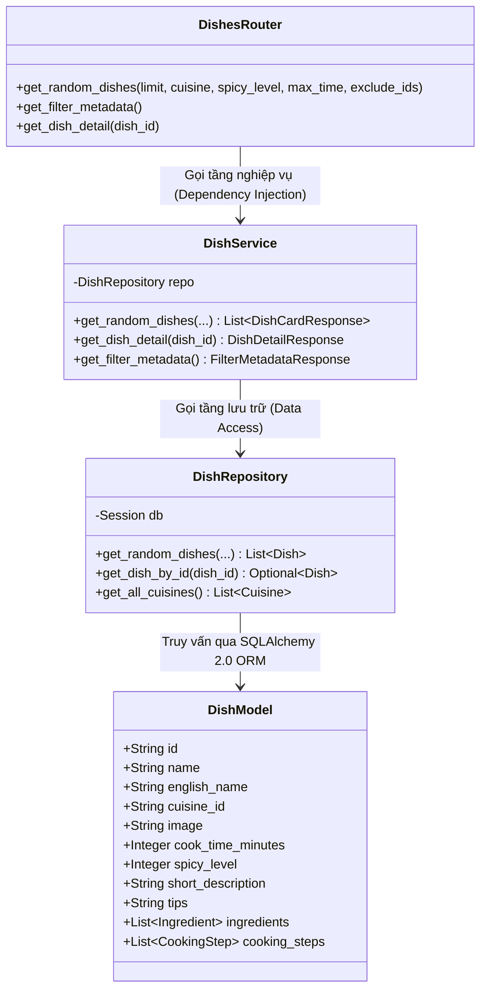
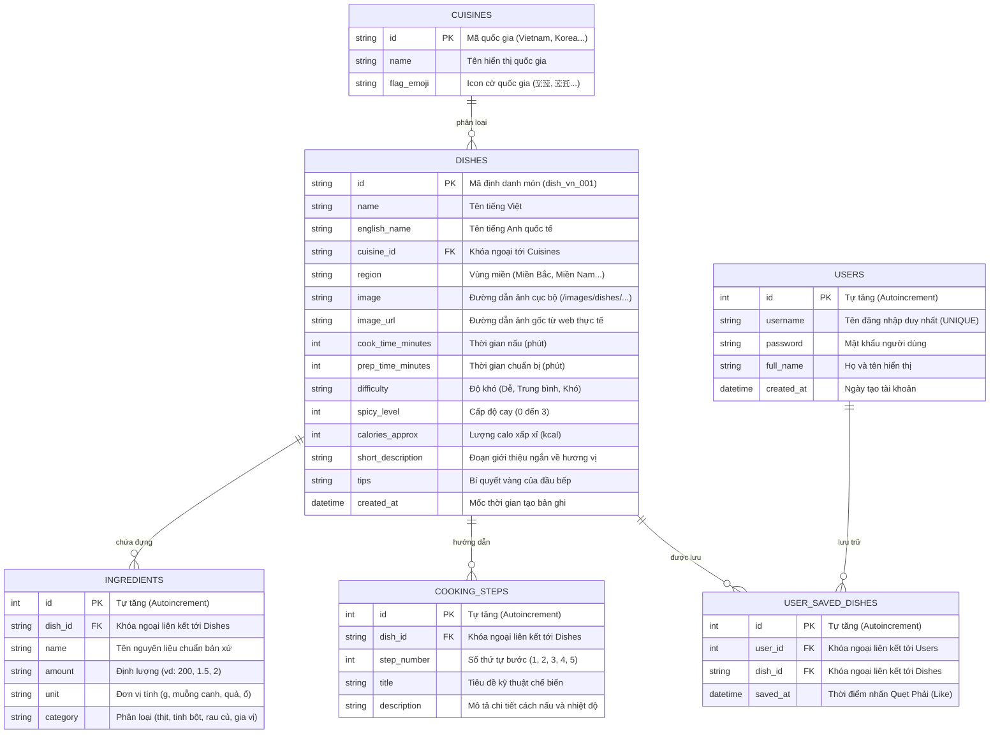
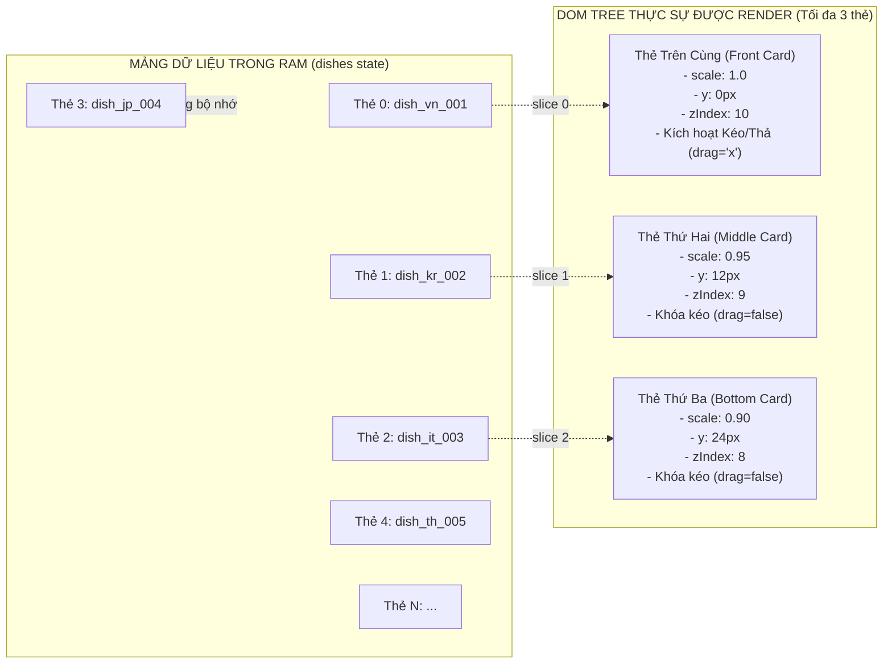
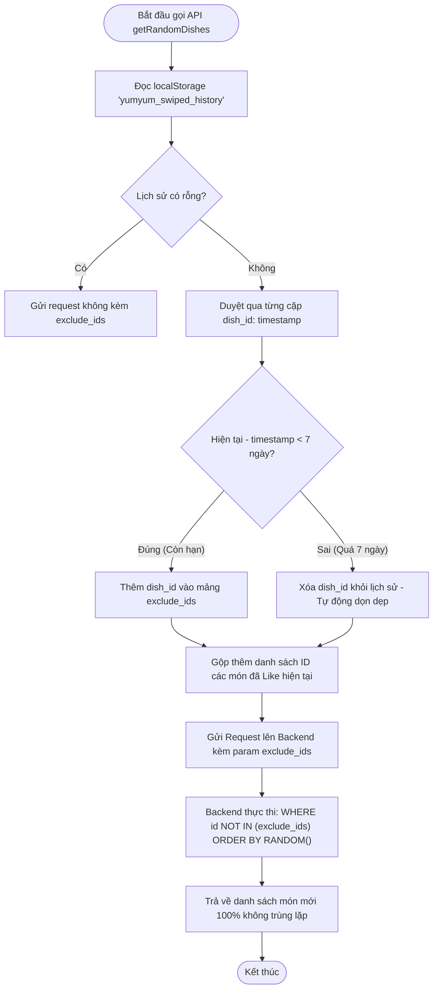

# 09. Kiến Trúc Kỹ Thuật Chuyên Sâu (Technical Architecture Deep-Dive)

> **Tài liệu phân tích kỹ thuật kiến trúc hệ thống phục vụ phản biện đồ án**  
> **Dự án:** YumYumPick — Nền tảng gợi ý thực đơn thông minh theo cơ chế quẹt thẻ (Tinder for Food)  
> **Tác giả:** Senior Software Architect & Giảng viên hướng dẫn  

---

## 1. Sơ Đồ Kiến Trúc Hệ Thống Tổng Thể (System Architecture Diagram)

Hệ thống YumYumPick được thiết kế theo mô hình **Client-Server kiến trúc phân tầng rời rạc (Decoupled Layered Architecture)**. Frontend và Backend giao tiếp hoàn toàn thông qua giao thức chuẩn **RESTful HTTP/JSON**:



---

## 2. Kiến Trúc Backend: Phân Tầng Clean Architecture

Backend được xây dựng theo chuẩn **Clean Architecture / Hexagonal Architecture** với sự phân định trách nhiệm rõ ràng (Separation of Concerns), đảm bảo mã nguồn dễ bảo trì, dễ mở rộng và dễ kiểm thử độc lập:



### 2.1. Tầng Controller / Router ([`backend/app/api/dishes.py`](../backend/app/api/dishes.py))
- **Trách nhiệm duy nhất (Single Responsibility):** Tiếp nhận HTTP Request từ client, phân giải query params, xác thực tính hợp lệ của tham số đầu vào bằng **Pydantic v2**, sau đó chuyển tiếp cho Service xử lý.
- **Dependency Injection:** Sử dụng cơ chế `Depends(get_dish_service)` của FastAPI để tiêm phụ thuộc, giúp các hàm router hoàn toàn phi trạng thái (stateless) và dễ dàng viết Unit Test bằng cách mock service.
- **Quy tắc thứ tự định tuyến (Route Precedence):**
  - Các route tĩnh (`/random`, `/filters/metadata`) **bắt buộc phải khai báo trước** route động (`/{dish_id}`). Nếu khai báo sau, FastAPI sẽ hiểu nhầm chuỗi ký tự `"random"` là một `dish_id`, gây ra lỗi `404 Not Found`.

### 2.2. Tầng Nghiệp Vụ / Service ([`backend/app/services/dish_service.py`](../backend/app/services/dish_service.py))
- **Trách nhiệm:** Nơi chứa toàn bộ logic nghiệp vụ (Business Rules).
- **Phân tách tham số loại trừ (`exclude_ids`):** Nhận chuỗi phân tách bởi dấu phẩy (`"dish_vn_001,dish_kr_002"`), kiểm tra và phân tích cú pháp thành một mảng `List[str]`, loại bỏ khoảng trắng thừa trước khi chuyển xuống tầng Repository.
- **Chuyển đổi dữ liệu (DTO Mapping):** Nhận thực thể SQLAlchemy Model từ Repository và chuyển đổi thành Schema Pydantic (`DishCardResponse`, `DishDetailResponse`) thông qua phương thức `model_validate()`, giúp kiểm soát chặt chẽ các trường thông tin trả về cho client.

### 2.3. Tầng Lưu Trữ / Repository ([`backend/app/repositories/dish_repo.py`](../backend/app/repositories/dish_repo.py))
- **Trách nhiệm:** Trừu tượng hóa hoàn toàn các thao tác truy vấn cơ sở dữ liệu. Tầng Service và Router không cần biết hệ thống đang dùng SQLite, PostgreSQL hay MySQL.
- **Cú pháp SQLAlchemy 2.0:** Sử dụng hoàn toàn cú pháp hiện đại `select(Dish).where(...)` thay vì cú pháp `db.query(Dish)` cũ của SQLAlchemy 1.x đã lỗi thời.
- **Eager Loading chống lỗi N+1 Query:** Khi truy vấn chi tiết món ăn kèm nguyên liệu và các bước nấu, Repository sử dụng kỹ thuật nạp trước `selectinload`:
  ```python
  stmt = (
      select(Dish)
      .options(
          selectinload(Dish.ingredients),
          selectinload(Dish.cooking_steps),
      )
      .where(Dish.id == dish_id)
  )
  ```
  Kỹ thuật này nạp toàn bộ danh sách `ingredients` và `cooking_steps` chỉ trong **2 truy vấn tối ưu** sử dụng toán tử `IN`, thay vì tạo ra hàng trăm câu lệnh `SELECT` lặp đi lặp lại (vấn nạn N+1 kinh điển).

---

## 3. Kiến Trúc Cơ Sở Dữ Liệu & Tối Ưu Hóa SQLite (Database Deep-Dive)

### 3.1. Sơ Đồ Thực Thể - Quan Hệ (Entity-Relationship Diagram)



### 3.2. Đánh Chỉ Mục (B-Tree Indexing) & Tối Ưu Truy Vấn
Để đảm bảo tốc độ phản hồi API dưới **15ms** trên kho dữ liệu 1.100 món ăn và hàng ngàn nguyên liệu:
1. **Chỉ mục khóa ngoại:** Tạo `index=True` trên cột `cuisine_id` của bảng `dishes`, `dish_id` của bảng `ingredients` và `cooking_steps`.
2. **Chỉ mục lọc đa chiều:** Tạo chỉ mục trên cột `cook_time_minutes` và `spicy_level` để tăng tốc độ quét khi người dùng áp dụng bộ lọc.
3. **Cơ chế WAL (Write-Ahead Logging):**
   Trong file cấu hình cơ sở dữ liệu [`backend/app/db/database.py`](../backend/app/db/database.py), SQLite được cấu hình kích hoạt chế độ **WAL Mode** và kiểm tra khóa ngoại (Foreign Keys Pragma):
   ```python
   @event.listens_for(engine, "connect")
   def set_sqlite_pragma(dbapi_connection, connection_record):
       cursor = dbapi_connection.cursor()
       cursor.execute("PRAGMA journal_mode=WAL")
       cursor.execute("PRAGMA foreign_keys=ON")
       cursor.execute("PRAGMA synchronous=NORMAL")
       cursor.close()
   ```
   - **Lợi ích kiến trúc của WAL:** Cho phép các luồng đọc (Readers) và luồng ghi (Writers) hoạt động đồng thời không gây khóa toàn bộ file CSDL (Zero Database Lock Congestion).

---

## 4. Kiến Trúc Frontend: Quản Lý Ngăn Xếp Thẻ & Mô Hình Vật Lý Cử Chỉ

### 4.1. Ảo Hóa Ngăn Xếp Thẻ (Card Stack Virtualization)
Một sai lầm phổ biến của các lập trình viên khi làm ứng dụng dạng Tinder là nạp toàn bộ 100 hay 1.000 thẻ vào DOM cùng một lúc. Điều này khiến trình duyệt phải duy trì hàng ngàn DOM nodes, gây giật lag và tràn bộ nhớ trên thiết bị di động.

YumYumPick giải quyết vấn đề này bằng kỹ thuật **Stack Windowing (chỉ render tối đa 3 thẻ)** trong component [`CardStack.jsx`](../frontend/src/components/CardStack.jsx):



### 4.2. Công Thức Toán Học Cho Cử Chỉ Quẹt (Framer Motion Physics)
Tại component [`SwipeCard.jsx`](../frontend/src/components/SwipeCard.jsx), vị trí kéo tay của người dùng được theo dõi bởi `useMotionValue(0)` và biến đổi mượt mà qua hook `useTransform`:

$$\text{rotate} = \frac{x}{15} \quad (\text{giới hạn trong khoảng } [-18^\circ, +18^\circ] \text{ khi } x \in [-250\text{px}, +250\text{px}])$$

- **Độ mờ của con dấu phản hồi (Stamp Opacity):**
  - $\text{likeOpacity} = \text{clamp}\left(\frac{x - 20}{100 - 20}, 0, 1\right)$ (Hiện dần khi kéo sang phải từ 20px đến 100px).
  - $\text{nopeOpacity} = \text{clamp}\left(\frac{-x - 20}{100 - 20}, 0, 1\right)$ (Hiện dần khi kéo sang trái từ -20px đến -100px).
- **Ngưỡng quyết định quẹt (Threshold Decision Logic):**
  Khi người dùng nhả chuột (`onDragEnd`), hệ thống kiểm tra 2 điều kiện:
  1. **Độ dời vị trí (Displacement Offset):** $|x| > 120\text{px}$
  2. **Vận tốc vung tay (Flick Velocity):** $|v_x| > 500\text{px/s}$
  Nếu một trong hai điều kiện thỏa mãn, thẻ sẽ bay thoát khỏi màn hình (`exit: x = \pm 400\text{px}`). Ngược lại, lò xo vật lý (`stiffness: 280, damping: 22`) sẽ tự động kéo thẻ bật lại vị trí trung tâm.

---

## 5. Thuật Toán Khử Trùng Lặp 7 Ngày (7-Day Rolling Window Deduplication)

### 5.1. Luồng Hoạt Động (Flowchart)



### 5.2. Phân Tích Độ Phức Tạp (Algorithm Complexity)
- **Độ phức tạp thời gian (Time Complexity):** $O(K)$, trong đó $K$ là số lượng món đã quẹt trong vòng 1 tuần ($K \le 1.100$). Thao tác duyệt object trong JavaScript diễn ra trong chưa đầy **0.2ms**.
- **Độ phức tạp không gian (Space Complexity):** $O(K)$ trong `LocalStorage`. Một bản ghi có định dạng `{"dish_vn_001": 1727062544000}`, tương đương khoảng 30 bytes. Với tối đa 1.100 món, tổng dung lượng lưu trữ chỉ chiếm **~33 KB**, hoàn toàn nằm trong giới hạn an toàn 5 MB của trình duyệt.
