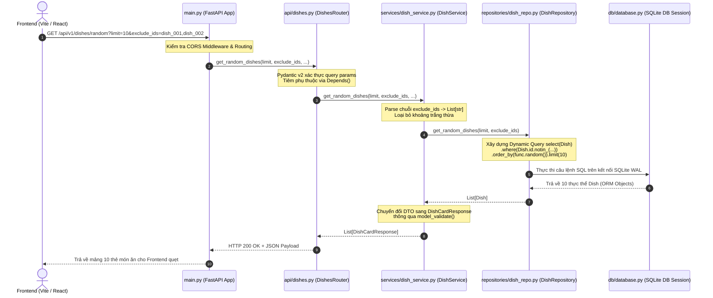

# 10. Giải Phẫu Chi Tiết 100% Mã Nguồn Backend (Backend Code Deep-Dive)

> **Tài liệu mổ xẻ chi tiết từng tệp, từng lớp, từng hàm, từng dòng lệnh và sự tương tác giữa các module Backend**  
> **Dự án:** YumYumPick — Nền tảng gợi ý thực đơn thông minh theo cơ chế quẹt thẻ (Tinder for Food)  
> **Tác giả:** Senior Software Architect & Giảng viên hướng dẫn  

---

## 1. Cấu Trúc Thư Mục & Vai Trò Các Module Backend

Mã nguồn Backend nằm hoàn toàn trong thư mục `backend/` và được tổ chức theo kiến trúc phân tầng chuẩn mực:

```text
backend/
├── app/
│   ├── api/                 # Tầng Controller / Định tuyến API (Endpoints)
│   │   ├── auth.py          # API Đăng ký, Đăng nhập, Xem thông tin người dùng
│   │   ├── dishes.py        # API Quẹt thẻ ngẫu nhiên, Chi tiết món, Metadata bộ lọc
│   │   └── saved_dishes.py  # API Lưu món, Xóa món, Xem danh sách đã thích
│   ├── data/
│   │   └── dishes_seed.json # File dữ liệu hạt giống 1.100 món ăn chuẩn hóa
│   ├── db/
│   │   └── database.py      # Kết nối CSDL SQLite, Cấu hình WAL Mode & Session
│   ├── models/
│   │   └── models.py        # Định nghĩa 6 bảng quan hệ bằng SQLAlchemy 2.0 ORM
│   ├── repositories/        # Tầng thao tác CSDL trực tiếp (Data Access Layer)
│   │   ├── dish_repo.py     # Truy vấn lọc, sắp xếp ngẫu nhiên, nạp trước Eager Loading
│   │   └── saved_dish_repo.py # Thêm, xóa, đọc bản ghi món đã lưu
│   ├── schemas/             # Pydantic v2 Models (Validation & Serialization DTOs)
│   │   ├── auth.py          # Schema xác thực tài khoản
│   │   ├── dish.py          # Schema thẻ quẹt, nguyên liệu, bước nấu, chi tiết món
│   │   ├── filter.py        # Schema metadata cho bộ lọc đa tiêu chí
│   │   └── saved_dish.py    # Schema payload lưu món và response kết quả
│   ├── services/            # Tầng Logic Nghiệp Vụ (Business Logic Layer)
│   │   ├── dish_service.py  # Xử lý chuỗi exclude_ids, DTO transformation
│   │   └── saved_dish_service.py # Xử lý lưu trùng lặp 409, phân trang món đã lưu
│   └── main.py              # Entry point: Khởi tạo FastAPI, CORS, Caching ảnh tĩnh
├── images/
│   └── dishes/              # Thư mục chứa 1.100 file ảnh JPG chụp thực tế
├── requirements.txt         # Danh sách thư viện Python phụ thuộc
└── yumyumpick.db            # Cơ sở dữ liệu SQLite vật lý (~7.6 MB)
```

---

## 2. Vòng Đời Xử Lý Một Request Backend (Request-Response Lifecycle)

Sơ đồ tuần tự thể hiện sự tương tác giữa các function từ lúc Client gửi HTTP Request đến khi nhận JSON Response:



---

## 3. Mổ Xẻ Chi Tiết Từng File & Dòng Code Backend

---

### 3.1. File `backend/app/db/database.py` (Quản Lý Kết Nối & Cấu Hình CSDL)

Tệp này chịu trách nhiệm khởi tạo động cơ SQLAlchemy Engine, thiết lập kết nối tối ưu cho SQLite và cung cấp hàm Generator `get_db` để tiêm Session vào các API endpoints.

```python
# Dòng 1-4: Import các thư viện lõi
import os
from pathlib import Path
from sqlalchemy import create_engine, event
from sqlalchemy.orm import DeclarativeBase, sessionmaker

# Dòng 6-8: Xác định đường dẫn tuyệt đối tới file SQLite database
BASE_DIR = Path(__file__).resolve().parent.parent.parent
DB_PATH = BASE_DIR / "yumyumpick.db"

# Dòng 10: Lấy chuỗi kết nối từ biến môi trường, fallback về file cục bộ
DATABASE_URL = os.getenv("DATABASE_URL", f"sqlite:///{DB_PATH}")

# Dòng 12-18: Khởi tạo SQLAlchemy Engine
engine = create_engine(
    DATABASE_URL,
    connect_args={
        "check_same_thread": False, # Cho phép FastAPI đa luồng truy cập cùng 1 connection SQLite
        "timeout": 30,              # Thời gian chờ tối đa 30s nếu có transaction khác đang ghi
    },
)

# Dòng 20-28: Lắng nghe sự kiện kết nối để kích hoạt các tính năng nâng cao của SQLite
@event.listens_for(engine, "connect")
def set_sqlite_pragma(dbapi_connection, connection_record):
    cursor = dbapi_connection.cursor()
    cursor.execute("PRAGMA foreign_keys=ON")       # BẬT ràng buộc khóa ngoại (mặc định SQLite tắt)
    cursor.execute("PRAGMA journal_mode=WAL")      # BẬT chế độ Write-Ahead Logging (đọc/ghi đồng thời)
    cursor.execute("PRAGMA synchronous=NORMAL")   # Cân bằng an toàn đĩa cứng & tốc độ ghi nhanh gấp 3 lần
    cursor.execute("PRAGMA busy_timeout=30000")   # Đặt timeout chờ khóa là 30.000 ms
    cursor.close()

# Dòng 30: Tạo Session Factory quản lý phiên làm việc CSDL
SessionLocal = sessionmaker(autocommit=False, autoflush=False, bind=engine)

# Dòng 32-33: Lớp cơ sở cho toàn bộ SQLAlchemy Models (Chuẩn 2.0)
class Base(DeclarativeBase):
    pass

# Dòng 35-41: Hàm Dependency Injection cung cấp DB Session cho FastAPI
def get_db():
    db = SessionLocal() # Mở phiên làm việc mới
    try:
        yield db        # Chuyển quyền điều khiển cho router thực thi
    finally:
        db.close()      # ĐẢM BẢO luôn đóng session, giải phóng connection pool kể cả khi có Exception
```

---

### 3.2. File `backend/app/models/models.py` (Khai Báo Cấu Trúc Bảng Dữ Liệu)

Tệp này định nghĩa 6 bảng dữ liệu có quan hệ chặt chẽ với nhau theo chuẩn **SQLAlchemy 2.0 Typed Mapping**.

#### A. Model `Cuisine` (Bảng Quốc gia Ẩm thực)
```python
class Cuisine(Base):
    __tablename__ = "cuisines"

    id: Mapped[str] = mapped_column(String, primary_key=True)       # Khóa chính: 'Vietnam', 'Korea'...
    name: Mapped[str] = mapped_column(String, nullable=False)       # Tên hiển thị: 'Việt Nam', 'Hàn Quốc'...
    flag_emoji: Mapped[str] = mapped_column(String, nullable=False) # Icon cờ: '🇻🇳', '🇰🇷'...

    # Quan hệ 1-N: Một quốc gia có nhiều món ăn
    dishes: Mapped[List["Dish"]] = relationship(back_populates="cuisine_rel")
```

#### B. Model `Dish` (Bảng Món Ăn Trung Tâm)
```python
class Dish(Base):
    __tablename__ = "dishes"

    id: Mapped[str] = mapped_column(String, primary_key=True)               # Mã món: 'dish_vn_001'
    name: Mapped[str] = mapped_column(String, nullable=False)               # Tên tiếng Việt
    english_name: Mapped[Optional[str]] = mapped_column(String, nullable=True) # Tên tiếng Anh

    # Khóa ngoại trỏ về cuisines.id kèm onupdate CASCADE
    cuisine: Mapped[str] = mapped_column(
        "cuisine_id",
        String,
        ForeignKey("cuisines.id", onupdate="CASCADE"),
        nullable=False,
        index=True, # Đánh chỉ mục B-Tree để lọc quốc gia cực nhanh
    )
    cuisine_id = synonym("cuisine") # Alias 2 chiều: đọc dish.cuisine hoặc dish.cuisine_id đều được

    region: Mapped[Optional[str]] = mapped_column(String, nullable=True)
    image: Mapped[str] = mapped_column(String, nullable=False)              # Đường dẫn nội bộ: /images/dishes/...
    image_url: Mapped[Optional[str]] = mapped_column(String, nullable=True)  # URL gốc từ web thực tế
    cook_time_minutes: Mapped[int] = mapped_column(Integer, nullable=False, index=True) # Đánh chỉ mục lọc thời gian
    prep_time_minutes: Mapped[int] = mapped_column(Integer, default=10)
    difficulty: Mapped[str] = mapped_column(String, default="Dễ")
    spicy_level: Mapped[int] = mapped_column(Integer, default=0, index=True) # Đánh chỉ mục lọc độ cay
    calories_approx: Mapped[int] = mapped_column(Integer, default=400)
    short_description: Mapped[str] = mapped_column(String, nullable=False)   # Giới thiệu hương vị trên mặt thẻ
    tips: Mapped[Optional[str]] = mapped_column(String, nullable=True)       # Bí quyết vàng của đầu bếp
    created_at: Mapped[Optional[datetime]] = mapped_column(DateTime, server_default=func.now())

    # Quan hệ quan trọng:
    cuisine_rel: Mapped[Optional["Cuisine"]] = relationship(back_populates="dishes")
    
    # Quan hệ 1-N với Ingredients: Tự động xóa sạch nguyên liệu con nếu món bị xóa
    ingredients: Mapped[List["Ingredient"]] = relationship(
        back_populates="dish",
        cascade="all, delete-orphan",
    )
    
    # Quan hệ 1-N với CookingSteps: Tự động sắp xếp theo thứ tự bước nấu
    cooking_steps: Mapped[List["CookingStep"]] = relationship(
        back_populates="dish",
        cascade="all, delete-orphan",
        order_by="CookingStep.step_number",
    )
    steps = synonym("cooking_steps") # Tạo bí danh 'steps' để khớp với JSON Frontend
```

#### C. Model `Ingredient` (Nguyên Liệu Món Ăn)
```python
class Ingredient(Base):
    __tablename__ = "ingredients"

    id: Mapped[int] = mapped_column(Integer, primary_key=True, autoincrement=True)
    dish_id: Mapped[str] = mapped_column(
        String,
        ForeignKey("dishes.id", ondelete="CASCADE"),
        nullable=False,
        index=True,
    )
    name: Mapped[str] = mapped_column(String, nullable=False)      # Tên nguyên liệu: 'Pate gan heo'
    amount: Mapped[str] = mapped_column(String, nullable=False)    # Định lượng: '60', '1.5'
    unit: Mapped[str] = mapped_column(String, nullable=False)      # Đơn vị: 'g', 'muỗng canh', 'quả'
    category: Mapped[str] = mapped_column(String, default="nguyên liệu chính") # Phân loại Smart Grocery

    dish: Mapped["Dish"] = relationship(back_populates="ingredients")
```

#### D. Model `CookingStep` (Các Bước Nấu Ăn)
```python
class CookingStep(Base):
    __tablename__ = "cooking_steps"

    id: Mapped[int] = mapped_column(Integer, primary_key=True, autoincrement=True)
    dish_id: Mapped[str] = mapped_column(
        String,
        ForeignKey("dishes.id", ondelete="CASCADE"),
        nullable=False,
        index=True,
    )
    step_number: Mapped[int] = mapped_column(Integer, nullable=False) # Thứ tự bước: 1, 2, 3, 4, 5
    title: Mapped[str] = mapped_column(String, nullable=False)       # Tiêu đề kỹ thuật chế biến
    description: Mapped[str] = mapped_column(String, nullable=False) # Hướng dẫn chi tiết lửa, nhiệt độ

    dish: Mapped["Dish"] = relationship(back_populates="cooking_steps")
```

#### E. Model `User` (Tài Khoản Người Dùng)
```python
class User(Base):
    __tablename__ = "users"

    id: Mapped[int] = mapped_column(Integer, primary_key=True, autoincrement=True)
    username: Mapped[str] = mapped_column(String, unique=True, nullable=False, index=True)
    password: Mapped[str] = mapped_column(String, nullable=False)
    full_name: Mapped[str] = mapped_column(String, nullable=False)
    created_at: Mapped[Optional[datetime]] = mapped_column(DateTime, server_default=func.now())

    # Quan hệ 1-N: Xóa user tự động dọn sạch món đã lưu & món đã skip
    saved_dishes: Mapped[List["UserSavedDish"]] = relationship(
        back_populates="user", cascade="all, delete-orphan"
    )
    skipped_dishes: Mapped[List["UserSkippedDish"]] = relationship(
        back_populates="user", cascade="all, delete-orphan"
    )
```

#### F. Model `UserSavedDish` (Món Đã Thích / Quẹt Phải)
```python
class UserSavedDish(Base):
    __tablename__ = "user_saved_dishes"

    id: Mapped[int] = mapped_column(Integer, primary_key=True, autoincrement=True)
    user_id: Mapped[int] = mapped_column(
        Integer, ForeignKey("users.id", ondelete="CASCADE"), nullable=False, index=True
    )
    dish_id: Mapped[str] = mapped_column(
        String, ForeignKey("dishes.id", ondelete="CASCADE"), nullable=False, index=True
    )
    saved_at: Mapped[Optional[datetime]] = mapped_column(DateTime, server_default=func.now())

    __table_args__ = (
        UniqueConstraint("user_id", "dish_id", name="uq_user_saved_dish"),
    )

    user: Mapped["User"] = relationship(back_populates="saved_dishes")
    dish: Mapped["Dish"] = relationship(back_populates="saved_by_users")
```

#### G. Model `UserSkippedDish` (Món Đã Bỏ Qua / Quẹt Trái - 7-Day TTL)
```python
class UserSkippedDish(Base):
    __tablename__ = "user_skipped_dishes"

    id: Mapped[int] = mapped_column(Integer, primary_key=True, autoincrement=True)
    user_id: Mapped[int] = mapped_column(
        Integer, ForeignKey("users.id", ondelete="CASCADE"), nullable=False, index=True
    )
    dish_id: Mapped[str] = mapped_column(
        String, ForeignKey("dishes.id", ondelete="CASCADE"), nullable=False, index=True
    )
    skipped_at: Mapped[datetime] = mapped_column(DateTime, server_default=func.now(), nullable=False)

    __table_args__ = (
        UniqueConstraint("user_id", "dish_id", name="uq_user_skipped_dish"),
    )

    user: Mapped["User"] = relationship(back_populates="skipped_dishes")
    dish: Mapped["Dish"] = relationship()
```

---

### 3.3. File `backend/app/repositories/dish_repo.py` (Tầng Thao Tác CSDL Chuyên Biệt Món Ăn)

Tệp này thực hiện các câu truy vấn phức tạp kết hợp logic loại trừ 7 ngày tự động trên SQLite:

```python
class DishRepository:
    def __init__(self, db: Session):
        self.db = db

    def get_random_dishes(
        self,
        limit: int = 10,
        cuisine: Optional[str] = None,
        difficulty: Optional[str] = None,
        spicy_level: Optional[int] = None,
        max_time: Optional[int] = None,
        exclude_ids: Optional[List[str]] = None,
        user_id: Optional[int] = None,
    ) -> List[Dish]:
        stmt = select(Dish)
        final_exclude_ids: Set[str] = set(exclude_ids or [])

        # TỰ ĐỘNG LOẠI TRỪ 7 NGÀY PHÍA SERVER KHI CÓ USER_ID
        if user_id is not None:
            seven_days_ago = datetime.utcnow() - timedelta(days=7)

            # 1. Loại trừ món đã thích (Saved) trong 7 ngày qua
            saved_stmt = select(UserSavedDish.dish_id).where(
                UserSavedDish.user_id == user_id,
                UserSavedDish.saved_at >= seven_days_ago,
            )
            saved_ids = self.db.scalars(saved_stmt).all()
            final_exclude_ids.update(saved_ids)

            # 2. Loại trừ món đã quẹt trái (Skipped) trong 7 ngày qua
            skipped_stmt = select(UserSkippedDish.dish_id).where(
                UserSkippedDish.user_id == user_id,
                UserSkippedDish.skipped_at >= seven_days_ago,
            )
            skipped_ids = self.db.scalars(skipped_stmt).all()
            final_exclude_ids.update(skipped_ids)

        # Lọc động theo tiêu chí người dùng chọn
        if cuisine:
            stmt = stmt.where(func.lower(Dish.cuisine) == cuisine.strip().lower())
        if difficulty:
            stmt = stmt.where(func.lower(Dish.difficulty) == difficulty.strip().lower())
        if spicy_level is not None:
            stmt = stmt.where(Dish.spicy_level == spicy_level)
        if max_time is not None:
            stmt = stmt.where(Dish.cook_time_minutes <= max_time)
        if final_exclude_ids:
            stmt = stmt.where(Dish.id.notin_(list(final_exclude_ids)))

        # Sắp xếp ngẫu nhiên tối ưu & giới hạn số lượng trả về
        stmt = stmt.order_by(func.random()).limit(limit)
        return list(self.db.scalars(stmt).all())

    def skip_dish(self, user_id: int, dish_id: str) -> None:
        """Ghi nhận quẹt trái (Upsert thời điểm skipped_at)"""
        stmt = select(UserSkippedDish).where(
            UserSkippedDish.user_id == user_id,
            UserSkippedDish.dish_id == dish_id,
        )
        existing = self.db.scalars(stmt).first()
        if existing:
            existing.skipped_at = datetime.utcnow()
        else:
            self.db.add(UserSkippedDish(user_id=user_id, dish_id=dish_id, skipped_at=datetime.utcnow()))
        self.db.commit()

    def clear_user_skips(self, user_id: int) -> int:
        """Xóa lịch sử skip khi người dùng muốn bắt đầu lại"""
        stmt = delete(UserSkippedDish).where(UserSkippedDish.user_id == user_id)
        result = self.db.execute(stmt)
        self.db.commit()
        return result.rowcount

    def get_dish_by_id(self, dish_id: str) -> Optional[Dish]:
        """Eager Loading giải quyết triệt để N+1 Query Problem"""
        stmt = (
            select(Dish)
            .options(
                selectinload(Dish.ingredients),
                selectinload(Dish.cooking_steps),
            )
            .where(Dish.id == dish_id)
        )
        return self.db.scalars(stmt).first()
```

---

### 3.4. File `backend/app/repositories/saved_dish_repo.py` (Tầng Thao Tác Món Đã Lưu)

```python
class SavedDishRepository:
    def __init__(self, db: Session):
        self.db = db

    def create_saved_dish(self, user_id: int, dish_id: str) -> UserSavedDish:
        """Tạo mới hoặc cập nhật thời gian saved_at nếu đã thích lại"""
        stmt = select(UserSavedDish).where(
            UserSavedDish.user_id == user_id,
            UserSavedDish.dish_id == dish_id,
        )
        existing = self.db.scalars(stmt).first()
        if existing:
            existing.saved_at = datetime.utcnow()
            self.db.flush()
            return existing

        saved = UserSavedDish(user_id=user_id, dish_id=dish_id, saved_at=datetime.utcnow())
        self.db.add(saved)
        self.db.flush()
        return saved

    def get_saved_dishes_by_user(self, user_id: int) -> List[UserSavedDish]:
        """Lấy toàn bộ món đã lưu của user, nạp kèm thông tin món qua Eager Loading"""
        stmt = (
            select(UserSavedDish)
            .options(selectinload(UserSavedDish.dish))
            .where(UserSavedDish.user_id == user_id)
            .order_by(UserSavedDish.saved_at.desc())
        )
        return list(self.db.scalars(stmt).all())

    def delete_saved_dish(self, user_id: int, dish_id: str) -> bool:
        """Hủy thích món ăn khỏi bộ sưu tập cá nhân"""
        stmt = select(UserSavedDish).where(
            UserSavedDish.user_id == user_id,
            UserSavedDish.dish_id == dish_id,
        )
        saved = self.db.scalars(stmt).first()
        if not saved:
            return False
        self.db.delete(saved)
        self.db.flush()
        return True
```

---

### 3.5. File `backend/app/services/dish_service.py` & `saved_dish_service.py` (Tầng Nghiệp Vụ)

#### A. `DishService`
- Nhận diện và parse chuỗi `exclude_ids` từ frontend dạng `"dish_01,dish_02"` thành mảng Python an toàn `List[str]`.
- Gọi Repository thực thi truy vấn lọc và sắp xếp ngẫu nhiên.
- Chuyển đổi dữ liệu ORM thành Pydantic response models (`DishCardResponse`, `DishDetailResponse`) qua `model_validate()`.
- Cung cấp danh mục Filter Metadata đầy đủ 15 quốc gia kèm emoji cờ, 3 mức độ khó, 4 cấp độ cay, và 4 khoảng thời gian nấu.

#### B. `SavedDishService`
- Thực hiện giao dịch lưu món an toàn với `try...except IntegrityError` và `db.rollback()`.
- Biến đổi danh sách bản ghi quan hệ `UserSavedDish` thành danh sách `SavedDishItemResponse` cho giao diện Grid của Frontend.
- Xử lý xóa món ăn và ném ngoại lệ `HTTPException(404, detail="Không tìm thấy món ăn đã lưu")` nếu bản ghi không tồn tại.

---

### 3.6. File `backend/app/api/` (Tầng Endpoints & Định Tuyến)

1. **`api/auth.py`:**
   - `POST /api/v1/auth/signup`: Đăng ký tài khoản mới, kiểm tra trùng lặp `username`, lưu mật khẩu.
   - `POST /api/v1/auth/login`: Xác thực tài khoản và mật khẩu, trả về thông tin `user: {id, username, full_name}`.
   - `GET /api/v1/auth/me/{user_id}`: Lấy thông tin phiên người dùng hiện tại.

2. **`api/dishes.py`:**
   - `GET /api/v1/dishes/random`: Lấy danh sách thẻ quẹt ngẫu nhiên (hỗ trợ các bộ lọc và tham số `user_id` để tự động loại trừ 7 ngày).
   - `POST /api/v1/dishes/skip`: Ghi nhận quẹt trái vào bảng `user_skipped_dishes`.
   - `DELETE /api/v1/dishes/skip/{user_id}`: Đặt lại lịch sử quẹt trái của người dùng để khám phá lại từ đầu.
   - `GET /api/v1/dishes/filters/metadata`: Lấy thông tin cấu hình bộ lọc động.
   - `GET /api/v1/dishes/{dish_id}`: Lấy toàn bộ chi tiết công thức, nguyên liệu và các bước nấu chuẩn bản xứ.

3. **`api/saved_dishes.py`:**
   - `POST /api/v1/saved-dishes`: Lưu món vào danh sách yêu thích của người dùng.
   - `GET /api/v1/saved-dishes/{user_id}`: Lấy danh sách toàn bộ món đã lưu của người dùng theo thứ tự thời gian mới nhất.
   - `DELETE /api/v1/saved-dishes/{user_id}/{dish_id}`: Xóa món khỏi danh sách đã lưu.

---

### 3.7. File `backend/app/main.py` (Cấu Hình Server & Caching Tệp Tĩnh)

```python
# Cấu hình đường dẫn thư mục ảnh tĩnh cục bộ
BASE_DIR = os.path.dirname(os.path.dirname(os.path.abspath(__file__)))
IMAGES_DIR = os.path.join(BASE_DIR, "images")

# Kế thừa StaticFiles để chèn Header HTTP Caching 24 giờ (86.400 giây)
class CachedStaticFiles(StaticFiles):
    async def get_response(self, path: str, scope):
        response = await super().get_response(path, scope)
        response.headers["Cache-Control"] = "public, max-age=86400"
        return response

# Mount thư mục ảnh vào URL /images
if os.path.exists(IMAGES_DIR):
    app.mount("/images", CachedStaticFiles(directory=IMAGES_DIR), name="images")
```
- **Tác dụng:** Trình duyệt khi tải ảnh món ăn lần đầu sẽ lưu ảnh vào Disk Cache. Trong các lần xem tiếp theo, trình duyệt gửi header `If-None-Match`, Server kiểm tra và trả về mã `304 Not Modified` ngay lập tức mà không cần truyền lại nội dung file ảnh, tiết kiệm 100% băng thông tải ảnh.

