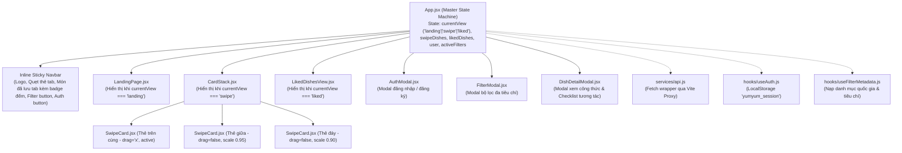

# 11. Giải Phẫu Chi Tiết 100% Mã Nguồn Frontend (Frontend Code Deep-Dive)

> **Tài liệu mổ xẻ chi tiết từng component, hook, state machine, cử chỉ vật lý Framer Motion và dịch vụ API Frontend**  
> **Dự án:** YumYumPick — Nền tảng gợi ý thực đơn thông minh theo cơ chế quẹt thẻ (Tinder for Food)  
> **Tác giả:** Senior Software Architect & Giảng viên hướng dẫn  

---

## 1. Cấu Trúc Thư Mục & Cây Phân Cấp Component Thực Tế (Component Hierarchy)

Mã nguồn Frontend nằm hoàn toàn trong thư mục `frontend/src/` được xây dựng trên nền tảng **React 19 + Vite 8** và **Tailwind CSS v4 (@tailwindcss/vite)**:

```text
frontend/
├── index.html                   # HTML template khởi đầu với meta viewport, Montserrat font
├── package.json                 # React 19.2.8, Framer Motion 13.3.0, Lucide React, Tailwind v4
├── vite.config.js               # Reverse Proxy định tuyến /api và /images sang Backend :8000
└── src/
    ├── App.jsx                  # State Machine trung tâm & Global Sticky Navbar
    ├── main.jsx                 # Entry point khởi tạo React 19 DOM Root
    ├── index.css                # Bảng màu Limón Dark Palette, font typography & Tailwind setup
    ├── assets/                  # Hero asset (.png, .svg)
    ├── components/
    │   ├── AuthModal.jsx        # Modal Đăng nhập / Đăng ký tài khoản người dùng
    │   ├── CardStack.jsx        # Ngăn xếp ảo hóa 3 thẻ, Prebuffering ảnh, phím tắt PC [←], [→]
    │   ├── SwipeCard.jsx        # Thẻ quẹt vật lý: MotionValue x, rotate = x / 15, YUMMY/NOPE stamps
    │   ├── DishDetailModal.jsx  # Modal công thức chi tiết, Checklist nguyên liệu & thanh tiến độ %
    │   ├── FilterModal.jsx      # Modal bộ lọc đa tiêu chí (quốc gia, độ khó, độ cay, thời gian)
    │   ├── LandingPage.jsx      # Trang giới thiệu thương hiệu, Animated Showcase & Collage ảnh nền
    │   └── LikedDishesView.jsx  # Quản lý món đã thích, tìm kiếm không dấu, lọc theo cờ quốc gia
    ├── config/
    │   └── api.js               # Khai báo tiền tố API tương đối (/api/v1 qua Vite Proxy)
    ├── hooks/
    │   ├── useAuth.js           # Quản lý phiên đăng nhập trực tiếp từ localStorage (yumyum_session)
    │   └── useFilterMetadata.js # Nạp metadata bộ lọc động từ backend (/dishes/filters/metadata)
    └── services/
        └── api.js               # REST Client: DTO Normalizer, getRandomDishes, saveDish, skipDish...
```

### Sơ Đồ Cây Phân Cấp & Luồng Dữ Liệu Thực Tế (Data Flow)



---

## 2. Mổ Xẻ Chi Tiết Từng File & Dòng Code Frontend

---

### 2.1. File `frontend/src/App.jsx` (Động Cơ Điều Phối Trạng Thái Ứng Dụng)

Tệp này đóng vai trò là **Bộ não trung tâm (Central Controller)** điều phối toàn bộ vòng đời trải nghiệm của người dùng:

```javascript
// Khởi tạo phiên người dùng từ useAuth hook
const { user, login, logout } = useAuth()
const currentUserId = user?.id || 1

// Quản lý View hiện tại: 'landing', 'swipe', 'liked' (lưu giữ qua sessionStorage)
const [currentView, setCurrentView] = useState(() => {
  const saved = sessionStorage.getItem('yumyum_view')
  if (saved && user) return saved
  return user ? 'swipe' : 'landing'
})

// Danh sách món đã lưu và danh sách thẻ quẹt trong RAM
const [likedDishes, setLikedDishes] = useState([])
const [swipeDishes, setSwipeDishes] = useState([])
const [activeFilters, setActiveFilters] = useState({})
```

#### A. Kỹ thuật Infinite Prefetching (Nạp thẻ ngầm không gián đoạn)
Khi người dùng quẹt đến khi số thẻ còn lại trong RAM $\le 3$, `CardStack` sẽ phát tín hiệu kích hoạt `onPrefetch`:

```javascript
const isPrefetchingRef = useRef(false)
const hasMoreRef = useRef(true)

const handlePrefetchDishes = async (remainingDishes) => {
  if (isPrefetchingRef.current || !hasMoreRef.current) return
  isPrefetchingRef.current = true

  try {
    const remainingIds = (remainingDishes || []).map((d) => d.id || d.dish_id).filter(Boolean)
    const currentDeckIds = swipeDishes.map((d) => d.id || d.dish_id).filter(Boolean)
    const deckExcludedIds = Array.from(new Set([...remainingIds, ...currentDeckIds]))

    const nextDishes = await api.getRandomDishes({
      ...activeFilters,
      user_id: currentUserId,
      limit: 10,
      exclude_ids: deckExcludedIds.length > 0 ? deckExcludedIds.join(',') : undefined
    })

    const cleanNew = (nextDishes || []).filter(
      (dish) => !deckExcludedIds.includes(dish.id || dish.dish_id)
    )

    if (cleanNew && cleanNew.length > 0) {
      // Asset Pre-buffering: Tải trước hình ảnh vào Disk Cache của trình duyệt
      cleanNew.slice(0, 3).forEach((d) => {
        const src = d.image || d.image_url
        if (src) {
          const img = new Image()
          img.src = src
        }
      })

      // Nối tiếp thẻ mới vào đuôi danh sách hiện có
      setSwipeDishes((prev) => {
        const existingIds = new Set(prev.map((d) => d.id || d.dish_id))
        const trulyNew = cleanNew.filter((d) => !existingIds.has(d.id || d.dish_id))
        return [...prev, ...trulyNew]
      })
    } else {
      hasMoreRef.current = false
    }
  } finally {
    isPrefetchingRef.current = false
  }
}
```

#### B. Xử lý Quẹt Trái (SKIP) và Quẹt Phải (LIKE)
- **Quẹt Phải (`handleLikeDish`):** Gửi API `POST /api/v1/saved-dishes` để lưu vào SQLite, đồng thời cập nhật tức thì state `likedDishes`.
- **Quẹt Trái (`handleSkipDish`):** Gửi API `POST /api/v1/dishes/skip` ghi nhận vào bảng `user_skipped_dishes` trên server. Món ăn này sẽ tự động bị loại trừ trong 7 ngày tới.

---

### 2.2. File `frontend/src/components/CardStack.jsx` (Ảo Hóa Ngăn Xếp Thẻ & Cử Chỉ Vật Lý)

Component này giải quyết bài toán hiệu năng: **Dù có 1.100 món ăn, DOM tree chỉ vẽ đúng tối đa 3 thẻ tại mọi thời điểm.**

```javascript
// Chỉ render tối đa 3 thẻ trên cùng của ngăn xếp
dishes.slice(0, 3).map((dish, index) => {
  const isFront = index === 0

  return (
    <motion.div
      key={dish.id}
      custom={exitDirection}
      variants={{
        initial: { scale: 0.9, y: 24, opacity: 0 },
        animate: {
          scale: 1 - index * 0.05, // Thẻ sau nhỏ hơn 5% (1.0 -> 0.95 -> 0.90)
          y: index * 12,           // Thẻ sau thụt lùi xuống 12px, 24px
          opacity: 1 - index * 0.2,// Thẻ sau mờ hơn
          zIndex: 10 - index,
        },
        exit: (direction) => ({
          x: direction === "left" ? -400 : 400,
          opacity: 0,
          scale: 0.85,
          transition: { duration: 0.25 },
        }),
      }}
      initial="initial"
      animate="animate"
      exit="exit"
      transition={{ type: "spring", stiffness: 280, damping: 22 }}
      className="absolute inset-0"
    >
      <SwipeCard dish={dish} isFront={isFront} onSwipe={handleSwipe} />
    </motion.div>
  )
})
```

#### Hỗ trợ phím tắt bàn phím PC (Keyboard Navigation)
Bắt sự kiện phím mũi tên bàn phím máy tính `[←]` (Skip) và `[→]` (Like), loại trừ khi người dùng đang nhập văn bản trong ô input:
```javascript
useEffect(() => {
  const handleKeyDown = (e) => {
    if (['INPUT', 'TEXTAREA'].includes(e.target?.tagName)) return
    if (dishes.length === 0) return
    if (e.key === "ArrowLeft") {
      e.preventDefault()
      handleButtonClick("left")
    } else if (e.key === "ArrowRight") {
      e.preventDefault()
      handleButtonClick("right")
    }
  }
  window.addEventListener("keydown", handleKeyDown)
  return () => window.removeEventListener("keydown", handleKeyDown)
}, [dishes, handleButtonClick])
```

---

### 2.3. File `frontend/src/components/SwipeCard.jsx` (Vật Lý Cử Chỉ Kéo Thả & Con Dấu Động)

Component biểu diễn thẻ món ăn với các thông số vật lý chính xác:

```javascript
export default function SwipeCard({ dish, isFront, onSwipe }) {
  const x = useMotionValue(0)

  // Góc nghiêng đàn hồi theo độ dời x: rotate = x / 15 (tối đa ±18 độ)
  const rotate = useTransform(x, [-250, 0, 250], [-18, 0, 18])

  // Con dấu LIKE (YUMMY!) và NOPE tăng giảm độ mờ mượt mà
  const likeOpacity = useTransform(x, [20, 100], [0, 1])
  const nopeOpacity = useTransform(x, [-20, -100], [0, 1])

  const handleDragEnd = (event, info) => {
    const offset = info.offset.x
    const velocity = info.velocity.x

    // Quẹt phải nếu kéo > 120px hoặc vận tốc vung tay > 500px/s
    if (offset > 120 || velocity > 500) {
      onSwipe('right', dish)
    }
    // Quẹt trái nếu kéo < -120px hoặc vận tốc vung tay < -500px/s
    else if (offset < -120 || velocity < -500) {
      onSwipe('left', dish)
    }
  }
```

- **Giao diện thẻ:**
  - Ảnh món ăn chiếm 60% chiều cao thẻ, xử lý `onError` fallback an toàn.
  - Con dấu **YUMMY!** (màu xanh lá neon `text-[#103b15] bg-[#f7ea48]`) nghiêng `-15°`.
  - Con dấu **NOPE** (màu đỏ vang neon `text-[#fcf9f0] border-rose-500`) nghiêng `+15°`.
  - Thông tin nhanh: Tên món, tên tiếng Anh, cờ quốc gia, thời gian nấu, cấp độ cay (ớt 🌶️) và mô tả cảm quan hương vị.

---

### 2.4. File `frontend/src/components/DishDetailModal.jsx` (Modal Công Thức & Checklist Nấu Ăn)

Cung cấp đầy đủ công thức chuẩn bản xứ với 2 Tab chuyển đổi linh hoạt:

1. **Tab Nguyên Liệu (Interactive Smart Checklist):**
   - Người dùng có thể tích chọn từng nguyên liệu đã chuẩn bị.
   - **Thanh tiến độ chuẩn bị (Dynamic Progress Bar):** Tự động tính toán tỷ lệ hoàn thành phần trăm:
     $$\text{progressPercent} = \text{round}\left(\frac{\text{checkedCount}}{\text{totalIngredients}} \times 100\right)$$
   - Nút "Chọn tất cả" / "Bỏ chọn tất cả" tiện lợi.
2. **Tab Hướng Dẫn Nấu (Step-by-Step Cooking Steps):**
   - Hiển thị tuần tự các bước nấu (1, 2, 3, 4, 5) kèm tiêu đề kỹ thuật và hướng dẫn điều chỉnh nhiệt độ lửa chi tiết.
3. **Bí Quyết Vàng Của Đầu Bếp (Chef's Tips):**
   - Đóng khung nổi bật với icon `Sparkles`, chia sẻ mẹo ướp gia vị chuẩn vị bản xứ.

---

### 2.5. File `frontend/src/components/LikedDishesView.jsx` (Quản Lý Danh Sách Món Đã Lưu)

- **Bộ lọc quốc gia nhanh (Cuisine Pills):** 16 nút bấm gắn cờ biểu tượng (`🇻🇳 Việt Nam`, `🇰🇷 Hàn Quốc`, `🇯🇵 Nhật Bản`...).
- **Tìm kiếm thông minh không dấu (`removeVietnameseDiacritics`):** Người dùng gõ "pho bo" hay "phở bò" đều lọc ra kết quả chính xác tức thì.
- **Hủy thích nhanh:** Bấm icon thùng rác `Trash2` để gọi `api.unsaveDish`, xóa ngay lập tức khỏi DB và cập nhật lại giao diện.
- **Xem công thức:** Nhấp vào bất kỳ thẻ nào trong Grid để mở `DishDetailModal`.

---

### 2.6. File `frontend/src/components/LandingPage.jsx` (Trang Giới Thiệu Thương Hiệu & Showcase)

- **Hero Banner:** Tiêu đề nhận diện thương hiệu *"Quẹt là măm – Không lăn tăn nghĩ món"*, CTA bắt đầu khám phá.
- **Dynamic 4-Second Card Preview:** Tự động xoay vòng hiển thị thẻ món ăn minh họa mỗi 4 giây kèm hiệu ứng trượt.
- **Background Collage:** Lưới mờ các món ăn thực tế tạo chiều sâu thị giác.
- **Showcase Tab 7 Quốc Gia Tiêu Biểu:** Nạp động 3 món tiêu biểu của từng quốc gia có áp dụng cache client để tránh gọi API lặp lại.

---

### 2.7. File `frontend/src/components/AuthModal.jsx` & `hooks/useAuth.js` (Hệ Thống Xác Thực)

- **`useAuth.js`:**
  - Khởi tạo trực tiếp bằng hàm đọc synchronous từ `localStorage.getItem('yumyum_session')` giúp ứng dụng xác định trạng thái đăng nhập ngay từ chu kỳ render đầu tiên mà không bị nháy màn hình (zero flicker).
  - Cung cấp hàm `login(userData)` và `logout()`.
- **`AuthModal.jsx`:**
  - Chuyển đổi giữa 2 tab: Đăng nhập và Đăng ký.
  - Client-side validation: Tên đăng nhập $\ge 3$ ký tự, Mật khẩu $\ge 6$ ký tự, Họ tên không được để trống.
  - Hiển thị thông báo lỗi thân thiện nếu đăng nhập thất bại.

---

### 2.8. File `frontend/src/services/api.js` & Cấu Hình Mạng

Toàn bộ cuộc gọi mạng đều thông qua đối tượng `api`:
- `getSavedDishes(userId)`: Lấy danh sách món đã lưu.
- `getRandomDishes(params)`: Nạp thẻ quẹt ngẫu nhiên có lọc và tự động loại trừ món đã xem.
- `saveDish(userId, dishId)`: Lưu món ăn (xử lý an toàn cả khi server báo 409 Conflict).
- `skipDish(userId, dishId)`: Ghi nhận bỏ qua món ăn vào server để kích hoạt quy tắc 7 ngày.
- `unsaveDish(userId, dishId)`: Xóa món khỏi danh sách yêu thích.
- `getDishDetail(dishId)`: Lấy chi tiết nguyên liệu và các bước nấu.

**Định tuyến qua Vite Proxy (`frontend/vite.config.js`):**
Mọi request bắt đầu bằng `/api` hoặc `/images` được chuyển tiếp trong suốt sang `http://127.0.0.1:8000`, triệt tiêu hoàn toàn lỗi CORS khi chạy dev cục bộ.
