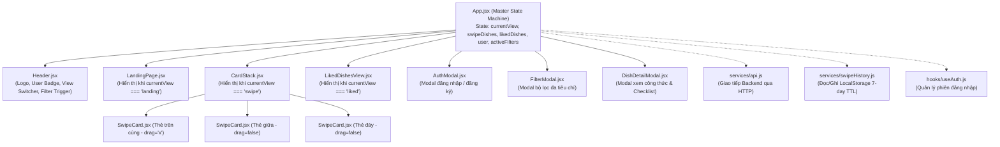

# 11. Giải Phẫu Chi Tiết 100% Mã Nguồn Frontend (Frontend Code Deep-Dive)

> **Tài liệu mổ xẻ chi tiết từng component, hook, state machine, cử chỉ vật lý Framer Motion và dịch vụ API Frontend**  
> **Dự án:** YumYumPick — Nền tảng gợi ý thực đơn thông minh theo cơ chế quẹt thẻ (Tinder for Food)  
> **Tác giả:** Senior Software Architect & Giảng viên hướng dẫn  

---

## 1. Cấu Trúc Thư Mục & Cây Phân Cấp Component (Component Hierarchy)

Mã nguồn Frontend nằm trong thư mục `frontend/src/` được xây dựng trên nền tảng **React 18 + Vite** và **Tailwind CSS**:

```text
frontend/src/
├── assets/                  # Ảnh minh họa, logo vector (.svg, .png)
├── components/              # Các thành phần giao diện người dùng
│   ├── AuthModal.jsx        # Modal Đăng ký / Đăng nhập người dùng
│   ├── CardStack.jsx        # Ngăn xếp ảo hóa 3 thẻ, quản lý phím tắt PC
│   ├── DishDetailModal.jsx  # Modal công thức chi tiết, Checklist nguyên liệu tương tác
│   ├── FilterModal.jsx      # Modal bộ lọc đa tiêu chí (quốc gia, độ cay, thời gian)
│   ├── Header.jsx           # Thanh điều hướng trên cùng, logo thương hiệu
│   ├── LandingPage.jsx      # Trang giới thiệu nhận diện thương hiệu, CTA bắt đầu
│   ├── LikedDishesView.jsx  # Màn hình quản lý món đã thích, gom nhóm theo quốc gia
│   └── SwipeCard.jsx        # Thẻ quẹt vật lý: kéo thả, góc xoay, con dấu YUMMY/NOPE
├── config/
│   └── api.js               # Cấu hình địa chỉ cơ sở backend (http://127.0.0.1:8000)
├── data/
│   └── mockDishes.js        # Dữ liệu dự phòng offline 1.100 món ăn chuẩn hóa
├── hooks/                   # Custom React Hooks
│   ├── useAuth.js           # Quản lý phiên đăng nhập người dùng từ LocalStorage
│   └── useFilterMetadata.js # Nạp metadata bộ lọc từ backend hoặc fallback
├── services/                # Các dịch vụ mạng và lưu trữ phía Client
│   ├── api.js               # Adapter gọi REST API, chuẩn hóa DTO, fallback offline
│   └── swipeHistory.js      # Thuật toán TTL 7 ngày lưu lịch sử quẹt vào LocalStorage
├── App.jsx                  # State Machine trung tâm điều phối toàn bộ ứng dụng
└── main.jsx                 # Entry point khởi tạo React DOM root
```

### Sơ Đồ Cây Phân Cấp & Luồng Dữ Liệu (Data Flow)



---

## 2. Mổ Xẻ Chi Tiết Từng File & Dòng Code Frontend

---

### 2.1. File `frontend/src/App.jsx` (Động Cơ Điều Phối Trạng Thái Ứng Dụng)

Tệp này đóng vai trò là **Bộ não trung tâm (Central Controller)**, quản lý toàn bộ trạng thái phiên, routing ảo giữa các view và luồng lấy thẻ món ăn:

```javascript
// Dòng 1-13: Import các components, icons và services
import React, { useState, useEffect } from 'react'
import { api } from './services/api'
import LikedDishesView from './components/LikedDishesView'
import DishDetailModal from './components/DishDetailModal'
import AuthModal from './components/AuthModal'
import FilterModal from './components/FilterModal'
import CardStack from './components/CardStack'
import { useAuth } from './hooks/useAuth'
import { swipeHistory } from './services/swipeHistory'
import LandingPage from './components/LandingPage'

function App() {
  // Dòng 16-20: Khởi tạo các hook xác thực và modal
  const { user, login, logout } = useAuth()
  const currentUserId = user?.id || 1
  const [authOpen, setAuthOpen] = useState(false)
  const [filterOpen, setFilterOpen] = useState(false)

  // Dòng 27-32: Các state cốt lõi của ứng dụng
  const [currentView, setCurrentView] = useState('landing') // 'landing' | 'swipe' | 'liked'
  const [likedDishes, setLikedDishes] = useState([])       // Mảng danh sách món đã like
  const [swipeDishes, setSwipeDishes] = useState([])       // Mảng danh sách thẻ chuẩn bị quẹt
  const [activeFilters, setActiveFilters] = useState({})   // Bộ lọc hiện tại (quốc gia, cay, thời gian)

  // Dòng 34-70: Hàm nạp thẻ ngẫu nhiên từ Backend kết hợp Khử trùng lặp 2 lớp (Dual-Tier Deduplication)
  const fetchRandomDishes = async (filters = activeFilters, currentLiked = likedDishes) => {
    try {
      // Lớp 1: Lấy danh sách ID các món đã quẹt trong 7 ngày từ LocalStorage
      const excludedHistoryIds = swipeHistory.getExcludedDishIds()
      
      // Lớp 2: Lấy danh sách ID các món đã bấm Like hiện có của người dùng
      const savedIds = currentLiked.map((d) => d.id || d.dish_id).filter(Boolean)
      
      // Hợp nhất 2 danh sách thành một Set duy nhất (loại bỏ phần tử trùng lặp)
      const allExcludedIds = Array.from(new Set([...excludedHistoryIds, ...savedIds]))

      // Gửi request lên Backend kèm query param exclude_ids
      const dishes = await api.getRandomDishes({
        ...filters,
        exclude_ids: allExcludedIds.length > 0 ? allExcludedIds.join(',') : undefined
      })

      // Bộ lọc phòng thủ phía Client (Defensive Client Filter):
      // Đảm bảo tuyệt đối không có món nào đã lưu xuất hiện lại trên màn hình quẹt
      const cleanDishes = (dishes || []).filter(
        (dish) => !savedIds.includes(dish.id || dish.dish_id)
      )

      if (cleanDishes && cleanDishes.length > 0) {
        setSwipeDishes(cleanDishes)
      } else {
        // Nếu đã quẹt hết sạch 1.100 món, tự động dọn dẹp lịch sử để bắt đầu vòng mới
        if (excludedHistoryIds.length > 0 && !filters.cuisine) {
          swipeHistory.clearHistory()
          const fresh = await api.getRandomDishes({ ...filters, exclude_ids: savedIds.join(',') })
          setSwipeDishes(fresh || [])
        }
      }
    } catch (err) {
      console.error('[App] Failed to fetch random dishes:', err)
    }
  }
```

---

### 2.2. File `frontend/src/components/CardStack.jsx` (Ảo Hóa Ngăn Xếp Thẻ & Phím Tắt)

Component này chịu trách nhiệm hiển thị ngăn xếp 3 thẻ lồng nhau và xử lý các thao tác điều khiển:

```javascript
export default function CardStack({ initialDishes = [], onLike, onRefresh, onCardSwiped }) {
  const [dishes, setDishes] = useState(initialDishes);
  const [exitDirection, setExitDirection] = useState("right");

  // Đồng bộ state khi danh sách thẻ ngẫu nhiên mới được truyền vào từ App.jsx
  useEffect(() => {
    setDishes(initialDishes);
  }, [initialDishes]);

  // Xử lý quẹt thẻ (direction: 'left' hoặc 'right')
  const handleSwipe = useCallback((direction, dish) => {
    setExitDirection(direction);

    // 1. Ghi nhận ID món ăn vào LocalStorage 7 ngày
    if (dish?.id) {
      swipeHistory.recordSwipe(dish.id);
    }

    // 2. Loại bỏ thẻ trên cùng khỏi mảng state cục bộ
    setDishes((prev) => prev.filter((item) => item.id !== dish.id));

    // 3. Thông báo cho App.jsx để đồng bộ RAM
    if (onCardSwiped) {
      onCardSwiped(dish);
    }

    // 4. Nếu quẹt PHẢI (LIKE), kích hoạt hàm onLike để gửi API lưu vào CSDL
    if (direction === "right" && onLike) {
      onLike(dish);
    }
  }, [onLike, onCardSwiped]);

  // Bắt sự kiện phím tắt bàn phím PC: Mũi tên TRÁI = Skip, Mũi tên PHẢI = Like
  useEffect(() => {
    const handleKeyDown = (e) => {
      // Bỏ qua nếu người dùng đang nhập liệu trong ô input hoặc textarea
      if (['INPUT', 'TEXTAREA'].includes(e.target?.tagName)) return;
      if (dishes.length === 0) return;

      if (e.key === "ArrowLeft") {
        e.preventDefault();
        const topDish = dishes[0];
        handleSwipe("left", topDish);
      } else if (e.key === "ArrowRight") {
        e.preventDefault();
        const topDish = dishes[0];
        handleSwipe("right", topDish);
      }
    };

    window.addEventListener("keydown", handleKeyDown);
    return () => window.removeEventListener("keydown", handleKeyDown);
  }, [dishes, handleSwipe]);
```

#### Thuật Toán Render 3 Thẻ Lồng Nhau:
```jsx
{/* Kỹ thuật Ảo hóa ngăn xếp: Chỉ render đúng 3 thẻ trên cùng (slice 0, 3) */}
{dishes.slice(0, 3).map((dish, index) => {
  const isFront = index === 0; // Thẻ trên cùng

  return (
    <motion.div
      key={dish.id}
      variants={{
        initial: { scale: 0.9, y: 24, opacity: 0 },
        animate: {
          scale: 1 - index * 0.05,  // Thẻ 0: scale 1.0; Thẻ 1: 0.95; Thẻ 2: 0.90
          y: index * 12,            // Thẻ 0: y 0px; Thẻ 1: y 12px; Thẻ 2: y 24px
          opacity: 1 - index * 0.2, // Thẻ sau mờ hơn thẻ trước
          zIndex: 10 - index,       // Thẻ trước đè lên thẻ sau
        },
        exit: (direction) => ({
          x: direction === "left" ? -400 : 400, // Bay ra ngoài màn hình
          opacity: 0,
          scale: 0.85,
          transition: { duration: 0.25 },
        }),
      }}
      transition={{ type: "spring", stiffness: 280, damping: 22 }}
    >
      <SwipeCard dish={dish} isFront={isFront} onSwipe={handleSwipe} />
    </motion.div>
  );
})}
```

---

### 2.3. File `frontend/src/components/SwipeCard.jsx` (Vật Lý Cử Chỉ Kéo Thả & Con Dấu)

Tệp này tính toán toàn bộ chuyển động vật lý bằng **Framer Motion**:

```javascript
export default function SwipeCard({ dish, isFront, onSwipe }) {
  // useMotionValue(0): Lưu tọa độ kéo ngang x độc lập, không gây re-render React
  const x = useMotionValue(0)

  // useTransform: Tính toán góc xoay tỷ lệ thuận với độ kéo x (rotate = x / 15)
  // Khi kéo x = +250px -> xoay +18 độ; Khi kéo x = -250px -> xoay -18 độ
  const rotate = useTransform(x, [-250, 0, 250], [-18, 0, 18])

  // Độ mờ của con dấu YUMMY! (Hiện dần khi kéo sang phải từ 20px đến 100px)
  const likeOpacity = useTransform(x, [20, 100], [0, 1])

  // Độ mờ của con dấu NOPE! (Hiện dần khi kéo sang trái từ -20px đến -100px)
  const nopeOpacity = useTransform(x, [-20, -100], [0, 1])

  // Xử lý khi người dùng buông tay khỏi chuột / màn hình cảm ứng
  const handleDragEnd = (event, info) => {
    const offset = info.offset.x      // Khoảng cách kéo theo phương ngang (px)
    const velocity = info.velocity.x   // Vận tốc vung tay (px/s)

    // Điều kiện quẹt PHẢI: Kéo lệch > 120px HOẶC vung tay nhanh > 500px/s
    if (offset > 120 || velocity > 500) {
      onSwipe('right', dish)
    }
    // Điều kiện quẹt TRÁI: Kéo lệch < -120px HOẶC vung tay nhanh < -500px/s
    else if (offset < -120 || velocity < -500) {
      onSwipe('left', dish)
    }
    // Nếu không đạt ngưỡng, lò xo Framer Motion tự động kéo thẻ bật lại vị trí tâm x = 0
  }
```

---

### 2.4. File `frontend/src/components/DishDetailModal.jsx` (Checklist Nguyên Liệu Tương Tác)

Tệp này hiển thị toàn bộ công thức chi tiết và cung cấp tính năng checklist thông minh:

```javascript
export default function DishDetailModal({ dish, isOpen, onClose }) {
  const [activeTab, setActiveTab] = useState('ingredients') // 'ingredients' | 'steps'
  const [checkedIngredients, setCheckedIngredients] = useState({}) // Dictionary lưu trạng thái tick chọn

  // Lấy danh sách nguyên liệu và các bước nấu từ đối tượng dish
  const ingredientsList = dish.ingredients || []
  const stepsList = dish.steps || []
  
  // Tính toán số lượng và tỷ lệ % hoàn thành chuẩn bị nguyên liệu
  const totalIngredients = ingredientsList.length
  const checkedCount = Object.values(checkedIngredients).filter(Boolean).length
  const progressPercent = totalIngredients > 0 
    ? Math.round((checkedCount / totalIngredients) * 100) 
    : 0

  // Đảo trạng thái checkbox của một nguyên liệu cụ thể
  const toggleIngredient = (idx) => {
    setCheckedIngredients((prev) => ({
      ...prev,
      [idx]: !prev[idx]
    }))
  }

  // Nút chọn tất cả hoặc bỏ chọn tất cả
  const toggleAllIngredients = () => {
    if (checkedCount === totalIngredients) {
      setCheckedIngredients({}) // Bỏ chọn tất cả
    } else {
      const all = {}
      ingredientsList.forEach((_, idx) => { all[idx] = true })
      setCheckedIngredients(all) // Đánh dấu tất cả
    }
  }

  // Đóng modal khi nhấn phím Escape
  useEffect(() => {
    const handleKeyDown = (e) => {
      if (e.key === 'Escape') onClose?.()
    }
    if (isOpen) {
      window.addEventListener('keydown', handleKeyDown)
      document.body.style.overflow = 'hidden' // Khóa cuộn trang nền
    }
    return () => {
      window.removeEventListener('keydown', handleKeyDown)
      document.body.style.overflow = 'auto'   // Mở lại cuộn trang
    }
  }, [isOpen, onClose])
```

---

### 2.5. File `frontend/src/services/swipeHistory.js` (Thuật Toán TTL 7 Ngày Trong LocalStorage)

Tệp này đóng gói toàn bộ logic quản lý bộ nhớ đệm lịch sử quẹt phía Client:

```javascript
const SWIPED_HISTORY_KEY = 'yumyum_swiped_history'
const SEVEN_DAYS_MS = 7 * 24 * 60 * 60 * 1000 // 7 ngày = 604.800.000 milliseconds

export const swipeHistory = {
  // Lấy danh sách ID món ăn đã quẹt chưa quá 7 ngày
  getExcludedDishIds() {
    try {
      const raw = localStorage.getItem(SWIPED_HISTORY_KEY)
      if (!raw) return []

      const history = JSON.parse(raw)
      const now = Date.now()
      const activeIds = []
      const updatedHistory = {}
      let hasExpired = false

      // Duyệt qua từng bản ghi { dishId: timestamp }
      for (const [dishId, timestamp] of Object.entries(history)) {
        if (now - Number(timestamp) < SEVEN_DAYS_MS) {
          activeIds.push(dishId)
          updatedHistory[dishId] = timestamp // Món chưa đủ 7 ngày -> Tiếp tục chặn
        } else {
          hasExpired = true // Món đã quá 7 ngày -> Đánh dấu để dọn dẹp
        }
      }

      // Tự động ghi đè LocalStorage để giải phóng bộ nhớ khi có món hết hạn
      if (hasExpired) {
        localStorage.setItem(SWIPED_HISTORY_KEY, JSON.stringify(updatedHistory))
      }

      return activeIds
    } catch (err) {
      console.warn('[swipeHistory] Lỗi khi đọc lịch sử quẹt:', err)
      return []
    }
  },

  // Ghi nhận một món vừa quẹt (dù Like hay Skip)
  recordSwipe(dishId) {
    if (!dishId) return
    try {
      const raw = localStorage.getItem(SWIPED_HISTORY_KEY)
      const history = raw ? JSON.parse(raw) : {}
      history[dishId] = Date.now() // Lưu mốc thời gian Unix hiện tại
      localStorage.setItem(SWIPED_HISTORY_KEY, JSON.stringify(history))
    } catch (err) {
      console.warn('[swipeHistory] Lỗi khi lưu lịch sử quẹt:', err)
    }
  },

  // Xóa sạch lịch sử để nạp lại thực đơn từ đầu khi người dùng quẹt hết món
  clearHistory() {
    try {
      localStorage.removeItem(SWIPED_HISTORY_KEY)
    } catch (err) {
      console.warn('[swipeHistory] Lỗi khi xóa lịch sử quẹt:', err)
    }
  }
}
```

---

### 2.6. File `frontend/src/services/api.js` (Adapter Pattern & Offline Fallback)

Tệp này cung cấp giao diện gọi API thống nhất và có khả năng tự phục hồi khi Backend gặp sự cố:

```javascript
import { MOCK_DISHES } from '../data/mockDishes'
import { API_BASE_URL } from '../config/api'

export const api = {
  // Lấy danh sách món ngẫu nhiên cho màn hình quẹt thẻ
  async getRandomDishes(params = {}) {
    try {
      const query = new URLSearchParams()
      query.append('limit', params.limit || 10)
      if (params.cuisine && params.cuisine !== 'Tất cả') {
        query.append('cuisine', params.cuisine)
      }
      if (params.spicy_level !== undefined && params.spicy_level !== null) {
        query.append('spicy_level', params.spicy_level)
      }
      if (params.max_time) {
        query.append('max_time', params.max_time)
      }
      if (params.exclude_ids) {
        query.append('exclude_ids', params.exclude_ids)
      }

      const url = `${API_BASE_URL}/api/v1/dishes/random?${query.toString()}`
      const response = await fetch(url)
      
      if (!response.ok) {
        throw new Error(`Server returned ${response.status}`)
      }
      
      const data = await response.json()
      return Array.isArray(data) ? data : []
    } catch (err) {
      // RESILIENT OFFLINE FALLBACK:
      // Khi Backend offline, tự động lấy dữ liệu từ mockDishes.js mà không làm sập giao diện
      console.warn('[API] Backend offline, kích hoạt chế độ dự phòng Mock Data:', err.message)
      return MOCK_DISHES.slice(0, 10)
    }
  },

  // Lưu món ăn vào danh sách yêu thích trong SQLite CSDL
  async saveDish(userId = 1, dishId) {
    try {
      const response = await fetch(`${API_BASE_URL}/api/v1/saved-dishes/`, {
        method: 'POST',
        headers: { 'Content-Type': 'application/json' },
        body: JSON.stringify({ user_id: Number(userId), dish_id: dishId })
      })

      // Xử lý mã 409 Conflict: Nếu món đã lưu trước đó, Client vẫn coi là thành công
      if (response.status === 409) {
        return { success: true, alreadySaved: true }
      }

      if (!response.ok) throw new Error(`Lỗi lưu món (${response.status})`)
      return await response.json()
    } catch (err) {
      console.warn('[API] Lỗi kết nối lưu món:', err.message)
      return { success: false, error: err.message }
    }
  }
}
```
