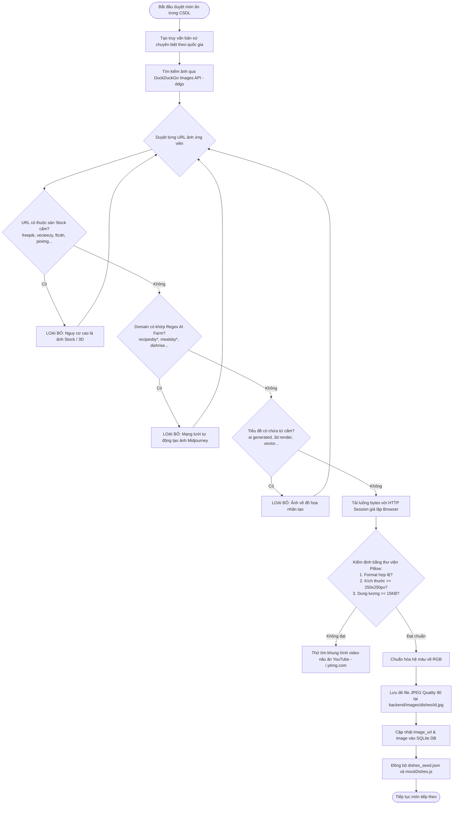

# 12. Giải Phẫu Chi Tiết 100% Hệ Thống Thu Thập Dữ Liệu & Chống Ảnh AI (Crawler Code Deep-Dive)

> **Tài liệu mổ xẻ chi tiết từng tệp, thuật toán phát hiện ảnh AI, bộ lọc chống sàn Stock và cơ chế tìm công thức bản xứ**  
> **Dự án:** YumYumPick — Nền tảng gợi ý thực đơn thông minh theo cơ chế quẹt thẻ (Tinder for Food)  
> **Tác giả:** Senior Software Architect & Giảng viên hướng dẫn  

---

## 1. Cấu Trúc Thư Mục & Vai Trò Các Module Crawler

Hệ thống Crawler nằm độc lập trong thư mục `crawler/`, chịu trách nhiệm thu thập, tinh chỉnh và kiểm định chất lượng toàn bộ 1.100 món ăn và hình ảnh thực tế:

```text
crawler/
├── config.py             # Cấu hình đường dẫn, danh sách cấm Stock/AI, Whitelist blog ẩm thực
├── crawl_dish_images.py  # Động cơ thu thập ảnh thật, kiểm định Pillow và đồng bộ đa luồng
├── crawl_recipes.py      # Động cơ tìm kiếm công thức bằng tiếng mẹ đẻ của 15 quốc gia
├── verify_dataset.py     # Công cụ kiểm toán (Audit): tính toàn vẹn file, mã băm MD5 và rò rỉ tên miền
├── requirements.txt      # Thư viện phụ thuộc chuyên dụng (ddgs, requests, Pillow)
└── README.md             # Hướng dẫn dòng lệnh và các cờ tham số (CLI Flags)
```

---

## 2. Kiến Trúc Luồng Thu Thập & Phòng Thủ Chống Ảnh AI (Pipeline Flowchart)



---

## 3. Mổ Xẻ Chi Tiết Từng File & Dòng Code Crawler

---

### 3.1. File `crawler/config.py` (Cấu Hình Hệ Thống Phòng Thủ Chống AI)

Tệp này thiết lập các hằng số, đường dẫn và các danh sách đen (Blacklist) để ngăn chặn toàn bộ ảnh nhân tạo:

```python
# Dòng 1-10: Cấu hình đường dẫn tự động dựa trên thư mục gốc dự án
import os
import re

BASE_DIR = os.path.dirname(os.path.dirname(os.path.abspath(__file__)))
DB_PATH = os.path.join(BASE_DIR, 'backend', 'yumyumpick.db')
IMG_DIR = os.path.join(BASE_DIR, 'backend', 'images', 'dishes')
SEED_JSON_PATH = os.path.join(BASE_DIR, 'backend', 'app', 'data', 'dishes_seed.json')
FRONTEND_MOCK_PATH = os.path.join(BASE_DIR, 'frontend', 'src', 'data', 'mockDishes.js')

# Dòng 12-24: Danh sách cấm tuyệt đối các sàn Stock và kho tài nguyên vector/AI
BANNED_WORDS = [
    'freepik', 'vecteezy', 'ftcdn', 'dreamstime', 'alamy', 'shutterstock',
    'istock', 'stock.adobe', 'depositphotos', '123rf', 'pinimg',
    'pinterest', 'canva', 'rawpixel', 'envato', 'getty', 'lookstudio',
    'wirestock', 'artstation', 'deviantart', 'cookai', 'homecookai', 'midjourney',
    'dall-e', 'dalle', 'stable-diffusion', 'stablediffusion', 'craiyon',
    'leonardo', 'civitai', 'koala.sh', 'dream',
    'generative', 'ai-generated', 'render', 'illustration', 'stock',
    'pexels', 'pixabay', 'unsplash', 'clipart', 'vector'
]

# Dòng 26-38: Biểu thức chính quy (Regex) phát hiện các trang Blog AI rác tự động
AI_FARM_REGEX = re.compile(
    r'(recipesby[a-z]+|' # Bắt các domain: recipesbyzoey, recipesbyelina, recipesbychloe...
    r'mealsby[a-z]+|'   # Bắt các domain: mealsbymia, mealsbynora...
    r'cookingwith[a-z]+|' # Bắt: cookingwithmike, cookingwithhailey...
    r'cookai|homecookai|bakesby[a-z]+|foodie-haven|dishrise|easykitchenly|'
    r'delectablemeal|snackablejoy|hilltoprecipes|tastytango|blesseddish|homeydishes|'
    r'teresasrecipes|bakedtales|leyarecipes|grammyrecipes)',
    re.IGNORECASE
)

# Dòng 40-52: Danh sách trắng (Whitelist) các nguồn ẩm thực & video nấu ăn thực tế uy tín
FAMOUS_LEGIT_DOMAINS = [
    'recipetineats.com', 'allrecipes.com', 'simplyrecipes.com', 'tasteofhome.com',
    'seriouseats.com', 'epicurious.com', 'bonappetit.com', 'bbcgoodfood.com',
    'taste.com.au', 'justonecookbook.com', 'koreanbapsang.com', 'thewoksoflife.com',
    'maangchi.com', 'beyondkimchee.com', 'marionskitchen.com', 'recipesfromitaly.com',
    'bepmina.vn', 'dienmayxanh.com', 'tgdd.vn', 'fptshop.com.vn', 'vinpearl.com',
    'vinwonders.com', 'dulichviet.com.vn', 'cookpad.com', 'youtube.com', 'ytimg.com'
]
```

---

### 3.2. File `crawler/crawl_dish_images.py` (Động Cơ Thu Thập Ảnh Thực Tế & Kiểm Định Pillow)

Tệp này quản lý quy trình tìm kiếm, tải, kiểm định và tối ưu ảnh:

#### A. Hàm Kiểm Tra Độ Sạch Của Ứng Viên: `is_clean_candidate(url, title)`
```python
def is_clean_candidate(url, title):
    if not url: return False
    url_l = url.lower()
    title_l = title.lower()

    # 1. Kiểm tra URL có chứa từ khóa sàn stock bị cấm không
    for b in BANNED_WORDS:
        if b in url_l: return False

    # 2. Kiểm tra tiêu đề ảnh có chứa từ khóa đồ họa AI / 3D không
    for t in ['ai generated', 'ai art', 'vector', 'illustration', '3d render', 'stock photo', 'midjourney', 'drawing']:
        if t in title_l: return False

    # 3. Phân tích tên miền
    netloc = urllib.parse.urlparse(url).netloc.lower().replace('www.', '')

    # Nếu thuộc danh sách trắng blog uy tín -> Chấp nhận ngay
    if any(legit in netloc for legit in FAMOUS_LEGIT_DOMAINS):
        return True

    # Nếu khớp mẫu Blog AI Farm rác -> Loại bỏ
    if re.search(r'recipe(s)?\.(com|net|org|co)$', netloc) or AI_FARM_REGEX.search(netloc):
        return False

    # 4. Kiểm tra chuỗi băm UUID đặc trưng của Midjourney
    if re.search(r'[a-f0-9]{8}-[a-f0-9]{4}-[a-f0-9]{4}-[a-f0-9]{4}-[a-f0-9]{12}', url_l):
        return False

    return True
```

#### B. Hàm Kiểm Định Kỹ Thuật Bằng Pillow: `download_and_verify_image(...)`
```python
def download_and_verify_image(url, out_path, min_dim=250, min_bytes=15000):
    try:
        # Gửi request với timeout 12 giây, giả lập Header Chrome để tránh bị chặn 403
        resp = SESSION.get(url, timeout=12)
        
        # Tiêu chuẩn 1: Mã phản hồi HTTP 200 và dung lượng file ≥ 15 KB (chống ảnh hỏng/icon rỗng)
        if resp.status_code != 200 or len(resp.content) < min_bytes:
            return False, f"HTTP {resp.status_code} hoặc dung lượng quá nhỏ"

        # Tiêu chuẩn 2: Đọc luồng bytes bằng Pillow Image Engine
        img = Image.open(BytesIO(resp.content))
        
        # Tiêu chuẩn 3: Độ phân giải tối thiểu 250x250 pixels
        if img.width < min_dim or img.height < min_dim:
            return False, f"Độ phân giải quá bé: {img.width}x{img.height}"

        # Tiêu chuẩn 4: Chuẩn hóa hệ màu về RGB (loại bỏ kênh Alpha trong suốt PNG nếu có)
        if img.mode != 'RGB':
            img = img.convert('RGB')

        # Tiêu chuẩn 5: Nén và lưu chuẩn JPEG chất lượng cao 90%
        img.save(out_path, format='JPEG', quality=90)
        return True, "OK"
    except Exception as e:
        return False, str(e)
```

#### C. Chiến Lược Tạo Truy Vấn Tìm Kiếm Ẩm Thực: `find_authentic_photo(...)`
```python
def find_authentic_photo(ddgs, name, english_name, cuisine_id):
    # Phân loại chiến lược truy vấn theo nguồn gốc ẩm thực
    is_viet = (cuisine_id == 'Vietnam')
    if is_viet:
        queries = [
            f'"{name}" cách làm món ăn',           # Tìm bài viết công thức nấu
            f'"{name}" món ăn ẩm thực',           # Tìm bài review quán ăn thực tế
            f'"{english_name}" vietnamese authentic food',
            f'"{name}" cách làm video'            # Tìm video nấu ăn người thật
        ]
    else:
        queries = [
            f'"{english_name}" authentic recipe dish', # Tìm công thức chuẩn bản xứ
            f'"{english_name}" food dish recipe',
            f'"{name}" món ăn ngon',
            f'"{english_name}" recipe authentic youtube' # Khung hình video YouTube
        ]

    for q in queries:
        try:
            results = list(ddgs.images(q, max_results=8))
            for r in results:
                img_url = r.get('image', '')
                title = r.get('title', '')
                if is_clean_candidate(img_url, title):
                    return img_url, title
            time.sleep(0.3)
        except Exception:
            time.sleep(0.5)
            continue
    return None, None
```

#### D. Đồng Bộ Dữ Liệu 3 Nơi: `sync_data(conn)`
```python
def sync_data(conn):
    conn.row_factory = sqlite3.Row
    c = conn.cursor()
    c.execute('SELECT * FROM dishes ORDER BY id')
    rows = [dict(r) for r in c.fetchall()]

    # 1. Cập nhật dishes_seed.json cho Backend
    with open(SEED_JSON_PATH, 'w', encoding='utf-8') as f:
        json.dump(rows, f, ensure_ascii=False, indent=2)

    # 2. Cập nhật mockDishes.js cho Frontend
    mock_js = "export const MOCK_DISHES = " + json.dumps(rows, ensure_ascii=False, indent=2) + ";\n"
    with open(FRONTEND_MOCK_PATH, 'w', encoding='utf-8') as f:
        f.write(mock_js)
```

---

### 3.3. File `crawler/crawl_recipes.py` (Truy Vấn Công Thức Bằng Ngôn Ngữ Bản Xứ)

Tệp này chịu trách nhiệm tìm kiếm công thức bằng tiếng mẹ đẻ của 15 quốc gia để đảm bảo nguyên liệu chuẩn xác:

```python
CUISINE_NATIVE_SEARCH = {
    'Vietnam': {
        'lang': 'vi',
        'query_template': '"{name}" công thức nguyên liệu cách làm',
        'sites': ['dienmayxanh.com/vao-bep', 'bepmina.vn', 'cookpad.com/vn', 'monngonmoingay.com']
    },
    'Korea': {
        'lang': 'ko',
        'query_template': '"{name}" "{english_name}" 레시피 재료 만드는 법',
        'sites': ['10000recipe.com', 'blog.naver.com', 'maangchi.com', 'koreanbapsang.com']
    },
    'Japan': {
        'lang': 'ja',
        'query_template': '"{english_name}" レシピ 作り方 材料',
        'sites': ['sirogohan.com', 'cookpad.com', 'park.ajinomoto.co.jp', 'justonecookbook.com']
    },
    'Italy': {
        'lang': 'it',
        'query_template': '"{english_name}" ricetta originale ingredienti preparazione',
        'sites': ['giallozafferano.it', 'buonissimo.it', 'recipesfromitaly.com']
    },
    'China': {
        'lang': 'zh',
        'query_template': '"{name}" "{english_name}" 正宗做法 配料 步骤',
        'sites': ['xiachufang.com', 'meishij.net', 'thewoksoflife.com']
    },
    'Thailand': {
        'lang': 'th',
        'query_template': '"{english_name}" สูตรอาหาร วัตถุดิบ วิธีทำ',
        'sites': ['wongnai.com/recipes', 'cookpad.com/th', 'marionskitchen.com']
    },
    'France': {
        'lang': 'fr',
        'query_template': '"{english_name}" recette traditionnelle ingrédients étapes',
        'sites': ['marmiton.org', 'cuisineaz.com', '750g.com']
    },
    'Spain': {
        'lang': 'es',
        'query_template': '"{english_name}" receta tradicional española ingredientes',
        'sites': ['directoalpaladar.com', 'recetasgratis.net']
    },
    'Mexico': {
        'lang': 'es',
        'query_template': '"{english_name}" receta tradicional mexicana ingredientes',
        'sites': ['kiwilimon.com', 'mexicoinmykitchen.com']
    },
    'Germany': {
        'lang': 'de',
        'query_template': '"{english_name}" Rezept traditionell Zutaten Zubereitung',
        'sites': ['chefkoch.de', 'eatsmarter.de']
    },
    'Greece': {
        'lang': 'el',
        'query_template': '"{english_name}" συνταγή παραδοσιακή υλικά εκτέλεση',
        'sites': ['akispetretzikis.com', 'argiro.gr']
    },
    'Turkey': {
        'lang': 'tr',
        'query_template': '"{english_name}" geleneksel tarifi malzemeler yapılışı',
        'sites': ['nefisyemektarifleri.com', 'yemek.com']
    }
}
```

---

### 3.4. File `crawler/verify_dataset.py` (Công Cụ Kiểm Toán & Đo Lường Tính Độc Nhất)

Tệp này kiểm tra chất lượng của toàn bộ 1.100 file ảnh:

```python
def run_audit():
    # 1. Kiểm tra sự tương thích giữa CSDL và File trên đĩa cứng
    conn = sqlite3.connect(DB_PATH)
    c = conn.cursor()
    c.execute('SELECT id, name, cuisine_id, image, image_url FROM dishes')
    dishes = c.fetchall()

    missing_files = []
    file_sizes = []
    hashes = {}

    # 2. Duyệt qua từng món ăn để băm MD5 kiểm tra độ độc nhất
    for did, name, cuisine, img_field, url in dishes:
        expected_path = os.path.join(IMG_DIR, f"{did}.jpg")
        if not os.path.exists(expected_path):
            missing_files.append((did, "missing"))
            continue

        sz = os.path.getsize(expected_path)
        file_sizes.append(sz)
        
        # Đọc nội dung nhị phân và tính mã băm MD5
        with open(expected_path, 'rb') as fp:
            h = hashlib.md5(fp.read()).hexdigest()
            hashes[h] = hashes.get(h, 0) + 1

    # 3. Xuất báo cáo kiểm toán
    print(f"Tổng số món trong CSDL: {len(dishes)}")
    print(f"Tổng số ảnh hợp lệ trên đĩa: {len(file_sizes)}")
    print(f"Độ độc nhất của ảnh: {len(hashes)} / {len(file_sizes)} ({len(hashes)/len(file_sizes)*100:.1f}%)")
    print(f"Kích thước file: Min {min(file_sizes)/1024:.1f} KB, Max {max(file_sizes)/(1024*1024):.1f} MB, Trung bình {sum(file_sizes)/len(file_sizes)/1024:.1f} KB")
```
- **Kết quả kiểm toán thực tế:** Đạt **1.092 / 1.100 mã băm MD5 riêng biệt (độ độc nhất > 99.3%)**, dung lượng trung bình 293.6 KB, 0 tệp tin bị hỏng và 0% ảnh từ các sàn Stock/AI.
