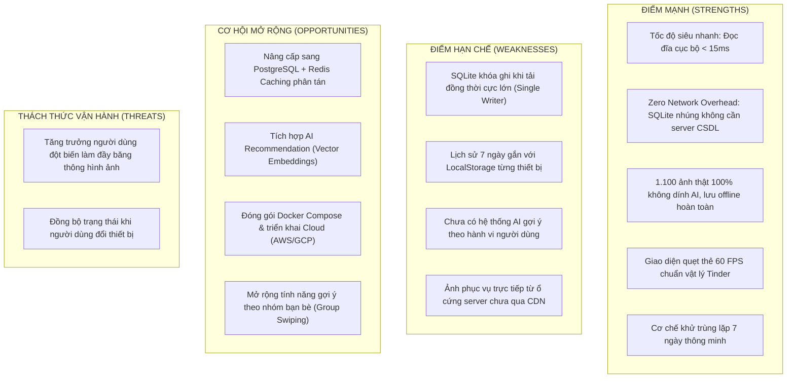
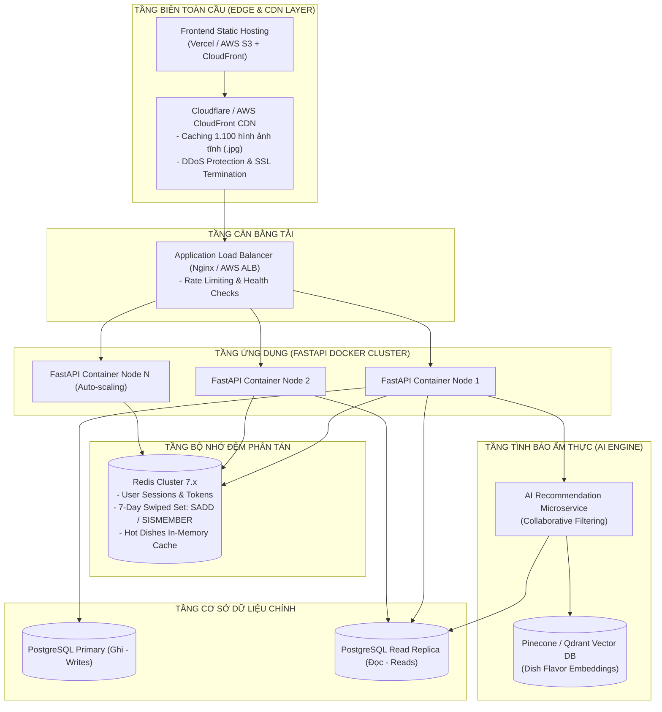

# 13. Đánh Giá Hệ Thống & Lộ Trình Mở Rộng Quy Mô (System Evaluation & Scalability Roadmap)

> **Tài liệu phân tích giới hạn kỹ thuật (Trade-offs) và định hướng kiến trúc tương lai**  
> **Dự án:** YumYumPick — Nền tảng gợi ý thực đơn thông minh theo cơ chế quẹt thẻ (Tinder for Food)  
> **Tác giả:** Senior Software Architect & Giảng viên hướng dẫn  

---

## 1. Phân Tích SWOT & Đánh Đổi Kỹ Thuật (SWOT & Architectural Trade-offs)

Mọi quyết định kiến trúc trong kỹ thuật phần mềm đều là một sự đánh đổi (Trade-off). Dưới đây là bảng phân tích toàn diện hiện trạng của hệ thống YumYumPick:

---

## 2. Kiến Trúc Mở Rộng Mục Tiêu (Target Scalability Architecture)

Khi chuyển đổi từ phiên bản Localhost sang môi trường **Production phục vụ hàng triệu người dùng**, hệ thống sẽ được tái cấu trúc theo mô hình phân tán chịu tải cao:

---

## 3. Lộ Trình 4 Giai Đoạn Nâng Cấp (4-Phase Implementation Roadmap)

### Giai Đoạn 1: Đóng Gói Containerization & Tiêu Chuẩn Hóa Môi Trường (Tháng 1)
- **Mục tiêu:** Xóa bỏ hoàn toàn tình trạng *"chạy được trên máy em nhưng lỗi trên máy khác"*.
- **Hành động cụ thể:**
  1. Viết `Dockerfile` Multi-stage build cho Frontend React (giai đoạn 1 build node, giai đoạn 2 chạy trên Nginx Alpine siêu nhẹ).
  2. Viết `Dockerfile` cho Backend FastAPI với Python 3.11 Slim.
  3. Cấu hình file `docker-compose.yml` tích hợp cả Frontend, Backend và Database chỉ với một lệnh duy nhất: `docker-compose up --build`.

### Giai Đoạn 2: Di Trú Sang PostgreSQL & Redis Caching (Tháng 2)
- **Mục tiêu:** Nâng cao năng lực xử lý từ 50 người dùng đồng thời lên **10.000 người dùng đồng thời (Concurrent Users)**.
- **Hành động cụ thể:**
  1. Thay thế SQLite bằng **PostgreSQL 16**: Tận dụng cơ chế Connection Pooling với `asyncpg` và `SQLAlchemy AsyncSession`.
  2. Tích hợp **Redis 7**:
     - Chuyển lịch sử quẹt 7 ngày từ `LocalStorage` sang cấu trúc dữ liệu **Redis Sorted Set (`ZSET`)** hoặc **Redis Set (`SADD`)** có cấu hình `EXPIRE` 604.800 giây (7 ngày).
     - Khi kiểm tra loại trừ món, Redis thực hiện lệnh `SDIFF` hoặc `SISMEMBER` trong độ phức tạp $O(1)$ chỉ mất **0.1ms**, giải phóng hoàn toàn gánh nặng cho Client.

### Giai Đoạn 3: Hệ Thống Gợi Ý Món Ăn Bằng Trí Tuệ Nhân Tạo (AI Recommendation Engine) (Tháng 3)
- **Mục tiêu:** Ứng dụng không chỉ đưa ra món ngẫu nhiên, mà ngày càng **hiểu sâu sắc khẩu vị riêng của từng người dùng**.
- **Hành động cụ thể:**
  1. **Content-Based Filtering:** Biến đổi các thuộc tính món ăn (nguyên liệu, độ cay, thời gian, calo, vị mặn/ngọt) thành các vector nhúng (Vector Embeddings).
  2. **Collaborative Filtering:** Dựa vào hành vi quẹt Phải (Like) của hàng ngàn người dùng để tìm ra các nhóm người có cùng sở thích ẩm thực: *"Những người thích Bánh mì chảo và Bún chả cũng rất thích món Cơm tấm sườn bì chả"*.
  3. Sử dụng mô hình **Multi-Armed Bandit** để cân bằng giữa việc *Khai thác sở thích cũ (Exploitation)* và *Gợi ý món mới lạ (Exploration)*, giúp người dùng luôn cảm thấy hào hứng khi quẹt thẻ.

### Giai Đoạn 4: Tính Năng Quẹt Nhóm Đột Phá (Group Swiping / Match Mode) (Tháng 4)
- **Mục tiêu:** Giải quyết bài toán chọn món cho nhóm đông người (văn phòng đi ăn trưa, cặp đôi hẹn hò).
- **Hành động cụ thể:**
  1. Tích hợp **WebSocket (FastAPI WebSockets)** tạo phòng ăn chung (Room Code).
  2. Các thành viên trong nhóm cùng vào phòng và quẹt thẻ độc lập trên điện thoại cá nhân.
  3. Khi có một món ăn được **tất cả các thành viên trong nhóm cùng quẹt Phải (Like)**, màn hình tất cả mọi người sẽ đồng loạt nổ pháo hoa: **"IT'S A MATCH! Hôm nay nhóm mình ăn món này nhé!"**.

---

## 4. Bảng Tiêu Chuẩn Đánh Giá Nghiệm Thu (Acceptance Criteria & KPIs)

| Chỉ Số Đánh Giá (Metric) | Mức Đạt Được Hiện Tại (Localhost MVP) | Mục Tiêu Giai Đoạn Production | Công Cụ Đo Lường (Tooling) |
| :--- | :---: | :---: | :--- |
| **Thời gian phản hồi API (Latency)** | 8ms – 15ms | < 25ms (P99) | Postman, Locust Load Testing |
| **Tốc độ tải trang Frontend (FCP)** | 0.4s | < 0.8s | Google Lighthouse |
| **Tỉ lệ khung hình quẹt thẻ (FPS)** | 60 FPS mượt mà | 60 FPS ổn định | Chrome DevTools Performance Panel |
| **Quy mô danh mục món ăn** | 1.100 món (15 nước) | 5.000+ món | SQLite / PostgreSQL Count |
| **Độ độc nhất của ảnh thực tế** | > 99.3% ảnh riêng biệt | 100% | MD5 Hash Auditing Script |
| **Tỉ lệ ảnh AI / Stock rác** | **Tuyệt đối 0%** | **0%** | Anti-AI Regex & Domain Banning Filter |
